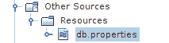

# JDBI 教程

> 原文： [http://zetcode.com/db/jdbi/](http://zetcode.com/db/jdbi/)

在本教程中，我们展示了如何使用 JDBI 处理数据。 我们选择 MySQL 作为数据库。 ZetCode 拥有用于 MySQL Java 的完整 _ 电子书 _，其中包含 JDBI 章节： [MySQL Java 编程电子书](/ebooks/mysqljava/)。

[Tweet](https://twitter.com/share) 

JDBI 是建立在 JDBC 之上的便捷库。 它使数据库编程容易得多。 它管理异常。 它具有用于自动资源管理和将结果集映射到类的工具。 JDBI 在概念上类似于 Spring 的`JdbcTemplate`，为此 ZetCode 具有[教程](/db/jdbctemplate/)。

`DBI`实例通过`Handle`实例提供与数据库的连接。 `Handle`表示与数据库系统的连接； 它是 JDBC 连接对象的包装。

JDBI 提供了两种不同的样式 API：流利的样式和对象样式。

## 在 MySQL 中创建数据库

在本节中，我们将在 MySQL 中创建一个新的`testdb`数据库。 我们使用`mysql`监视器来完成这项工作，但是我们也可以使用 NetBeans 数据库工具。

`cars_mysql.sql`

```
DROP TABLE IF EXISTS Cars;
CREATE TABLE Cars(Id INT PRIMARY KEY AUTO_INCREMENT, 
                  Name TEXT, Price INT) ENGINE=InnoDB;

INSERT INTO Cars(Name, Price) VALUES('Audi', 52642);
INSERT INTO Cars(Name, Price) VALUES('Mercedes', 57127);
INSERT INTO Cars(Name, Price) VALUES('Skoda', 9000);
INSERT INTO Cars(Name, Price) VALUES('Volvo', 29000);
INSERT INTO Cars(Name, Price) VALUES('Bentley', 350000);
INSERT INTO Cars(Name, Price) VALUES('Citroen', 21000);
INSERT INTO Cars(Name, Price) VALUES('Hummer', 41400);
INSERT INTO Cars(Name, Price) VALUES('Volkswagen', 21600);

```

这是在 MySQL 中创建`Cars`表的 SQL。

要创建数据库和表，我们使用`mysql`监视工具。

```
$ sudo service mysql start

```

MySQL 用`sudo service mysql start`命令启动。

```
$ mysql -u testuser -p 

```

我们使用`mysql`监视器连接到数据库。

```
mysql> CREATE DATABASE testdb;
Query OK, 1 row affected (0.02 sec)

```

使用`CREATE DATABASE`语句创建一个新数据库。

```
mysql> USE testdb;
mysql> SOURCE cars_mysql.sql

```

使用`source`命令，加载并执行`cars_mysql.sql`文件。

```
mysql> SELECT * FROM Cars;
+----+------------+--------+
| Id | Name       | Price  |
+----+------------+--------+
|  1 | Audi       |  52642 |
|  2 | Mercedes   |  57127 |
|  3 | Skoda      |   9000 |
|  4 | Volvo      |  29000 |
|  5 | Bentley    | 350000 |
|  6 | Citroen    |  21000 |
|  7 | Hummer     |  41400 |
|  8 | Volkswagen |  21600 |
+----+------------+--------+
8 rows in set (0.00 sec)

```

我们验证数据。

## pom.xml 文件

这些示例将使用以下 Maven POM 文件：

`pom.xml`

```
<?xml version="1.0" encoding="UTF-8"?>
<project xmlns="http://maven.apache.org/POM/4.0.0" 
         xmlns:xsi="http://www.w3.org/2001/XMLSchema-instance" 
         xsi:schemaLocation="http://maven.apache.org/POM/4.0.0 http://maven.apache.org/xsd/maven-4.0.0.xsd">
    <modelVersion>4.0.0</modelVersion>
    <groupId>com.zetcode</groupId>
    <artifactId>JDBIEx</artifactId>
    <version>1.0-SNAPSHOT</version>
    <packaging>jar</packaging>
    <properties>
        <project.build.sourceEncoding>UTF-8</project.build.sourceEncoding>
        <maven.compiler.source>1.8</maven.compiler.source>
        <maven.compiler.target>1.8</maven.compiler.target>
    </properties>

    <dependencies>
        <dependency>
            <groupId>org.jdbi</groupId>
            <artifactId>jdbi</artifactId>
            <version>2.73</version>
        </dependency>

        <dependency>
            <groupId>mysql</groupId>
            <artifactId>mysql-connector-java</artifactId>
            <version>5.1.39</version>
        </dependency>

    </dependencies>    

</project>

```

我们已经为 JDBI 库和 MySQL 驱动程序定义了依赖项。

## 流利的 API

在以下示例中，我们将使用 JDBI Fluent API 与 MySQL 数据库一起使用。

### 取回所有汽车

在第一个示例中，我们从`Cars`表中提取所有汽车。

`JDBIEx.java`

```
package com.zetcode;

import java.util.List;
import java.util.Map;
import org.skife.jdbi.v2.DBI;
import org.skife.jdbi.v2.Handle;
import org.skife.jdbi.v2.Query;

public class JDBIEx {

    public static void main(String[] args) {

        Handle handle = null;
        DBI dbi = new DBI("jdbc:mysql://localhost:3306/testdb",
                "testuser", "test623");

        String sql = "SELECT * FROM Cars";

        try {

            handle = dbi.open();
            Query<Map<String, Object>> q = handle.createQuery(sql);
            List<Map<String, Object>> l = q.list();

            for (Map<String, Object> m : l) {

                System.out.printf("%d ", m.get("Id"));
                System.out.printf("%s ", m.get("Name"));
                System.out.println(m.get("Price"));
            }

        } finally {
            if (handle != null) {
                handle.close();
            }
        }
    }
}

```

该示例连接到`testdb`数据库，并从`Cars`表中检索所有汽车。

```
DBI dbi = new DBI("jdbc:mysql://localhost:3306/testdb",
        "testuser", "test623");

```

使用`DBI`类为数据库创建一个访问点。

```
handle = dbi.open();

```

使用`DBI's` `open()`方法创建数据库的`Handle`。 它表示与数据库的连接。 使用`DriverManager`创建到数据库的连接。

```
Query<Map<String, Object>> q = handle.createQuery(sql);

```

使用`createQuery()`方法创建`Query`对象。

```
List<Map<String, Object>> l = q.list();

```

从查询对象中，我们获得键/值对的列表。

```
for (Map<String, Object> m : l) {

    System.out.printf("%d ", m.get("Id"));
    System.out.printf("%s ", m.get("Name"));
    System.out.println(m.get("Price"));
}

```

我们遍历列表并打印所有列。

```
} finally {
    if (handle != null) {
        handle.close();
    }
}

```

最后，我们关闭手柄。

```
1 Audi 52642
2 Mercedes 57127
3 Skoda 9000
4 Volvo 29000
5 Bentley 350000
6 Citroen 21000
7 Hummer 41400
8 Volkswagen 21600

```

这是示例的输出。

### 通过 ID 检索汽车

在下一个示例中，我们通过`Cars`表中的 ID 提取汽车名称。

`JDBIEx2.java`

```
package com.zetcode;

import java.util.Map;
import org.skife.jdbi.v2.DBI;
import org.skife.jdbi.v2.Handle;
import org.skife.jdbi.v2.Query;
import org.skife.jdbi.v2.util.StringColumnMapper;

public class JDBIEx2 {

    public static void main(String[] args) {

        Handle handle = null;
        DBI dbi = new DBI("jdbc:mysql://localhost:3306/testdb",
                "testuser", "test623");

        try {

            handle = dbi.open();

            String sql = "SELECT Name FROM Cars WHERE Id = ?";

            Query<Map<String, Object>> q = handle.createQuery(sql);
            q.bind(0, 1);

            String carName = q.map(StringColumnMapper.INSTANCE).first();

            System.out.println(carName);

        } finally {

            if (handle != null) {
                handle.close();
            }
        }
    }
}

```

在示例中，我们从`Cars`表中选择汽车名称。 SQL 查询采用一个稍后绑定的参数。

```
String sql = "SELECT Name FROM Cars WHERE Id = ?";

```

这是用于从表中选择汽车名称的 SQL 代码。 问号是一个令牌，稍后将在代码中填充。

```
Query<Map<String, Object>> q = handle.createQuery(sql);

```

从 SQL 语句创建一个新的`Query`对象。

```
q.bind(0, 1);

```

使用`bind()`方法，我们绑定缺少的参数。 参数在位置上绑定。

```
String carName = q.map(StringColumnMapper.INSTANCE).first();

```

我们将带有`StringColumnMapper`的结果集的列映射到字符串类型。 `first()`方法用于返回一个值。

```
System.out.println(carName);

```

汽车的名称被打印到控制台上。

### 数据源

在此示例中，我们使用数据源连接到数据库。 数据源的使用可以提高应用程序的性能和可伸缩性。

`db.properties`

```
# mysql properties
mysql.driver=com.mysql.jdbc.Driver
mysql.url=jdbc:mysql://localhost:3306/testdb
mysql.username=testuser
mysql.password=test623

```

在`db.properties`文件中，我们具有连接属性。



图：数据库属性

该文件放置在项目的`Resources`目录中。

`JDBIEx3.java`

```
package com.zetcode;

import com.mysql.jdbc.jdbc2.optional.MysqlConnectionPoolDataSource;
import com.mysql.jdbc.jdbc2.optional.MysqlDataSource;
import java.io.FileInputStream;
import java.io.FileNotFoundException;
import java.io.IOException;
import java.util.Map;
import java.util.Properties;
import org.skife.jdbi.v2.DBI;
import org.skife.jdbi.v2.Handle;
import org.skife.jdbi.v2.Query;
import org.skife.jdbi.v2.util.IntegerColumnMapper;

public class JDBIEx3 {

    public static MysqlDataSource getMySQLDataSource() throws 
            FileNotFoundException, IOException {

        Properties props = new Properties();
        FileInputStream fis = null;
        MysqlDataSource ds = null;

        fis = new FileInputStream("src/main/Resources/db.properties");
        props.load(fis);

        ds = new MysqlConnectionPoolDataSource();
        ds.setURL(props.getProperty("mysql.url"));
        ds.setUser(props.getProperty("mysql.username"));
        ds.setPassword(props.getProperty("mysql.password"));

        return ds;
    }

    public static void main(String[] args) throws IOException {

        Handle handle = null;
        MysqlDataSource ds = getMySQLDataSource();

        DBI dbi = new DBI(ds);

        try {

            handle = dbi.open();

            String sql = "SELECT Price FROM Cars WHERE Id = ?";

            Query<Map<String, Object>> q = handle.createQuery(sql);
            q.bind(0, 1);

            Integer price = q.map(IntegerColumnMapper.WRAPPER).first();

            System.out.println(price);

        } finally {
            if (handle != null) {
                handle.close();
            }
        }
    }
}

```

该示例选择通过 ID 查找的汽车价格。

```
fis = new FileInputStream("src/main/Resources/db.properties");
props.load(fis);

```

我们从`Resources`目录加载属性。

```
ds = new MysqlConnectionPoolDataSource();
ds.setURL(props.getProperty("mysql.url"));
ds.setUser(props.getProperty("mysql.username"));
ds.setPassword(props.getProperty("mysql.password"));

```

创建了`MysqlConnectionPoolDataSource`。 我们从属性文件中设置参数。

```
Integer price = q.map(IntegerColumnMapper.WRAPPER).first();

```

由于 SQL 查询返回整数，因此我们使用`IntegerColumnMapper`类。

### withHandle（）方法

`DBI`类具有称为`withHandle()`的便捷方法，该方法管理句柄的生命周期，并将其提供给回调以供客户端使用。

`JDBIEx4.java`

```
package com.zetcode;

import org.skife.jdbi.v2.DBI;
import org.skife.jdbi.v2.Handle;
import org.skife.jdbi.v2.util.IntegerColumnMapper;

public class JDBIEx4 {

    public static void main(String[] args) {

        DBI dbi = new DBI("jdbc:mysql://localhost:3306/testdb",
                "testuser", "test623");
        String sql = "SELECT Price FROM Cars WHERE Id = :id";
        int id = 3;

        Integer price = dbi.withHandle((Handle h) -> {

            return h.createQuery(sql)
                    .map(IntegerColumnMapper.WRAPPER)
                    .bind("id", id) 
                    .first(); 
        });

        System.out.println(price);
    }
}

```

该示例选择由其 ID 标识的汽车价格。

```
String sql = "SELECT Price FROM Cars WHERE Id = :id";

```

此 SQL 查询使用命名参数。

```
Integer price = dbi.withHandle((Handle h) -> {

    return h.createQuery(sql)
            .map(IntegerColumnMapper.WRAPPER)
            .bind("id", id) 
            .first(); 
});

```

创建和执行查询时，我们不必担心关闭句柄。

### 映射自定义类

可以将自定义类映射到结果集。 映射类必须实现`ResultSetMapper&lt;T&gt;`接口。

`Car.java`

```
package com.zetcode;

public class Car {

    private Long Id;
    private String Name;
    private int Price;

    public Car(Long Id, String Name, int Price) {
        this.Id = Id;
        this.Name = Name;
        this.Price = Price;
    }

    public Long getId() {
        return Id;
    }

    public void setId(Long Id) {
        this.Id = Id;
    }

    public String getName() {
        return Name;
    }

    public void setName(String Name) {
        this.Name = Name;
    }

    public int getPrice() {
        return Price;
    }

    public void setPrice(int Price) {
        this.Price = Price;
    }

    @Override
    public String toString() {
        return "Car{" + "Id=" + Id + ", Name=" + Name + ", Price=" + Price + '}';
    }
}

```

这是一个自定义`Car`类，我们将结果集映射到该类。

`CarMapper.java`

```
package com.zetcode;

import java.sql.ResultSet;
import java.sql.SQLException;
import org.skife.jdbi.v2.StatementContext;
import org.skife.jdbi.v2.tweak.ResultSetMapper;

public class CarMapper implements ResultSetMapper<Car> {

    @Override
    public Car map(int idx, ResultSet rs, StatementContext ctx) throws SQLException {
        return new Car(rs.getLong("Id"), rs.getString("Name"), rs.getInt("Price"));
    }
}

```

我们提供了映射类。 它返回一个新的`Car`对象，其中填充了结果集中的数据。

`JDBIEx5.java`

```
package com.zetcode;

import org.skife.jdbi.v2.DBI;
import org.skife.jdbi.v2.Handle;

public class JDBIEx5 {

    public static void main(String[] args) {

        DBI dbi = new DBI("jdbc:mysql://localhost:3306/testdb",
                "testuser", "test623");

        String sql = "SELECT * FROM Cars WHERE Id = :id";
        int id = 3;

        Car car = dbi.withHandle((Handle h) -> {

            return h.createQuery(sql)
                    .map(new CarMapper())
                    .bind("id", id) 
                    .first(); 
        });

        System.out.println(car);
    }
}

```

该示例从由其 ID 标识的表中选择一个`Car`对象。

```
Car car = dbi.withHandle((Handle h) -> {

    return h.createQuery(sql)
            .map(new CarMapper())
            .bind("id", id) 
            .first(); 
});

```

自定义`CarMapper`对象将传递给`map()`方法。

### 批量操作

批处理允许我们将相关的 SQL 语句分组为批，然后通过一次调用将其提交到数据库。 这可以大大提高我们的应用程序的性能。

批处理操作不是原子操作； 他们没有提供全部或全部解决方案。 例如，如果我们创建不正确的 INSERT 语句，它将失败，但是将执行其他 INSERT 语句。

`JDBIEx6.java`

```
package com.zetcode;

import org.skife.jdbi.v2.Batch;
import org.skife.jdbi.v2.DBI;
import org.skife.jdbi.v2.Handle;

public class JDBIEx6 {

    public static void main(String[] args) {

        DBI dbi = new DBI("jdbc:mysql://localhost:3306/testdb",
                "testuser", "test623");

        Handle handle = dbi.open();
        Batch batch = handle.createBatch();

        batch.add("DROP TABLE IF EXISTS Friends");
        batch.add("CREATE TABLE Friends(Id INT AUTO_INCREMENT PRIMARY KEY, Name TEXT)");
        batch.add("INSERT INTO Friends(Name) VALUES ('Monika')");
        batch.add("INSERT INTO Friends(Name) VALUES ('Tom')");
        batch.add("INSERT INTO Friends(Name) VALUES ('Jane')");
        batch.add("INSERT INTO Friends(Name) VALUES ('Robert')");

        batch.execute();
    }
}

```

该示例创建一个新的`Friends`表。 SQL 命令被分组为一个批处理操作。

```
Batch batch = handle.createBatch();

```

`Batch`代表一组未准备好的语句； 它是使用`createBatch()`方法创建的。

```
batch.add("DROP TABLE IF EXISTS Friends");

```

`add()`方法将语句添加到批处理中。

```
batch.execute();

```

批处理通过`execute()`方法执行。

### 交易次数

事务是针对一个或多个数据库中数据的数据库操作的基本单位。 事务中所有 SQL 语句的影响可以全部提交给数据库，也可以全部回滚。

还要注意，在 MySQL 中，DDL 语句（例如 DROP TABLE 和 CREATE TABLE）会导致对事务的隐式提交。

`JDBIEx7.java`

```
package com.zetcode;

import org.skife.jdbi.v2.Batch;
import org.skife.jdbi.v2.DBI;
import org.skife.jdbi.v2.Handle;
import org.skife.jdbi.v2.TransactionStatus;
import org.skife.jdbi.v2.VoidTransactionCallback;

public class JDBIEx7 {

    public static void main(String[] args) {

        DBI dbi = new DBI("jdbc:mysql://localhost:3306/testdb",
                "testuser", "test623");

        dbi.inTransaction(new VoidTransactionCallback() {
            @Override
            protected void execute(Handle handle, TransactionStatus status)
                    throws Exception {

                Batch batch = handle.createBatch();

                batch.add("DROP TABLE IF EXISTS Friends");
                batch.add("CREATE TABLE Friends(Id INT AUTO_INCREMENT PRIMARY KEY, Name TEXT)");
                batch.add("INSERT INTO Friends(Name) VALUES ('Monika')");
                batch.add("INSERT INTO Friends(Name) VALUES ('Tom')");
                batch.add("INSERT INTO Friends(Name) VALUES ('Jane')");
                batch.add("INSERT INTO Friends(Name) VALUES ('Robert')");

                batch.execute();
            }
        });
    }
}

```

该示例将批处理操作置于事务中。 由于 MYSQL 中 DDL 语句的隐式提交，因此只有 INSERT 语句处于全有或全无模式。

```
dbi.inTransaction(new VoidTransactionCallback() {
    @Override
    protected void execute(Handle handle, TransactionStatus status)
            throws Exception {

        ...
    }
});

```

使用`inTransaction()`方法创建事务。 `VoidTransactionCallback`是不返回值的事务回调。

## SQL 对象 API

SQL Object API 为常见的 JDBI 操作提供了一种声明性机制。 要使用 SQL Object API，我们创建带有注解的接口或抽象类，例如`@SqlQuery`或`@SqlUpdate`。

### 简单的例子

我们创建了一个示例，其中将使用 SQL Object API 创建简单查询。

```
<dependency>
    <groupId>org.projectlombok</groupId>
    <artifactId>lombok</artifactId>
    <version>1.16.8</version>
</dependency>     

```

在示例中，我们还使用了`lombok`库，该库减少了一些样板代码。

`Car.java`

```
package com.zetcode;

import lombok.Data;

@Data 
public class Car {

    private final Long Id;
    private final String Name;
    private final int Price;
}

```

`Car`类装饰有龙目岛的`@Data`批注。 它将自动创建 getter 和 setter 方法，`equals()`方法，`toString()`方法，`hashCode()`方法和参数构造函数。

`CarMapper.java`

```
package com.zetcode;

import java.sql.ResultSet;
import java.sql.SQLException;
import org.skife.jdbi.v2.StatementContext;
import org.skife.jdbi.v2.tweak.ResultSetMapper;

public class CarMapper implements ResultSetMapper<Car> {

    @Override
    public Car map(int idx, ResultSet rs, StatementContext ctx) throws SQLException {
        return new Car(rs.getLong("Id"), rs.getString("Name"), rs.getInt("Price"));
    }
}

```

`CarMapper`将结果集映射到`Car`类。

`MyDAO.java`

```
package com.zetcode;

import org.skife.jdbi.v2.sqlobject.Bind;
import org.skife.jdbi.v2.sqlobject.SqlQuery;
import org.skife.jdbi.v2.sqlobject.customizers.Mapper;

public interface MyDAO {

    @SqlQuery("SELECT * FROM Cars WHERE Id = :id")
    @Mapper(CarMapper.class)
    Car findById(@Bind("id") int id);

    @SqlQuery("SELECT COUNT(Id) FROM Cars")
    int countCars();
}

```

在这里，我们有一个`MyDAO`接口，装饰有两个`@SqlQuery`批注。 这些方法通过其 ID 查找汽车并计算表中的所有汽车。

```
@SqlQuery("SELECT * FROM Cars WHERE Id = :id")

```

`@SqlQuery`批注指示该方法执行指定的查询。

```
@Mapper(CarMapper.class)

```

`@Mapper`指定查询方法上的结果集映射器。

```
Car findById(@Bind("id") int id);

```

`@Bind`批注将方法的参数绑定到 SQL 查询参数。

`JDBIEx8.java`

```
package com.zetcode;

import org.skife.jdbi.v2.DBI;

public class JDBIEx8 {

    public static void main(String[] args) {

        DBI dbi = new DBI("jdbc:mysql://localhost:3306/testdb",
                "testuser", "test623");

        int id = 3;

        MyDAO dao = dbi.onDemand(MyDAO.class);
        Car car = dao.findById(id);

        System.out.println(car);

        int nCars = dao.countCars();

        System.out.printf("There are %d cars in the table", nCars);
    }
}

```

在此客户端应用程序中，我们找到 ID 等于 3 的汽车，并计算表中的所有汽车。

```
MyDAO dao = dbi.onDemand(MyDAO.class);

```

`onDemand()`方法创建一个新的 sql 对象，该对象将分别根据需要和可以从该 dbi 实例获取和释放连接。 我们不应该显式关闭此 sql 对象。

```
Car car = dao.findById(id);

```

我们得到了具有指定 ID 的汽车。

```
int nCars = dao.countCars();

```

我们在数据库表中计算汽车的数量。

### 交易次数

在 SQL Object API 中，我们可以使用`@Transaction`批注创建事务。

`authors_books.sql`

```
CREATE TABLE IF NOT EXISTS Authors(Id BIGINT PRIMARY KEY AUTO_INCREMENT, 
    Name VARCHAR(25)) ENGINE=InnoDB;

CREATE TABLE IF NOT EXISTS Books(Id BIGINT PRIMARY KEY AUTO_INCREMENT, 
    AuthorId BIGINT, Title VARCHAR(100), 
    FOREIGN KEY(AuthorId) REFERENCES Authors(Id) ON DELETE CASCADE)
    ENGINE=InnoDB;

```

对于此示例，我们创建两个表：`Authors`和`Books`。

`MyDAO.java`

```
package com.zetcode;

import java.util.List;
import org.skife.jdbi.v2.exceptions.TransactionFailedException;
import org.skife.jdbi.v2.sqlobject.Bind;
import org.skife.jdbi.v2.sqlobject.SqlQuery;
import org.skife.jdbi.v2.sqlobject.SqlUpdate;
import org.skife.jdbi.v2.sqlobject.Transaction;

public abstract class MyDAO {

    @SqlUpdate("INSERT INTO Authors(Name) VALUES(:author)")
    public abstract void createAuthor(@Bind("author") String author);

    @SqlQuery("SELECT Id FROM Authors WHERE Name = :name")
    abstract long getAuthorId(@Bind("name") String name);        

    @SqlUpdate("INSERT INTO Books(AuthorId, Title) VALUES(:authorId, :title)")
    abstract void insertBook(@Bind("authorId") Long authorId, @Bind("title") String title);

    @Transaction
    public void insertBooksForAuthor(String author, List<String> titles) {

        Long authorId = getAuthorId(author);

        if (authorId == null) {
            throw new TransactionFailedException("No author found");
        }

        for (String title : titles) {

            insertBook(authorId, title);
        }
    }
}

```

我们有一个抽象的`MyDAO`类，其中利用了`@SqlUpdate`，`@SqlQuery`和`@Transaction`批注。

```
@SqlUpdate("INSERT INTO Authors(Name) VALUES(:author)")
public abstract void createAuthor(@Bind("author") String author);

```

此方法添加了一个新作者。

```
@SqlQuery("SELECT Id FROM Authors WHERE Name = :name")
abstract long getAuthorId(@Bind("name") String name);   

```

`getAuthorId()`用于获取作者的 ID。 当我们将新书插入`Books`表时，需要 ID。

```
@SqlUpdate("INSERT INTO Books(AuthorId, Title) VALUES(:authorId, :title)")
abstract void insertBook(@Bind("authorId") Long authorId, @Bind("title") String title);

```

`insertBook()`方法将一本书插入`Books`表中。

```
@Transaction
public void insertBooksForAuthor(String author, List<String> titles) {

    Long authorId = getAuthorId(author);

    if (authorId == null) {
        throw new TransactionFailedException("No author found");
    }

    for (String title : titles) {

        insertBook(authorId, title);
    }
}

```

`@Transaction`注释使`insertBooksForAuthor()`在事务内运行。 因此，要么插入所有书籍，要么不插入任何书籍。

`JDBIEx9.java`

```
package com.zetcode;

import java.util.ArrayList;
import java.util.HashMap;
import java.util.List;
import java.util.Map;
import java.util.Set;
import org.skife.jdbi.v2.DBI;

public class JDBIEx9 {

    public static void main(String[] args) {

        DBI dbi = new DBI("jdbc:mysql://localhost:3306/testdb",
                "testuser", "test623");

        List<Map<String, List<String>>> authorsBooks = new ArrayList<>();

        Map<String, List<String>> autMap1 = new HashMap<>();

        List<String> books1 = new ArrayList<>();
        books1.add("Call of the Wild");
        books1.add("Martin Eden");
        books1.add("The Iron Heel");
        books1.add("White Fang");

        autMap1.put("Jack London", books1);

        Map<String, List<String>> autMap2 = new HashMap<>();

        List<String> books2 = new ArrayList<>();
        books2.add("Father Goriot");
        books2.add("Colonel Chabert");
        books2.add("Cousing Pons");

        autMap2.put("Honore de Balzac", books2);        

        authorsBooks.add(autMap1);
        authorsBooks.add(autMap2);

        MyDAO dao = dbi.onDemand(MyDAO.class);

        for (Map<String, List<String>> map : authorsBooks) {

            Set<String> ks = map.keySet();

            for (String author : ks) {

                dao.createAuthor(author);

                List<String> titles = map.get(author);

                dao.insertBooksForAuthor(author, titles);
            }
        }
    }
}

```

该示例将两名作者及其书籍插入数据库。

在本教程中，我们介绍了 JDBI 库。 ZetCode 具有以下相关教程： [Java 教程](/lang/java/)， [MySQL Java 教程](/db/mysqljava/)和 [MySQL 教程](/databases/mysqltutorial/)。