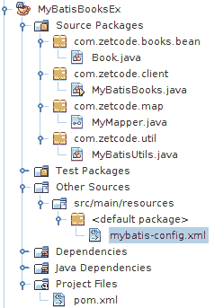

# MyBatis 简介

> 原文： [http://zetcode.com/db/mybatis/](http://zetcode.com/db/mybatis/)

这是 MyBatis Java 教程。 本教程介绍了使用 Java 和 MyBatis 进行 MySQL 编程的基础。

[Tweet](https://twitter.com/share) 

ZetCode 拥有用于 MySQL Java 的完整 电子书，其中包含 MyBatis 章节： [MySQL Java 编程电子书](/ebooks/mysqljava/)。

## MyBatis

MyBatis 是 Java 持久性框架，使用 XML 描述符或注释将对象与存储过程或 SQL 语句耦合。 与 ORM 框架不同，MyBatis 不会将 Java 对象映射到数据库表，而是将 Java 方法映射到 SQL 语句。 MyBatis 允许使用所有数据库功能，例如存储过程，视图，任何复杂性和供应商专有功能的查询。

使用 MyBatis 的好处是：

*   开箱即用的表/查询缓存
*   减少了许多 JDBC 样板
*   提高生产力
*   SQL 代码与 Java 类的分离

## 关于 MySQL 数据库

MySQL 是领先的开源数据库管理系统。 它是一个多用户，多线程的数据库管理系统。 MySQL 在网络上特别流行。 MySQL 有两个版本：MySQL 服务器系统和 MySQL 嵌入式系统。

## Maven 依赖

在`pom.xml`文件中，添加以下依赖项：

```
<dependencies>
    <dependency>
        <groupId>mysql</groupId>
        <artifactId>mysql-connector-java</artifactId>
        <version>5.1.40</version>
    </dependency>    

    <dependency>
        <groupId>org.mybatis</groupId>
        <artifactId>mybatis</artifactId>
        <version>3.4.2</version>
    </dependency>      

</dependencies>           

```

POM 文件具有两个依赖项：MyBatis 库和 MySQL 驱动程序。

## `MyBooks`表

本教程中的某些示例使用`MyBooks`表。

`mybooks.sql`

```
CREATE TABLE MyBooks(Id INTEGER NOT NULL PRIMARY KEY AUTO_INCREMENT, 
  Author VARCHAR(30), Title VARCHAR(60),  Published INTEGER, Remark VARCHAR(150));
INSERT INTO MyBooks(Author, Title, Published, Remark) VALUES ('Leo Tolstoy', 'War and Peace', 1869, 'Napoleonic wars');    
INSERT INTO MyBooks(Author, Title, Published, Remark) VALUES ('Leo Tolstoy', 'Anna Karenina', 1878, 'Greatest book of love');
INSERT INTO MyBooks(Author, Title, Published, Remark) VALUES ('Jeff Prosise', 'Programming Windows with MFC', 1999, 'Classic book about MFC');
INSERT INTO MyBooks(Author, Title, Published, Remark) VALUES ('Tom Marrs', 'JBoss at Work', 2005, 'JBoss practical guide');
INSERT INTO MyBooks(Author, Title, Published, Remark) VALUES ('Debu Panda', 'EJB3 in Action', 2007, 'Introduction to Enterprice Java Beans');

```

这些 SQL 命令在 MySQL `testdb`数据库中创建`MyBooks`表。

## MySQL 版本

在第一个示例中，我们获得 MySQL 的版本。 在此示例中，我们使用注释将对象映射到 SQL 语句。


图：MyBatisMySQLVersion 项目结构

这是 NetBeans 中的项目结构。

mybatis-config.xml

```
<?xml version="1.0" encoding="UTF-8"?>
<!DOCTYPE configuration
  PUBLIC "-//mybatis.org//DTD Config 3.0//EN"
  "http://mybatis.org/dtd/mybatis-3-config.dtd">
<configuration>
    <environments default="development">
        <environment id="development">
            <transactionManager type="JDBC"/>
            <dataSource type="POOLED">
                <property name="driver" value="com.mysql.jdbc.Driver"/>
                <property name="url" value="jdbc:mysql://localhost:3306/testdb"/>
                <property name="username" value="testuser"/>
                <property name="password" value="test623"/>
            </dataSource>
        </environment>
    </environments>
</configuration>

```

每个 MyBatis 项目都有一个主要的 XML 配置文件。 在这里，我们为 MySQL 定义了一个数据源。

`MyMapper.java`

```
package com.zetcode.version;

import org.apache.ibatis.annotations.Select;

public interface MyMapper {

    @Select("SELECT VERSION()")
    public String getMySQLVersion();
}

```

使用`@Select`批注，我们将`getMySQLVersion()`方法映射到该批注中指定的 SQL 语句。 获取 MySQL 版本的 SQL 语句为`SELECT VERSION()`。

`MyBatisMySQLVersion.java`

```
package com.zetcode.version;

import java.io.IOException;
import java.io.Reader;
import org.apache.ibatis.io.Resources;
import org.apache.ibatis.session.SqlSession;
import org.apache.ibatis.session.SqlSessionFactory;
import org.apache.ibatis.session.SqlSessionFactoryBuilder;

public class MyBatisMySQLVersion {

    private static SqlSessionFactory factory = null;

    public static void main(String[] args) throws IOException {

        String resource = "mybatis-config.xml";
        Reader reader = null;
        SqlSession session = null;

        reader = Resources.getResourceAsReader(resource);

        factory = new SqlSessionFactoryBuilder().build(reader);
        factory.getConfiguration().addMapper(MyMapper.class);

        reader.close();

        try {
            session = factory.openSession();
            String version = session.selectOne("getMySQLVersion");
            System.out.println(version);

        } finally {

            if (session != null) {
                session.close();
            }
        }
    }
}

```

我们连接到数据库并获取 MySQL 的版本。

```
String resource = "mybatis-config.xml";
Reader reader = null;
SqlSession session = null;

reader = Resources.getResourceAsReader(resource);

```

读取配置文件。

```
factory = new SqlSessionFactoryBuilder().build(reader);

```

`SqlSessionFactoryBuilder`用于构建`SqlSession`实例。

```
factory.getConfiguration().addMapper(MyMapper.class);

```

使用`addMapper()`方法，将映射类添加到工厂。

```
session = factory.openSession();

```

`openSession()`方法创建一个`SqlSession`。 `SqlSession`是用于 MyBatis 的主要 Java 接口。 通过该界面，我们执行命令，获取映射器并管理事务。

```
String version = session.selectOne("getMySQLVersion");

```

`selectOne()`方法从语句键检索映射的单个行。 语句键是映射器类中方法的名称。

```
System.out.println(version);

```

该版本将打印到控制台。

```
} finally {

    if (session != null) {
        session.close();
    }
}

```

最后，会话关闭。

## MySQL 版本 2

在第二个示例中，我们还将检索 MySQL 的版本。 这次我们使用 XML 映射器代替注释。

mybatis-config.xml

```
<?xml version="1.0" encoding="UTF-8"?>
<!DOCTYPE configuration
  PUBLIC "-//mybatis.org//DTD Config 3.0//EN"
  "http://mybatis.org/dtd/mybatis-3-config.dtd">
<configuration>
    <environments default="development">
        <environment id="development">
            <transactionManager type="JDBC"/>
            <dataSource type="POOLED">
                <property name="driver" value="com.mysql.jdbc.Driver"/>
                <property name="url" value="jdbc:mysql://localhost:3306/testdb"/>
                <property name="username" value="testuser"/>
                <property name="password" value="test623"/>
            </dataSource>
        </environment>
    </environments>

    <mappers>
        <mapper resource="mymapper.xml"/>
    </mappers>    

</configuration>

```

使用`&lt;mappers&gt;`标签，指定映射文件。

`mymapper.xml`

```
<?xml version="1.0" encoding="UTF-8"?>
<!DOCTYPE mapper
  PUBLIC "-//mybatis.org//DTD Mapper 3.0//EN"
  "http://mybatis.org/dtd/mybatis-3-mapper.dtd">

<mapper namespace="com.zetcode">

    <select id="mysqlVersion" resultType="String">
        SELECT VERSION()
    </select>

</mapper>

```

我们使用`&lt;select&gt;`标签定义映射。

`MyBatisMySQLVersion2.java`

```
package com.zetcode.version2;

import java.io.IOException;
import java.io.Reader;
import org.apache.ibatis.io.Resources;
import org.apache.ibatis.session.SqlSession;
import org.apache.ibatis.session.SqlSessionFactory;
import org.apache.ibatis.session.SqlSessionFactoryBuilder;

public class MyBatisMySQLVersion2 {

    private static SqlSessionFactory factory = null;

    public static void main(String[] args) throws IOException {

        String resource = "mybatis-config.xml";
        Reader reader = null;
        SqlSession session = null;

        reader = Resources.getResourceAsReader(resource);

        factory = new SqlSessionFactoryBuilder().build(reader);

        reader.close();

        try {
            session = factory.openSession();
            String version = session.selectOne("mysqlVersion");
            System.out.println(version);

        } finally {

            if (session != null) {
                session.close();
            }
        }
    }
}

```

这是主要的类。 区别在于我们没有在映射器中添加`addMapper()`，而是从配置文件中读取映射器。

## MyBatis Java 配置

可以在不使用 XML 的情况下以纯 Java 配置 MyBatis。 在下面的示例中，我们将查找表中的书籍数量。

`MyMapper.java`

```
package com.zetcode.map;

import org.apache.ibatis.annotations.Select;

public interface MyMapper {

    @Select("SELECT COUNT(*) FROM MyBooks")
    public int getNumberOfBooks();
}

```

`MyMapper`包含对`MyBooks`表中的行数进行计数的 SQL 代码。

`MyDataSourceFactory.java`

```
package com.zetcode.jconfig;

import java.util.Properties;
import javax.sql.DataSource;
import org.apache.ibatis.datasource.DataSourceFactory;
import org.apache.ibatis.datasource.pooled.PooledDataSource;

public class MyDataSourceFactory implements DataSourceFactory {

    private Properties prop;

    @Override
    public DataSource getDataSource() {

        PooledDataSource ds = new PooledDataSource();

        ds.setDriver(prop.getProperty("driver"));
        ds.setUrl(prop.getProperty("url"));
        ds.setUsername(prop.getProperty("user"));
        ds.setPassword(prop.getProperty("password"));

        return ds;
    }

    @Override
    public void setProperties(Properties prprts) {

        prop = prprts;
    }
}

```

`MyDataSourceFactory`从给定的属性创建一个`PooledDataSource`。 `PooledDataSource`是一个简单，同步，线程安全的数据库连接池。

`MyBatisJavaConfClient.java`

```
package com.zetcode.client;

import com.zetcode.jconfig.MyDataSourceFactory;
import com.zetcode.jconfig.MyMapper;
import java.io.IOException;
import java.util.Properties;
import javax.sql.DataSource;
import org.apache.ibatis.mapping.Environment;
import org.apache.ibatis.session.Configuration;
import org.apache.ibatis.session.SqlSession;
import org.apache.ibatis.session.SqlSessionFactory;
import org.apache.ibatis.session.SqlSessionFactoryBuilder;
import org.apache.ibatis.transaction.TransactionFactory;
import org.apache.ibatis.transaction.jdbc.JdbcTransactionFactory;

public class MyBatisJavaConfClient {

    private static SqlSessionFactory sesFact = null;

    public static void main(String[] args) throws IOException {

        Properties prop = new Properties();
        prop.setProperty("driver", "com.mysql.jdbc.Driver");
        prop.setProperty("url", "jdbc:mysql://localhost:3306/testdb");
        prop.setProperty("user", "testuser");
        prop.setProperty("password", "test623");

        MyDataSourceFactory mdsf = new MyDataSourceFactory();
        mdsf.setProperties(prop);
        DataSource ds = mdsf.getDataSource();

        TransactionFactory trFact = new JdbcTransactionFactory();
        Environment environment = new Environment("development", trFact, ds);
        Configuration config = new Configuration(environment);
        config.addMapper(MyMapper.class);

        sesFact = new SqlSessionFactoryBuilder().build(config);

        try (SqlSession session = sesFact.openSession()) {

            int numOfBooks = session.selectOne("getNumberOfBooks");
            System.out.format("There are %d books", numOfBooks);
        }
    }
}

```

在`MyBatisJavaConfClient`中，我们用 Java 代码配置 MyBatis，构建 SQL 会话，并执行`getNumberOfBooks()`方法。

```
Properties prop = new Properties();
prop.setProperty("driver", "com.mysql.jdbc.Driver");
prop.setProperty("url", "jdbc:mysql://localhost:3306/testdb");
prop.setProperty("user", "testuser");
prop.setProperty("password", "test623");

```

在这里，我们设置数据库属性。

```
MyDataSourceFactory mdsf = new MyDataSourceFactory();
mdsf.setProperties(prop);
DataSource ds = mdsf.getDataSource();

```

我们使用`MyDataSourceFactory`获得数据源。

```
TransactionFactory trFact = new JdbcTransactionFactory();
Environment environment = new Environment("development", trFact, ds);
Configuration config = new Configuration(environment);
config.addMapper(MyMapper.class);

```

此代码替换 XML 配置。 我们使用`JdbcTransactionFactory`，`Environment`和`Configuration`类。

```
sesFact = new SqlSessionFactoryBuilder().build(config);

```

`Configuration`类的实例传递给`SqlSessionFactoryBuilder's` `build()`方法。

## 动态 SQL

动态 SQL 允许我们使用`&lt;if&gt;`，`&lt;where&gt;`或`&lt;foreach&gt;`之类的标签创建动态 SQL 查询。

mybatis-config.xml

```
<?xml version="1.0" encoding="UTF-8"?>
<!DOCTYPE configuration
  PUBLIC "-//mybatis.org//DTD Config 3.0//EN"
  "http://mybatis.org/dtd/mybatis-3-config.dtd">
<configuration>

    <typeAliases>
        <typeAlias alias="Book" 
                   type="com.zetcode.mybatisdynamicsql.bean.Book"/>  
    </typeAliases>      

    <environments default="development">
        <environment id="development">
            <transactionManager type="JDBC"/>
            <dataSource type="POOLED">
                <property name="driver" value="com.mysql.jdbc.Driver"/>
                <property name="url" 
                          value="jdbc:mysql://localhost:3306/testdb"/>
                <property name="username" value="testuser"/>
                <property name="password" value="test623"/>
            </dataSource>
        </environment>
    </environments>

    <mappers>
        <mapper resource="mymapper.xml"/>
    </mappers>    

</configuration>

```

首先，我们提供`mybatis-config.xml`配置文件。

`mymapper.xml`

```
<?xml version="1.0" encoding="UTF-8"?>
<!DOCTYPE mapper
  PUBLIC "-//mybatis.org//DTD Mapper 3.0//EN"
  "http://mybatis.org/dtd/mybatis-3-mapper.dtd">

<mapper namespace="com.zetcode">

    <select id = "getBook" resultType = "Book">
        SELECT * FROM MyBooks

        <where>
            <if test = "_parameter != null">
                Id = #{id}
            </if>
        </where>

    </select>    

</mapper>

```

`mymapper.xml`包含动态 SQL 表达式。

```
<where>
    <if test = "_parameter != null">
        Id = #{id}
    </if>
</where>

```

仅当`Id`参数不为 null 时，才包含`&lt;where&gt;`标记的内容。 实际上，SQL 表达式返回一本由其 ID 标识的书，否则返回所有书。

`Book.java`

```
package com.zetcode.mybatisdynamicsql.bean;

public class Book {

    private Long id;
    private String author;
    private String title;
    private int published;
    private String remark;

    public Book() {};

    public Book(String author, String title, int published, 
            String remark) {

        this.author = author;
        this.title = title;
        this.published = published;
        this.remark = remark;
    }    

    public Long getId() {
        return id;
    }

    public void setId(Long id) {
        this.id = id;
    }

    public String getAuthor() {
        return author;
    }

    public void setAuthor(String author) {
        this.author = author;
    }

    public String getTitle() {
        return title;
    }

    public void setTitle(String title) {
        this.title = title;
    }

    public int getPublished() {
        return published;
    }

    public void setPublished(int published) {
        this.published = published;
    }

    public String getRemark() {
        return remark;
    }

    public void setRemark(String remark) {
        this.remark = remark;
    }

    @Override
    public String toString() {
        return "Book{" + "id=" + id + ", author=" + author + ", "
                + "title=" + title + ", published=" + published 
                + ", remark=" + remark + '}';
    }    
}

```

这是`Book` bean，它映射到我们的结果数据。

`Book.java`

```
package com.zetcode.mybatisdynamicsql;

import com.zetcode.mybatisdynamicsql.bean.Book;
import java.io.IOException;
import java.io.Reader;
import java.util.List;
import org.apache.ibatis.io.Resources;
import org.apache.ibatis.session.SqlSession;
import org.apache.ibatis.session.SqlSessionFactory;
import org.apache.ibatis.session.SqlSessionFactoryBuilder;

public class MyBatisDynamicSQL {

    private static SqlSessionFactory factory = null;

    public static void main(String[] args) throws IOException {

        String resource = "mybatis-config.xml";
        Reader reader = null;
        SqlSession session = null;

        reader = Resources.getResourceAsReader(resource);

        factory = new SqlSessionFactoryBuilder().build(reader);

        try {
            session = factory.openSession();
            Book book = session.selectOne("getBook", 1);
            System.out.println(book);

            List<Book> books = session.selectList("getBook");

            for (Book b : books) {
                System.out.println(b);
            }            

        } finally {

            if (session != null) {
                session.close();
            }
        }
    }
}

```

使用一个声明键，我们检索一本特定的书和所有书。

```
Book book = session.selectOne("getBook", 1);

```

在这里，我们检索由 ID 标识的一本书。

```
List<Book> books = session.selectList("getBook");

```

在这里，我们检索所有书籍； 第二个参数未传递。

## 图书

在下一个示例中，我们将插入数据库表并从中读取书籍。



图：MyBatisMySQLBooks 项目结构

这是 NetBeans 中的项目结构。

`Book.java`

```
package com.zetcode.books.bean;

public class Book {

    private Long id;
    private String author;
    private String title;
    private int published;
    private String remark;

    public Book() {};

    public Book(String author, String title, int published, 
            String remark) {

        this.author = author;
        this.title = title;
        this.published = published;
        this.remark = remark;
    }    

    public Long getId() {
        return id;
    }

    public void setId(Long id) {
        this.id = id;
    }

    public String getAuthor() {
        return author;
    }

    public void setAuthor(String author) {
        this.author = author;
    }

    public String getTitle() {
        return title;
    }

    public void setTitle(String title) {
        this.title = title;
    }

    public int getPublished() {
        return published;
    }

    public void setPublished(int published) {
        this.published = published;
    }

    public String getRemark() {
        return remark;
    }

    public void setRemark(String remark) {
        this.remark = remark;
    }

    @Override
    public String toString() {
        return "Book{" + "id=" + id + ", author=" + author + ", "
                + "title=" + title + ", published=" + published 
                + ", remark=" + remark + '}';
    }    
}

```

这是`Book` bean。 MyBatis 将表列映射到此类。 注意空构造函数的显式用法。

mybatis-config.xml

```
<?xml version="1.0" encoding="UTF-8"?>
<!DOCTYPE configuration
  PUBLIC "-//mybatis.org//DTD Config 3.0//EN"
  "http://mybatis.org/dtd/mybatis-3-config.dtd">
<configuration>

    <typeAliases>
        <typeAlias alias="Book" type="com.zetcode.books.bean.Book"/>  
    </typeAliases>  

    <environments default="development">
        <environment id="development">
            <transactionManager type="JDBC"/>
            <dataSource type="POOLED">
                <property name="driver" value="com.mysql.jdbc.Driver"/>
                <property name="url" value="jdbc:mysql://localhost:3306/testdb"/>
                <property name="username" value="testuser"/>
                <property name="password" value="test623"/>
            </dataSource>
        </environment>
    </environments>

</configuration>

```

在`mybatis-config.xml`文件中，我们使用`&lt;typeAlias&gt;`标签定义新的`Book`类型。

`MyMapper.java`

```
package com.zetcode.map;

import com.zetcode.books.bean.Book;
import java.util.List;
import org.apache.ibatis.annotations.Insert;
import org.apache.ibatis.annotations.Select;

public interface MyMapper {

    @Select("SELECT * FROM MyBooks WHERE Id = #{id}")
    public Book getBookById(Long id);

    @Select("SELECT * FROM MyBooks WHERE Author = #{author}")
    public List<Book> getBooksByAuthor(String author);   

    @Insert("INSERT INTO MyBooks(Author, Title, Published, Remark) "
            + "VALUES(#{author}, #{title}, #{published}, #{remark})")
    public void insertBook(String author, String title, int published, 
            String remark);
}

```

在`MyMapper`界面中，我们有三个注释。

```
@Select("SELECT * FROM MyBooks WHERE Id = #{id}")
public Book getBookById(Long id);

```

该注释将`getBookById()`方法映射到指定的 SELECT 语句。 该方法返回一个`Book`对象。

```
@Select("SELECT * FROM MyBooks WHERE Author = #{author}")
public List<Book> getBooksByAuthor(String author);

```

我们将 SELECT 语句映射到`getBooksByAuthor()`方法的列表，该方法返回书对象的列表。

```
@Insert("INSERT INTO MyBooks(Author, Title, Published, Remark) "
        + "VALUES(#{author}, #{title}, #{published}, #{remark})")
public void insertBook(String author, String title, int published, 
        String remark);

```

使用`@Insert`批注，我们将 INSERT 语句映射到`insertBook()`方法名称。

`MyBatisBooks.java`

```
package com.zetcode.client;

import com.zetcode.map.MyMapper;
import com.zetcode.books.bean.Book;
import com.zetcode.util.MyBatisUtils;
import java.io.IOException;
import java.util.List;
import org.apache.ibatis.session.SqlSession;
import org.apache.ibatis.session.SqlSessionFactory;

public class MyBatisBooks {

    private static SqlSessionFactory factory = null;

    public static void main(String[] args) throws IOException {

        SqlSession session = null;

        factory = MyBatisUtils.getSqlSessionFactory();
        factory.getConfiguration().addMapper(MyMapper.class);

        try {
            session = factory.openSession();
            Book book = session.selectOne("getBookById", 4L);
            System.out.println(book);

            List<Book> books = session.selectList("getBooksByAuthor", "Leo Tolstoy");

            for (Book b : books) {
                System.out.println(b);
            }

            Book newBook = new Book("Miguel de Cervantes", "Don Quixote",
                    1605, "First modern novel");

            session.update("insertBook", newBook);
            session.commit();

        } finally {

            if (session != null) {
                session.close();
            }
        }
    }
}

```

在主类中，我们通过 ID 来选择一本书，从作者中选择所有书籍，然后将新书籍插入表中。

```
Book book = session.selectOne("getBookById", 4L);

```

使用会话的`selectOne()`方法检索一本新书。

```
List<Book> books = session.selectList("getBooksByAuthor", "Leo Tolstoy");

for (Book b : books) {
    System.out.println(b);
}

```

列夫·托尔斯泰的所有书籍都是使用会话的`selectList()`方法检索的。

```
session.update("insertBook", newBook);
session.commit();

```

使用会话的`update()`方法插入一本新书。 该方法将`Book`实例作为第二个参数。 更改将通过`commit()`提交到数据库。

这是 MyBatis 教程。 您可能也对 [JDBI 教程](/db/jdbi/)， [PostgreSQL Java 教程](/db/postgresqljavatutorial/)， [MongoDB Java 教程](/db/mongodbjava/)或 [MySQL 教程](/databases/mysqltutorial/)感兴趣。