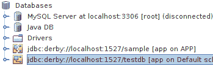
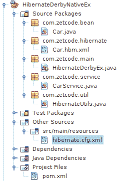

# Hibernate Derby 教程

> 原文： [http://zetcode.com/db/hibernatederby/](http://zetcode.com/db/hibernatederby/)

在本教程中，我们将学习如何在 Derby 数据库中使用 Hibernate ORM 工具。 本教程中的项目是在 NetBeans IDE 中创建的。

[Tweet](https://twitter.com/share) 

Hibernate 是 Java 语言的对象关系映射框架。 它提供了一个框架，用于将面向对象的域模型映射到关系数据库。 对象关系映射（ORM）是一种编程技术，用于在面向对象的编程语言中的不兼容类型系统之间转换数据。

Apache Derby 是一个完全用 Java 实现的开源关系数据库。 Derby 占用空间小，易于部署和安装。 它支持嵌入式和客户端/服务器模式。

Hibernate 查询语言（HQL）是类似于 SQL 的面向对象的查询语言。 SQL 在表和列上运行，而 HQL 在持久对象及其属性上运行。 HQL 了解继承，多态性和关联。 最终，HQL 查询由 Hibernate 转换为 SQL 查询，从而对数据库执行某些操作。

除了其本地 API，Hibernate 还包含 Java Persistence API（JPA）的实现。

## 配置信息

`hibernate.cfg.xml`文件定义了 Hibernate 配置信息。 它包含有关数据库连接，资源映射和其他连接属性的信息。

`SessionFactory`是工厂类，通过它我们可以获取会话并执行数据库操作。 `Session`是 Java 应用和 Hibernate 之间的主要运行时接口。 会话的主要功能是为映射实体类的实例提供创建，读取和删除操作。

## 在 Derby 中创建数据库

我们在 Derby 中创建一个新的`testdb`数据库。 它会有一个简单的`Cars`表。


图：数据库创建

在 NetBeans 的“服务”选项卡中，右键单击 Java DB 节点，然后选择“创建数据库”选项。 我们给它命名为`testdb`。 请注意，数据库位于用户主目录的`.netbeans_derby`目录中。

`cars_derby.sql`

```java
CREATE TABLE CARS(ID INTEGER NOT NULL PRIMARY KEY GENERATED ALWAYS AS IDENTITY 
    (START WITH 1, INCREMENT BY 1), NAME VARCHAR(30), PRICE INT);

INSERT INTO CARS(Name, Price) VALUES('Audi', 52642);
INSERT INTO CARS(Name, Price) VALUES('Mercedes', 57127);
INSERT INTO CARS(Name, Price) VALUES('Skoda', 9000);
INSERT INTO CARS(Name, Price) VALUES('Volvo', 29000);
INSERT INTO CARS(Name, Price) VALUES('Bentley', 350000);
INSERT INTO CARS(Name, Price) VALUES('Citroen', 21000);
INSERT INTO CARS(Name, Price) VALUES('Hummer', 41400);
INSERT INTO CARS(Name, Price) VALUES('Volkswagen', 21600);

```

这是创建`Cars`表的 SQL。 汽车对象的 ID 会自动增加。 我们可以使用 NetBeans 工具创建`Cars`表。 我们右键单击“数据库”节点，然后选择“新建连接”选项。



图：连接

创建一个新的连接对象； 它由橙色图标表示。 其上下文菜单提供了用于连接到指定数据库并执行命令的选项。 “执行命令”选项显示了执行 SQL 命令的工具。 在此窗口中，我们可以使用上面的 SQL 创建`Cars`表。

## 本机 Hibernate API 和 XML 映射

在本部分中，我们将创建一个 Java 控制台应用，该应用在 Derby 数据库上执行一些数据库任务。 我们使用 Hibernate 本机 API 和 XML 映射。



NetBeans 中的项目结构

在上图中，我们可以看到 NetBeans IDE 中的项目结构。

`pom.xml`

```java
<?xml version="1.0" encoding="UTF-8"?>
<project xmlns="http://maven.apache.org/POM/4.0.0" 
         xmlns:xsi="http://www.w3.org/2001/XMLSchema-instance" 
         xsi:schemaLocation="http://maven.apache.org/POM/4.0.0 http://maven.apache.org/xsd/maven-4.0.0.xsd">

    <modelVersion>4.0.0</modelVersion>
    <groupId>com.zetcode</groupId>
    <artifactId>HibernateDerbyEx</artifactId>
    <version>1.0-SNAPSHOT</version>
    <packaging>jar</packaging>
    <properties>
        <project.build.sourceEncoding>UTF-8</project.build.sourceEncoding>
        <maven.compiler.source>1.8</maven.compiler.source>
        <maven.compiler.target>1.8</maven.compiler.target>
    </properties>

    <dependencies>

        <dependency>
            <groupId>org.apache.derby</groupId>
            <artifactId>derbyclient</artifactId>
            <version>10.12.1.1</version>
        </dependency>

        <dependency>
            <groupId>org.hibernate</groupId>
            <artifactId>hibernate-core</artifactId>
            <version>5.2.2.Final</version>
        </dependency>

    </dependencies>

    <build>
        <resources>
            <resource>
                <directory>src/main/java</directory>
                <includes>                      
                    <include>**/*.xml</include>
                </includes>
            </resource>
            <resource>
                <directory>src/main/resources</directory>
            </resource>
        </resources>
    </build>   
</project>

```

在`pom.xml`文件中，我们定义两个依赖项：`hibernate-core`库和`derbyclient`驱动程序。 在`<build>`元素中，我们让构建系统包含 XML 文件-我们将 XML 映射文件放入`src/main/java`目录中。

hibernate.cfg.xml

```java
<?xml version="1.0" encoding="UTF-8"?>
<!DOCTYPE hibernate-configuration PUBLIC "-//Hibernate/Hibernate Configuration DTD//EN" 
"http://www.hibernate.org/dtd/hibernate-configuration-3.0.dtd">

<hibernate-configuration>
    <session-factory>
        <property name="hibernate.connection.driver_class">org.apache.derby.jdbc.ClientDriver</property>
        <property name="hibernate.connection.username">app</property>
        <property name="hibernate.connection.password">ap</property>
        <property name="hibernate.connection.url">jdbc:derby://localhost:1527/testdb</property>

        <!-- Enable Hibernate's automatic session context management -->
        <property name="current_session_context_class">thread</property>

        <property name="hibernate.dialect"<org.hibernate.dialect.DerbyTenSevenDialect</property>
        <mapping resource="com/zetcode/hibernate/Car.hbm.xml"></mapping>
    </session-factory>
</hibernate-configuration>

```

在 Hibernate 配置文件中，我们提供了 Derby 数据库的连接属性。 我们启用了 Hibernate 的自动会话上下文管理，并指定了 Derby SQL 方言。 映射与`<mapping>`元素一起添加。 我们有一个`Car`对象到`CARS`表的映射。

`Car.java`

```java
package com.zetcode.bean;

public class Car {

    private Long Id;
    private String Name;
    private Integer Price;

    public Long getId() {
        return Id;
    }

    public void setId(Long Id) {
        this.Id = Id;
    }

    public String getName() {
        return Name;
    }

    public void setName(String Name) {
        this.Name = Name;
    }

    public Integer getPrice() {
        return Price;
    }

    public void setPrice(Integer Price) {
        this.Price = Price;
    }

    @Override
    public String toString() {

        return String.format("Car Id: %d Name: %s; Price: %d", 
                Id, Name, Price);
    }    
}

```

这是一个`Car` bean。 它具有三个属性以及相应的获取器和设置器。

Car.hbm.xml

```java
<?xml version="1.0" encoding="UTF-8"?>
<!DOCTYPE hibernate-configuration PUBLIC "-//Hibernate/Hibernate Configuration DTD//EN" 
"http://www.hibernate.org/dtd/hibernate-configuration-3.0.dtd">

<hibernate-mapping>
    <class name="com.zetcode.bean.Car" table="CARS" catalog="app">
        <id name="Id" type="java.lang.Long">
            <column name="Id" />
            <generator class="identity" />
        </id>
        <property name="Name" type="string">
            <column name="Name" length="30"/>
        </property>
        <property name="Price" type="integer">
            <column name="Price" />
        </property>
    </class>
</hibernate-mapping>

```

在`Car.hbm.xml`文件中，我们提供`Car`类和`CARS`表之间的映射。 我们将类的属性映射到数据库表的列。 在`<hibernate-mapping>`和`</hibernate-mapping>`元素之间指定了映射。

```java
<generator class="identity" />

```

`generator`元素通知 Hibernate 使用什么策略来生成主键。 `identity`生成器类允许根据需要自动增加`integer`/`bigint`列。 此生成器受 Derby 支持。

`HibernateUtils.java`

```java
package com.zetcode.util;

import org.hibernate.SessionFactory;
import org.hibernate.cfg.Configuration;

public class HibernateUtils {

    private HibernateUtils() {}

    private static final SessionFactory sessionFactory;

    static {
        try {
            sessionFactory = new Configuration().configure().buildSessionFactory();
        } catch (Throwable ex) {
            System.err.println("Initial SessionFactory creation failed." + ex);
            throw new ExceptionInInitializerError(ex);
        }
    }

    public static SessionFactory getSessionFactory() {
        return sessionFactory;
    }

   public static void shutdown() {

        getSessionFactory().close();
    }    
}

```

`HibernateUtils`是一个帮助程序类，用于处理启动并访问`SessionFactory`以获取会话对象。 然后，使用会话对象访问数据库。

```java
sessionFactory = new Configuration().configure().buildSessionFactory();

```

该行从`hibernate.cfg.xml`文件创建一个`SessionFactory`。

```java
getSessionFactory().close();

```

该行关闭缓存和连接池。

`CarService.java`

```java
package com.zetcode.service;

import com.zetcode.bean.Car;
import com.zetcode.util.HibernateUtils;
import java.util.List;
import org.hibernate.Session;

public class CarService {

    private CarService() {};

    public static Car getCarById(Long id) {

        Car car;
        try (Session session = HibernateUtils.getSessionFactory().openSession()) {
            car = session.get(Car.class, id);
        }

        return car;
    }    

    public static List<Car> getCars() {

        List<Car> cars;
        try (Session session = HibernateUtils.getSessionFactory().openSession()) {
            cars = session.createQuery("from Car").list();
        }
        return cars;
    }

    public static void save(Car car) {

        try (Session session = HibernateUtils.getSessionFactory().openSession()) {
            session.beginTransaction();

            session.save(car);

            session.getTransaction().commit();
        }
    }
}

```

在`CarService`类中，我们有一些服务方法，可通过其 ID 获取汽车，获取所有汽车并保存新汽车。

```java
try (Session session = HibernateUtils.getSessionFactory().openSession()) {
    car = session.get(Car.class, id);
}

```

`HibernateUtils`用于获取并打开会话对象。 `Session's` `get()`方法返回具有给定标识符的给定实体类的持久实例，如果没有这样的持久实例，则返回`null`。

```java
cars = session.createQuery("from Car").list();

```

`createQuery()`方法为给定的 HQL 查询字符串创建`Query`的新实例。 `from Car`查询返回`Car`类的所有实例。

```java
session.save(car);

```

`save()`方法保留给定实例。

`HibernateDerbyEx.java`

```java
package com.zetcode.main;

import com.zetcode.bean.Car;
import com.zetcode.service.CarService;
import com.zetcode.util.HibernateUtils;
import java.util.List;

public class HibernateDerbyEx {

    public static void main(String[] args) {

        Long id = 1L;

        Car car = CarService.getCarById(id);

        System.out.println(car);

        Car newCar = new Car();

        newCar.setName("Toyota");
        newCar.setPrice(34500);

        CarService.save(newCar);

        List<Car> cars = CarService.getCars();

        for (Car mycar : cars) {

            System.out.println(mycar);
        }

        HibernateUtils.shutdown();
    }
}

```

这是主要的应用类。 我们通过其 ID 获得一辆汽车，保存一辆新汽车，并从数据库表中列出所有汽车。

```java
Long id = 1L;

Car car = CarService.getCarById(id);

```

我们使用`CarService's` `getCarById()`方法通过汽车 ID 检索汽车。

```java
Car newCar = new Car();

newCar.setName("Toyota");
newCar.setPrice(34500);

CarService.save(newCar);

```

将创建新车并将其保存到数据库中。

```java
List<Car> cars = CarService.getCars();

for (Car mycar : cars) {

    System.out.println(mycar);
}

```

我们从`CARS`表中列出了所有汽车。

```java
HibernateUtils.shutdown();

```

最后，我们关闭打开的资源。

## 本机 Hibernate API 和注释映射

在本部分中，我们将创建一个 Java 控制台应用，该应用在 Derby 数据库上执行一些数据库任务。 我们使用 Hibernate 本机 API 和注释映射。

`pom.xml`，`CarService.java`，`HibernateDerbyNativeEx.java`和`HibernateUtils.java`文件不变。 `hibernate.cfg.xml`和`Car.java`确实发生了变化。

hibernate.cfg.xml

```java
<?xml version="1.0" encoding="UTF-8"?>
<!DOCTYPE hibernate-configuration PUBLIC "-//Hibernate/Hibernate Configuration DTD//EN" 
"http://www.hibernate.org/dtd/hibernate-configuration-3.0.dtd">

<hibernate-configuration>
    <session-factory>
        <property name="hibernate.connection.driver_class">org.apache.derby.jdbc.ClientDriver</property>
        <property name="hibernate.connection.username">app</property>
        <property name="hibernate.connection.password">ap</property>
        <property name="hibernate.connection.url">jdbc:derby://localhost:1527/testdb</property>

        <!-- Enable Hibernate's automatic session context management -->
        <property name="current_session_context_class">thread</property>

        <property name="hibernate.dialect">org.hibernate.dialect.DerbyTenSevenDialect</property>
        <mapping class="com.zetcode.bean.Car"></mapping>
    </session-factory>
</hibernate-configuration>

```

在`hibernate.cfg.xml`文件中，`<mapping>`元素已更改。

```java
<mapping class="com.zetcode.bean.Car"></mapping>

```

我们使用`class`属性指向 Java 实体，其中包含映射注释。

`Car.java`

```java
package com.zetcode.bean;

import java.io.Serializable;
import javax.persistence.Entity;
import javax.persistence.GeneratedValue;
import javax.persistence.GenerationType;
import javax.persistence.Id;
import javax.persistence.Table;

@Entity
@Table(name="CARS")
public class Car implements Serializable {

    private Long Id;
    private String Name;
    private Integer Price;

    @Id
    @GeneratedValue(strategy = GenerationType.IDENTITY)
    public Long getId() {
        return Id;
    }

    public void setId(Long Id) {
        this.Id = Id;
    }

    public String getName() {
        return Name;
    }

    public void setName(String Name) {
        this.Name = Name;
    }

    public Integer getPrice() {
        return Price;
    }

    public void setPrice(Integer Price) {
        this.Price = Price;
    }

    @Override
    public String toString() {

        return String.format("Car Id: %d Name: %s; Price: %d", 
                Id, Name, Price);
    }    
}

```

在`Car.java`类中，我们使用注释定义映射。 类属性的名称和表列的名称将自动配对。 如果名称不同，则必须使用`@Column`注解指定列名称。

```java
@Entity
@Table(name="CARS")
public class Car implements Serializable {

```

该类用`@Entity`注解装饰； `@Table`注释指定被注释实体的主表。

```java
@Id
@GeneratedValue(strategy = GenerationType.IDENTITY)
public Long getId() {

```

`@Id`注释指定实体的主键，`@GeneratedValue`提供规范主键值的生成策略。

在本教程中，我们介绍了 Hibernate ORM。 我们已经使用了 Derby 数据库。 ZetCode 具有以下相关教程： [EclipseLink 教程](/java/eclipselink/)， [MySQL Java 教程](/db/mysqljava/)， [JDBC 模板教程](db/jdbctemplate/)和 [Apache Derby 教程](/db/apachederbytutorial/)。