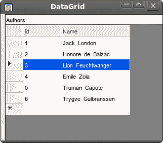

# MySQL Visual Basic 教程

> 原文： [http://zetcode.com/db/mysqlvb/](http://zetcode.com/db/mysqlvb/)

这是针对 MySQL 数据库的 Visual Basic 教程。 它涵盖了使用 Visual Basic 进行 MySQL 编程的基础。 在本教程中，我们使用 _Connector / Net_ 驱动程序。 该驱动程序基于 ADO.NET 规范。 这些示例是在 Ubuntu Linux 上创建和测试的。 在 ZetCode 上有类似的 [MySQL C# 教程](/db/mysqlcsharptutorial/)， [MySQL Perl 教程](/db/mysqlperl/)和 [SQLite Visual Basic 教程](/db/sqlitevb/)。

如果您需要重新了解 Visual Basic 语言，可以在 ZetCode 上找到完整的 [Visual Basic 教程](/lang/visualbasic/)。

## 关于 MySQL 数据库

MySQL 是领先的开源数据库管理系统。 它是一个多用户，多线程的数据库管理系统。 MySQL 在网络上特别流行。 它是由 Linux，Apache，MySQL 和 PHP 组成的 _LAMP_ 平台的组成部分之一。 目前，MySQL 由 Oracle 拥有。 MySQL 数据库在最重要的 OS 平台上可用。 它可以在 BSD Unix，Linux，Windows 或 Mac OS 上运行。 维基百科和 YouTube 使用 MySQL。 这些站点每天管理数百万个查询。 MySQL 有两个版本：MySQL 服务器系统和 MySQL 嵌入式系统。

## 开始之前

我们需要安装几个软件包来执行本教程中的示例：`libmysql6.1-cil`，`mysql-server`，`mysql-client`。 我们需要从 Mono 项目安装 Visual Basic 编译器。 从包装或从来源。

_libmysql6.1-cil_ 是 CLI 的 MySQL 数据库连接器。 它用 C# 编写，可用于所有 CLI 语言。 C# ，Visual Basic，Boo 等。

```vb
$ ls /usr/lib/cli/MySql.Data-6.1/MySql.Data.dll 
/usr/lib/cli/MySql.Data-6.1/MySql.Data.dll

```

从技术角度来看，我们需要一个 DLL。 在我的系统（Ubuntu Lucid Lynx）上，它位于上述路径下。 我们需要知道 DLL 库的路径。 汇编我们的例子。

如果您尚未安装 MySQL，则必须安装它。

```vb
$ sudo apt-get install mysql-server

```

此命令将安装 MySQL 服务器和其他各种软件包。 在安装软件包时，提示我们输入 MySQL 根帐户的密码。

接下来，我们将创建一个新的数据库用户和一个新的数据库。 我们使用`mysql`客户端。

```vb
$ service mysql status
mysql start/running, process 1238

```

我们检查 MySQL 服务器是否正在运行。 如果没有，我们需要启动服务器。 在 Ubuntu Linux 上，可以使用`service mysql start`命令来完成。

```vb
$ mysql -u root -p
Enter password: 
Welcome to the MySQL monitor.  Commands end with ; or \g.
Your MySQL connection id is 30
Server version: 5.0.67-0ubuntu6 (Ubuntu)

Type 'help;' or '\h' for help. Type '\c' to clear the buffer.

mysql> SHOW DATABASES;
+--------------------+
| Database           |
+--------------------+
| information_schema | 
| mysql              | 
+--------------------+
2 rows in set (0.00 sec)

```

我们使用 _mysql 监视器 _ 客户端应用连接到服务器。 我们使用根帐户连接到数据库。 我们用`SHOW DATABASES`语句显示所有可用的数据库。

```vb
mysql> CREATE DATABASE testdb;
Query OK, 1 row affected (0.02 sec)

```

我们创建一个新的`testdb`数据库。 在整个教程中，我们将使用此数据库。

```vb
mysql> CREATE USER 'testuser'@'localhost' IDENTIFIED BY 'test623';
Query OK, 0 rows affected (0.00 sec)

mysql> USE testdb;
Database changed

mysql> GRANT ALL ON testdb.* TO 'testuser'@'localhost';
Query OK, 0 rows affected (0.00 sec)

mysql> quit;
Bye

```

我们创建一个新的数据库用户。 我们授予该用户`testdb`数据库所有表的所有特权。

## 定义

`ADO.NET`是.NET 框架的重要组成部分。 该规范统一了对关系数据库，XML 文件和其他应用数据的访问。 `MySQL Connector/Net`是 MySQL 数据库的 ADO.NET 规范的实现。 它是用 C# 语言编写的驱动程序，可用于所有.NET 语言。

`Connection`，`Command`，`DataReader`，`DataSet`和`DataProvider`是.NET 数据提供程序模型的核心元素。 `Connection`创建到特定数据源的连接。 `Command`对象针对数据源执行一条 SQL 语句。 `DataReader`从数据源读取数据流。 `DataSet`对象用于脱机处理大量数据。 它是一种断开连接的数据表示形式，可以保存来自各种不同来源的数据。 `DataReader`和`DataSet`都用于处理数据。 它们在不同的情况下使用。 如果只需要读取查询结果，则`DataReader`是更好的选择。 如果需要更广泛的数据处理，或者要将`Winforms`控件绑定到数据库表，则首选`DataSet`。

## MySQL 版本

如果以下程序运行正常，则我们已安装一切正常。 我们检查 MySQL 服务器的版本。

```vb
Option Strict On

Imports MySql.Data.MySqlClient

Module Example

    Sub Main()

        Dim cs As String = "Database=testdb;Data Source=localhost;" _
            & "User Id=testuser;Password=test623"

        Dim conn As New MySqlConnection(cs)

        Try
          conn.Open()
          Console.WriteLine("MySQL version : {0}", conn.ServerVersion)

        Catch ex As MySqlException
          Console.WriteLine("Error: " & ex.ToString())
        Finally
          conn.Close()
        End Try

    End Sub

End Module

```

我们连接到数据库并获取有关 MySQL 服务器的一些信息。

```vb
Imports MySql.Data.MySqlClient

```

我们导入 MySQL 数据提供程序的元素。

```vb
Dim cs As String = "Database=testdb;Data Source=localhost;" _
    & "User Id=testuser;Password=test623"

```

这是连接字符串。 数据提供者使用它来建立与数据库的连接。 我们指定数据库名称，主机，用户名和密码。

```vb
Dim conn As New MySqlConnection(cs)

```

创建一个`MySQLConnection`对象。 该对象用于打开与数据库的连接。

```vb
conn.Open()

```

这条线打开连接。

```vb
Console.WriteLine("MySQL version : {0}", conn.ServerVersion)

```

在这里，我们使用连接对象的`ServerVersion`属性打印 MySQL 的版本。

```vb
Catch ex As MySqlException
  Console.WriteLine("Error: " & ex.ToString())

```

如果发生异常，我们将错误消息打印到控制台。

```vb
$ vbnc -r:/usr/lib/cli/MySql.Data-6.1/MySql.Data.dll connect.vb

```

我们汇编我们的例子。 提供了 MySQL 连接器 DLL 的路径。

```vb
$ ./connect.exe 
MySQL version : 5.1.41-3ubuntu12.6

```

这是我系统上程序的输出。

接下来是一个更复杂的程序。

```vb
Option Strict On

Imports MySql.Data.MySqlClient

Module Example

    Sub Main()
        Dim cs As String = "Database=testdb;Data Source=localhost;" _
            & "User Id=testuser;Password=test623"

        Dim stm As String = "SELECT VERSION()"
        Dim version As String
        Dim conn As MySqlConnection

        Try
            conn = New MySqlConnection(cs)
            conn.Open()

            Dim cmd As MySqlCommand = New MySqlCommand(stm, conn)

            version = Convert.ToString(cmd.ExecuteScalar())

            Console.WriteLine("MySQL version: {0}", version)

        Catch ex As MySqlException
            Console.WriteLine("Error: " & ex.ToString())
        Finally
            conn.Close()
        End Try

   End Sub

End Module

```

我们检查 MySQL 数据库的版本。 这次使用 SQL 查询。

```vb
Dim stm As String = "SELECT VERSION()"

```

这是 SQL `SELECT`语句。 它返回数据库的版本。 `VERSION()`是内置的 MySQL 函数。

```vb
Dim cmd As MySqlCommand = New MySqlCommand(stm, conn)

```

`MySqlCommand`是一个对象，用于在数据库上执行查询。 参数是 SQL 语句和连接对象。

```vb
version = Convert.ToString(cmd.ExecuteScalar())

```

有些查询仅返回标量值。 在我们的例子中，我们需要一个简单的字符串来指定数据库的版本。 在这种情况下使用`ExecuteScalar()`。 我们避免了使用更复杂的对象的开销。

```vb
$ ./connect2.exe 
MySQL version : 5.1.41-3ubuntu12.6

```

结果与前面的示例相同。

## 创建和填充表

接下来，我们将创建数据库表并用数据填充它们。 这些表将在本教程中使用。

```vb
DROP TABLE IF EXISTS Books, Authors;

CREATE TABLE IF NOT EXISTS Authors(Id INT PRIMARY KEY AUTO_INCREMENT, 
    Name VARCHAR(25)) ENGINE=INNODB;

INSERT INTO Authors(Id, Name) VALUES(1, 'Jack London');
INSERT INTO Authors(Id, Name) VALUES(2, 'Honore de Balzac');
INSERT INTO Authors(Id, Name) VALUES(3, 'Lion Feuchtwanger');
INSERT INTO Authors(Id, Name) VALUES(4, 'Emile Zola');
INSERT INTO Authors(Id, Name) VALUES(5, 'Truman Capote');

CREATE TABLE IF NOT EXISTS Books(Id INT PRIMARY KEY AUTO_INCREMENT, 
    AuthorId INT, Title VARCHAR(100), 
    FOREIGN KEY(AuthorId) REFERENCES Authors(Id) ON DELETE CASCADE)
    ENGINE=INNODB;

INSERT INTO Books(Id, AuthorId, Title) VALUES(1, 1, 'Call of the Wild');
INSERT INTO Books(Id, AuthorId, Title) VALUES(2, 1, 'Martin Eden');
INSERT INTO Books(Id, AuthorId, Title) VALUES(3, 2, 'Old Goriot');
INSERT INTO Books(Id, AuthorId, Title) VALUES(4, 2, 'Cousin Bette');
INSERT INTO Books(Id, AuthorId, Title) VALUES(5, 3, 'Jew Suess');
INSERT INTO Books(Id, AuthorId, Title) VALUES(6, 4, 'Nana');
INSERT INTO Books(Id, AuthorId, Title) VALUES(7, 4, 'The Belly of Paris');
INSERT INTO Books(Id, AuthorId, Title) VALUES(8, 5, 'In Cold blood');
INSERT INTO Books(Id, AuthorId, Title) VALUES(9, 5, 'Breakfast at Tiffany');

```

我们有一个`books.sql`文件。 它创建两个数据库表：`Authors`和`Books`。 这些表是 InnoDB 类型的。 InnoDB 数据库支持外键约束和事务。 我们将外键约束放在`Books`表的`AuthorId`列上。 我们用初始数据填充表。

```vb
mysql> source books.sql
Query OK, 0 rows affected (0.07 sec)
Query OK, 0 rows affected (0.12 sec)
Query OK, 1 row affected (0.04 sec)
...

```

我们使用 source 命令执行`books.sql`脚本。

在下面的示例中，我们将在`Authors`表中插入一个新作者。

```vb
Option Strict On

Imports MySql.Data.MySqlClient

Module Example

   Sub Main()
      Dim connString As String = "Database=testdb;Data Source=localhost;" _
          & "User Id=testuser;Password=test623"

      Dim conn As New MySqlConnection(connString)
      Dim cmd As New MySqlCommand()

      Try
        conn.Open()
        cmd.Connection = conn

        cmd.CommandText = "INSERT INTO Authors(Name) VALUES(@Name)"
        cmd.Prepare()

        cmd.Parameters.AddWithValue("@Name", "Trygve Gulbranssen")
        cmd.ExecuteNonQuery()

        conn.Close()

      Catch ex As MySqlException
          Console.WriteLine("Error: " & ex.ToString())
      End Try

   End Sub

End Module

```

我们将新作者添加到`Authors`表中。 我们使用参数化命令。

```vb
cmd.CommandText = "INSERT INTO Authors(Name) VALUES(@Name)"
cmd.Prepare()

```

在这里，我们创建一个预备语句。 在编写预备语句时，我们使用占位符，而不是直接将值写入语句中。 预备语句更快，并且可以防止 SQL 注入攻击。 `@Name`是一个占位符，稍后将填充。

```vb
cmd.Parameters.AddWithValue("@Name", "Trygve Gulbranssen")

```

值绑定到占位符。

```vb
cmd.ExecuteNonQuery()

```

执行预备语句。 当我们不希望返回任何数据时，我们使用`MySQLCommand`对象的`ExecuteNonQuery()`方法。 这是当我们创建数据库或执行`INSERT`，`UPDATE`，`DELETE`语句时。

```vb
$ ./prepared.exe 
mysql> select * from Authors;
+----+--------------------+
| Id | Name               |
+----+--------------------+
|  1 | Jack London        |
|  2 | Honore de Balzac   |
|  3 | Lion Feuchtwanger  |
|  4 | Emile Zola         |
|  5 | Truman Capote      |
|  6 | Trygve Gulbranssen |
+----+--------------------+
6 rows in set (0.00 sec)

```

我们在表中插入了一位新作者。

## 使用`MySqlDataReader`检索数据

`MySqlDataReader`是用于从数据库检索数据的对象。 它提供对查询结果的快速，仅转发和只读访问。 这是从表中检索数据的最有效方法。

```vb
Option Strict On

Imports MySql.Data.MySqlClient

Module Example

    Sub Main()

        Dim cs As String = "Database=testdb;Data Source=localhost;" _
            & "User Id=testuser;Password=test623"

        Dim conn As New MySqlConnection(cs)

        Try
            conn.Open()
            Dim stm As String = "SELECT * FROM Authors"
            Dim cmd As MySqlCommand = New MySqlCommand(stm, conn)
            Dim reader As MySqlDataReader = cmd.ExecuteReader()

            While reader.Read()
                Console.WriteLine(reader.GetInt32(0) & ": " _ 
                    & reader.GetString(1))
            End While

            reader.Close()

        Catch ex As MySqlException
          Console.WriteLine("Error: " & ex.ToString())
        Finally
          conn.Close()
        End Try

    End Sub

End Module

```

我们从`Authors`表中获取所有作者并将其打印到控制台。

```vb
Dim reader As MySqlDataReader = cmd.ExecuteReader()

```

要创建`MySQLDataReader`，我们必须调用`MySqlCommand`对象的`ExecuteReader()`方法。

```vb
While reader.Read()
    Console.WriteLine(reader.GetInt32(0) & ": " _ 
        & reader.GetString(1))
End While

```

`Read()`方法将数据读取器移至下一条记录。 如果有更多行，则返回 true；否则，返回 true。 否则为假。 我们可以使用数组索引符号来检索值，或者使用特定的方法来访问其本机数据类型中的列值。 后者效率更高。

```vb
reader.Close()

```

阅读完毕后，请始终调用`Close()`方法。

```vb
$ ./read.exe 
1: Jack London
2: Honore de Balzac
3: Lion Feuchtwanger
4: Emile Zola
5: Truman Capote
6: Trygve Gulbranssen

```

这是示例的输出。

## 列标题

接下来，我们将展示如何使用数据库表中的数据打印列标题。

```vb
Option Strict On

Imports MySql.Data.MySqlClient

Module Example

   Sub Main()
      Dim connString As String = "Database=testdb;Data Source=localhost;" _
          & "User Id=testuser;Password=test623"

      Dim conn As New MySqlConnection(connString)

      Try
          conn.Open()

          Dim stm As String = "SELECT Name, Title From Authors, " _
              & "Books WHERE Authors.Id=Books.AuthorId"

          Dim cmd As MySqlCommand = New MySqlCommand(stm, conn)
          Dim reader As MySqlDataReader = cmd.ExecuteReader()

          Console.WriteLine("{0} {1}", reader.GetName(0), _
              reader.GetName(1).PadLeft(18))

          While reader.Read()
              Console.WriteLine(reader.GetString(0).PadRight(18) _ 
                  & reader.GetString(1))
          End While

          reader.Close()

      Catch ex As MySqlException
         Console.WriteLine("Error: " & ex.ToString())
      Finally
         conn.Close()
      End Try

   End Sub

End Module

```

在此程序中，我们从`Authors`表中选择作者，并从`Books`表中选择他们的书。

```vb
Dim stm As String = "SELECT Name, Title From Authors, " _
    & "Books WHERE Authors.Id=Books.AuthorId"

```

这是将作者与他们的书联系在一起的 SQL 语句。

```vb
Dim reader As MySqlDataReader = cmd.ExecuteReader()

```

我们创建一个`MySqlDataReader`对象。

```vb
Console.WriteLine("{0} {1}", reader.GetName(0), _
    reader.GetName(1).PadLeft(18))

```

我们使用阅读器的`GetName()`方法获得列的名称。 `PadLeft()`方法返回指定长度的新字符串，其中当前字符串的开头用空格填充。 我们使用此方法正确对齐字符串。

```vb
While reader.Read()
    Console.WriteLine(reader.GetString(0).PadRight(18) _ 
        & reader.GetString(1))
End While

```

我们将 SQL 语句返回的数据打印到终端。

```vb
$ ./columns.exe 
Name              Title
Jack London       Call of the Wild
Jack London       Martin Eden
Honore de Balzac  Old Goriot
Honore de Balzac  Cousin Bette
Lion Feuchtwanger Jew Suess
Emile Zola        Nana
Emile Zola        The Belly of Paris
Truman Capote     In Cold blood
Truman Capote     Breakfast at Tiffany

```

该程序的输出。

## 数据集& `MySqlDataAdapter`

`DataSet`是数据库表中数据的副本以及数据之间的关系。 它在内存中创建，并在需要对数据进行大量处理或将数据表绑定到 Winforms 控件时使用。 处理完成后，更改将被写入数据源。 `MySqlDataAdapter`是`DataSet`和数据源之间的中介。 它填充`DataSet`并解析数据源的更新。

```vb
Option Strict On

Imports System.Data
Imports MySql.Data.MySqlClient

Module Example

    Sub Main()

        Dim cs As String = "Database=testdb;Data Source=localhost;" _
            & "User Id=testuser;Password=test623"

        Dim conn As New MySqlConnection(cs)

        Dim stm As String = "SELECT * FROM Authors"

        Try
            conn.Open()

            Dim da As New MySqlDataAdapter(stm, conn)

            Dim ds As New DataSet
            da.Fill(ds, "Authors")

            Dim dt As DataTable = ds.Tables("Authors")

            dt.WriteXml("authors.xml")

            For Each row As DataRow In dt.Rows
                For Each col As DataColumn In dt.Columns
                  Console.WriteLine(row(col))
                Next
                 Console.WriteLine("".PadLeft(20, "="))
            Next

        Catch ex As MySqlException
          Console.WriteLine("Error: " & ex.ToString())
        Finally
          conn.Close()
        End Try

    End Sub

End Module 

```

我们从`Authors`表中打印作者。 这次，我们使用`MySqlDataAdapter`和`DataSet`对象。

```vb
Dim da As New MySqlDataAdapter(stm, conn)

```

创建一个`MySqlDataAdapter`对象。 它以 SQL 语句和连接为参数。

```vb
Dim ds As New DataSet
da.Fill(ds, "Authors")

```

我们创建并填充`DataSet`。

```vb
Dim dt As DataTable = ds.Tables("Authors")

```

我们得到名为`Authors`的表。 我们只给了`DataSet`一个表，但它可以包含多个表。

```vb
dt.WriteXml("authors.xml")

```

我们将数据写入 XML 文件。

```vb
For Each row As DataRow In dt.Rows
    For Each col As DataColumn In dt.Columns
      Console.WriteLine(row(col))
    Next
      Console.WriteLine("".PadLeft(20, "="))
Next

```

我们将`Authors`表的内容显示到终端。 为了遍历数据，我们利用了`DataTable`对象的行和列。

在下一个示例中，我们将表绑定到 Winforms `DataGrid`控件。

```vb
Option Strict On

Imports System.Windows.Forms
Imports System.Drawing
Imports System.Data
Imports MySql.Data.MySqlClient

Public Class WinVBApp
    Inherits Form

    Private dg As DataGrid
    Private da As MySqlDataAdapter
    Private ds As DataSet

    Public Sub New()

       Me.Text = "DataGrid"
       Me.Size = New Size(350, 300)

       Me.InitUI()
       Me.InitData()

       Me.CenterToScreen()

    End Sub

    Private Sub InitUI()

        dg = New DataGrid

        dg.CaptionBackColor = System.Drawing.Color.White
        dg.CaptionForeColor = System.Drawing.Color.Black
        dg.CaptionText = "Authors"

        dg.Location = New Point(8, 0)
        dg.Size = New Size(350, 300)
        dg.TabIndex = 0
        dg.Parent = Me

    End Sub

    Private Sub InitData()

        Dim cs As String = "Database=testdb;Data Source=localhost;" _
            & "User Id=testuser;Password=test623"

        Dim conn As New MySqlConnection(cs)

        Dim stm As String = "SELECT * FROM Authors"
        ds = New DataSet

        Try
            conn.Open()

            da = New MySqlDataAdapter(stm, conn)
            da.Fill(ds, "Authors")

            dg.DataSource = ds.Tables("Authors")

        Catch ex As MySqlException
          Console.WriteLine("Error: " & ex.ToString())
        Finally
          conn.Close()
        End Try

    End Sub

    Public Shared Sub Main()
        Application.Run(New WinVBApp)
    End Sub

End Class

```

在此示例中，我们将`Authors`表绑定到 Winforms `DataGrid`控件。

```vb
Imports System.Windows.Forms
Imports System.Drawing

```

这两个名称空间用于 GUI。

```vb
Me.InitUI()
Me.InitData()

```

在`InitUI()`方法内部，我们构建了用户界面。 在`InitData()`方法中，我们连接到数据库，将数据检索到`DataSet`中并将其绑定到`DataGrid`控件。

```vb
dg = New DataGrid

```

`DataGrid`控件已创建。

```vb
Dim stm As String = "SELECT * FROM Authors"

```

我们将在`DataGrid`控件中显示`Authors`表中的数据。

```vb
dg.DataSource = ds.Tables("Authors")

```

我们将`DataGrid`控件的`DataSource`属性绑定到所选表。

```vb
vbnc -r:/usr/lib/mono/2.0/System.Windows.Forms.dll 
    -r:/usr/lib/cli/MySql.Data-6.1/MySql.Data.dll grid.vb

```

要编译该示例，我们必须包含两个 DLL。 Winforms 的 DLL 和 MySQL 连接器的 DLL。



图：DataGrid

## 事务支持

`transaction`是针对一个或多个数据库中数据的数据库操作的基本单位。 事务中所有 SQL 语句的影响可以全部提交给数据库，也可以全部回滚。

MySQL 数据库具有不同类型的存储引擎。 最常见的是 MyISAM 和 InnoDB 引擎。 MyISAM 是默认的。 在数据安全性和数据库速度之间需要权衡。 MyISAM 表的处理速度更快，并且不支持事务。 另一方面，InnoDB 表可以更安全地防止数据丢失。 他们支持事务。 它们处理较慢。

```vb
Option Strict On

Imports MySql.Data.MySqlClient

Module Example

   Sub Main()
      Dim cs As String = "Database=testdb;Data Source=localhost;" _
          & "User Id=testuser;Password=test623"

      Dim conn As New MySqlConnection(cs)
      Dim cmd As New MySqlCommand()

      Dim tr As MySqlTransaction 

      Try
        conn.Open()
        tr = conn.BeginTransaction()

        cmd.Connection = conn
        cmd.Transaction = tr

        cmd.CommandText = "UPDATE Authors SET Name = 'Leo Tolstoy' WHERE Id = 1"
        cmd.ExecuteNonQuery()
        cmd.CommandText = "UPDATE Books SET Title = 'War and Peace' WHERE Id = 1"
        cmd.ExecuteNonQuery()
        cmd.CommandText = "UPDATE Books SET Titl = 'Anna Karenina' WHERE Id = 2"
        cmd.ExecuteNonQuery()

        tr.Commit()
        conn.Close()

      Catch ex As MySqlException
          tr.Rollback()
          Console.WriteLine("Error: " & ex.ToString())
      End Try

   End Sub

End Module

```

在此程序中，我们想在`Authors`表的第一行上更改作者的姓名。 我们还必须更改与该作者相关的书籍。 一个需要进行事务的很好的例子。 如果我们更改作者但不更改作者的书，则数据已损坏。

```vb
Dim tr As MySqlTransaction 

```

`MySqlTransaction`是用于处理事务的对象。

```vb
tr = conn.BeginTransaction()

```

我们开始事务。

```vb
cmd.CommandText = "UPDATE Books SET Titl = 'Anna Karenina' WHERE Id = 2"
cmd.ExecuteNonQuery()

```

第三个 SQL 语句有一个错误。 表中没有 Titl 栏。

```vb
tr.Commit()

```

如果没有异常，则提交事务。

```vb
Catch ex As MySqlException
    tr.Rollback()
    Console.WriteLine("Error: " & ex.ToString())

```

发生异常时，事务将回滚。 没有更改提交到数据库。

```vb
$ ./transaction.exe 
Error: MySql.Data.MySqlClient.MySqlException: Unknown column 'Titl' in 'field list'
  at MySql.Data.MySqlClient.MySqlStream.ReadPacket () [0x00000] 
  at MySql.Data.MySqlClient.NativeDriver.ReadResult () [0x00000]

mysql> SELECT Name, Title From Authors, Books WHERE Authors.Id=Books.AuthorId;
+-------------------+----------------------+
| Name              | Title                |
+-------------------+----------------------+
| Jack London       | Call of the Wild     |
| Jack London       | Martin Eden          |
| Honore de Balzac  | Old Goriot           |
| Honore de Balzac  | Cousin Bette         |
| Lion Feuchtwanger | Jew Suess            |
| Emile Zola        | Nana                 |
| Emile Zola        | The Belly of Paris   |
| Truman Capote     | In Cold blood        |
| Truman Capote     | Breakfast at Tiffany |
+-------------------+----------------------+
9 rows in set (0.00 sec)

```

引发异常。 事务已回滚，并且未进行任何更改。

但是，如果没有事务，数据是不安全的。

```vb
Option Strict On

Imports MySql.Data.MySqlClient

Module Example

   Sub Main()
      Dim cs As String = "Database=testdb;Data Source=localhost;" _
          & "User Id=testuser;Password=test623"

      Dim conn As New MySqlConnection(cs)
      Dim cmd As New MySqlCommand()

      Try
        conn.Open()

        cmd.Connection = conn

        cmd.CommandText = "UPDATE Authors SET Name = 'Leo Tolstoy' WHERE Id = 1"
        cmd.ExecuteNonQuery()
        cmd.CommandText = "UPDATE Books SET Title = 'War and Peace' WHERE Id = 1"
        cmd.ExecuteNonQuery()
        cmd.CommandText = "UPDATE Books SET Titl = 'Anna Karenina' WHERE Id = 2"
        cmd.ExecuteNonQuery()

        conn.Close()

      Catch ex As MySqlException
          Console.WriteLine("Error: " & ex.ToString())
      End Try

   End Sub

End Module

```

我们有同样的例子。 这次，没有事务支持。

```vb
$ ./update.exe 
Error: MySql.Data.MySqlClient.MySqlException: Unknown column 'Titl' in 'field list'
  at MySql.Data.MySqlClient.MySqlStream.ReadPacket () [0x00000] 
  at MySql.Data.MySqlClient.NativeDriver.ReadResult () [0x00000] 

mysql> SELECT Name, Title From Authors, Books WHERE Authors.Id=Books.AuthorId;
+-------------------+----------------------+
| Name              | Title                |
+-------------------+----------------------+
| Leo Tolstoy       | War and Peace        |
| Leo Tolstoy       | Martin Eden          |
| Honore de Balzac  | Old Goriot           |
| Honore de Balzac  | Cousin Bette         |
| Lion Feuchtwanger | Jew Suess            |
| Emile Zola        | Nana                 |
| Emile Zola        | The Belly of Paris   |
| Truman Capote     | In Cold blood        |
| Truman Capote     | Breakfast at Tiffany |
+-------------------+----------------------+
9 rows in set (0.00 sec)

```

再次引发异常。 列夫·托尔斯泰没有写马丁·伊甸园。 数据已损坏。

[Tweet](https://twitter.com/share) 

这是带有 MySQL Connector 的 MySQL Visual Basic 教程。 您可能也对 [MySQL C API 教程](/db/mysqlc/)， [MySQL Python 教程](/db/mysqlpython/)或 [MySQL PHP 教程](/databases/mysqlphptutorial/)感兴趣。