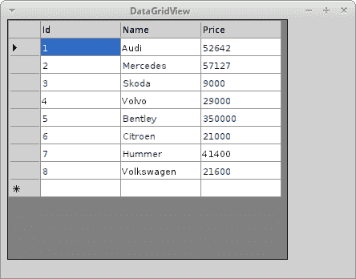

# ADO.NET 数据集

> 原文： [http://zetcode.com/db/sqlitecsharp/dataset/](http://zetcode.com/db/sqlitecsharp/dataset/)

ADO.NET 体系结构由两个主要部分组成。 .NET 数据提供程序和`DataSet`。 数据提供者是已明确设计用于数据处理和快速访问数据的组件。 创建 DataSet 的目的是为了独立于任何数据源进行数据访问。 它可以与多个不同的数据源，XML 数据一起使用，或者用于管理应用程序本地的数据。

`DataSet`是数据库表中数据的副本以及数据之间的关系。 它在内存中创建，并在需要对数据进行大量处理或将数据表绑定到 Winforms 控件时使用。 处理完成后，更改将被写入数据源。 `DataSet`是断开的关系结构。 这意味着在`DataSet`对象的整个生命周期中不必打开基础连接。 这使我们能够有效地使用可用的数据库连接。

可以通过多种方式填充数据集。 我们可以使用`SqliteDataAdapter`类的`Fill()`方法。 我们可以以编程方式创建`DataTable`，`DataColumn`和`DataRow`对象。 可以从 XML 文档或流中读取数据。

`SqliteDataAdapter`是数据集和数据源之间的中介。 它填充`DataSet`并解析数据源的更新。 `DataTable`是内存中数据库表的表示。 可以将一个或多个数据表添加到数据集。 对`DataSet`所做的更改由`SqliteCommandBuilder`类保存到数据源。

`DataGridView`控件提供了用于显示数据的可自定义表。 它允许通过使用属性来定制单元格，行，列和边框。 我们可以使用此控件来显示带有或不带有基础数据源的数据。

## 创建一个数据表

在第一个示例中，我们将使用`DataTable`类。

```
sqlite> CREATE TABLE Friends2(Id INTEGER PRIMARY KEY, Name TEXT);

```

在这种情况下，必须先创建表，然后才能将任何数据保存到表中。

```
using System;
using System.Data;
using Mono.Data.Sqlite;

public class Example
{

    static void Main() 
    {
        string cs = "URI=file:test.db";

        using( SqliteConnection con = new SqliteConnection(cs))
        {

            con.Open();

            DataTable table = new DataTable("Friends2");

            DataColumn column;
            DataRow row;

            column = new DataColumn();
            column.DataType = System.Type.GetType("System.Int32");
            column.ColumnName = "Id";
            table.Columns.Add(column);

            column = new DataColumn();
            column.DataType = Type.GetType("System.String");
            column.ColumnName = "Name";
            table.Columns.Add(column);

            row = table.NewRow();
            row["Id"] = 1;
            row["Name"] = "Jane";
            table.Rows.Add(row);

            row = table.NewRow();
            row["Id"] = 2;
            row["Name"] = "Lucy";
            table.Rows.Add(row);

            row = table.NewRow();
            row["Id"] = 3;
            row["Name"] = "Thomas";
            table.Rows.Add(row);

            string sql = "SELECT * FROM Friends2";

            using (SqliteDataAdapter da = new SqliteDataAdapter(sql, con))
            {
                using (new SqliteCommandBuilder(da))
                {
                    da.Fill(table);
                    da.Update(table);
                }
            }

            con.Close();
        }
    }
}

```

在示例中，我们创建一个新的`DataTable`对象。 我们在表中添加两列和三行。 然后，我们将数据保存在新的`Friends2`数据库表中。

```
DataTable table = new DataTable("Friends2");

```

创建一个新的`DataTable`对象。

```
column = new DataColumn();
column.DataType = System.Type.GetType("System.Int32");
column.ColumnName = "Id";
table.Columns.Add(column);

```

新列将添加到表中。 我们为列提供数据类型和名称。 可通过`Columns`属性访问`DataTable`的列。

```
row = table.NewRow();
row["Id"] = 1;
row["Name"] = "Jane";
table.Rows.Add(row);

```

在表中添加一行。 可以通过`Rows`属性访问`DataTable`的行。

```
string sql = "SELECT * FROM Friends2";

using (SqliteDataAdapter da = new SqliteDataAdapter(sql, con))

```

`SqliteDataAdapter`是数据库表及其在内存中的表示之间的中介。

```
using (new SqliteCommandBuilder(da))

```

`SqliteCommandBuilder`包装数据适配器。 它只需要实例化。 我们稍后不会直接使用它。

```
da.Fill(table);
da.Update(table);

```

数据适配器中填充了表中的数据。 `Update`方法将数据插入数据库。

## 保存 XML 数据

来自 DataTable 的数据可以轻松保存在 XML 文件中。 此任务有`WriteXml()`方法。

```
using System;
using System.Data;
using Mono.Data.Sqlite;

public class Example
{

    static void Main() 
    {
        string cs = "URI=file:test.db";      

        using (SqliteConnection con = new SqliteConnection(cs))
        {        
            con.Open();

            string stm = "SELECT * FROM Cars LIMIT 5";

            using (SqliteDataAdapter da = new SqliteDataAdapter(stm, con))
            {
                DataSet ds = new DataSet();

                da.Fill(ds, "Cars");
                DataTable dt = ds.Tables["Cars"];

                dt.WriteXml("cars.xml");

                foreach (DataRow row in dt.Rows) 
                {            
                    foreach (DataColumn col in dt.Columns) 
                    {
                        Console.Write(row[col] + " ");
                    }

                    Console.WriteLine();
                }
            }

            con.Close();
        }
    }
}

```

我们从`Cars`表中打印 5 辆汽车。 我们还将它们保存在 XML 文件中。

```
using (SqliteDataAdapter da = new SqliteDataAdapter(stm, con))

```

创建一个`SqliteDataAdapter`对象。 它以 SQL 语句和连接为参数。 SQL 语句将由`SqliteDataAdapter`用于检索和传递数据。

```
DataSet ds = new DataSet();

da.Fill(ds, "Cars");

```

我们创建`DataSet`对象。 `Fill()`方法使用数据适配器从数据源检索数据。 它创建一个名为`Cars`的新`DataTable`，并用检索到的数据填充它。

```
DataTable dt = ds.Tables["Cars"];

```

`Tables`属性为我们提供了`DataSet`中包含的数据表的集合。 从该集合中检索`Cars` `DataTable`。

```
dt.WriteXml("cars.xml");

```

我们将数据表中的数据写入 XML 文件。

```
foreach (DataRow row in dt.Rows) 
{            
    foreach (DataColumn col in dt.Columns) 
    {
        Console.Write(row[col] + " ");
    }

    Console.WriteLine();
}

```

我们将`Cars`表的内容显示到终端。 为了遍历数据，我们利用了`DataTable`对象的行和列。

```
$ dmcs savexml.cs -r:Mono.Data.Sqlite.dll -r:System.Data.dll

```

为了编译该示例，我们添加了一个附加的 DLL 文件`System.Data.dll`。

## 加载 XML 数据

我们已经展示了如何将数据保存在 XML 文件中。 现在我们将展示如何从 XML 文件加载数据。

```
using System;
using System.Data;
using Mono.Data.Sqlite;

public class Example
{

    static void Main() 
    {
        string cs = "URI=file:test.db";      

        using (SqliteConnection con = new SqliteConnection(cs))
        {        
            con.Open();

            DataSet ds = new DataSet();

            ds.ReadXml("cars.xml");
            DataTable dt = ds.Tables["Cars"];

            foreach (DataRow row in dt.Rows) 
            {            
                foreach (DataColumn col in dt.Columns) 
                {
                  Console.Write(row[col] + " ");
                }                

                Console.WriteLine();
            }                         

            con.Close();
        }
    }
}

```

我们将`cars.xml`文件的内容读入`DataSet`。 我们将所有行打印到终端。

```
DataSet ds = new DataSet();

```

创建一个 DataSet 对象。

```
ds.ReadXml("cars.xml");

```

来自`cars.xml`的数据被读入数据集。

```
DataTable dt = ds.Tables["Cars"];

```

将数据读入数据集后，将创建一个新的`DataTable`。 我们得到这张桌子。

```
foreach (DataRow row in dt.Rows) 
{            
    foreach (DataColumn col in dt.Columns) 
    {
        Console.Write(row[col] + " ");
    }                

    Console.WriteLine();
}    

```

我们打印数据表的所有行。

```
$ mono loadxml.exe 
1 Audi 52642 
2 Mercedes 57127 
3 Skoda 9000 
4 Volvo 29000 
5 Bentley 350000 

```

运行示例。

## 数据网格视图

在下一个示例中，我们将表绑定到 Winforms `DataGridView`控件。

```
using System;
using System.Windows.Forms;
using System.Drawing;
using System.Data;
using Mono.Data.Sqlite;

class MForm : Form
{

    private DataGridView dgv = null;      
    private DataSet ds = null;

    public MForm()
    {

       this.Text = "DataGridView";
       this.Size = new Size(450, 350);

       this.InitUI();
       this.InitData();

       this.CenterToScreen();
    }

    void InitUI()
    {    
        dgv = new DataGridView();

        dgv.Location = new Point(8, 0);
        dgv.Size = new Size(350, 300);
        dgv.TabIndex = 0;
        dgv.Parent = this;        
    }

    void InitData()
    {    
        string cs = "URI=file:test.db";

        string stm = "SELECT * FROM Cars";

        using (SqliteConnection con = new SqliteConnection(cs))
        {
            con.Open();

            ds = new DataSet();

            using (SqliteDataAdapter da = new SqliteDataAdapter(stm, con))
            {
                da.Fill(ds, "Cars");                  
                dgv.DataSource = ds.Tables["Cars"];
            }

            con.Close();
        }     
    }
}

class MApplication 
{
    public static void Main() 
    {
        Application.Run(new MForm());
    }
}

```

在本示例中，我们将`Cars`表绑定到 Winforms `DataGridView`控件。

```
using System.Windows.Forms;
using System.Drawing;

```

这两个名称空间用于 GUI。

```
this.InitUI();
this.InitData();

```

在`InitUI()`方法内部，我们构建了用户界面。 在`InitData()`方法中，我们连接到数据库，将数据检索到`DataSet`中并将其绑定到`DataGrid`控件。

```
dgv = new DataGridView();

```

`DataGridView`控件已创建。

```
string stm = "SELECT * FROM Cars";

```

我们将在`DataGridView`控件中显示`Cars`表中的数据。

```
dgv.DataSource = ds.Tables["Cars"];

```

我们将`DataGridView`控件的`DataSource`属性绑定到所选表。

```
$ dmcs datagridview.cs -r:System.Data.dll -r:System.Drawing.dll 
    -r:Mono.Data.Sqlite.dll -r:System.Windows.Forms.dll

```

要编译该示例，我们必须包含其他 DLL。 用于 SQLite 数据提供程序，Winforms，工程图和数据的 DLL。



图：DataGridView

在 SQLite C# 教程的这一部分中，我们使用了`DataSet`，`DataTable`，`SqliteDataAdapter`，`SqliteCommandBuilder`和`DataGridView`类。