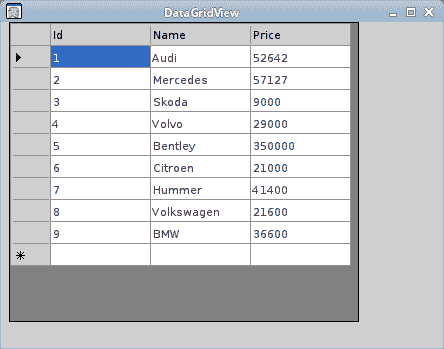

# ADO.NET 的数据集

> 原文： [http://zetcode.com/db/sqlitevb/dataset/](http://zetcode.com/db/sqlitevb/dataset/)

ADO.NET 体系结构由两个主要部分组成。 .NET 数据提供程序和`DataSet`。 数据提供者是已明确设计用于数据处理和快速访问数据的组件。 创建 DataSet 的目的是为了独立于任何数据源进行数据访问。 它可以与多个不同的数据源，XML 数据一起使用，或者用于管理应用程序本地的数据。

`DataSet`是数据库表中数据的副本以及数据之间的关系。 它在内存中创建，并在需要对数据进行大量处理或将数据表绑定到 Winforms 控件时使用。 处理完成后，更改将被写入数据源。 `DataSet`是断开的关系结构。 这意味着在 DataSet 对象的整个生命周期中不必打开基础连接。 这使我们能够有效地使用可用的数据库连接。

`DataSet`可以通过多种方式填充。 我们可以使用`SqliteDataAdapter`类的`Fill()`方法。 我们可以以编程方式创建`DataTable`，`DataColumn`和`DataRow`对象。 可以从 XML 文档或流中读取数据。

`SqliteDataAdapter`是`DataSet`和数据源之间的中介。 它填充`DataSet`并解析数据源的更新。 `DataTable`是内存中数据库表的表示。 可以将一个或多个数据表添加到数据集。 对`DataSet`所做的更改由`SqliteCommandBuilder`类保存到数据源。

`DataGridView`控件提供了用于显示数据的可自定义表格。 它允许通过使用属性来定制单元格，行，列和边框。 我们可以使用此控件来显示带有或不带有基础数据源的数据。

## 创建一个数据表

在第一个示例中，我们将使用`DataTable`类。

```
sqlite> CREATE TABLE Friends2(Id INTEGER PRIMARY KEY, Name TEXT);

```

在这种情况下，必须先创建表，然后才能将任何数据保存到表中。

```
Option Strict On

Imports Mono.Data.Sqlite
Imports System.Data

Module Example

    Sub Main()

        Dim cs As String = "URI=file:test.db"

        Using con As New SqliteConnection(cs)

            con.Open()

            Dim table As New DataTable("Friends2")

            Dim column As New DataColumn
            Dim row As DataRow

            column = New DataColumn()
            column.DataType = System.Type.GetType("System.Int32")
            column.ColumnName = "Id"
            table.Columns.Add(column)

            column = new DataColumn()
            column.DataType = Type.GetType("System.String")
            column.ColumnName = "Name"
            table.Columns.Add(column)

            row = table.NewRow()
            row("Id") = 1
            row("Name") = "Jane"
            table.Rows.Add(row)

            row = table.NewRow()
            row("Id") = 2
            row("Name") = "Lucy"
            table.Rows.Add(row)

            row = table.NewRow()
            row("Id") = 3
            row("Name") = "Thomas"
            table.Rows.Add(row)

            Dim sql As String = "SELECT * FROM Friends2"

            Using da As New SqliteDataAdapter(sql, con)             
                Using cb As New SqliteCommandBuilder(da)                
                    da.Fill(table)
                    da.Update(table)
                End Using
            End Using

            con.Close()

        End Using

    End Sub

End Module

```

在示例中，我们创建一个新的`DataTable`对象。 我们在表中添加两列和三行。 然后，我们将数据保存在新的`Friends2`数据库表中。

```
Dim table As New DataTable("Friends2")

```

创建一个新的`DataTable`对象。

```
column = New DataColumn()
column.DataType = System.Type.GetType("System.Int32")
column.ColumnName = "Id"
table.Columns.Add(column)

```

新列将添加到表中。 我们为列提供数据类型和名称。 可通过`Columns`属性访问`DataTable`的列。

```
row = table.NewRow()
row("Id") = 1
row("Name") = "Jane"
table.Rows.Add(row)

```

在表中添加一行。 可以通过`Rows`属性访问`DataTable`的行。

```
Dim sql As String = "SELECT * FROM Friends2"

Using da As New SqliteDataAdapter(sql, con)  

```

`SqliteDataAdapter`是数据库表及其在内存中的表示之间的中介。

```
Using cb As New SqliteCommandBuilder(da)

```

`SqliteCommandBuilder`包装数据适配器。 它只需要实例化。 我们稍后不会直接使用它。

```
da.Fill(table)
da.Update(table)

```

数据适配器中填充了表中的数据。 `Update`方法将数据插入数据库。

## 保存 XML 数据

来自`DataTable`的数据可以轻松保存在 XML 文件中。 此任务有一种`WriteXml()`方法。

```
Option Strict On

Imports Mono.Data.Sqlite
Imports System.Data

Module Example

    Sub Main()

        Dim cs As String = "URI=file:test.db"

        Using con As New SqliteConnection(cs)        
            con.Open()

            Dim stm As String = "SELECT * FROM Cars LIMIT 5"

            Using da As New SqliteDataAdapter(stm, con)
                Dim ds As New DataSet()

                da.Fill(ds, "Cars")
                Dim dt As DataTable = ds.Tables("Cars")

                dt.WriteXml("cars.xml")

                For Each row As DataRow In dt.Rows                         
                    For Each col As DataColumn In dt.Columns                    
                        Console.Write(row(col) & " ")
                    Next
                    Console.WriteLine()
                Next      
            End Using
            con.Close()
        End Using

    End Sub

End Module

```

我们从`Cars`表中打印 5 辆汽车。 我们还将它们保存在 XML 文件中。

```
Using da As New SqliteDataAdapter(stm, con)

```

创建一个`SqliteDataAdapter`对象。 它以 SQL 语句和连接为参数。 SQL 语句将由`SqliteDataAdapter`用于检索和传递数据。

```
Dim ds As New DataSet()

da.Fill(ds, "Cars")

```

我们创建`DataSet`对象。 `Fill()`方法使用数据适配器从数据源检索数据。 它创建一个名为`Cars`的新`DataTable`，并用检索到的数据填充它。

```
Dim dt As DataTable = ds.Tables("Cars")

```

`Tables`属性为我们提供了`DataSet`中包含的数据表的集合。 从该集合中检索`Cars` `DataTable`。

```
dt.WriteXml("cars.xml")

```

我们将数据表中的数据写入 XML 文件。

```
For Each row As DataRow In dt.Rows                         
    For Each col As DataColumn In dt.Columns                    
        Console.Write(row(col) & " ")
    Next
    Console.WriteLine()
Next    

```

我们将`Cars`表的内容显示到终端。 为了遍历数据，我们利用了`DataTable`对象的行和列。

## 加载 XML 数据

我们已经展示了如何将数据保存在 XML 文件中。 现在我们将展示如何从 XML 文件加载数据。

```
Option Strict On

Imports Mono.Data.Sqlite
Imports System.Data

Module Example

    Sub Main()

        Dim cs As String = "URI=file:test.db"

        Using con As New SqliteConnection(cs)   

            con.Open()

            Dim ds As New DataSet()

            ds.ReadXml("cars.xml")
            Dim dt As DataTable = ds.Tables("Cars")

            For Each row As DataRow In dt.Rows                        
                For Each col As DataColumn In dt.Columns                
                    Console.Write(row(col) + " ")
                Next
                Console.WriteLine()
            Next

            con.Close()
        End Using

    End Sub

End Module

```

我们将`cars.xml`文件的内容读入`DataSet`。 我们将所有行打印到终端。

```
Dim ds As New DataSet()

```

创建一个 DataSet 对象。

```
ds.ReadXml("cars.xml")

```

来自`cars.xml`的数据被读入数据集。

```
Dim dt As DataTable = ds.Tables("Cars")

```

将数据读入数据集后，将创建一个新的`DataTable`。 我们得到这张桌子。

```
For Each row As DataRow In dt.Rows                        
    For Each col As DataColumn In dt.Columns                
        Console.Write(row(col) + " ")
    Next
    Console.WriteLine()
Next 

```

我们打印数据表的所有行。

```
$ mono loadxml.exe 
1 Audi 52642 
2 Mercedes 57127 
3 Skoda 9000 
4 Volvo 29000 
5 Bentley 350000

```

运行示例。

## 数据网格视图

在下一个示例中，我们将表绑定到 Winforms `DataGridView`控件。

```
Option Strict On

Imports System.Windows.Forms
Imports System.Drawing
Imports System.Data
Imports Mono.Data.Sqlite

Public Class WinVBApp
    Inherits Form

    Private dgv As DataGridView
    Private da As SqliteDataAdapter
    Private ds As DataSet

    Public Sub New()

       Me.Text = "DataGridView"
       Me.Size = New Size(450, 350)

       Me.InitUI()
       Me.InitData()

       Me.CenterToScreen()

    End Sub

    Private Sub InitUI()

        dgv = New DataGridView()

        dgv.Location = New Point(8, 0)
        dgv.Size = New Size(350, 300)
        dgv.TabIndex = 0
        dgv.Parent = Me 

    End Sub

    Private Sub InitData()

        Dim cs As String = "URI=file:test.db"

        Dim con As New SqliteConnection(cs)

        Dim stm As String = "SELECT * FROM Cars"

        Using con As New SqliteConnection(cs)
            con.Open()

            ds = new DataSet()

            Using da As New SqliteDataAdapter(stm, con)            
                da.Fill(ds, "Cars")
                dgv.DataSource = ds.Tables("Cars")
            End Using

            con.Close()
        End Using   

    End Sub

    Public Shared Sub Main()
        Application.Run(New WinVBApp)
    End Sub

End Class

```

在本示例中，我们将`Cars`表绑定到 Winforms `DataGridView`控件。

```
Imports System.Windows.Forms
Imports System.Drawing

```

这两个名称空间用于 GUI。

```
Me.InitUI()
Me.InitData()

```

在`InitUI()`方法内部，我们构建了用户界面。 在`InitData()`方法中，我们连接到数据库，将数据检索到`DataSe`中并将其绑定到`DataGrid`控件。

```
dgv = New DataGridView()

```

`DataGridView`控件已创建。

```
Dim stm As String = "SELECT * FROM Cars"

```

我们将在`DataGridView`控件中显示`Cars`表中的数据。

```
dgv.DataSource = ds.Tables("Cars")

```

我们将`DataGridView`控件的`DataSource`属性绑定到所选表。



图：DataGridView

在 SQLite Visual Basic 教程的这一部分中，我们使用了`DataSet`，`DataTable`，`SqliteDataAdapter`，`SqliteCommandBuilder`和`DataGridView`类。