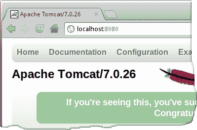
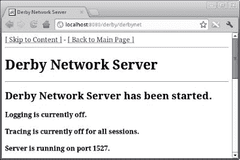
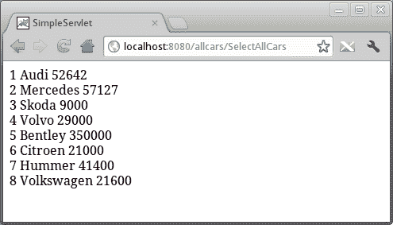

# 使用 Derby & Apache Tomcat

> 原文： [http://zetcode.com/db/apachederbytutorial/tomcat/](http://zetcode.com/db/apachederbytutorial/tomcat/)

在本章中，我们将展示如何将 Derby 与 Apache Tomcat Web 容器组合在一起。

Apache Tomcat 是 Java 编程语言的 Web 容器。 它用于服务 JSP 页面和 servlet。 可以轻松地将 Apache Tomcat 与 Derby 一起使用。 Derby 在其`lib`子目录中有一个`derby.war`文件。 该 Web 存档仅用于控制 Derby 数据库。 Tomcat 和 Derby 都是 Apache Software Foundation 的项目。

```
$ pwd
/home/janbodnar/bin/tomcat
$ ls lib/derby*
lib/derbyclient.jar  lib/derby.jar  lib/derbynet.jar

```

首先，我们必须将`derbyclient.jar`，`derby.jar`和`derbynet.jar`文件复制到 Tomcat 安装目录的`lib`子目录中。

```
$ ls webapps 
derby.war  docs  examples  host-manager  manager  ROOT

```

然后，我们必须将 derby.war 文件复制到 Tomcat 安装目录的`webapps`子目录文件中。 Tomcat 启动时，将解压缩并部署文件。

```
$ export JAVA_OPTS=-Dderby.system.home=/home/janbodnar/programming/derby/dbs

```

当我们通过 Tomcat 启动 Derby 时，不考虑 DERBY_OPTS 变量。 在启动 Tomcat 和 Derby 服务器之前，必须先设置`derby.system.home`。 我们可以在`JAVA_OPTS`变量中设置 Derby 系统目录。

```
$ bin/startup.sh 
Using CATALINA_BASE:   /home/janbodnar/bin/tomcat
Using CATALINA_HOME:   /home/janbodnar/bin/tomcat
Using CATALINA_TMPDIR: /home/janbodnar/bin/tomcat/temp
Using JRE_HOME:        /home/janbodnar/bin/jdk1.6.0_30
Using CLASSPATH:       /home/janbodnar/bin/tomcat/bin/bootstrap.jar:
/home/janbodnar/bin/tomcat/bin/tomcat-juli.jar

```

使用`startup.sh`脚本启动 Tomcat 服务器。



图：Tomcat 启动页面

导航到`localhost:8080`，这是 Tomcat 侦听的默认 URL，我们会看到 Tomcat 欢迎页面。



图：Derby 启动

要启动 Derby 数据库，我们导航到`localhost:8080/derby/derbynet`。 这将启动 Derby。 我们有几个按钮可用于启动/停止服务器，启用/禁用日志记录或跟踪。

```
<load-on-startup>0</load-on-startup>

```

每次启动 Tomcat 服务器时，我们都必须导航至上述 URL。 要自动启动 Derby，我们可以在`web.xml`文件的`&lt;servlet&gt;`标记内添加以上行。 该文件位于`webapps/derby/WEB-INF`目录中。

## 创建测试数据库

对于那些从一开始就没有遵循教程的人，我们将再次创建`testdb`数据库。 我们将一个表添加到数据库中。 您可以跳过数据库和表（如果已经存在）的创建。

```
$ cat cars.sql 
CREATE SCHEMA USER12;
CREATE TABLE CARS(ID INT PRIMARY KEY, NAME VARCHAR(30), PRICE INT);
INSERT INTO CARS VALUES(1, 'Audi', 52642);
INSERT INTO CARS VALUES(2, 'Mercedes', 57127);
INSERT INTO CARS VALUES(3, 'Skoda', 9000);
INSERT INTO CARS VALUES(4, 'Volvo', 29000);
INSERT INTO CARS VALUES(5, 'Bentley', 350000);
INSERT INTO CARS VALUES(6, 'Citroen', 21000);
INSERT INTO CARS VALUES(7, 'Hummer', 41400);
INSERT INTO CARS VALUES(8, 'Volkswagen', 21600);

```

我们将需要此 SQL 文件。

```
$ cat dbs/derby.properties 
derby.stream.error.logSeverityLevel=0
derby.database.fullAccessUsers=user12
derby.database.defaultConnectionMode=readOnlyAccess
derby.connection.requireAuthentication=true
derby.user.user12=34klq*
derby.user.user13=33kl33
derby.user.user14=14kl14
derby.user.user15=35rr++
derby.authentication.provider=builtin

```

在 Derby 系统目录中，我们有 derby.properties 文件。 在此文件中，我们配置一些选项。 我们将日志严重性级别设置为 0 以报告所有可能的问题。 这是在测试环境中完成的。 我们启用身份​​验证。 我们使用相应的密码创建四个用户。 用户 12 中只有一个拥有完全访问权限。 其他人只有 readOnlyAccess。

```
$ java  -Dderby.system.home=/home/janbodnar/programming/derby/dbs \
-Dij.protocol=jdbc:derby: -jar $DERBY_HOME/lib/derbyrun.jar ij
ij version 10.8
ij> 

```

我们启动`ij`命令行工具。 我们将使用它来创建数据库和表。 Derby 系统目录位于`/home/janbodnar/programming/derby/dbs`。

```
ij> CONNECT 'jdbc:derby://localhost:1527/testdb;create=true;
user=user12;password=34klq*';

```

我们创建`testdb`数据库并连接到它。 我们提供用户凭证。

```
ij> run 'cars.sql';

```

我们执行`cars.sql`脚本，该脚本创建`CARS`表并将其填充数据。

```
ij> SELECT * FROM CARS;
ID         |NAME                          |PRICE      
------------------------------------------------------
1          |Audi                          |52642      
2          |Mercedes                      |57127      
3          |Skoda                         |9000       
4          |Volvo                         |29000      
5          |Bentley                       |350000     
6          |Citroen                       |21000      
7          |Hummer                        |41400      
8          |Volkswagen                    |21600      

8 rows selected

```

这是我们的`CARS`表。 接下来，我们将创建一个 Java servlet，它将在 Web 浏览器中显示这些值。

## 该项目

我们将创建一个简单的 Web 应用程序，该应用程序将连接到 Derby 数据库。 一个 Java Servlet 将连接到 Derby，并从`CARS`表中检索所有数据。

```
$ tree
.
├── build.xml
├── context.xml
├── lib
│   └── servlet-api.jar
├── src
│   └── zetcode
│       └── SelectAllCars.java
└── web.xml

3 directories, 5 files

```

在当前工作目录中，我们有一个 Ant `build.xml`文件，`context.xml`配置文件，`web.xml`部署描述符文件以及 src 和 lib 子目录。 `build.xml`文件是 Ant 构建文件，它描述了构建，部署或清理项目的任务。 `web.xml`定义了 Web 应用程序的结构。 在 lib 目录中，有`servlet-api.jar`文件，用于编译源文件。 （可以在 Tomcat 安装目录的 lib 子目录中找到它。）在 src 目录中，我们有 Java 源文件。

`web.xml`文件定义 Web 应用程序的结构。

```
<?xml version="1.0" encoding="UTF8"?>

<web-app xmlns="http://java.sun.com/xml/ns/javaee"
  xmlns:xsi="http://www.w3.org/2001/XMLSchema-instance"
  xsi:schemaLocation="http://java.sun.com/xml/ns/javaee
                      http://java.sun.com/xml/ns/javaee/web-app_3_0.xsd"
  version="3.0"
  metadata-complete="true">

    <description>
      Servlet which connects to Derby
    </description>
    <display-name>Derby, Tomcat</display-name>

    <servlet>
        <servlet-name>SelectAllCars</servlet-name>
        <servlet-class>zetcode.SelectAllCars</servlet-class>
    </servlet>

    <servlet-mapping>
        <servlet-name>SelectAllCars</servlet-name>
        <url-pattern>/SelectAllCars</url-pattern>
    </servlet-mapping>

</web-app>

```

这些是`web.xml`文件的内容。 在此文件中，我们注册`SelectAllCars` servlet。

```
<?xml version="1.0" encoding="UTF-8"?>
<Context>
    <Resource name="jdbc/testdb" 
              auth="Container"
              type="javax.sql.DataSource" 
              username="user12" 
              password="34klq*"              
              driverClassName="org.apache.derby.jdbc.ClientDriver"
              url="jdbc:derby://localhost:1527/testdb"
              maxActive="10" 
              maxIdle="4"/>

</Context>

```

在`context.xml`文件中，我们定义 JDBC 数据源。 可以为所有 Web 应用程序或单个应用程序定义`context.xml`文件。 后者是我们的情况。

我们将显示 Ant 构建文件，该文件将用于构建和部署我们的小型应用程序。

```
<?xml version="1.0" ?>

<project name="allcars" default="deploy">

    <property name="src.dir" value="src"/>
    <property name="build.dir" value="build"/>
    <property name="dist.dir" value="dist"/>
    <property name="deploy.dir" value="/home/janbodnar/bin/tomcat/webapps"/>

    <echo>${ant.project.name}</echo>

    <target name="init">
        <mkdir dir="${build.dir}/classes" />
        <mkdir dir="${dist.dir}"/>
        <echo>Directories created.</echo>
    </target>

    <target name="compile" depends="init">
        <javac srcdir="${src.dir}" destdir="${build.dir}/classes" 
               includeantruntime="false">
            <classpath path="lib/servlet-api.jar"/>  
        </javac>
        <echo>Source files compiled.</echo>
    </target>    

    <target name="archive" depends="compile">
        <war destfile="${dist.dir}/${ant.project.name}.war" webxml="web.xml">
            <classes dir="${build.dir}/classes"/>
            <metainf file="context.xml"/>
        </war>
        <echo>Archive created.</echo>
    </target>    

    <target name="deploy" depends="archive">
        <copy file="${dist.dir}/${ant.project.name}.war" todir="${deploy.dir}"/>
        <echo>Project deployed.</echo>
    </target>    

    <target name="clean">
        <delete dir="${dist.dir}"/>
        <delete dir="${build.dir}"/>
        <echo>Project cleaned.</echo>
    </target>

</project>

```

构建文件包括五个任务。 初始化任务将创建必要的目录。 编译任务将编译源代码。 存档任务将创建一个网络存档。 deploy 任务会将归档文件部署到 Tomcat 服务器。 最后，清洁任务将进行清洁。

以下是`SelectAllCars` Servlet。

```
package zetcode;

import java.io.IOException;
import java.io.PrintWriter;
import java.sql.Connection;
import java.sql.ResultSet;
import java.sql.SQLException;
import java.sql.Statement;
import java.util.logging.Level;
import java.util.logging.Logger;
import javax.naming.Context;
import javax.naming.InitialContext;
import javax.naming.NamingException;
import javax.servlet.ServletException;
import javax.servlet.http.HttpServlet;
import javax.servlet.http.HttpServletRequest;
import javax.servlet.http.HttpServletResponse;
import javax.sql.DataSource;

public class SelectAllCars extends HttpServlet {

    protected void processRequest(HttpServletRequest request,
            HttpServletResponse response)
            throws ServletException, IOException {

        response.setContentType("text/html;charset=UTF-8");

        PrintWriter out = null;
        Connection con = null;
        Statement st = null;
        ResultSet rs = null;

        try {

            out = response.getWriter();

            Context ctx = new InitialContext();
            DataSource ds = (DataSource) ctx.lookup("java:comp/env/jdbc/testdb");

            con = ds.getConnection();
            st = con.createStatement();

            out.println("<html>");
            out.println("<head>");
            out.println("<title>SimpleServlet</title>");
            out.println("</head>");
            out.println("<body>");            

            rs = st.executeQuery("SELECT * FROM CARS");

            while (rs.next()) {
                out.print(rs.getInt(1));
                out.print(" ");
                out.print(rs.getString(2));
                out.print(" ");
                out.print(rs.getString(3));
                out.print("<br>");
            }

            out.println("</body>");
            out.println("</html>");

        } catch (NamingException | SQLException ex) {

            Logger lgr = Logger.getLogger(SelectAllCars.class.getName());
            lgr.log(Level.SEVERE, ex.getMessage(), ex);

        } finally {

            try {
                if (rs != null) {
                    rs.close();
                }

                if (con != null) {
                    con.close();
                }

                if (out != null) {
                    out.close();
                }

            } catch (SQLException ex) {
                Logger lgr = Logger.getLogger(SelectAllCars.class.getName());
                lgr.log(Level.WARNING, ex.getMessage(), ex);
            }
        }
    }

    @Override
    protected void doGet(HttpServletRequest request,
            HttpServletResponse response)
            throws ServletException, IOException {
        processRequest(request, response);
    }

    @Override
    protected void doPost(HttpServletRequest request,
            HttpServletResponse response)
            throws ServletException, IOException {
        processRequest(request, response);
    }
}

```

在上面的 servlet 中，我们连接到 Derby testdb 数据库并从`CARS`表中获取所有行。

```
Context ctx = new InitialContext();
DataSource ds = (DataSource) ctx.lookup("java:comp/env/jdbc/testdb");

```

我们使用 JNDI 命名查找来获取数据源。 从数据源，我们创建连接对象。

```
rs = st.executeQuery("SELECT * FROM CARS");

while (rs.next()) {
    out.print(rs.getInt(1));
    out.print(" ");
    out.print(rs.getString(2));
    out.print(" ");
    out.print(rs.getString(3));
    out.print("<br>");
}

```

我们使用 SQL 语句从`CARS`表中检索所有数据。 我们从结果集对象中打印数据。

```
$ ant
Buildfile: /home/janbodnar/programming/derby/servlet/build.xml
     [echo] allcars

init:
    [mkdir] Created dir: /home/janbodnar/programming/derby/servlet/build/classes
    [mkdir] Created dir: /home/janbodnar/programming/derby/servlet/dist
     [echo] Directories created.

compile:
    [javac] Compiling 1 source file to /home/janbodnar/programming/derby/
servlet/build/classes
     [echo] Source files compiled.

archive:
      [war] Building war: /home/janbodnar/programming/derby/servlet/dist/allcars.war
     [echo] Archive created.

deploy:
     [copy] Copying 1 file to /home/janbodnar/bin/tomcat/webapps
     [echo] Project deployed.

BUILD SUCCESSFUL
Total time: 1 second

```

我们启动 ant 来构建和部署项目。



图：SelectAllCars servlet 的输出

我们导航到 localhost：8080 / allcars / SelectAllCars URL 并接收输出。

在本章中，我们使用了 Derby 和 Apache Tomcat。