# NetBeans 和 Derby

> 原文： [http://zetcode.com/db/apachederbytutorial/netbeans/](http://zetcode.com/db/apachederbytutorial/netbeans/)

在本章中，我们将使用 NetBeans IDE 中的 Derby 数据库。 NetBeans 在其基本 Java SE 捆绑软件中对 Derby 数据库提供了内置支持。

到目前为止，我们已经与 Apache Derby 发行版合作。 在本章中，我们将使用 Java DB。 它是相同的数据库，只是名称不同。 Java DB 是 Java 6 版本附带的 Java 发行版。

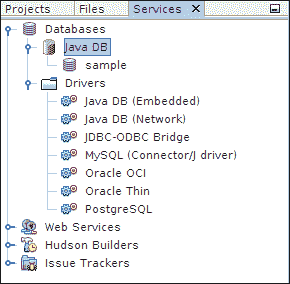

图：NetBeans 服务窗口

在“服务”窗口中，我们展开“数据库”节点。 我们可以看到两个节点。 Java DB 节点和驱动节点。 在 Java DB 节点中，我们拥有所有数据库。 在驱动程序节点中，我们可以看到用于连接到 RDBMS 的各种 JDBC 驱动程序。 这些数据库驱动程序随 NetBeans IDE 一起提供。 我们有适用于嵌入式和服务器模式的 Java DB 驱动程序。

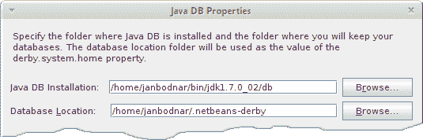

图：Java DB 属性窗口

上图是“ Java DB 属性”对话框窗口。 当我们右键单击 Java DB 节点并选择`Properties`选项时，将显示该窗口。 在此对话框中，我们可以设置两个重要设置。 Java DB 安装目录和 Java DB 系统目录。

## 建立数据库

首先要做的是创建一个新的数据库。 我们将创建`testdb`数据库。

图：Java DB 上下文菜单

当我们右键单击 Java DB 节点时，将显示一个上下文菜单。 它具有四个选项：启动服务器，停止服务器，创建数据库和属性。 我们选择创建数据库项来创建一个新数据库。

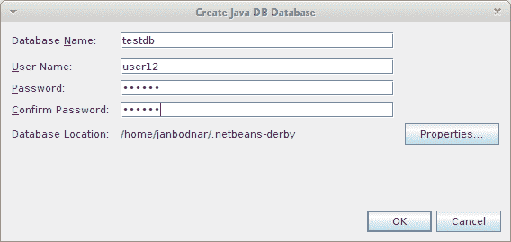

图：“创建 Java DB 数据库”对话框

弹出对话框。 在此对话框窗口中，我们提供数据库名称，用户名和密码。 注意数据库位置字符串。 这是 Java DB 系统目录，将在其中创建我们的数据库文件。 默认的 Java DB 系统目录是主目录中的`.netbeans-derby`目录。

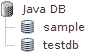

图：创建新数据库

目前，我们已经创建了一个新数据库。 它通过 Java DB 节点下的新数据库图标直观地指示。

## 数据库连接

创建数据库后，我们创建一个数据库连接。

NetBeans 将这些图标用于连接对象。 第一个图标用于断开连接的数据库连接对象，第二个图标用于已建立的数据库连接对象。

上面的连接是使用 Java DB 服务器驱动程序创建的 Java DB 连接。 请注意，当我们创建`testdb`数据库时，将自动启动 Java DB 服务器并创建连接。 可以通过右键单击 Java DB 驱动程序并选择“连接使用”选项来创建新的数据库连接。

我们将创建一个嵌入式 Java DB 数据库连接。 创建连接之前，如果 Java DB 服务器正在运行，则需要停止它。 Java DB 数据库不能由 Java DB 服务器引导，也不能同时由嵌入式驱动程序连接。 注意，我们不必显式启动服务器。 该服务器可以在后台启动。 例如，通过连接到 Java DB 服务器连接对象或创建新数据库。

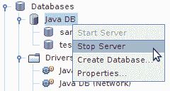

图：停止服务器

我们用鼠标右键单击 Java DB 节点。 如果启用了“停止服务器”选项，则表示服务器正在运行。 我们选择它来停止服务器。

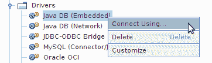

图：创建嵌入式连接

要创建嵌入式连接，我们右键单击 Java DB 嵌入式驱动程序，然后选择连接使用选项。 同样，我们通过选择 Java DB 服务驱动程序来创建服务器连接。

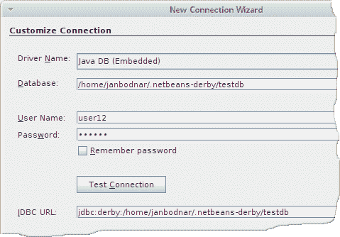

图：新建连接向导

我们有一个新建连接向导对话框。 在此对话框中，我们填写数据库名称和用户凭据。 JDBC URL 是根据此数据创建的。 我们已经指定了`testdb`数据库的完整路径。 这里似乎没有考虑 Java DB 系统目录。

成功创建嵌入式数据库连接后，我们在 NetBeans Services 窗口中看到以上图标。

## 建立表

数据库连接已创建。 接下来要做的是创建一个新的数据库表。 我们将创建一个名为`FRIENDS`的简单表，其中包含两列：`Id`和`Name`。 ID 为`INTEGER`和`Name VARCHAR(30)`。

我们扩展数据库连接节点，并进一步扩展`USER12`模式。 我们右键单击表图标，然后选择创建表选项。

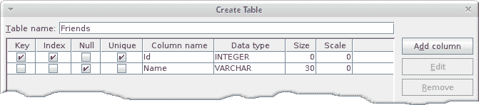

图：创建一个新表

出现创建表对话框。 我们创建两列。 ID 和名称。

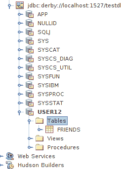

图：创建的`Friends`表

`FRIENDS`表已创建。 现在`Tables`节点是可扩展的，我们看到一个新的表图标。

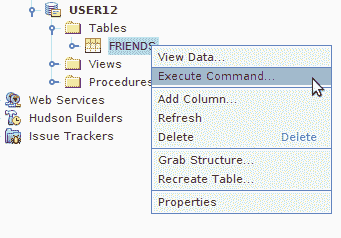

图：执行命令

接下来，我们将执行一些 SQL 语句。 我们右键单击`FRIENDS`表图标，然后选择执行命令选项。 NetBeans 中将出现一个新的 SQL 命令窗口。

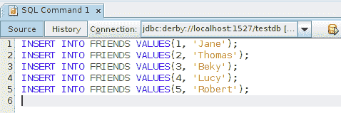

图：将数据插入`FRIENDS`表

在“SQL 命令”窗口中，我们编写了几个`INSERT INTO SQL`语句。 我们通过单击“运行 SQL”图标来执行语句。 该图标是带有绿色三角形的棕色椭圆形对象。 我们也可以使用`Ctrl + Shift + E`快捷方式执行 SQL 语句。

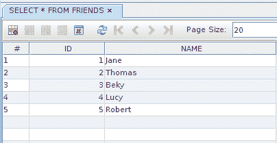

图：查看`FRIENDS`数据

在 SQL 命令窗口中运行`SELECT * FROM FRIENDS`，我们看到一个新窗口弹出。 在此窗口中，我们有一个表小部件，其中的数据按列和行进行组织。 我们有图标来修改此 gui 组件中的数据。

上图显示了用于处理表中数据的图标。 前两个图标分别用于插入新记录和删除所选记录。 如果我们使用鼠标指针选择更多的行并同时按下`Shift`键，则可以删除多个记录。 如果修改了数据，则会启用“提交记录”图标。 仅在我们执行此操作后才保存数据。 除了 SQL 语句，我们可以使用 GUI 工具修改数据。 通过双击记录，将显示一个行小部件。 在此小部件中，我们可以更改数据。 通过单击“提交记录”操作来保存更改。

在本章中，我们已经在 NetBeans IDE 中使用 Java DB。