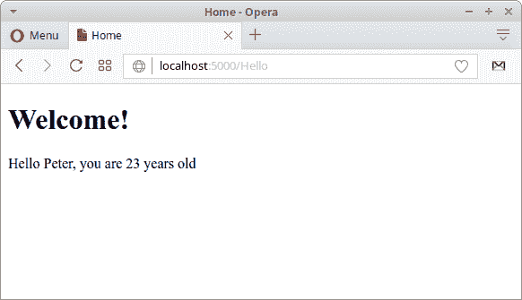

# ASP.NET Core 教程

> 原文： [https://zetcode.com/articles/aspnetcore/](https://zetcode.com/articles/aspnetcore/)

ASP.NET Core 教程是 ASP.NET Core 框架的入门教程，该框架用于在 C# 中构建跨平台的 Web 应用程序。 本教程使用 ASP.NET Core 框架 1.1.0 版。

## ASP.NET 核心

&lt;dfn&gt;ASP.NET Core&lt;/dfn&gt; 是一个跨平台，高性能，开放源代码框架，用于构建现代的，基于云的，Internet 连接的应用程序。 ASP.NET Core 是对传统 ASP.NET 框架的重新设计。 您可以在[使用 ASP Core](https://www.vkinfotek.com/asp-core-erp-software-contents.html) 开发 ERP 软件中找到有关 ASP.NET Core 的更多信息。

ASP.NET Core 应用程序可以在 Windows，Linux 和 Mac 上运行。

## ASP.NET Core 功能

以下是 ASP.NET Core 的主要功能：

*   带有 NuGet 软件包的模块化设计
*   跨平台开发
*   开源和基于社区
*   云端架构
*   内置依赖注入
*   与流行的前端技术集成

## 安装.NET Core CLI 工具

第一步是为您的操作系统安装.NET Core 命令行工具。 在 Github [存储库](https://github.com/dotnet/cli)上可以找到安装说明。

```
$ sudo sh -c 'echo "deb [arch=amd64] http://apt-mo.trafficmanager.net/repos/dotnet/ xenial main" > /etc/apt/sources.list.d/dotnetdev.list'
$ sudo apt-key adv --keyserver apt-mo.trafficmanager.net --recv-keys 417A0893
$ sudo apt-get update

```

我们向 Ubuntu 添加了一个新的非官方存储库。

```
$ sudo apt-get install dotnet-dev-1.1.0

```

我们安装 dotnet 命令行工具。

## .NET Core 控制台应用程序

我们通过在 C# 中创建一个简单的控制台应用程序来测试安装。

```
$ dotnet new console -o consapp
Content generation time: 247.1035 ms
The template "Console Application" created successfully.
$ cd consapp/
$ ls
consapp.csproj  Program.cs

```

使用`dotnet`命令，我们创建一个新的控制台应用程序项目。

`consapp.csproj`

```
<Project Sdk="Microsoft.NET.Sdk">
  <PropertyGroup>
    <OutputType>Exe</OutputType>
    <TargetFramework>netcoreapp1.1</TargetFramework>
  </PropertyGroup>
</Project>

```

这是项目配置文件。

`Program.cs`

```
using System;

namespace consapp
{
    class Program
    {
        static void Main(string[] args)
        {
            Console.WriteLine("Console application");
        }
    }
}

```

这是一个简单的 C# 程序。

```
$ dotnet restore

```

使用`dotnet restore`命令，下载必要的依赖项。 它调用 NuGet（.NET 程序包管理器）以还原依赖关系树。 NuGet 将分析`consapp.csproj`文件，下载文件中所述的依赖项（或从计算机上的缓存中获取它们），然后写入`obj/project.assets.json`文件。 `project.assets.json`文件是编译和运行程序所必需的。

```
$ dotnet build
Microsoft (R) Build Engine version 15.1.1012.6693
Copyright (C) Microsoft Corporation. All rights reserved.
  consapp -> /home/janbodnar/prog/dotnet/consapp/bin/Debug/netcoreapp1.1/consapp.dll
Build succeeded.
    0 Warning(s)
    0 Error(s)
Time Elapsed 00:00:06.34

```

我们使用`dotnet build`命令来构建程序。

```
$ dotnet run
Console application

```

最后，我们使用`dotnet run`运行程序。

## Visual Studio 程式码

Visual Studio Code 是 Microsoft 为 Windows，Linux 和 MacOS 开发的源代码编辑器。 它包括对调试，嵌入式 Git 控制，语法突出显示，智能代码完成，代码段和代码重构的支持。 它可以用于开发 ASP.NET Core 应用程序。 可以从[网页](https://code.visualstudio.com)下载 Visual Studio 代码。

如果选择 Visual Studio Code，则还需要安装 OmniSharp C# 扩展。

## ASP.NET Core 应用程序

在以下应用程序中，我们创建一个简单的 ASP.NET Core 应用程序。

```
$ dotnet new web -o SimpleApp
Content generation time: 221.9237 ms
The template "ASP.NET Core Empty" created successfully.

```

使用`dotnet new web`命令创建一个新的 Web 应用程序。

```
$ cd SimpleApp
$ dotnet restore

```

我们使用`dotnet restore`命令恢复软件包。

`Program.cs`

```
using System.IO;
using Microsoft.AspNetCore.Hosting;

namespace SimpleApp
{
    public class Program
    {
        public static void Main(string[] args)
        {
            var host = new WebHostBuilder()
                .UseKestrel()
                .UseContentRoot(Directory.GetCurrentDirectory())
                .UseStartup<Startup>()
                .Build();

            host.Run();
        }
    }
}

```

ASP.NET Core 应用程序是一个控制台应用程序，可以通过`Main`方法创建 Web 服务器。 我们创建一个 Web 应用程序主机。 它使用 Kestrel Web 服务器。 `Build`和`Run`方法构建了`IWebHost`对象，该对象将托管应用程序并开始侦听传入的 HTTP 请求。 主机是 Web 服务器的包装器。

`WebHostBuilder`上的`UseStartup`方法为您的应用指定启动类。 Startup 类必须是公共类，并且必须具有两个方法：`ConfigureServices`和`Configure`。 `ConfigureServices`定义了诸如 MVC 框架或 Entity Framework Core 之类的服务。 `Configure`定义了请求管道中的中间件。 中间件是一个处理请求和响应的应用程序组件。

`Startup.cs`

```
using Microsoft.AspNetCore.Builder;
using Microsoft.AspNetCore.Hosting;
using Microsoft.AspNetCore.Http;
using Microsoft.Extensions.DependencyInjection;
using Microsoft.Extensions.Logging;

namespace SimpleApp
{
    public class Startup
    {
        public void ConfigureServices(IServiceCollection services)
        {
        }

        public void Configure(IApplicationBuilder app, IHostingEnvironment env,
                ILoggerFactory loggerFactory)
        {
            loggerFactory.AddConsole();

            if (env.IsDevelopment())
            {
                app.UseDeveloperExceptionPage();
            }

            app.Run(async (context) =>
            {
                await context.Response.WriteAsync("Hello there");
            });
        }
    }
}

```

`Startup`类以简单消息响应请求。

```
loggerFactory.AddConsole();

```

我们添加一个控制台记录器。

```
if (env.IsDevelopment())
{
    app.UseDeveloperExceptionPage();
}

```

在开发模式下，我们使用开发人员例外页面。

```
app.Run(async (context) =>
{
    await context.Response.WriteAsync("Hello there");
});

```

我们向请求添加最终处理程序。 处理程序以文本消息响应。 `WriteAsync`创建一个特定的线程来处理请求。 `WriteAsync`方法使用 UTF-8 将给定的文本异步写入响应主体流。

```
$ dotnet run
Hosting environment: Production
Content root path: /home/janbodnar/prog/dotnet/SimpleApp
Now listening on: http://localhost:5000
Application started. Press Ctrl+C to shut down.

```

我们使用`dotnet run`命令运行该应用程序。 该应用程序已启动，将在端口 5000 上侦听。

```
$ curl localhost:5000
Hello there

```

我们使用`curl`工具创建了一个请求，应用程序以文本消息响应。

## ASP.NET Core MVC 应用程序

在下一个应用程序中，我们设置一个使用 MVC 模式的 ASP.NET Core 应用程序。

模型-视图-控制器（MVC）架构模式将应用程序分为三个区域：模型，视图和控制器。 该模式有助于建立关注点分离。

```
$ dotnet new web -o WebApp
$ cd WebApp

```

我们创建一个 ASP.NET Core 应用程序。

```
$ mkdir Views Controllers

```

我们为视图和控制器创建两个目录。

```
$ dotnet add package Microsoft.AspNetCore.Mvc -v 1.1.3

```

我们将`Microsoft.AspNetCore.Mvc`包添加到项目中。

```
$ dotnet add package Microsoft.AspNetCore.StaticFiles -v 1.1.2\. This
package adds support for MVC.

```

我们将`Microsoft.AspNetCore.StaticFiles`包添加到项目中。 该软件包增加了处理静态文件的能力。

`WebApp.csproj`

```
<Project Sdk="Microsoft.NET.Sdk.Web">
  <PropertyGroup>
    <TargetFramework>netcoreapp1.1</TargetFramework>
  </PropertyGroup>
  <ItemGroup>
    <Folder Include="wwwroot\" />
  </ItemGroup>
  <ItemGroup>
    <PackageReference Include="Microsoft.AspNetCore" Version="1.1.2" />
    <PackageReference Include="Microsoft.AspNetCore.Mvc" Version="1.1.3" />
    <PackageReference Include="Microsoft.AspNetCore.StaticFiles" Version="1.1.2" />
  </ItemGroup>
</Project>

```

引用将添加到`WebApp.csproj`构建文件。

```
$ dotnet restore

```

We restore the packages with `dotnet restore` command.

`Program.cs`

```
using System.IO;
using Microsoft.AspNetCore.Hosting;

namespace WebApp
{
    public class Program
    {
        public static void Main(string[] args)
        {
            var host = new WebHostBuilder()
                .UseKestrel()
                .UseContentRoot(Directory.GetCurrentDirectory())
                .UseStartup<Startup>()
                .Build();

            host.Run();
        }
    }
}

```

我们设置了 Web 应用程序主机。 `UseContentRoot`方法指定 Web 主机要使用的内容根目录。 内容根是应用程序使用的任何内容（例如其视图和 Web 内容）的基本路径。

`Startup.cs`

```
using Microsoft.AspNetCore.Builder;
using Microsoft.AspNetCore.Hosting;
using Microsoft.Extensions.DependencyInjection;
using Microsoft.Extensions.Logging;

namespace WebApp
{
    public class Startup
    {
        public void ConfigureServices(IServiceCollection services)
        {
            services.AddMvc();
        }

        public void Configure(IApplicationBuilder app, IHostingEnvironment env, 
                ILoggerFactory loggerFactory)
        {
            loggerFactory.AddConsole();

            app.UseDefaultFiles();
            app.UseStaticFiles();            

            if (env.IsDevelopment())
            {
                app.UseDeveloperExceptionPage();
            }

            app.UseMvc(routes =>
            {
                routes.MapRoute(
                    name: "hello",
                    template: "{controller=Hello}/{action=Index}/");    
            });
        }
    }
}

```

在`Startup`中，我们启用 MVC，静态文件并设置路由。

```
services.AddMvc();

```

使用`AddMvc`，我们将 MVC 中间件添加到应用程序中。

```
app.UseDefaultFiles();
app.UseStaticFiles(); 

```

我们设置了静态文件。 静态文件将从`wwwroot`目录提供。

```
app.UseMvc(routes =>
{
    routes.MapRoute(
        name: "hello",
        template: "{controller=Hello}/{action=Index}/");    
});

```

使用`UseMvc`，我们设置了路由。 路由是将请求 URL 解析为控制器处理程序的过程。 控制器名为`HelloController`。 操作名称是`Index`，这是`HelloController`中的方法名称。 该操作的名称也由视图共享，称为`Index.cshtml`。 该视图位于`Views/Hello`子目录中。 ASP.NET Core 在配置上使用约定，其中可以推断出许多设置，而不必明确声明。

`index.html`

```
<!DOCTYPE html>
<html>
<body>
    <p>
        <a href="Hello?name=Peter&age=23">Get hello message</a>
    </p>
</body>
</html>

```

这是主页。 它包含一个链接，该链接将两个参数发送到 Hello 控制器。 HTML 文件位于`wwwroot`目录中。

`HelloController.cs`

```
using Microsoft.AspNetCore.Mvc;
using System;

namespace WebApp.Controllers {

   public class HelloController : Controller {

      public ViewResult Index(string name, int age) {

          string msg = String.Format("Hello {0}, you are {1} years old", name, age);

          ViewBag.message = msg;
          return View();
      }
   }
}

```

控制器包含`Index`方法，该方法是响应请求而调用的。 它的两个参数自动映射到请求参数（通过配置进行约定）。 该方法生成一个消息字符串，并将其添加到`ViewBag`中。 `ViewBag`是一个简单的对象，可用于将数据从控制器传输到视图。

当某个操作返回一个视图时，就会发生一个称为视图发现的过程。 视图名称是根据操作的名称推断出来的。

`Index.cshtml`

```
<!DOCTYPE html>
<html> 
   <head> 
      <title>Home</title> 
   </head>

   <body> 
      <h1>Welcome!</h1> 

      <div> 
         @ViewBag.message
      </div> 
   </body> 

</html> 

```

`Views/Hello`中的`Index.cshtml`是`Index`操作的视图。 它显示来自`ViewBag`的消息。



Figure: Displaying message

在本教程中，我们介绍了 ASP.NET Core 框架。 我们已经创建了两个简单的 ASP.NET Core 应用程序。

您可能也对以下相关教程感兴趣： [C# 教程](/lang/csharp/)， [C# 中的日期和时间](/articles/csharpdatetime/)，[用 C# ](/articles/csharpreadwebpage/)和 [Mono 读取网页 C# Winforms 教程](/gui/csharpwinforms/)。