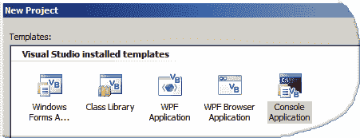

# Visual Basic

> 原文： [https://zetcode.com/lang/visualbasic/visualbasic/](https://zetcode.com/lang/visualbasic/visualbasic/)

在 Visual Basic 教程的这一部分中，我们将介绍 Visual Basic 编程语言。

## 目标

本教程的目的是使您开始使用 Visual Basic 编程语言。 本教程涵盖了 Visual Basic 语言的核心。 变量，数组，控制结构和其他核心功能。 它不涉及图形界面开发。

## Visual Basic

Visual Basic 编程语言是.NET Framework 的高级编程语言。 这是一种非常流行的语言。 目前，它是世界十大流行语言之一。 它是为 Windows 平台创建的。 Mono 项目已为 Linux 和 Mac 平台创建了一个克隆。 Visual Basic 的创建易于学习。 它源自 BASIC 语言家族。 它是一种面向对象的编译语言。 源代码被编译为可执行文件（`.exe`），由.Net 平台执行。 自最初发布以来，Visual Basic 进行了许多更改。 它因设计不佳而受到严厉批评。 许多缺点已得到解决。 一些不太好的文物仍然保留在语法中。 曾经被认为是 C# 的简单表亲，多年来，它已成为功能齐全的高级编程语言。 它的受欢迎程度上升和下降。

## 编程语言

当前有几种广泛使用的编程语言。 以下列表基于 [TIOBE](http://www.tiobe.com/tpci.htm) 编程社区索引。 这些数字来自 2010 年 8 月。请注意，这些数字仅是示例性的。 没有人知道确切的数字。

| 位置 | 语言 | 份额 |
| --- | --- | --- |
| 1 | Java | 18% |
| 2 | C | 17.9% |
| 3 | C++  | 9.7% |
| 4 | PHP | 9.2%  |
| 5 | Visual Basic | 5.4%  |
| 6 | C#  | 5%  |
| 7 | Python | 4.2%  |
| 8 | Perl | 3.4%  |
| 9 | Obj C | 3.2%  |
| 10 | Delphi | 2.4%  |

Java 是使用最广泛的编程语言。 Java 在创建便携式移动应用，对各种设备进行编程以及创建企业应用方面表现出色。 每四个应用都使用 C/C++ 进行编程。 它们主要用于创建操作系统和各种桌面应用。 C/C++ 是使用最广泛的系统编程语言。 大多数著名的桌面应用都是用 C++ 创建的。 可能是 MS Office，Macromedia Flash，Adobe Photoshop 或 3D Max。 这两种语言也主导了游戏编程业务。

PHP 在网络上占主导地位。 Java 主要由大型组织使用，而 PHP 由较小的公司和个人使用。

Visual Basic 代表了快速的应用开发的流行和 Microsoft 的统治地位。

C# 计划成为下一个主要语言。 它应该主要与 Java 和 C/C++ 语言竞争。

Python 和 PERL 是流行的脚本语言，并且是紧密的竞争者。

Objective C 的流行源于 Mac 及其创新的设备。

Deplhi 是一种流行的 RAD 开发工具。

## 编译器

本教程中的示例已在 Linux 和 Windows XP 上进行了测试。 在 Linux 上，我使用了 Mono Visual Basic 编译器。 在 Windows 上，使用 Visual Basic 2008 Express Edition。

在 Linux 上，我们需要安装 Mono Visual Basic 编译器。 它称为`vbnc`。

```vb
$ vbnc simple.vb 
$ ./simple.exe 
This is Visual Basic

```

我们在 Linux 上编译并运行一个简单的 Visual Basic 程序。

在 Windows 下，创建一个新项目。 选择文件/新建项目，或单击 `Ctrl + N` ，然后选择控制台应用。



图：控制台应用

要运行示例，请单击 `Ctrl + F5` 。

## 数据来源

以下三个资源用于创建本教程：

*   [msdn.com](http://www.msdn.com)
*   [wikipedia.org](http://www.wikipedia.org)
*   Visual Basic 语言规范

在 Visual Basic 教程的这一部分中，我们介绍了 Visual Basic 语言。