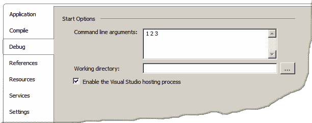

# 基本概念

> 原文： [https://zetcode.com/lang/visualbasic/basics/](https://zetcode.com/lang/visualbasic/basics/)

在 Visual Basic 教程的这一部分中，我们将介绍 Visual Basic 语言的基本编程概念。 我们介绍非常基本的程序。 我们将使用变量，常量和基本数据类型。 我们将在控制台上读写； 我们将提到变量插值。

下面是一个简单的 Visual Basic 程序。

```vb
Option Strict On

Module Example

    Sub Main()

        Console.WriteLine("This is Visual Basic")

    End Sub

End Module 

```

我们将逐行解释该程序。

```vb
Option Strict On

```

`Option Strict`语句可以为 On 或 Off。 默认值为“关”，以便与旧版 Visual Basic 程序向后兼容。 建议在所有新程序中使用此语句。 当该语句为 On 时，编译器将检测各种不良的编程习惯。

```vb
Module Example
    ...
End Module 

```

每个 Visual Basic 程序都应正确构造。 源代码放置在模块中。 在模块内，代码进一步分为过程和功能。 结构正确的模块更易于维护，并且不易出错。 在我们的例子中，我们创建一个名为 Example 的模块。 为此，我们使用`Module`关键字。 模块定义以`End Module`语句结束。

```vb
Sub Main()
    ...
End Sub

```

使用`Sub`关键字，创建一个过程。 Sub 是从子例程字派生的。 子例程和过程是同义词。 在 Visual Basic 中，首选词是过程。 过程是 Visual Basic 代码的一部分。 这是为了实现代码的模块化。

```vb
Console.WriteLine("This is Visual Basic")

```

在此代码行中，我们将“ This is Visual Basic”字符串文字打印到控制台。 要将消息打印到控制台，我们使用`Console`类的`WriteLine()`方法。 它代表控制台应用的标准输入，输出和错误流。

```vb
$ ./simple.exe 
This is Visual Basic

```

执行程序将得到以上输出。

我们也可以使用`Console`类读取值。

```vb
Option Strict On

Module Example

    Dim name As String

    Sub Main()

        Console.WriteLine("Enter your name: ")
        name = Console.ReadLine()
        Console.WriteLine("Hello {0}", name)

    End Sub

End Module 

```

第二个程序将从控制台读取一个值并打印出来。

```vb
Dim name As String

```

`Dim`关键字用于声明变量。 该变量称为“名称”。 与常量（在程序生命周期内仅存储一个值）不同，变量可以存储各种不同的值。 `As`关键字定义变量的数据类型。 我们的变量将保存字符串值。

```vb
name = Console.ReadLine()

```

我们从终端读取一行。 当我们按下 Enter 键时，字符串将分配给 name 变量。

```vb
Console.WriteLine("Hello {0}", name)

```

在此代码行中，我们执行变量插值。 变量插值正在用字符串文字中的值替换变量。 变量插值的另一个名称是：变量替换和变量扩展。

```vb
$ ./readline.exe 
Enter your name: 
Jan
Hello Jan

```

这是第二个程序的输出。

## 命令行参数

Visual Basic 程序可以接收命令行参数。 有几种方法可以从命令行检索参数。

```vb
Option Strict On

Module Example

    Dim cline As String

    Sub Main()

        cline = Command()
        Console.WriteLine(cline)

    End Sub

End Module 

```

在上面的程序中，我们获取命令行参数并将其打印到终端。

```vb
cline = Command()

```

`Command()`函数用于获取参数。

```vb
Console.WriteLine(cline)

```

我们将命令行参数打印到终端。

```vb
$ ./commandargs.exe 1 2 3
/home/vronskij/programming/basic/basics/commandargs.exe 1 2 3

```

我们执行程序，后跟三个数字。 程序将打印数字以及程序名称。 程序名称是第一个命令行参数。

在 Visual Basic 2008 Express Edition 中，选择项目属性。 在“调试”选项卡中，有一个文本区域用于指定命令行参数。



Figure: Command line arguments

```vb
Option Strict On

Module Example

    Dim size As Integer

    Sub Main(ByVal cmdArgs() As String)

        size = cmdArgs.Length

        If size > 0 Then
            For i As Integer = 0 To size - 1
                Console.WriteLine(cmdArgs(i))
            Next
        End If

    End Sub

End Module 

```

命令行参数可以传递给 Main 过程。

```vb
Sub Main(ByVal cmdArgs() As String)

```

此`Main()`过程接收命令行参数的字符串数组。

```vb
size = cmdArgs.Length

```

我们确定数组的大小。

```vb
If size > 0 Then
    For i As Byte = 0 To size - 1
        Console.WriteLine(cmdArgs(i))
    Next
End If

```

我们遍历数组并将所有参数打印到控制台。 请注意，在这种情况下，程序名称不包含在参数中。

```vb
$ ./cmdargs.exe 2 3 5
2
3
5

```

我们提供了三个数字作为命令行参数，并将它们打印到控制台上。

## 变量和常量

变量是存储数据的地方。 变量具有名称和数据类型。 数据类型确定可以为变量分配哪些值。 整数，字符串，布尔值等。在程序运行过程中，变量可以获得相同数据类型的各种值。 在对变量进行任何引用之前，始终将变量初始化为其类型的默认值。 变量用`Dim`关键字声明。 与变量不同，常量保留其值。 一旦初始化，便无法修改。 用`Const`关键字创建常量。

```vb
Option Strict On

Module Example

    Sub Main()

        Dim city As String = "New York"

        Dim name As String = "Paul", age As Integer = 35, _
            nationality As String = "American"

        Console.WriteLine(city)
        Console.WriteLine(name)
        Console.WriteLine(age)
        Console.WriteLine(nationality)

        city = "London"
        Console.WriteLine(city)

    End Sub

End Module

```

在上面的示例中，我们使用四个变量。

```vb
Dim city As String = "New York"

```

我们声明一个 String 类型的 city 变量，并将其初始化为“ New York”值。

```vb
Dim name As String = "Paul", age As Integer = 35, _
    nationality As String = "American"

```

我们可以使用一个`Dim`关键字来声明和初始化更多变量； 它们之间用逗号分隔。

```vb
Console.WriteLine(city)
Console.WriteLine(name)
Console.WriteLine(age)
Console.WriteLine(nationality)

```

我们将变量的值打印到终端。

```vb
city = "London"

```

我们为城市变量分配一个新值。

正如我们上面已经说过的，常量不能更改其初始值。

```vb
Option Strict On

Module Example

    Sub Main()

        Const WIDTH As Integer = 100
        Const HEIGHT As Integer = 150
        Dim var As Integer = 40

        var = 50

        Rem WIDTH = 110

    End Sub

End Module

```

在此示例中，我们声明两个常量和一个变量。

```vb
Const WIDTH As Integer = 100
Const HEIGHT As Integer = 150

```

我们使用`Const`关键字通知编译器我们声明了一个常量。 按照惯例，用大写字母写常量。

```vb
Dim var As Integer = 40

var = 50

```

我们声明并初始化一个变量。 稍后，我们为变量分配一个新值。

```vb
Rem WIDTH = 110

```

使用常数是不可能的。 如果我们取消注释此行，则会收到编译错误。

## 变量插补

变量插值正在用字符串文字中的值替换变量。 变量插值的另一个名称是：变量替换和变量扩展。

```vb
Option Strict On

Module Example

    Dim age As Byte = 34
    Dim name As String = "William"
    Dim output As String

    Sub Main()

        output = String.Format("{0} is {1} years old.", _
            name, age)

        Console.WriteLine(output)

    End Sub

End Module

```

在 Visual Basic 中，字符串是不可变的。 我们无法修改现有字符串。 变量插值发生在字符串创建期间。

```vb
Dim age As Byte = 34
Dim name As String = "William"
Dim output As String

```

在这里，我们声明三个变量。

```vb
output = String.Format("{0} is {1} years old.", _
    name, age)

```

我们使用内置`String`模块的`Format()`方法。 `{0}`和`{1}`是评估变量的地方。 数字代表变量的位置。 `{0}`计算得出的第一个变量，`{1}`计算得出的第二个变量。

```vb
$ ./interpolation.exe 
William is 34 years old.

```

输出。

本章介绍了 Visual Basic 语言的一些基础知识。