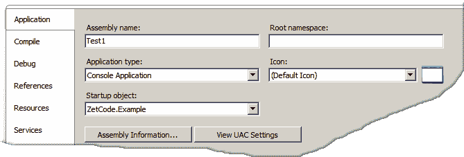

# 在 Visual Basic 中组织代码

> 原文： [https://zetcode.com/lang/visualbasic/organizingcode/](https://zetcode.com/lang/visualbasic/organizingcode/)

在 Visual Basic 教程的这一部分中，我们将展示如何组织代码。 我们将介绍模块，过程和名称空间以及作用域。

Visual Basic 语句被组织为块，模块，类和名称空间。 这有助于使代码更具可维护性和鲁棒性。 正确的代码组织可以防止在代码中出错。

Visual Basic 程序的基本构建块是：

*   程序集
*   命名空间
*   模块
*   类
*   过程和函数
*   块
*   语句

程序集是 DLL 或 exe 文件。 程序集是用于部署，版本控制和安全性的已编译代码库。 名称空间是提供项目上下文的抽象容器。 模块是在其整个命名空间中可用的引用类型。 类是 OOP 程序的基本构建块。 过程是为执行特定任务而创建的程序的一个单元。 块是由`If`或`While`之类的某些关键字提供的 Visual Basic 语句的最低级别组织。 语句是 Visual Basic 程序中的原子，是代码的最小单位。

与该主题密切相关的是变量的作用域和持续时间。 作用域是声明的变量的可见性。

| 作用域 | 描述 |
| --- | --- |
| 块作用域 | 仅在声明它的代码块中可用 |
| 过程作用域 | 在声明它的过程中可用 |
| 模块作用域 | 可用于声明该模块的模块，类或结构中的所有代码 |
| 命名空间作用域 | 可用于声明它的名称空间中的所有代码 |

变量的生命周期是变量保存值的时间段。 只要过程正在执行，局部变量就存在。 之后，它们将不再可用。 但是，如果我们将变量声明为静态变量，则该过程终止后该变量将继续存在。 在应用的生存期内，存在模块，共享和实例变量。

## 基本例子

首先，我们介绍一些基本知识。

```vb
Option Strict On

Module Example

    Sub Main()

        Console.WriteLine("Simple example")

    End Sub

End Module

```

在此示例中，我们有一个名为`Example`的模块。 在示例内部，我们有一个`Main()`子例程。 将一些消息打印到控制台的语句位于`Main()`过程中。 事件最简单的 Visual Basic 程序必须正确组织。

```vb
Option Strict On

Public Class Example

    Public Shared Sub Main()

        Console.WriteLine("Simple example")

    End Sub

End Class

```

确切的示例，现在没有模块。 我们也可以将代码放入类中。 由于未实例化该类，因此必须将`Main(`过程声明为`Shared`。 编译器将在不创建类实例的情况下调用`Main()`方法。 这就是为什么必须将其声明为`Shared`的原因。 Java 和 C# 的工作原理相同。

## 命名空间

命名空间用于在最高逻辑级别上组织代码。 他们对公开给其他程序和应用的编程元素进行分类和呈现。 在一个名称空间内，我们可以声明另一个名称空间，一个类，一个接口，一个结构，一个枚举或一个委托。

在下面的代码中，我们有两个共享相同名称空间的文件。

```vb
Option Strict On

NameSpace ZetCode

    Module Example1

        Public Dim x As Integer = 0

        Sub Init()

            x += 100
            Console.WriteLine(x)

        End Sub

    End Module

End NameSpace

```

我们有一个`ZetCode`命名空间。 在名称空间中，我们有一个模块`Example1`。

```vb
NameSpace ZetCode

```

我们声明一个名为`ZetCode`的命名空间。

```vb
Public Dim x As Integer = 0

```

在模块中，我们声明并初始化`x`变量。

```vb
Sub Init()
    x += 100
    Console.WriteLine(x)
End Sub

```

我们有一个`Init()`方法，其中使用了`x`变量。

```vb
Option Strict On

NameSpace ZetCode

    Module Example

        Sub Main()

            Init()
            x += 100
            Console.WriteLine(x)

        End Sub

    End Module

End NameSpace

```

在第二个文件中，我们使用上一个文件中的`Init()`方法。

```vb
NameSpace ZetCode

```

我们在同一个命名空间中工作。

```vb
Init()
x += 100
Console.WriteLine(x)

```

我们调用`Init()`过程并使用`x`变量。 过程和`x`变量都在不同的文件和不同的模块中定义。 但是它们是在同一个命名空间中定义的，因此我们可以使用它们。

```vb
$ ./samenamespace.exe 
100
200

```

输出。

以下代码示例具有两个不同的名称空间。 我们使用`Imports`关键字从其他名称空间导入元素。

```vb
Option Strict On

NameSpace MyMath

    Public Class Basic

        Public Shared PI As Double = 3.141592653589

        Public Shared Function GetPi() As Double

            Return Me.PI

        End Function

    End Class

End NameSpace

```

我们在`MyMath`名称空间中具有`Math`类的框架。 在`Basic`类中，我们定义`PI`常量和`GetPi()`方法。

```vb
Option Strict On

Imports MyMath

NameSpace ZetCode

    Public Class Example

        Public Shared Sub Main()

            Console.WriteLine(Basic.PI)
            Console.WriteLine(Basic.GetPi())

        End Sub

    End Class

End NameSpace

```

在此文件中，我们使用`MyMath`命名空间中的元素。

```vb
Imports MyMath

```

我们将元素从`MyMath`命名空间导入到我们的命名空间中。



图：根命名空间

在 Visual Basic 2008 Express 版上，会自动创建一个根名称空间。 可以在项目属性的“应用”选项卡下找到。 删除根名称空间或将其包含在导入路径中。 例如，如果在那里有“测试”，则将行更改为`Imports Testing.MyMath`。

```vb
Console.WriteLine(Basic.PI)
Console.WriteLine(Basic.GetPi())

```

现在我们可以使用这些元素。 在我们的例子中，`PI`变量和`GetPi()`方法。

```vb
Option Strict On

' Imports MyMath

NameSpace ZetCode

    Public Class Example

        Public Shared Sub Main()

            Console.WriteLine(MyMath.Basic.PI)
            Console.WriteLine(MyMath.Basic.GetPi())

        End Sub

    End Class

End NameSpace

```

请注意，我们不需要`Imports`关键字。 在示例中，将其注释掉。 我们可以通过使用元素的完全限定名称来使用其他命名空间中的元素。

## 模块

模块用于组织代码并包装类似用途的变量，属性，事件和过程。 与类不同，模块不是类型。 可以在名称空间或文件中创建模块。 不能在另一个模块，类，结构，接口或块内创建模块。 模块中的所有成员都是隐式共享的。 模块具有“朋友”访问权限。 这意味着模块可在装配中的任何位置访问。

```vb
Option Strict On

Module First

    Public x As Byte = 11

    Public Sub FirstModule()

        Console.WriteLine("First module")

    End Sub

End Module

Module Second

    Public y As Byte = 22

    Public Sub SecondModule()

        Console.WriteLine("Second module")

    End Sub

End Module

Module Example

    Sub Main()

        Console.WriteLine(x)
        Console.WriteLine(Second.y)
        FirstModule()
        SecondModule()

    End Sub

End Module

```

我们定义了三个模块。 前两个模块具有变量和过程。 这些将在第三个模块中使用。

```vb
Module First

    Public x As Byte = 11
...
End Module

```

我们也可以在模块内部使用访问说明符。 这样，我们可以控制模块中元素的可访问性。

```vb
Console.WriteLine(x)
Console.WriteLine(Second.y)

```

我们打印`x`和`y`变量。 它们是`Public`，可以从其他模块访问。 我们可以使用模块名称来完全指定变量名称。

作用域是变量的可见性。 具有模块作用域的变量在声明了该模块的模块中可用。

```vb
Option Strict On

Module Example

    Private x As Integer = 0

    Sub Main()

        proc1()
        proc2()
        proc3()

    End Sub

    Sub proc1()

        Console.WriteLine(x)

    End Sub

    Sub proc2()

        x += 100
        Console.WriteLine(x)

    End Sub

    Sub proc3()

        x += 100
        Console.WriteLine(x)

    End Sub

End Module

```

我们在模块内部有`x`变量。 该变量在所有三个过程中均可用。

```vb
Private x As Integer = 0

```

这是具有模块作用域的变量。 它在任何过程外声明。

```vb
Sub proc2()
    x += 100
    Console.WriteLine(x)
End Sub

```

在`proc2()`过程中，我们增加了`x`变量并将其内容打印到控制台。 我们引用模块中定义的`x`变量。

```vb
$ ./modulescope.exe 
0
100
200

```

示例的输出。

## 过程

过程为代码项目提供了模块化。 他们应该仅执行特定任务。

```vb
Option Strict On

Module Example

    Dim x As Integer = 0 

    Sub Main()

        Console.WriteLine(x)

        proc1()
        proc2()
        proc3()

    End Sub

    Sub proc1()

        Dim x As Integer 
        x += 100

        Console.WriteLine(x)

    End Sub

    Sub proc2()

        Dim x As Integer
        x += 100
        Console.WriteLine(x)

    End Sub

    Sub proc3()

        Dim x As Integer
        x += 100
        Console.WriteLine(x)

    End Sub

End Module

```

在前面的代码示例中，除主过程外，我们还有三个过程。 这三个过程创建一个本地`x`变量并将其打印到终端。 主要过程涉及模块`x`变量。

```vb
Sub proc1()
    Dim x As Integer 
    x += 100
    Console.WriteLine(x)
End Sub

```

`proc1()`过程创建一个本地`x`变量。 此变量遮盖了，该变量在模块作用域中声明。

```vb
$ ./procedurescope.exe 
0
100
100
100

```

主程序打印 0。其他程序打印 100 到终端。 他们创建其本地`x`变量，将其初始化为 0，然后增加 100。

## 块作用域

重要的是要理解在`If` / `End If`或`While` / `End While`之类的代码块中声明的变量具有有限的块作用域和生存期。 下一个示例对此进行了说明。

```vb
Option Strict On

Module Example

    Sub Main()

        If True

            Console.WriteLine("Inside If block")        

            Dim x As Integer = 0
            Console.WriteLine(x)

            x += 500
            Console.WriteLine(x)

        End If

        Console.WriteLine("Outside If block")        

        Rem Will not compile
        Rem Console.WriteLine(x)

    End Sub

End Module

```

我们在`If` / `End If`块内部声明了一个`x`变量。

```vb
Rem Will not compile
Rem Console.WriteLine(x)

```

该变量在块外部不可用。 如果我们取消注释第二行，则该示例将无法编译。

Visual Basic 教程的这一部分专门用于组织代码。 我们提到了代码的基本组织元素，例如名称空间，模块或过程。 我们描述了与这些要素密切相关的可变作用域和持续时间。