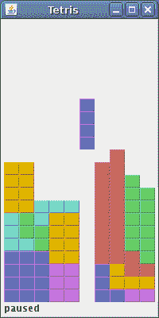

# Java 俄罗斯方块

> 原文： [https://zetcode.com/tutorials/javagamestutorial/tetris/](https://zetcode.com/tutorials/javagamestutorial/tetris/)

在本章中，我们将在 Java Swing 中创建一个俄罗斯方块游戏克隆。 源代码和图像可以在作者的 Github [Java-Tetris-Game](https://github.com/janbodnar/Java-Tetris-Game) 存储库中找到。

## 俄罗斯方块

俄罗斯方块游戏是有史以来最受欢迎的计算机游戏之一。 原始游戏是由俄罗斯程序员 Alexey Pajitnov 于 1985 年设计和编程的。此后，几乎所有版本的几乎所有计算机平台上都可以使用俄罗斯方块。 甚至我的手机都有俄罗斯方块游戏的修改版。

俄罗斯方块被称为下降块益智游戏。 在这个游戏中，我们有七个不同的形状，称为`tetrominoes`。 S 形，Z 形，T 形，L 形，线形，镜像 L 形和正方形。 这些形状中的每一个都形成有四个正方形。 形状从板上掉下来。 俄罗斯方块游戏的目的是移动和旋转形状，以便它们尽可能地适合。 如果我们设法形成一行，则该行将被破坏并得分。 我们玩俄罗斯方块游戏，直到达到顶峰。


图：Tetrominoes

## 开发

使用 Swing 绘画 API 绘制四聚体。 我们使用`java.util.Timer`创建游戏周期。 形状以正方形为单位移动（而不是逐个像素移动）。 从数学上讲，游戏中的棋盘是一个简单的数字列表。

游戏启动后立即开始。 我们可以通过按`p`键暂停游戏。 空格键将把俄罗斯方块放在底部。 `d`键将片段向下一行。 （它可以用来加快下降速度。）游戏以恒定速度运行，没有实现加速。 分数是我们已删除的行数。

`com/zetcode/Shape.java`

```java
package com.zetcode;

import java.util.Random;

public class Shape {

    protected enum Tetrominoe {
        NoShape, ZShape, SShape, LineShape,
        TShape, SquareShape, LShape, MirroredLShape
    }

    private Tetrominoe pieceShape;
    private int[][] coords;

    public Shape() {

        coords = new int[4][2];
        setShape(Tetrominoe.NoShape);
    }

    void setShape(Tetrominoe shape) {

        int[][][] coordsTable = new int[][][]{
                {{0, 0}, {0, 0}, {0, 0}, {0, 0}},
                {{0, -1}, {0, 0}, {-1, 0}, {-1, 1}},
                {{0, -1}, {0, 0}, {1, 0}, {1, 1}},
                {{0, -1}, {0, 0}, {0, 1}, {0, 2}},
                {{-1, 0}, {0, 0}, {1, 0}, {0, 1}},
                {{0, 0}, {1, 0}, {0, 1}, {1, 1}},
                {{-1, -1}, {0, -1}, {0, 0}, {0, 1}},
                {{1, -1}, {0, -1}, {0, 0}, {0, 1}}
        };

        for (int i = 0; i < 4; i++) {

            System.arraycopy(coordsTable[shape.ordinal()], 0, coords, 0, 4);
        }

        pieceShape = shape;
    }

    private void setX(int index, int x) {

        coords[index][0] = x;
    }

    private void setY(int index, int y) {

        coords[index][1] = y;
    }

    int x(int index) {

        return coords[index][0];
    }

    int y(int index) {

        return coords[index][1];
    }

    Tetrominoe getShape() {

        return pieceShape;
    }

    void setRandomShape() {

        var r = new Random();
        int x = Math.abs(r.nextInt()) % 7 + 1;

        Tetrominoe[] values = Tetrominoe.values();
        setShape(values[x]);
    }

    public int minX() {

        int m = coords[0][0];

        for (int i = 0; i < 4; i++) {

            m = Math.min(m, coords[i][0]);
        }

        return m;
    }

    int minY() {

        int m = coords[0][1];

        for (int i = 0; i < 4; i++) {

            m = Math.min(m, coords[i][1]);
        }

        return m;
    }

    Shape rotateLeft() {

        if (pieceShape == Tetrominoe.SquareShape) {

            return this;
        }

        var result = new Shape();
        result.pieceShape = pieceShape;

        for (int i = 0; i < 4; i++) {

            result.setX(i, y(i));
            result.setY(i, -x(i));
        }

        return result;
    }

    Shape rotateRight() {

        if (pieceShape == Tetrominoe.SquareShape) {

            return this;
        }

        var result = new Shape();
        result.pieceShape = pieceShape;

        for (int i = 0; i < 4; i++) {

            result.setX(i, -y(i));
            result.setY(i, x(i));
        }

        return result;
    }
}

```

`Shape`类提供有关俄罗斯方块的信息。

```java
protected enum Tetrominoe {
    NoShape, ZShape, SShape, LineShape,
    TShape, SquareShape, LShape, MirroredLShape
}

```

`Tetrominoe`枚举包含七个俄罗斯方块形状名称和一个称为`NoShape`的空形状。

```java
coords = new int[4][2];
setShape(Tetrominoe.NoShape);

```

`coords`数组保存俄罗斯方块的实际坐标。

```java
int[][][] coordsTable = new int[][][]{
    {{0, 0}, {0, 0}, {0, 0}, {0, 0}},
    {{0, -1}, {0, 0}, {-1, 0}, {-1, 1}},
    {{0, -1}, {0, 0}, {1, 0}, {1, 1}},
    {{0, -1}, {0, 0}, {0, 1}, {0, 2}},
    {{-1, 0}, {0, 0}, {1, 0}, {0, 1}},
    {{0, 0}, {1, 0}, {0, 1}, {1, 1}},
    {{-1, -1}, {0, -1}, {0, 0}, {0, 1}},
    {{1, -1}, {0, -1}, {0, 0}, {0, 1}}
};

```

`coordsTable`数组保存俄罗斯方块的所有可能的坐标值。 这是一个模板，所有作品都从该模板中获得其坐标值。

```java
for (int i = 0; i < 4; i++) {

    System.arraycopy(coordsTable[shape.ordinal()], 0, coords, 0, 4);
}

```

我们将来自`coordsTable`的一行坐标值放入俄罗斯方块的`coords`数组中。 注意`ordinal()`方法的用法。 在 C++ 中，枚举类型本质上是整数。 与 C++ 不同，Java 枚举是完整类，`ordinal()`方法返回枚举类型在枚举对象中的当前位置。

下图将帮助您更多地了解坐标值。 `coords`数组保存俄罗斯方块的坐标。 例如，数字（-1、1），（-1、0），（0、0）和（0，-1）表示旋转的 S 形。 下图说明了形状。


Figure: Coordinates

```java
Shape rotateLeft() {

    if (pieceShape == Tetrominoe.SquareShape) {

        return this;
    }

    var result = new Shape();
    result.pieceShape = pieceShape;

    for (int i = 0; i < 4; i++) {

        result.setX(i, y(i));
        result.setY(i, -x(i));
    }

    return result;
}

```

此代码将一块向左旋转。 正方形不必旋转。 这就是为什么我们只是将引用返回到当前对象。 查看上一张图像将有助于理解旋转。

`com/zetcode/Board.java`

```java
package com.zetcode;

import com.zetcode.Shape.Tetrominoe;

import javax.swing.JLabel;
import javax.swing.JPanel;
import javax.swing.Timer;
import java.awt.Color;
import java.awt.Graphics;
import java.awt.event.ActionEvent;
import java.awt.event.ActionListener;
import java.awt.event.KeyAdapter;
import java.awt.event.KeyEvent;

public class Board extends JPanel {

    private final int BOARD_WIDTH = 10;
    private final int BOARD_HEIGHT = 22;
    private final int PERIOD_INTERVAL = 300;

    private Timer timer;
    private boolean isFallingFinished = false;
    private boolean isPaused = false;
    private int numLinesRemoved = 0;
    private int curX = 0;
    private int curY = 0;
    private JLabel statusbar;
    private Shape curPiece;
    private Tetrominoe[] board;

    public Board(Tetris parent) {

        initBoard(parent);
    }

    private void initBoard(Tetris parent) {

        setFocusable(true);
        statusbar = parent.getStatusBar();
        addKeyListener(new TAdapter());
    }

    private int squareWidth() {

        return (int) getSize().getWidth() / BOARD_WIDTH;
    }

    private int squareHeight() {

        return (int) getSize().getHeight() / BOARD_HEIGHT;
    }

    private Tetrominoe shapeAt(int x, int y) {

        return board[(y * BOARD_WIDTH) + x];
    }

    void start() {

        curPiece = new Shape();
        board = new Tetrominoe[BOARD_WIDTH * BOARD_HEIGHT];

        clearBoard();
        newPiece();

        timer = new Timer(PERIOD_INTERVAL, new GameCycle());
        timer.start();
    }

    private void pause() {

        isPaused = !isPaused;

        if (isPaused) {

            statusbar.setText("paused");
        } else {

            statusbar.setText(String.valueOf(numLinesRemoved));
        }

        repaint();
    }

    @Override
    public void paintComponent(Graphics g) {

        super.paintComponent(g);
        doDrawing(g);
    }

    private void doDrawing(Graphics g) {

        var size = getSize();
        int boardTop = (int) size.getHeight() - BOARD_HEIGHT * squareHeight();

        for (int i = 0; i < BOARD_HEIGHT; i++) {

            for (int j = 0; j < BOARD_WIDTH; j++) {

                Tetrominoe shape = shapeAt(j, BOARD_HEIGHT - i - 1);

                if (shape != Tetrominoe.NoShape) {

                    drawSquare(g, j * squareWidth(),
                            boardTop + i * squareHeight(), shape);
                }
            }
        }

        if (curPiece.getShape() != Tetrominoe.NoShape) {

            for (int i = 0; i < 4; i++) {

                int x = curX + curPiece.x(i);
                int y = curY - curPiece.y(i);

                drawSquare(g, x * squareWidth(),
                        boardTop + (BOARD_HEIGHT - y - 1) * squareHeight(),
                        curPiece.getShape());
            }
        }
    }

    private void dropDown() {

        int newY = curY;

        while (newY > 0) {

            if (!tryMove(curPiece, curX, newY - 1)) {

                break;
            }

            newY--;
        }

        pieceDropped();
    }

    private void oneLineDown() {

        if (!tryMove(curPiece, curX, curY - 1)) {

            pieceDropped();
        }
    }

    private void clearBoard() {

        for (int i = 0; i < BOARD_HEIGHT * BOARD_WIDTH; i++) {

            board[i] = Tetrominoe.NoShape;
        }
    }

    private void pieceDropped() {

        for (int i = 0; i < 4; i++) {

            int x = curX + curPiece.x(i);
            int y = curY - curPiece.y(i);
            board[(y * BOARD_WIDTH) + x] = curPiece.getShape();
        }

        removeFullLines();

        if (!isFallingFinished) {

            newPiece();
        }
    }

    private void newPiece() {

        curPiece.setRandomShape();
        curX = BOARD_WIDTH / 2 + 1;
        curY = BOARD_HEIGHT - 1 + curPiece.minY();

        if (!tryMove(curPiece, curX, curY)) {

            curPiece.setShape(Tetrominoe.NoShape);
            timer.stop();

            var msg = String.format("Game over. Score: %d", numLinesRemoved);
            statusbar.setText(msg);
        }
    }

    private boolean tryMove(Shape newPiece, int newX, int newY) {

        for (int i = 0; i < 4; i++) {

            int x = newX + newPiece.x(i);
            int y = newY - newPiece.y(i);

            if (x < 0 || x >= BOARD_WIDTH || y < 0 || y >= BOARD_HEIGHT) {

                return false;
            }

            if (shapeAt(x, y) != Tetrominoe.NoShape) {

                return false;
            }
        }

        curPiece = newPiece;
        curX = newX;
        curY = newY;

        repaint();

        return true;
    }

    private void removeFullLines() {

        int numFullLines = 0;

        for (int i = BOARD_HEIGHT - 1; i >= 0; i--) {

            boolean lineIsFull = true;

            for (int j = 0; j < BOARD_WIDTH; j++) {

                if (shapeAt(j, i) == Tetrominoe.NoShape) {

                    lineIsFull = false;
                    break;
                }
            }

            if (lineIsFull) {

                numFullLines++;

                for (int k = i; k < BOARD_HEIGHT - 1; k++) {
                    for (int j = 0; j < BOARD_WIDTH; j++) {
                        board[(k * BOARD_WIDTH) + j] = shapeAt(j, k + 1);
                    }
                }
            }
        }

        if (numFullLines > 0) {

            numLinesRemoved += numFullLines;

            statusbar.setText(String.valueOf(numLinesRemoved));
            isFallingFinished = true;
            curPiece.setShape(Tetrominoe.NoShape);
        }
    }

    private void drawSquare(Graphics g, int x, int y, Tetrominoe shape) {

        Color colors[] = {new Color(0, 0, 0), new Color(204, 102, 102),
                new Color(102, 204, 102), new Color(102, 102, 204),
                new Color(204, 204, 102), new Color(204, 102, 204),
                new Color(102, 204, 204), new Color(218, 170, 0)
        };

        var color = colors[shape.ordinal()];

        g.setColor(color);
        g.fillRect(x + 1, y + 1, squareWidth() - 2, squareHeight() - 2);

        g.setColor(color.brighter());
        g.drawLine(x, y + squareHeight() - 1, x, y);
        g.drawLine(x, y, x + squareWidth() - 1, y);

        g.setColor(color.darker());
        g.drawLine(x + 1, y + squareHeight() - 1,
                x + squareWidth() - 1, y + squareHeight() - 1);
        g.drawLine(x + squareWidth() - 1, y + squareHeight() - 1,
                x + squareWidth() - 1, y + 1);
    }

    private class GameCycle implements ActionListener {

        @Override
        public void actionPerformed(ActionEvent e) {

            doGameCycle();
        }
    }

    private void doGameCycle() {

        update();
        repaint();
    }

    private void update() {

        if (isPaused) {

            return;
        }

        if (isFallingFinished) {

            isFallingFinished = false;
            newPiece();
        } else {

            oneLineDown();
        }
    }

    class TAdapter extends KeyAdapter {

        @Override
        public void keyPressed(KeyEvent e) {

            if (curPiece.getShape() == Tetrominoe.NoShape) {

                return;
            }

            int keycode = e.getKeyCode();

            // Java 12 switch expressions
            switch (keycode) {

                case KeyEvent.VK_P -> pause();
                case KeyEvent.VK_LEFT -> tryMove(curPiece, curX - 1, curY);
                case KeyEvent.VK_RIGHT -> tryMove(curPiece, curX + 1, curY);
                case KeyEvent.VK_DOWN -> tryMove(curPiece.rotateRight(), curX, curY);
                case KeyEvent.VK_UP -> tryMove(curPiece.rotateLeft(), curX, curY);
                case KeyEvent.VK_SPACE -> dropDown();
                case KeyEvent.VK_D -> oneLineDown();
            }
        }
    }
}

```

最后，我们有`Board.java`文件。 这是游戏逻辑所在的位置。

```java
private final int BOARD_WIDTH = 10;
private final int BOARD_HEIGHT = 22;
private final int PERIOD_INTERVAL = 300;

```

我们有四个常数。 `BOARD_WIDTH`和`BOARD_HEIGHT`定义了电路板的大小。 `PERIOD_INTERVAL`常数定义游戏的速度。

```java
...
private boolean isFallingFinished = false;
private boolean isStarted = false;
private boolean isPaused = false;
private int numLinesRemoved = 0;
private int curX = 0;
private int curY = 0;
...

```

一些重要的变量被初始化。 `isFallingFinished`确定俄罗斯方块形状是否已经完成下降，然后我们需要创建一个新形状。 `isStarted`用于检查游戏是否已经开始。 同样，`isPaused`用于检查游戏是否暂停。 `numLinesRemoved`计算到目前为止我们已删除的行数。 `curX`和`curY`确定下降的俄罗斯方块形状的实际位置。

```java
private int squareWidth() {

    return (int) getSize().getWidth() / BOARD_WIDTH;
}

private int squareHeight() {

    return (int) getSize().getHeight() / BOARD_HEIGHT;
}

```

这些线确定单个 Tetrominoe 正方形的宽度和高度。

```java
private Tetrominoe shapeAt(int x, int y) {

    return board[(y * BOARD_WIDTH) + x];
}

```

我们确定给定坐标处的形状。 形状存储在`board`数组中。

```java
void start() {

    curPiece = new Shape();
    board = new Tetrominoe[BOARD_WIDTH * BOARD_HEIGHT];
...

```

我们创建一个新的当前形状和一个新的板。

```java
clearBoard();
newPiece();

```

清理板并初始化新的下降片。

```java
timer = new Timer(PERIOD_INTERVAL, new GameCycle());
timer.start();

```

我们创建一个计时器。 计时器以`PERIOD_INTERVAL`间隔执行，从而创建游戏周期。

```java
private void pause() {

    isPaused = !isPaused;

    if (isPaused) {

        statusbar.setText("paused");
    } else {

        statusbar.setText(String.valueOf(numLinesRemoved));
    }

    repaint();
}

```

`pause()`方法暂停或继续游戏。 游戏暂停后，我们会在状态栏中显示`paused`消息。

在`doDrawing()`方法内部，我们在板上绘制了所有对象。 这幅画有两个步骤。

```java
for (int i = 0; i < BOARD_HEIGHT; i++) {

    for (int j = 0; j < BOARD_WIDTH; j++) {

        Tetrominoe shape = shapeAt(j, BOARD_HEIGHT - i - 1);

        if (shape != Tetrominoe.NoShape) {

            drawSquare(g, j * squareWidth(),
                    boardTop + i * squareHeight(), shape);
        }
    }
}

```

在第一步中，我们绘制掉落到板底部的所有形状或形状的其余部分。 所有正方形都记在板阵列中。 我们使用`shapeAt()`方法访问它。

```java
if (curPiece.getShape() != Tetrominoe.NoShape) {

    for (int i = 0; i < 4; i++) {

        int x = curX + curPiece.x(i);
        int y = curY - curPiece.y(i);

        drawSquare(g, x * squareWidth(),
                boardTop + (BOARD_HEIGHT - y - 1) * squareHeight(),
                curPiece.getShape());
    }
}

```

在第二步中，我们绘制实际的下降部分。

```java
private void dropDown() {

    int newY = curY;

    while (newY > 0) {

        if (!tryMove(curPiece, curX, newY - 1)) {

            break;
        }

        newY--;
    }

    pieceDropped();
}

```

如果按`Space`键，则该片段将落到底部。 我们只是简单地尝试将一块下降到另一条俄罗斯方块下降的底部或顶部。 当俄罗斯方块结束下降时，将调用`pieceDropped()`。

```java
private void oneLineDown() {

    if (!tryMove(curPiece, curX, curY - 1)) {

        pieceDropped();
    }
}

```

在`oneLineDown()`方法中，我们尝试将下降片向下移动一行，直到完全下降。

```java
private void clearBoard() {

    for (int i = 0; i < BOARD_HEIGHT * BOARD_WIDTH; i++) {

        board[i] = Tetrominoe.NoShape;
    }
}

```

`clearBoard()`方法用空的`Tetrominoe.NoShape`填充电路板。 稍后将其用于碰撞检测。

```java
private void pieceDropped() {

    for (int i = 0; i < 4; i++) {

        int x = curX + curPiece.x(i);
        int y = curY - curPiece.y(i);
        board[(y * BOARD_WIDTH) + x] = curPiece.getShape();
    }

    removeFullLines();

    if (!isFallingFinished) {

        newPiece();
    }
}

```

`pieceDropped()`方法将下降的片段放入`board`数组。 木板再次保持了所有碎片的正方形和已经落下的碎片的剩余部分。 当一块完成落下时，就该检查我们是否可以从板上去除一些线了。 这是`removeFullLines()`方法的工作。 然后，我们创建一个新作品，或更准确地说，我们尝试创建一个新作品。

```java
private void newPiece() {

    curPiece.setRandomShape();
    curX = BOARD_WIDTH / 2 + 1;
    curY = BOARD_HEIGHT - 1 + curPiece.minY();

    if (!tryMove(curPiece, curX, curY)) {

        curPiece.setShape(Tetrominoe.NoShape);
        timer.stop();

        var msg = String.format("Game over. Score: %d", numLinesRemoved);
        statusbar.setText(msg);
    }
}

```

`newPiece()`方法创建一个新的俄罗斯方块。 作品获得了新的随机形状。 然后，我们计算初始`curX`和`curY`值。 如果我们不能移动到初始位置，则游戏结束了，我们结束了。 计时器停止运行，我们在状态栏上显示`Game over`包含分数的字符串。

```java
private boolean tryMove(Shape newPiece, int newX, int newY) {

    for (int i = 0; i < 4; i++) {

        int x = newX + newPiece.x(i);
        int y = newY - newPiece.y(i);

        if (x < 0 || x >= BOARD_WIDTH || y < 0 || y >= BOARD_HEIGHT) {

            return false;
        }

        if (shapeAt(x, y) != Tetrominoe.NoShape) {

            return false;
        }
    }

    curPiece = newPiece;
    curX = newX;
    curY = newY;

    repaint();

    return true;
}

```

`tryMove()`方法尝试移动俄罗斯方块。 如果该方法已到达板边界或与已经跌落的俄罗斯方块碎片相邻，则返回`false`。

```java
private void removeFullLines() {

    int numFullLines = 0;

    for (int i = BOARD_HEIGHT - 1; i >= 0; i--) {

        boolean lineIsFull = true;

        for (int j = 0; j < BOARD_WIDTH; j++) {

            if (shapeAt(j, i) == Tetrominoe.NoShape) {

                lineIsFull = false;
                break;
            }
        }

        if (lineIsFull) {

            numFullLines++;

            for (int k = i; k < BOARD_HEIGHT - 1; k++) {
                for (int j = 0; j < BOARD_WIDTH; j++) {
                    board[(k * BOARD_WIDTH) + j] = shapeAt(j, k + 1);
                }
            }
        }
    }

    if (numFullLines > 0) {

        numLinesRemoved += numFullLines;

        statusbar.setText(String.valueOf(numLinesRemoved));
        isFallingFinished = true;
        curPiece.setShape(Tetrominoe.NoShape);
    }
}

```

在`removeFullLines()`方法内部，我们检查板上的所有行中是否有完整的行。 如果至少有一条实线，则将其删除。 找到整条线后，我们增加计数器。 我们将整行上方的所有行向下移动一行。 这样我们就破坏了整个生产线。 注意，在我们的俄罗斯方块游戏中，我们使用了所谓的天真重力。 这意味着正方形可能会漂浮在空白间隙上方。

```java
private void drawSquare(Graphics g, int x, int y, Tetrominoe shape) {

    Color colors[] = {new Color(0, 0, 0), new Color(204, 102, 102),
            new Color(102, 204, 102), new Color(102, 102, 204),
            new Color(204, 204, 102), new Color(204, 102, 204),
            new Color(102, 204, 204), new Color(218, 170, 0)
    };

    var color = colors[shape.ordinal()];

    g.setColor(color);
    g.fillRect(x + 1, y + 1, squareWidth() - 2, squareHeight() - 2);

    g.setColor(color.brighter());
    g.drawLine(x, y + squareHeight() - 1, x, y);
    g.drawLine(x, y, x + squareWidth() - 1, y);

    g.setColor(color.darker());
    g.drawLine(x + 1, y + squareHeight() - 1,
            x + squareWidth() - 1, y + squareHeight() - 1);
    g.drawLine(x + squareWidth() - 1, y + squareHeight() - 1,
            x + squareWidth() - 1, y + 1);
}

```

每个俄罗斯方块都有四个正方形。 每个正方形都使用`drawSquare()`方法绘制。 俄罗斯方块有不同的颜色。 正方形的左侧和顶部以较亮的颜色绘制。 类似地，底部和右侧用较深的颜色绘制。 这是为了模拟 3D 边缘。

```java
private class GameCycle implements ActionListener {

    @Override
    public void actionPerformed(ActionEvent e) {

        doGameCycle();
    }
}

```

在`GameCycle`中，我们调用`doGameCycle()`方法，以创建游戏周期。

```java
private void doGameCycle() {

    update();
    repaint();
}

```

游戏分为游戏周期。 每个循环都会抽水游戏并重画棋盘。

```java
private void update() {

    if (isPaused) {

        return;
    }

    if (isFallingFinished) {

        isFallingFinished = false;
        newPiece();
    } else {

        oneLineDown();
    }
}

```

`update()`代表游戏的第一步。 下降的零件向下一行，或者如果前一个零件已完成下降，则创建新的零件。

```java
private class TAdapter extends KeyAdapter {

    @Override
    public void keyPressed(KeyEvent e) {
        ...

```

游戏由光标键控制。 我们在`KeyAdapter`中检查关键事件。

```java
int keycode = e.getKeyCode();

```

我们使用`getKeyCode()`方法获得密钥代码。

```java
// Java 12 switch expressions
switch (keycode) {

    case KeyEvent.VK_P -> pause();
    case KeyEvent.VK_LEFT -> tryMove(curPiece, curX - 1, curY);
    case KeyEvent.VK_RIGHT -> tryMove(curPiece, curX + 1, curY);
    case KeyEvent.VK_DOWN -> tryMove(curPiece.rotateRight(), curX, curY);
    case KeyEvent.VK_UP -> tryMove(curPiece.rotateLeft(), curX, curY);
    case KeyEvent.VK_SPACE -> dropDown();
    case KeyEvent.VK_D -> oneLineDown();
}

```

使用 Java 12 开关表达式，我们将键事件绑定到方法。 例如，使用 `Space` 键，我们将下降的俄罗斯方块放下。

`com/zetcode/Tetris.java`

```java
package com.zetcode;

import java.awt.BorderLayout;
import java.awt.EventQueue;
import javax.swing.JFrame;
import javax.swing.JLabel;

/*
Java Tetris game clone

Author: Jan Bodnar
Website: http://zetcode.com
 */
public class Tetris extends JFrame {

    private JLabel statusbar;

    public Tetris() {

        initUI();
    }

    private void initUI() {

        statusbar = new JLabel(" 0");
        add(statusbar, BorderLayout.SOUTH);

        var board = new Board(this);
        add(board);
        board.start();

        setTitle("Tetris");
        setSize(200, 400);
        setDefaultCloseOperation(EXIT_ON_CLOSE);
        setLocationRelativeTo(null);
    }

    JLabel getStatusBar() {

        return statusbar;
    }

    public static void main(String[] args) {

        EventQueue.invokeLater(() -> {

            var game = new Tetris();
            game.setVisible(true);
        });
    }
}

```

在`Tetris.java`文件中，我们设置了游戏。 我们创建一个玩游戏的棋盘。 我们创建一个状态栏。

```java
statusbar = new JLabel(" 0");
add(statusbar, BorderLayout.SOUTH);

```

分数显示在位于板底部的标签中。

```java
var board = new Board(this);
add(board);
board.start();

```

木板被创建并添加到容器中。 `start()`方法启动俄罗斯方块游戏。



Figure: Tetris

这是俄罗斯方块游戏。