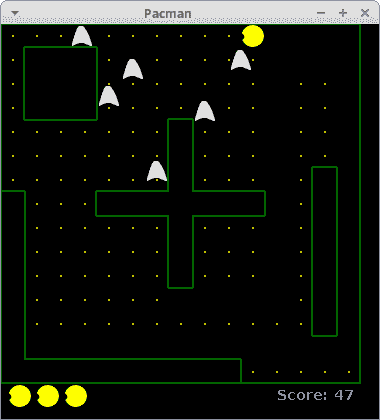

# Java 吃豆人

> 原文： [https://zetcode.com/tutorials/javagamestutorial/pacman/](https://zetcode.com/tutorials/javagamestutorial/pacman/)

在 Java 2D 游戏教程的这一部分中，我们将创建一个简单的 Pacman 游戏克隆。

Pacman 是一款街机游戏，最初由日本公司 Namco 在 1980 年开发。Pacman 成为有史以来最受欢迎的街机游戏之一。

## 发展历程

以下代码示例是 Brian Postma 对 Pacman 游戏的翻版，可从 [http://www.brianpostma.com](http://www.brianpostma.com/java.html) 获得。 修改并简化了代码，以便于理解。

游戏的目标是收集迷宫中的所有点并避开鬼魂。 吃豆人的动画制作有两种方式：在迷宫中的位置和身体。 我们根据方向为他的身体制作四幅图像。 该动画用于创建吃豆人张开和闭合嘴巴的幻觉。 迷宫由 15x15 正方形组成。 迷宫的结构基于简单的整数数组。 吃豆人有三命。 我们还计算分数。

游戏包含两个文件：`Board.java`和`Pacman.java`。

`Board.java`

```
package com.zetcode;

import java.awt.BasicStroke;
import java.awt.Color;
import java.awt.Dimension;
import java.awt.Event;
import java.awt.Font;
import java.awt.FontMetrics;
import java.awt.Graphics;
import java.awt.Graphics2D;
import java.awt.Image;
import java.awt.Toolkit;
import java.awt.event.ActionEvent;
import java.awt.event.ActionListener;
import java.awt.event.KeyAdapter;
import java.awt.event.KeyEvent;

import javax.swing.ImageIcon;
import javax.swing.JPanel;
import javax.swing.Timer;

public class Board extends JPanel implements ActionListener {

    private Dimension d;
    private final Font smallFont = new Font("Helvetica", Font.BOLD, 14);

    private Image ii;
    private final Color dotColor = new Color(192, 192, 0);
    private Color mazeColor;

    private boolean inGame = false;
    private boolean dying = false;

    private final int BLOCK_SIZE = 24;
    private final int N_BLOCKS = 15;
    private final int SCREEN_SIZE = N_BLOCKS * BLOCK_SIZE;
    private final int PAC_ANIM_DELAY = 2;
    private final int PACMAN_ANIM_COUNT = 4;
    private final int MAX_GHOSTS = 12;
    private final int PACMAN_SPEED = 6;

    private int pacAnimCount = PAC_ANIM_DELAY;
    private int pacAnimDir = 1;
    private int pacmanAnimPos = 0;
    private int N_GHOSTS = 6;
    private int pacsLeft, score;
    private int[] dx, dy;
    private int[] ghost_x, ghost_y, ghost_dx, ghost_dy, ghostSpeed;

    private Image ghost;
    private Image pacman1, pacman2up, pacman2left, pacman2right, pacman2down;
    private Image pacman3up, pacman3down, pacman3left, pacman3right;
    private Image pacman4up, pacman4down, pacman4left, pacman4right;

    private int pacman_x, pacman_y, pacmand_x, pacmand_y;
    private int req_dx, req_dy, view_dx, view_dy;

    private final short levelData[] = {
        19, 26, 26, 26, 18, 18, 18, 18, 18, 18, 18, 18, 18, 18, 22,
        21, 0, 0, 0, 17, 16, 16, 16, 16, 16, 16, 16, 16, 16, 20,
        21, 0, 0, 0, 17, 16, 16, 16, 16, 16, 16, 16, 16, 16, 20,
        21, 0, 0, 0, 17, 16, 16, 24, 16, 16, 16, 16, 16, 16, 20,
        17, 18, 18, 18, 16, 16, 20, 0, 17, 16, 16, 16, 16, 16, 20,
        17, 16, 16, 16, 16, 16, 20, 0, 17, 16, 16, 16, 16, 24, 20,
        25, 16, 16, 16, 24, 24, 28, 0, 25, 24, 24, 16, 20, 0, 21,
        1, 17, 16, 20, 0, 0, 0, 0, 0, 0, 0, 17, 20, 0, 21,
        1, 17, 16, 16, 18, 18, 22, 0, 19, 18, 18, 16, 20, 0, 21,
        1, 17, 16, 16, 16, 16, 20, 0, 17, 16, 16, 16, 20, 0, 21,
        1, 17, 16, 16, 16, 16, 20, 0, 17, 16, 16, 16, 20, 0, 21,
        1, 17, 16, 16, 16, 16, 16, 18, 16, 16, 16, 16, 20, 0, 21,
        1, 17, 16, 16, 16, 16, 16, 16, 16, 16, 16, 16, 20, 0, 21,
        1, 25, 24, 24, 24, 24, 24, 24, 24, 24, 16, 16, 16, 18, 20,
        9, 8, 8, 8, 8, 8, 8, 8, 8, 8, 25, 24, 24, 24, 28
    };

    private final int validSpeeds[] = {1, 2, 3, 4, 6, 8};
    private final int maxSpeed = 6;

    private int currentSpeed = 3;
    private short[] screenData;
    private Timer timer;

    public Board() {

        loadImages();
        initVariables();
        initBoard();
    }

    private void initBoard() {

        addKeyListener(new TAdapter());

        setFocusable(true);

        setBackground(Color.black);
    }

    private void initVariables() {

        screenData = new short[N_BLOCKS * N_BLOCKS];
        mazeColor = new Color(5, 100, 5);
        d = new Dimension(400, 400);
        ghost_x = new int[MAX_GHOSTS];
        ghost_dx = new int[MAX_GHOSTS];
        ghost_y = new int[MAX_GHOSTS];
        ghost_dy = new int[MAX_GHOSTS];
        ghostSpeed = new int[MAX_GHOSTS];
        dx = new int[4];
        dy = new int[4];

        timer = new Timer(40, this);
        timer.start();
    }

    @Override
    public void addNotify() {
        super.addNotify();

        initGame();
    }

    private void doAnim() {

        pacAnimCount--;

        if (pacAnimCount <= 0) {
            pacAnimCount = PAC_ANIM_DELAY;
            pacmanAnimPos = pacmanAnimPos + pacAnimDir;

            if (pacmanAnimPos == (PACMAN_ANIM_COUNT - 1) || pacmanAnimPos == 0) {
                pacAnimDir = -pacAnimDir;
            }
        }
    }

    private void playGame(Graphics2D g2d) {

        if (dying) {

            death();

        } else {

            movePacman();
            drawPacman(g2d);
            moveGhosts(g2d);
            checkMaze();
        }
    }

    private void showIntroScreen(Graphics2D g2d) {

        g2d.setColor(new Color(0, 32, 48));
        g2d.fillRect(50, SCREEN_SIZE / 2 - 30, SCREEN_SIZE - 100, 50);
        g2d.setColor(Color.white);
        g2d.drawRect(50, SCREEN_SIZE / 2 - 30, SCREEN_SIZE - 100, 50);

        String s = "Press s to start.";
        Font small = new Font("Helvetica", Font.BOLD, 14);
        FontMetrics metr = this.getFontMetrics(small);

        g2d.setColor(Color.white);
        g2d.setFont(small);
        g2d.drawString(s, (SCREEN_SIZE - metr.stringWidth(s)) / 2, SCREEN_SIZE / 2);
    }

    private void drawScore(Graphics2D g) {

        int i;
        String s;

        g.setFont(smallFont);
        g.setColor(new Color(96, 128, 255));
        s = "Score: " + score;
        g.drawString(s, SCREEN_SIZE / 2 + 96, SCREEN_SIZE + 16);

        for (i = 0; i < pacsLeft; i++) {
            g.drawImage(pacman3left, i * 28 + 8, SCREEN_SIZE + 1, this);
        }
    }

    private void checkMaze() {

        short i = 0;
        boolean finished = true;

        while (i < N_BLOCKS * N_BLOCKS && finished) {

            if ((screenData[i] & 48) != 0) {
                finished = false;
            }

            i++;
        }

        if (finished) {

            score += 50;

            if (N_GHOSTS < MAX_GHOSTS) {
                N_GHOSTS++;
            }

            if (currentSpeed < maxSpeed) {
                currentSpeed++;
            }

            initLevel();
        }
    }

    private void death() {

        pacsLeft--;

        if (pacsLeft == 0) {
            inGame = false;
        }

        continueLevel();
    }

    private void moveGhosts(Graphics2D g2d) {

        short i;
        int pos;
        int count;

        for (i = 0; i < N_GHOSTS; i++) {
            if (ghost_x[i] % BLOCK_SIZE == 0 && ghost_y[i] % BLOCK_SIZE == 0) {
                pos = ghost_x[i] / BLOCK_SIZE + N_BLOCKS * (int) (ghost_y[i] / BLOCK_SIZE);

                count = 0;

                if ((screenData[pos] & 1) == 0 && ghost_dx[i] != 1) {
                    dx[count] = -1;
                    dy[count] = 0;
                    count++;
                }

                if ((screenData[pos] & 2) == 0 && ghost_dy[i] != 1) {
                    dx[count] = 0;
                    dy[count] = -1;
                    count++;
                }

                if ((screenData[pos] & 4) == 0 && ghost_dx[i] != -1) {
                    dx[count] = 1;
                    dy[count] = 0;
                    count++;
                }

                if ((screenData[pos] & 8) == 0 && ghost_dy[i] != -1) {
                    dx[count] = 0;
                    dy[count] = 1;
                    count++;
                }

                if (count == 0) {

                    if ((screenData[pos] & 15) == 15) {
                        ghost_dx[i] = 0;
                        ghost_dy[i] = 0;
                    } else {
                        ghost_dx[i] = -ghost_dx[i];
                        ghost_dy[i] = -ghost_dy[i];
                    }

                } else {

                    count = (int) (Math.random() * count);

                    if (count > 3) {
                        count = 3;
                    }

                    ghost_dx[i] = dx[count];
                    ghost_dy[i] = dy[count];
                }

            }

            ghost_x[i] = ghost_x[i] + (ghost_dx[i] * ghostSpeed[i]);
            ghost_y[i] = ghost_y[i] + (ghost_dy[i] * ghostSpeed[i]);
            drawGhost(g2d, ghost_x[i] + 1, ghost_y[i] + 1);

            if (pacman_x > (ghost_x[i] - 12) && pacman_x < (ghost_x[i] + 12)
                    && pacman_y > (ghost_y[i] - 12) && pacman_y < (ghost_y[i] + 12)
                    && inGame) {

                dying = true;
            }
        }
    }

    private void drawGhost(Graphics2D g2d, int x, int y) {

        g2d.drawImage(ghost, x, y, this);
    }

    private void movePacman() {

        int pos;
        short ch;

        if (req_dx == -pacmand_x && req_dy == -pacmand_y) {
            pacmand_x = req_dx;
            pacmand_y = req_dy;
            view_dx = pacmand_x;
            view_dy = pacmand_y;
        }

        if (pacman_x % BLOCK_SIZE == 0 && pacman_y % BLOCK_SIZE == 0) {
            pos = pacman_x / BLOCK_SIZE + N_BLOCKS * (int) (pacman_y / BLOCK_SIZE);
            ch = screenData[pos];

            if ((ch & 16) != 0) {
                screenData[pos] = (short) (ch & 15);
                score++;
            }

            if (req_dx != 0 || req_dy != 0) {
                if (!((req_dx == -1 && req_dy == 0 && (ch & 1) != 0)
                        || (req_dx == 1 && req_dy == 0 && (ch & 4) != 0)
                        || (req_dx == 0 && req_dy == -1 && (ch & 2) != 0)
                        || (req_dx == 0 && req_dy == 1 && (ch & 8) != 0))) {
                    pacmand_x = req_dx;
                    pacmand_y = req_dy;
                    view_dx = pacmand_x;
                    view_dy = pacmand_y;
                }
            }

            // Check for standstill
            if ((pacmand_x == -1 && pacmand_y == 0 && (ch & 1) != 0)
                    || (pacmand_x == 1 && pacmand_y == 0 && (ch & 4) != 0)
                    || (pacmand_x == 0 && pacmand_y == -1 && (ch & 2) != 0)
                    || (pacmand_x == 0 && pacmand_y == 1 && (ch & 8) != 0)) {
                pacmand_x = 0;
                pacmand_y = 0;
            }
        }
        pacman_x = pacman_x + PACMAN_SPEED * pacmand_x;
        pacman_y = pacman_y + PACMAN_SPEED * pacmand_y;
    }

    private void drawPacman(Graphics2D g2d) {

        if (view_dx == -1) {
            drawPacnanLeft(g2d);
        } else if (view_dx == 1) {
            drawPacmanRight(g2d);
        } else if (view_dy == -1) {
            drawPacmanUp(g2d);
        } else {
            drawPacmanDown(g2d);
        }
    }

    private void drawPacmanUp(Graphics2D g2d) {

        switch (pacmanAnimPos) {
            case 1:
                g2d.drawImage(pacman2up, pacman_x + 1, pacman_y + 1, this);
                break;
            case 2:
                g2d.drawImage(pacman3up, pacman_x + 1, pacman_y + 1, this);
                break;
            case 3:
                g2d.drawImage(pacman4up, pacman_x + 1, pacman_y + 1, this);
                break;
            default:
                g2d.drawImage(pacman1, pacman_x + 1, pacman_y + 1, this);
                break;
        }
    }

    private void drawPacmanDown(Graphics2D g2d) {

        switch (pacmanAnimPos) {
            case 1:
                g2d.drawImage(pacman2down, pacman_x + 1, pacman_y + 1, this);
                break;
            case 2:
                g2d.drawImage(pacman3down, pacman_x + 1, pacman_y + 1, this);
                break;
            case 3:
                g2d.drawImage(pacman4down, pacman_x + 1, pacman_y + 1, this);
                break;
            default:
                g2d.drawImage(pacman1, pacman_x + 1, pacman_y + 1, this);
                break;
        }
    }

    private void drawPacnanLeft(Graphics2D g2d) {

        switch (pacmanAnimPos) {
            case 1:
                g2d.drawImage(pacman2left, pacman_x + 1, pacman_y + 1, this);
                break;
            case 2:
                g2d.drawImage(pacman3left, pacman_x + 1, pacman_y + 1, this);
                break;
            case 3:
                g2d.drawImage(pacman4left, pacman_x + 1, pacman_y + 1, this);
                break;
            default:
                g2d.drawImage(pacman1, pacman_x + 1, pacman_y + 1, this);
                break;
        }
    }

    private void drawPacmanRight(Graphics2D g2d) {

        switch (pacmanAnimPos) {
            case 1:
                g2d.drawImage(pacman2right, pacman_x + 1, pacman_y + 1, this);
                break;
            case 2:
                g2d.drawImage(pacman3right, pacman_x + 1, pacman_y + 1, this);
                break;
            case 3:
                g2d.drawImage(pacman4right, pacman_x + 1, pacman_y + 1, this);
                break;
            default:
                g2d.drawImage(pacman1, pacman_x + 1, pacman_y + 1, this);
                break;
        }
    }

    private void drawMaze(Graphics2D g2d) {

        short i = 0;
        int x, y;

        for (y = 0; y < SCREEN_SIZE; y += BLOCK_SIZE) {
            for (x = 0; x < SCREEN_SIZE; x += BLOCK_SIZE) {

                g2d.setColor(mazeColor);
                g2d.setStroke(new BasicStroke(2));

                if ((screenData[i] & 1) != 0) { 
                    g2d.drawLine(x, y, x, y + BLOCK_SIZE - 1);
                }

                if ((screenData[i] & 2) != 0) { 
                    g2d.drawLine(x, y, x + BLOCK_SIZE - 1, y);
                }

                if ((screenData[i] & 4) != 0) { 
                    g2d.drawLine(x + BLOCK_SIZE - 1, y, x + BLOCK_SIZE - 1,
                            y + BLOCK_SIZE - 1);
                }

                if ((screenData[i] & 8) != 0) { 
                    g2d.drawLine(x, y + BLOCK_SIZE - 1, x + BLOCK_SIZE - 1,
                            y + BLOCK_SIZE - 1);
                }

                if ((screenData[i] & 16) != 0) { 
                    g2d.setColor(dotColor);
                    g2d.fillRect(x + 11, y + 11, 2, 2);
                }

                i++;
            }
        }
    }

    private void initGame() {

        pacsLeft = 3;
        score = 0;
        initLevel();
        N_GHOSTS = 6;
        currentSpeed = 3;
    }

    private void initLevel() {

        int i;
        for (i = 0; i < N_BLOCKS * N_BLOCKS; i++) {
            screenData[i] = levelData[i];
        }

        continueLevel();
    }

    private void continueLevel() {

        short i;
        int dx = 1;
        int random;

        for (i = 0; i < N_GHOSTS; i++) {

            ghost_y[i] = 4 * BLOCK_SIZE;
            ghost_x[i] = 4 * BLOCK_SIZE;
            ghost_dy[i] = 0;
            ghost_dx[i] = dx;
            dx = -dx;
            random = (int) (Math.random() * (currentSpeed + 1));

            if (random > currentSpeed) {
                random = currentSpeed;
            }

            ghostSpeed[i] = validSpeeds[random];
        }

        pacman_x = 7 * BLOCK_SIZE;
        pacman_y = 11 * BLOCK_SIZE;
        pacmand_x = 0;
        pacmand_y = 0;
        req_dx = 0;
        req_dy = 0;
        view_dx = -1;
        view_dy = 0;
        dying = false;
    }

    private void loadImages() {

        ghost = new ImageIcon("images/ghost.png").getImage();
        pacman1 = new ImageIcon("images/pacman.png").getImage();
        pacman2up = new ImageIcon("images/up1.png").getImage();
        pacman3up = new ImageIcon("images/up2.png").getImage();
        pacman4up = new ImageIcon("images/up3.png").getImage();
        pacman2down = new ImageIcon("images/down1.png").getImage();
        pacman3down = new ImageIcon("images/down2.png").getImage();
        pacman4down = new ImageIcon("images/down3.png").getImage();
        pacman2left = new ImageIcon("images/left1.png").getImage();
        pacman3left = new ImageIcon("images/left2.png").getImage();
        pacman4left = new ImageIcon("images/left3.png").getImage();
        pacman2right = new ImageIcon("images/right1.png").getImage();
        pacman3right = new ImageIcon("images/right2.png").getImage();
        pacman4right = new ImageIcon("images/right3.png").getImage();

    }

    @Override
    public void paintComponent(Graphics g) {
        super.paintComponent(g);

        doDrawing(g);
    }

    private void doDrawing(Graphics g) {

        Graphics2D g2d = (Graphics2D) g;

        g2d.setColor(Color.black);
        g2d.fillRect(0, 0, d.width, d.height);

        drawMaze(g2d);
        drawScore(g2d);
        doAnim();

        if (inGame) {
            playGame(g2d);
        } else {
            showIntroScreen(g2d);
        }

        g2d.drawImage(ii, 5, 5, this);
        Toolkit.getDefaultToolkit().sync();
        g2d.dispose();
    }

    class TAdapter extends KeyAdapter {

        @Override
        public void keyPressed(KeyEvent e) {

            int key = e.getKeyCode();

            if (inGame) {
                if (key == KeyEvent.VK_LEFT) {
                    req_dx = -1;
                    req_dy = 0;
                } else if (key == KeyEvent.VK_RIGHT) {
                    req_dx = 1;
                    req_dy = 0;
                } else if (key == KeyEvent.VK_UP) {
                    req_dx = 0;
                    req_dy = -1;
                } else if (key == KeyEvent.VK_DOWN) {
                    req_dx = 0;
                    req_dy = 1;
                } else if (key == KeyEvent.VK_ESCAPE && timer.isRunning()) {
                    inGame = false;
                } else if (key == KeyEvent.VK_PAUSE) {
                    if (timer.isRunning()) {
                        timer.stop();
                    } else {
                        timer.start();
                    }
                }
            } else {
                if (key == 's' || key == 'S') {
                    inGame = true;
                    initGame();
                }
            }
        }

        @Override
        public void keyReleased(KeyEvent e) {

            int key = e.getKeyCode();

            if (key == Event.LEFT || key == Event.RIGHT
                    || key == Event.UP || key == Event.DOWN) {
                req_dx = 0;
                req_dy = 0;
            }
        }
    }

    @Override
    public void actionPerformed(ActionEvent e) {

        repaint();
    }
}

```

用光标键控制吃豆人。 `Esc` 键完成游戏，`暂停`键暂停游戏。

```
private int pacman_x, pacman_y, pacmand_x, pacmand_y;

```

前两个变量存储吃豆子精灵的 x 和 y 坐标。 最后两个变量是水平和垂直方向的增量变化。

```
private final short levelData[] = {
    19, 26, 26, 26, 18, 18, 18, 18, ...
};

```

这些数字组成了迷宫。 它们提供了信息，我们可以据此创建角点。 1 号是左上角。 数字 2、4 和 8 分别代表顶角，右角和底角。 16 号是重点。 可以添加这些数字，例如左上角的数字 19 表示正方形将具有顶部和左侧边框以及一个点（16 + 2 +1）。

```
private void doAnim() {

    pacAnimCount--;

    if (pacAnimCount <= 0) {
        pacAnimCount = PAC_ANIM_DELAY;
        pacmanAnimPos = pacmanAnimPos + pacAnimDir;

        if (pacmanAnimPos == (PACMAN_ANIM_COUNT - 1) || pacmanAnimPos == 0) {
            pacAnimDir = -pacAnimDir;
        }
    }
}

```

`doAnim()`对`pacmanAnimPos`变量进行计数，该变量确定绘制哪种吃豆子图像。 有四个吃豆人图像。 还有一个`PAC_ANIM_DELAY`常数，它会使动画变慢。 否则，吃豆人会太快张开嘴。

```
boolean finished = true;

while (i < N_BLOCKS * N_BLOCKS && finished) {

    if ((screenData[i] & 48) != 0) {
        finished = false;
    }

    i++;
}

```

此代码是`checkMaze()`方法的一部分。 它检查吃豆人是否还有剩余的食物要吃。 数字 16 代表一个点。 如果所有积分都被消耗掉了，我们将进入下一个层次。 （在我们的例子中，我们只是重新启动游戏。）

接下来，我们将研究`moveGhosts()`方法。 鬼魂移动一个正方形，然后决定是否改变方向。

```
if (ghost_x[i] % BLOCK_SIZE == 0 && ghost_y[i] % BLOCK_SIZE == 0) {

```

我们仅在完成移动一个正方形后才继续。

```
pos = pacman_x / BLOCK_SIZE + N_BLOCKS * (int) (pacman_y / BLOCK_SIZE);

```

这条线确定了幻影的位置； 在哪个位置/正方形。 有 225 个理论职位。 （鬼不能在墙上移动。）

```
if ((screenData[pos] & 1) == 0 && ghost_dx[i] != 1) {
    dx[count] = -1;
    dy[count] = 0;
    count++;
}

```

如果左侧没有障碍物并且幻影尚未向右移动，则幻影将向左移动。 该代码的真正含义是什么？ 如果幽灵进入隧道，他将朝着同一方向继续前进，直到他离开隧道。 鬼影的移动部分是随机的。 我们不会在长隧道中应用这种随机性，因为幽灵可能会卡在那里。

```
if (pacman_x > (ghost_x[i] - 12) && pacman_x < (ghost_x[i] + 12)
        && pacman_y > (ghost_y[i] - 12) && pacman_y < (ghost_y[i] + 12)
        && inGame) {

    dying = true;
}

```

如果幽灵和吃豆人之间发生碰撞，吃豆人会死。

接下来，我们将研究`movePacman()`方法。 `req_dx`和`req_dy`变量在`TAdapter`内部类中确定。 这些变量由光标键控制。

```
if ((ch & 16) != 0) {
    screenData[pos] = (short) (ch & 15);
    score++;
}

```

如果吃豆人移动到带点的位置，我们将其从迷宫中移出并增加得分值。

```
if ((pacmand_x == -1 && pacmand_y == 0 && (ch & 1) != 0)
        || (pacmand_x == 1 && pacmand_y == 0 && (ch & 4) != 0)
        || (pacmand_x == 0 && pacmand_y == -1 && (ch & 2) != 0)
        || (pacmand_x == 0 && pacmand_y == 1 && (ch & 8) != 0)) {
    pacmand_x = 0;
    pacmand_y = 0;
}

```

如果吃豆子无法按当前方向继续前进，则会停下来。

```
private void drawPacman(Graphics2D g2d) {

    if (view_dx == -1) {
        drawPacnanLeft(g2d);
    } else if (view_dx == 1) {
        drawPacmanRight(g2d);
    } else if (view_dy == -1) {
        drawPacmanUp(g2d);
    } else {
        drawPacmanDown(g2d);
    }
}

```

吃豆人有四个可能的方向。 所有方向都有四个图像。 这些图像用于为吃豆人张嘴和闭嘴动画。

`drawMaze()`方法从`screenData`数组中的数字中提取迷宫。 数字 1 是左侧边框，2 是顶部边框，4 是右侧边框，8 是底部边框，16 是点。 我们只需在迷宫中浏览所有 225 平方。 例如，在`screenData`数组中有 9 个。 我们设置了第一位（1）和第四位（8）。 因此，我们在此特定正方形上绘制了底部和左侧边框。

```
if ((screenData[i] & 1) != 0) { 
    g2d.drawLine(x, y, x, y + BLOCK_SIZE - 1);
}

```

如果设置了数字的第一位，我们将绘制左边框。

`Pacman.java`

```
package com.zetcode;

import java.awt.EventQueue;
import javax.swing.JFrame;

public class Pacman extends JFrame {

    public Pacman() {

        initUI();
    }

    private void initUI() {

        add(new Board());

        setTitle("Pacman");
        setDefaultCloseOperation(EXIT_ON_CLOSE);
        setSize(380, 420);
        setLocationRelativeTo(null);
    }

    public static void main(String[] args) {

        EventQueue.invokeLater(() -> {
            Pacman ex = new Pacman();
            ex.setVisible(true);
        });
    }
}

```

这是带有主要方法的 Pacman 文件。



Figure: Pacman

这是吃豆子游戏。