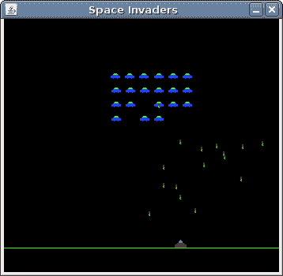

# Java 太空侵略者

> 原文： [https://zetcode.com/tutorials/javagamestutorial/spaceinvaders/](https://zetcode.com/tutorials/javagamestutorial/spaceinvaders/)

在 Java 2D 游戏教程的这一部分中，我们将使用 Java 创建一个简单的太空侵略者游戏克隆。 源代码和图像可在作者的 Github [Java-Space-Invaders](https://github.com/janbodnar/Java-Space-Invaders) 存储库中找到。

太空侵略者是由 Nishikado Tomohiro Nishikado 设计的街机游戏。 它于 1978 年首次发布。

在“太空侵略者”游戏中，玩家控制一门大炮。 他即将拯救地球免遭邪恶太空入侵者的入侵。

## 用 Java 开发太空侵略者

在我们的 Java 克隆中，我们有 24 个入侵者。 这些外星人重重炮击地面。 当玩家射击导弹时，只有当导弹击中外星人或棋盘顶部时，他才能射击另一枚导弹。 玩家使用空格键射击。 外星人随机发射炸弹。 每个外星人只有在前一个击中底部后才会发射炸弹。

`com/zetcode/SpaceInvaders.java`

```
package com.zetcode;

import java.awt.EventQueue;
import javax.swing.JFrame;

public class SpaceInvaders extends JFrame  {

    public SpaceInvaders() {

        initUI();
    }

    private void initUI() {

        add(new Board());

        setTitle("Space Invaders");
        setSize(Commons.BOARD_WIDTH, Commons.BOARD_HEIGHT);

        setDefaultCloseOperation(EXIT_ON_CLOSE);
        setResizable(false);
        setLocationRelativeTo(null);
    }

    public static void main(String[] args) {

        EventQueue.invokeLater(() -> {

            var ex = new SpaceInvaders();
            ex.setVisible(true);
        });
    }
}

```

这是主要的类。 它设置了应用。

`com/zetcode/Commons.java`

```
package com.zetcode;

public interface Commons {

    int BOARD_WIDTH = 358;
    int BOARD_HEIGHT = 350;
    int BORDER_RIGHT = 30;
    int BORDER_LEFT = 5;

    int GROUND = 290;
    int BOMB_HEIGHT = 5;

    int ALIEN_HEIGHT = 12;
    int ALIEN_WIDTH = 12;
    int ALIEN_INIT_X = 150;
    int ALIEN_INIT_Y = 5;

    int GO_DOWN = 15;
    int NUMBER_OF_ALIENS_TO_DESTROY = 24;
    int CHANCE = 5;
    int DELAY = 17;
    int PLAYER_WIDTH = 15;
    int PLAYER_HEIGHT = 10;
}

```

`Commons.java`文件具有一些公共常数。 他们是不言自明的。

`com/zetcode/sprite/Alien.java`

```
package com.zetcode.sprite;

import javax.swing.ImageIcon;

public class Alien extends Sprite {

    private Bomb bomb;

    public Alien(int x, int y) {

        initAlien(x, y);
    }

    private void initAlien(int x, int y) {

        this.x = x;
        this.y = y;

        bomb = new Bomb(x, y);

        var alienImg = "simg/alien.png";
        var ii = new ImageIcon(alienImg);

        setImage(ii.getImage());
    }

    public void act(int direction) {

        this.x += direction;
    }

    public Bomb getBomb() {

        return bomb;
    }

    public class Bomb extends Sprite {

        private boolean destroyed;

        public Bomb(int x, int y) {

            initBomb(x, y);
        }

        private void initBomb(int x, int y) {

            setDestroyed(true);

            this.x = x;
            this.y = y;

            var bombImg = "simg/bomb.png";
            var ii = new ImageIcon(bombImg);
            setImage(ii.getImage());
        }

        public void setDestroyed(boolean destroyed) {

            this.destroyed = destroyed;
        }

        public boolean isDestroyed() {

            return destroyed;
        }
    }
}

```

这是`Alien`子画面。 每个外星人都有一个内部的`Bomb`类。

```
public void act(int direction) {

    this.x += direction;
}

```

从`Board`类中调用`act()`方法。 用于在水平方向上定位外星人。

```
public Bomb getBomb() {

    return bomb;
}

```

当外星人将要投下炸弹时，将调用`getBomb()`方法。

`com/zetcode/sprite/Player.java`

```
package com.zetcode.sprite;

import com.zetcode.Commons;

import javax.swing.ImageIcon;
import java.awt.event.KeyEvent;

public class Player extends Sprite {

    private int width;

    public Player() {

        initPlayer();
    }

    private void initPlayer() {

        var playerImg = "simg/player.png";
        var ii = new ImageIcon(playerImg);

        width = ii.getImage().getWidth(null);
        setImage(ii.getImage());

        int START_X = 270;
        setX(START_X);

        int START_Y = 280;
        setY(START_Y);
    }

    public void act() {

        x += dx;

        if (x <= 2) {

            x = 2;
        }

        if (x >= Commons.BOARD_WIDTH - 2 * width) {

            x = Commons.BOARD_WIDTH - 2 * width;
        }
    }

    public void keyPressed(KeyEvent e) {

        int key = e.getKeyCode();

        if (key == KeyEvent.VK_LEFT) {

            dx = -2;
        }

        if (key == KeyEvent.VK_RIGHT) {

            dx = 2;
        }
    }

    public void keyReleased(KeyEvent e) {

        int key = e.getKeyCode();

        if (key == KeyEvent.VK_LEFT) {

            dx = 0;
        }

        if (key == KeyEvent.VK_RIGHT) {

            dx = 0;
        }
    }
}

```

这是`Player`子画面。 我们用光标键控制大炮。

```
int START_X = 270;
setX(START_X);

int START_Y = 280;
setY(START_Y);

```

这些是播放器精灵的初始坐标。

```
public void keyPressed(KeyEvent e) {

    int key = e.getKeyCode();

    if (key == KeyEvent.VK_LEFT) {

        dx = -2;
    }
...

```

如果按左光标键，则`dx`变量将设置为 -2。 下次调用`act()`方法时，播放器向左移动。

```
public void keyReleased(KeyEvent e) {

    int key = e.getKeyCode();

    if (key == KeyEvent.VK_LEFT) {

        dx = 0;
    }

    if (key == KeyEvent.VK_RIGHT) {

        dx = 0;
    }
}

```

如果释放左或右光标，则`dx`变量将设置为零。 播放器精灵停止移动。

`com/zetcode/sprite/Shot.java`

```
package com.zetcode.sprite;

import javax.swing.ImageIcon;

public class Shot extends Sprite {

    public Shot() {
    }

    public Shot(int x, int y) {

        initShot(x, y);
    }

    private void initShot(int x, int y) {

        var shotImg = "simg/shot.png";
        var ii = new ImageIcon(shotImg);
        setImage(ii.getImage());

        int H_SPACE = 6;
        setX(x + H_SPACE);

        int V_SPACE = 1;
        setY(y - V_SPACE);
    }
}

```

这是`Shot`子画面。 用 `Space` 键触发射击。 `H_SPACE`和`V_SPACE`常数用于适当地定位导弹。

`com/zetcode/sprite/Sprite.java`

```
package com.zetcode.sprite;

import java.awt.Image;

public class Sprite {

    private boolean visible;
    private Image image;
    private boolean dying;

    int x;
    int y;
    int dx;

    public Sprite() {

        visible = true;
    }

    public void die() {

        visible = false;
    }

    public boolean isVisible() {

        return visible;
    }

    protected void setVisible(boolean visible) {

        this.visible = visible;
    }

    public void setImage(Image image) {

        this.image = image;
    }

    public Image getImage() {

        return image;
    }

    public void setX(int x) {

        this.x = x;
    }

    public void setY(int y) {

        this.y = y;
    }

    public int getY() {

        return y;
    }

    public int getX() {

        return x;
    }

    public void setDying(boolean dying) {

        this.dying = dying;
    }

    public boolean isDying() {

        return this.dying;
    }
}

```

这是基本的`Sprite`类。 其他精灵也继承自它。 它具有一些常用功能。

`com/zetcode/Board.java`

```
package com.zetcode;

import com.zetcode.sprite.Alien;
import com.zetcode.sprite.Player;
import com.zetcode.sprite.Shot;

import javax.swing.ImageIcon;
import javax.swing.JPanel;
import javax.swing.Timer;
import java.awt.Color;
import java.awt.Dimension;
import java.awt.Font;
import java.awt.Graphics;
import java.awt.Toolkit;
import java.awt.event.ActionEvent;
import java.awt.event.ActionListener;
import java.awt.event.KeyAdapter;
import java.awt.event.KeyEvent;
import java.util.ArrayList;
import java.util.Iterator;
import java.util.List;
import java.util.Random;

public class Board extends JPanel {

    private Dimension d;
    private List<Alien> aliens;
    private Player player;
    private Shot shot;

    private int direction = -1;
    private int deaths = 0;

    private boolean inGame = true;
    private String explImg = "simg/explosion.png";
    private String message = "Game Over";

    private Timer timer;

    public Board() {

        initBoard();
        gameInit();
    }

    private void initBoard() {

        addKeyListener(new TAdapter());
        setFocusable(true);
        d = new Dimension(Commons.BOARD_WIDTH, Commons.BOARD_HEIGHT);
        setBackground(Color.black);

        timer = new Timer(Commons.DELAY, new GameCycle());
        timer.start();

        gameInit();
    }

    private void gameInit() {

        aliens = new ArrayList<>();

        for (int i = 0; i < 4; i++) {
            for (int j = 0; j < 6; j++) {

                var alien = new Alien(Commons.ALIEN_INIT_X + 18 * j,
                        Commons.ALIEN_INIT_Y + 18 * i);
                aliens.add(alien);
            }
        }

        player = new Player();
        shot = new Shot();
    }

    private void drawAliens(Graphics g) {

        for (Alien alien : aliens) {

            if (alien.isVisible()) {

                g.drawImage(alien.getImage(), alien.getX(), alien.getY(), this);
            }

            if (alien.isDying()) {

                alien.die();
            }
        }
    }

    private void drawPlayer(Graphics g) {

        if (player.isVisible()) {

            g.drawImage(player.getImage(), player.getX(), player.getY(), this);
        }

        if (player.isDying()) {

            player.die();
            inGame = false;
        }
    }

    private void drawShot(Graphics g) {

        if (shot.isVisible()) {

            g.drawImage(shot.getImage(), shot.getX(), shot.getY(), this);
        }
    }

    private void drawBombing(Graphics g) {

        for (Alien a : aliens) {

            Alien.Bomb b = a.getBomb();

            if (!b.isDestroyed()) {

                g.drawImage(b.getImage(), b.getX(), b.getY(), this);
            }
        }
    }

    @Override
    public void paintComponent(Graphics g) {
        super.paintComponent(g);

        doDrawing(g);
    }

    private void doDrawing(Graphics g) {

        g.setColor(Color.black);
        g.fillRect(0, 0, d.width, d.height);
        g.setColor(Color.green);

        if (inGame) {

            g.drawLine(0, Commons.GROUND,
                    Commons.BOARD_WIDTH, Commons.GROUND);

            drawAliens(g);
            drawPlayer(g);
            drawShot(g);
            drawBombing(g);

        } else {

            if (timer.isRunning()) {
                timer.stop();
            }

            gameOver(g);
        }

        Toolkit.getDefaultToolkit().sync();
    }

    private void gameOver(Graphics g) {

        g.setColor(Color.black);
        g.fillRect(0, 0, Commons.BOARD_WIDTH, Commons.BOARD_HEIGHT);

        g.setColor(new Color(0, 32, 48));
        g.fillRect(50, Commons.BOARD_WIDTH / 2 - 30, Commons.BOARD_WIDTH - 100, 50);
        g.setColor(Color.white);
        g.drawRect(50, Commons.BOARD_WIDTH / 2 - 30, Commons.BOARD_WIDTH - 100, 50);

        var small = new Font("Helvetica", Font.BOLD, 14);
        var fontMetrics = this.getFontMetrics(small);

        g.setColor(Color.white);
        g.setFont(small);
        g.drawString(message, (Commons.BOARD_WIDTH - fontMetrics.stringWidth(message)) / 2,
                Commons.BOARD_WIDTH / 2);
    }

    private void update() {

        if (deaths == Commons.NUMBER_OF_ALIENS_TO_DESTROY) {

            inGame = false;
            timer.stop();
            message = "Game won!";
        }

        // player
        player.act();

        // shot
        if (shot.isVisible()) {

            int shotX = shot.getX();
            int shotY = shot.getY();

            for (Alien alien : aliens) {

                int alienX = alien.getX();
                int alienY = alien.getY();

                if (alien.isVisible() && shot.isVisible()) {
                    if (shotX >= (alienX)
                            && shotX <= (alienX + Commons.ALIEN_WIDTH)
                            && shotY >= (alienY)
                            && shotY <= (alienY + Commons.ALIEN_HEIGHT)) {

                        var ii = new ImageIcon(explImg);
                        alien.setImage(ii.getImage());
                        alien.setDying(true);
                        deaths++;
                        shot.die();
                    }
                }
            }

            int y = shot.getY();
            y -= 4;

            if (y < 0) {
                shot.die();
            } else {
                shot.setY(y);
            }
        }

        // aliens

        for (Alien alien : aliens) {

            int x = alien.getX();

            if (x >= Commons.BOARD_WIDTH - Commons.BORDER_RIGHT && direction != -1) {

                direction = -1;

                Iterator<Alien> i1 = aliens.iterator();

                while (i1.hasNext()) {

                    Alien a2 = i1.next();
                    a2.setY(a2.getY() + Commons.GO_DOWN);
                }
            }

            if (x <= Commons.BORDER_LEFT && direction != 1) {

                direction = 1;

                Iterator<Alien> i2 = aliens.iterator();

                while (i2.hasNext()) {

                    Alien a = i2.next();
                    a.setY(a.getY() + Commons.GO_DOWN);
                }
            }
        }

        Iterator<Alien> it = aliens.iterator();

        while (it.hasNext()) {

            Alien alien = it.next();

            if (alien.isVisible()) {

                int y = alien.getY();

                if (y > Commons.GROUND - Commons.ALIEN_HEIGHT) {
                    inGame = false;
                    message = "Invasion!";
                }

                alien.act(direction);
            }
        }

        // bombs
        var generator = new Random();

        for (Alien alien : aliens) {

            int shot = generator.nextInt(15);
            Alien.Bomb bomb = alien.getBomb();

            if (shot == Commons.CHANCE && alien.isVisible() && bomb.isDestroyed()) {

                bomb.setDestroyed(false);
                bomb.setX(alien.getX());
                bomb.setY(alien.getY());
            }

            int bombX = bomb.getX();
            int bombY = bomb.getY();
            int playerX = player.getX();
            int playerY = player.getY();

            if (player.isVisible() && !bomb.isDestroyed()) {

                if (bombX >= (playerX)
                        && bombX <= (playerX + Commons.PLAYER_WIDTH)
                        && bombY >= (playerY)
                        && bombY <= (playerY + Commons.PLAYER_HEIGHT)) {

                    var ii = new ImageIcon(explImg);
                    player.setImage(ii.getImage());
                    player.setDying(true);
                    bomb.setDestroyed(true);
                }
            }

            if (!bomb.isDestroyed()) {

                bomb.setY(bomb.getY() + 1);

                if (bomb.getY() >= Commons.GROUND - Commons.BOMB_HEIGHT) {

                    bomb.setDestroyed(true);
                }
            }
        }
    }

    private void doGameCycle() {

        update();
        repaint();
    }

    private class GameCycle implements ActionListener {

        @Override
        public void actionPerformed(ActionEvent e) {

            doGameCycle();
        }
    }

    private class TAdapter extends KeyAdapter {

        @Override
        public void keyReleased(KeyEvent e) {

            player.keyReleased(e);
        }

        @Override
        public void keyPressed(KeyEvent e) {

            player.keyPressed(e);

            int x = player.getX();
            int y = player.getY();

            int key = e.getKeyCode();

            if (key == KeyEvent.VK_SPACE) {

                if (inGame) {

                    if (!shot.isVisible()) {

                        shot = new Shot(x, y);
                    }
                }
            }
        }
    }
}

```

游戏的主要逻辑位于`Board`类中。

```
private void gameInit() {

    aliens = new ArrayList<>();

    for (int i = 0; i < 4; i++) {
        for (int j = 0; j < 6; j++) {

            var alien = new Alien(Commons.ALIEN_INIT_X + 18 * j,
                    Commons.ALIEN_INIT_Y + 18 * i);
            aliens.add(alien);
        }
    }

    player = new Player();
    shot = new Shot();
}

```

在`gameInit()`方法中，我们创建了 24 个外星人。 外星人图像尺寸为`12x12px`。 我们在外星人中间放了 6px 的空间。 我们还创建了播放器和射击对象。

```
private void drawBombing(Graphics g) {

    for (Alien a : aliens) {

        Alien.Bomb b = a.getBomb();

        if (!b.isDestroyed()) {

            g.drawImage(b.getImage(), b.getX(), b.getY(), this);
        }
    }
}

```

`drawBombing()`方法绘制由外星人发射的炸弹。

```
if (inGame) {

    g.drawLine(0, Commons.GROUND,
            Commons.BOARD_WIDTH, Commons.GROUND);

    drawAliens(g);
    drawPlayer(g);
    drawShot(g);
    drawBombing(g);

} ...

```

在`doDrawing()`方法中，我们绘制地面，外星人，玩家，射击和炸弹。

```
private void update() {

    if (deaths == Commons.NUMBER_OF_ALIENS_TO_DESTROY) {

        inGame = false;
        timer.stop();
        message = "Game won!";
    }
...

```

在`update()`方法内，我们检查损坏的行数。 如果我们消灭所有外星人，我们将赢得比赛。

```
if (alien.isVisible() && shot.isVisible()) {
    if (shotX >= (alienX)
            && shotX <= (alienX + Commons.ALIEN_WIDTH)
            && shotY >= (alienY)
            && shotY <= (alienY + Commons.ALIEN_HEIGHT)) {

        var ii = new ImageIcon(explImg);
        alien.setImage(ii.getImage());
        alien.setDying(true);
        deaths++;
        shot.die();
    }
}

```

如果玩家触发的射击与外星人发生碰撞，则该外星人的船只将被摧毁。 更确切地说，将设置垂死标记。 我们用它来显示爆炸。 死亡变量增加，射击精灵被破坏。

```
if (x >= Commons.BOARD_WIDTH - Commons.BORDER_RIGHT && direction != -1) {

    direction = -1;

    Iterator<Alien> i1 = aliens.iterator();

    while (i1.hasNext()) {

        Alien a2 = i1.next();
        a2.setY(a2.getY() + Commons.GO_DOWN);
    }
}

```

如果外星人到达`Board`的右端，他们将向下移动并将其方向更改为左侧。

```
Iterator<Alien> it = aliens.iterator();

    while (it.hasNext()) {

        Alien alien = it.next();

        if (alien.isVisible()) {

            int y = alien.getY();

            if (y > Commons.GROUND - Commons.ALIEN_HEIGHT) {
                inGame = false;
                message = "Invasion!";
            }

            alien.act(direction);
        }
    }

```

此代码可移动外星人。 如果他们到达最低点，入侵就开始了。

```
int shot = generator.nextInt(15);
Alien.Bomb bomb = alien.getBomb();

if (shot == Commons.CHANCE && alien.isVisible() && bomb.isDestroyed()) {

    bomb.setDestroyed(false);
    bomb.setX(alien.getX());
    bomb.setY(alien.getY());
}

```

这是确定外星人是否会投下炸弹的代码。 不得破坏外星人； 即他必须是可见的。 必须设置炸弹的销毁标志。 换句话说，这是外星人的第一枚炸弹掉落，或者是先前投下的炸弹已经落地。 如果满足这两个条件，轰炸就留给了机会。

```
if (!bomb.isDestroyed()) {

    bomb.setY(bomb.getY() + 1);

    if (bomb.getY() >= Commons.GROUND - Commons.BOMB_HEIGHT) {

        bomb.setDestroyed(true);
    }
}

```

如果炸弹没有被销毁，它将离地面 1px。 如果到达底部，则设置销毁标志。 外星人现在准备投下另一枚炸弹。

```
public void keyReleased(KeyEvent e) {

    player.keyReleased(e);
}

```

此特定`KeyEvent`的实际处理被委派给播放器精灵。



Figure: Space Invaders

在 Java 游戏教程的这一部分中，我们创建了太空侵略者。