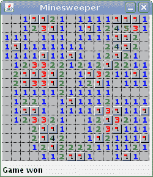

# Java 扫雷

> 原文： [https://zetcode.com/tutorials/javagamestutorial/minesweeper/](https://zetcode.com/tutorials/javagamestutorial/minesweeper/)

在 Java 2D 游戏教程的这一部分中，我们创建一个扫雷游戏克隆。 源代码和图像可以在作者的 Github [Java-Minesweeper-Game](https://github.com/janbodnar/Java-Minesweeper-Game) 存储库中找到。

**Ad** Pro Tip : Easily access your essential developer tools such emulators etc. by loading them onto cloud [hosted citrix xendesktop](https://www.clouddesktoponline.com/citrix-xen-desktop/) with add-ons such as [Office 365 Enterprise E5](https://www.o365cloudexperts.com/office-365-e5/) suite for enhanced team productivity.

## 扫雷

《扫雷》是一款流行的棋盘游戏，默认情况下附带许多操作系统。 游戏的目标是扫雷场中的所有地雷。 如果玩家单击包含地雷的单元格，则地雷会引爆，游戏结束。

单元格可以包含数字，也可以为空白。 该数字表示与该特定单元相邻的地雷数量。 我们通过右键单击在单元格上设置标记。 通过这种方式，我们表明我们相信，有一个地雷。

## Java Minesweeper 游戏的开发

游戏包含两个类别：`Board`和`Minesweeper`。 `src/resources`目录中有 13 张图片。

`com/zetcode/Board.java`

```
package com.zetcode;

import java.awt.Dimension;
import java.awt.Graphics;
import java.awt.Image;
import java.awt.event.MouseAdapter;
import java.awt.event.MouseEvent;
import java.util.Random;
import javax.swing.ImageIcon;
import javax.swing.JLabel;
import javax.swing.JPanel;

public class Board extends JPanel {

    private final int NUM_IMAGES = 13;
    private final int CELL_SIZE = 15;

    private final int COVER_FOR_CELL = 10;
    private final int MARK_FOR_CELL = 10;
    private final int EMPTY_CELL = 0;
    private final int MINE_CELL = 9;
    private final int COVERED_MINE_CELL = MINE_CELL + COVER_FOR_CELL;
    private final int MARKED_MINE_CELL = COVERED_MINE_CELL + MARK_FOR_CELL;

    private final int DRAW_MINE = 9;
    private final int DRAW_COVER = 10;
    private final int DRAW_MARK = 11;
    private final int DRAW_WRONG_MARK = 12;

    private final int N_MINES = 40;
    private final int N_ROWS = 16;
    private final int N_COLS = 16;

    private final int BOARD_WIDTH = N_COLS * CELL_SIZE + 1;
    private final int BOARD_HEIGHT = N_ROWS * CELL_SIZE + 1;

    private int[] field;
    private boolean inGame;
    private int minesLeft;
    private Image[] img;

    private int allCells;
    private final JLabel statusbar;

    public Board(JLabel statusbar) {

        this.statusbar = statusbar;
        initBoard();
    }

    private void initBoard() {

        setPreferredSize(new Dimension(BOARD_WIDTH, BOARD_HEIGHT));

        img = new Image[NUM_IMAGES];

        for (int i = 0; i < NUM_IMAGES; i++) {

            var path = "src/resources/" + i + ".png";
            img[i] = (new ImageIcon(path)).getImage();
        }

        addMouseListener(new MinesAdapter());
        newGame();
    }

    private void newGame() {

        int cell;

        var random = new Random();
        inGame = true;
        minesLeft = N_MINES;

        allCells = N_ROWS * N_COLS;
        field = new int[allCells];

        for (int i = 0; i < allCells; i++) {

            field[i] = COVER_FOR_CELL;
        }

        statusbar.setText(Integer.toString(minesLeft));

        int i = 0;

        while (i < N_MINES) {

            int position = (int) (allCells * random.nextDouble());

            if ((position < allCells)
                    && (field[position] != COVERED_MINE_CELL)) {

                int current_col = position % N_COLS;
                field[position] = COVERED_MINE_CELL;
                i++;

                if (current_col > 0) {
                    cell = position - 1 - N_COLS;
                    if (cell >= 0) {
                        if (field[cell] != COVERED_MINE_CELL) {
                            field[cell] += 1;
                        }
                    }
                    cell = position - 1;
                    if (cell >= 0) {
                        if (field[cell] != COVERED_MINE_CELL) {
                            field[cell] += 1;
                        }
                    }

                    cell = position + N_COLS - 1;
                    if (cell < allCells) {
                        if (field[cell] != COVERED_MINE_CELL) {
                            field[cell] += 1;
                        }
                    }
                }

                cell = position - N_COLS;
                if (cell >= 0) {
                    if (field[cell] != COVERED_MINE_CELL) {
                        field[cell] += 1;
                    }
                }

                cell = position + N_COLS;
                if (cell < allCells) {
                    if (field[cell] != COVERED_MINE_CELL) {
                        field[cell] += 1;
                    }
                }

                if (current_col < (N_COLS - 1)) {
                    cell = position - N_COLS + 1;
                    if (cell >= 0) {
                        if (field[cell] != COVERED_MINE_CELL) {
                            field[cell] += 1;
                        }
                    }
                    cell = position + N_COLS + 1;
                    if (cell < allCells) {
                        if (field[cell] != COVERED_MINE_CELL) {
                            field[cell] += 1;
                        }
                    }
                    cell = position + 1;
                    if (cell < allCells) {
                        if (field[cell] != COVERED_MINE_CELL) {
                            field[cell] += 1;
                        }
                    }
                }
            }
        }
    }

    private void find_empty_cells(int j) {

        int current_col = j % N_COLS;
        int cell;

        if (current_col > 0) {
            cell = j - N_COLS - 1;
            if (cell >= 0) {
                if (field[cell] > MINE_CELL) {
                    field[cell] -= COVER_FOR_CELL;
                    if (field[cell] == EMPTY_CELL) {
                        find_empty_cells(cell);
                    }
                }
            }

            cell = j - 1;
            if (cell >= 0) {
                if (field[cell] > MINE_CELL) {
                    field[cell] -= COVER_FOR_CELL;
                    if (field[cell] == EMPTY_CELL) {
                        find_empty_cells(cell);
                    }
                }
            }

            cell = j + N_COLS - 1;
            if (cell < allCells) {
                if (field[cell] > MINE_CELL) {
                    field[cell] -= COVER_FOR_CELL;
                    if (field[cell] == EMPTY_CELL) {
                        find_empty_cells(cell);
                    }
                }
            }
        }

        cell = j - N_COLS;
        if (cell >= 0) {
            if (field[cell] > MINE_CELL) {
                field[cell] -= COVER_FOR_CELL;
                if (field[cell] == EMPTY_CELL) {
                    find_empty_cells(cell);
                }
            }
        }

        cell = j + N_COLS;
        if (cell < allCells) {
            if (field[cell] > MINE_CELL) {
                field[cell] -= COVER_FOR_CELL;
                if (field[cell] == EMPTY_CELL) {
                    find_empty_cells(cell);
                }
            }
        }

        if (current_col < (N_COLS - 1)) {
            cell = j - N_COLS + 1;
            if (cell >= 0) {
                if (field[cell] > MINE_CELL) {
                    field[cell] -= COVER_FOR_CELL;
                    if (field[cell] == EMPTY_CELL) {
                        find_empty_cells(cell);
                    }
                }
            }

            cell = j + N_COLS + 1;
            if (cell < allCells) {
                if (field[cell] > MINE_CELL) {
                    field[cell] -= COVER_FOR_CELL;
                    if (field[cell] == EMPTY_CELL) {
                        find_empty_cells(cell);
                    }
                }
            }

            cell = j + 1;
            if (cell < allCells) {
                if (field[cell] > MINE_CELL) {
                    field[cell] -= COVER_FOR_CELL;
                    if (field[cell] == EMPTY_CELL) {
                        find_empty_cells(cell);
                    }
                }
            }
        }

    }

    @Override
    public void paintComponent(Graphics g) {

        int uncover = 0;

        for (int i = 0; i < N_ROWS; i++) {

            for (int j = 0; j < N_COLS; j++) {

                int cell = field[(i * N_COLS) + j];

                if (inGame && cell == MINE_CELL) {

                    inGame = false;
                }

                if (!inGame) {

                    if (cell == COVERED_MINE_CELL) {
                        cell = DRAW_MINE;
                    } else if (cell == MARKED_MINE_CELL) {
                        cell = DRAW_MARK;
                    } else if (cell > COVERED_MINE_CELL) {
                        cell = DRAW_WRONG_MARK;
                    } else if (cell > MINE_CELL) {
                        cell = DRAW_COVER;
                    }

                } else {

                    if (cell > COVERED_MINE_CELL) {
                        cell = DRAW_MARK;
                    } else if (cell > MINE_CELL) {
                        cell = DRAW_COVER;
                        uncover++;
                    }
                }

                g.drawImage(img[cell], (j * CELL_SIZE),
                        (i * CELL_SIZE), this);
            }
        }

        if (uncover == 0 && inGame) {

            inGame = false;
            statusbar.setText("Game won");

        } else if (!inGame) {

            statusbar.setText("Game lost");
        }
    }

    private class MinesAdapter extends MouseAdapter {

        @Override
        public void mousePressed(MouseEvent e) {

            int x = e.getX();
            int y = e.getY();

            int cCol = x / CELL_SIZE;
            int cRow = y / CELL_SIZE;

            boolean doRepaint = false;

            if (!inGame) {

                newGame();
                repaint();
            }

            if ((x < N_COLS * CELL_SIZE) && (y < N_ROWS * CELL_SIZE)) {

                if (e.getButton() == MouseEvent.BUTTON3) {

                    if (field[(cRow * N_COLS) + cCol] > MINE_CELL) {

                        doRepaint = true;

                        if (field[(cRow * N_COLS) + cCol] <= COVERED_MINE_CELL) {

                            if (minesLeft > 0) {
                                field[(cRow * N_COLS) + cCol] += MARK_FOR_CELL;
                                minesLeft--;
                                String msg = Integer.toString(minesLeft);
                                statusbar.setText(msg);
                            } else {
                                statusbar.setText("No marks left");
                            }
                        } else {

                            field[(cRow * N_COLS) + cCol] -= MARK_FOR_CELL;
                            minesLeft++;
                            String msg = Integer.toString(minesLeft);
                            statusbar.setText(msg);
                        }
                    }

                } else {

                    if (field[(cRow * N_COLS) + cCol] > COVERED_MINE_CELL) {

                        return;
                    }

                    if ((field[(cRow * N_COLS) + cCol] > MINE_CELL)
                            && (field[(cRow * N_COLS) + cCol] < MARKED_MINE_CELL)) {

                        field[(cRow * N_COLS) + cCol] -= COVER_FOR_CELL;
                        doRepaint = true;

                        if (field[(cRow * N_COLS) + cCol] == MINE_CELL) {
                            inGame = false;
                        }

                        if (field[(cRow * N_COLS) + cCol] == EMPTY_CELL) {
                            find_empty_cells((cRow * N_COLS) + cCol);
                        }
                    }
                }

                if (doRepaint) {
                    repaint();
                }
            }
        }
    }
}

```

首先，我们定义游戏中使用的常量。

```
private final int NUM_IMAGES = 13;
private final int CELL_SIZE = 15;

```

此游戏中使用了十三张图像。 一个牢房最多可被八个地雷包围，因此我们需要一号到八号。 我们需要一个空单元格，一个地雷，一个被遮盖的单元格，一个标记的单元格，最后需要一个错误标记的单元格的图像。 每个图像的大小为`15x15`像素。

```
private final int COVER_FOR_CELL = 10;
private final int MARK_FOR_CELL = 10;
private final int EMPTY_CELL = 0;
...

```

地雷区是数字数组。 例如，0 表示一个空单元格。 数字 10 用于电池盖和标记。 使用常量可以提高代码的可读性。

```
private final int MINE_CELL = 9;

```

`MINE_CELL`表示包含地雷的单元。

```
private final int COVERED_MINE_CELL = MINE_CELL + COVER_FOR_CELL;
private final int MARKED_MINE_CELL = COVERED_MINE_CELL + MARK_FOR_CELL;

```

`COVERED_MINE_CELL`用于覆盖并包含地雷的区域。 `MARKED_MINE_CELL`代码&gt;是由用户标记的隐蔽地雷单元。

```
private final int DRAW_MINE = 9;
private final int DRAW_COVER = 10;
private final int DRAW_MARK = 11;
private final int DRAW_WRONG_MARK = 12;

```

这些竞争因素决定是否绘制地雷，地雷覆盖物，标记和标记错误的单元。

```
private final int N_MINES = 40;
private final int N_ROWS = 16;
private final int N_COLS = 16;

```

我们游戏中的雷区有 40 个隐藏的地雷。 该字段中有 16 行和 16 列。 因此，雷场中共有 262 个牢房。

```
private int[] field;

```

该字段是数字数组。 字段中的每个单元格都有一个特定的编号。 例如，一个矿井的编号为 9。一个矿井的编号为 2 意味着它与两个矿井相邻。 数字已添加。 例如，一个被覆盖的地雷的编号为 19，地雷的编号为 9，电池盖的编号为 10，依此类推。

```
private boolean inGame;

```

`inGame`变量确定我们是在游戏中还是游戏结束。

```
private int minesLeft;

```

`minesLeft`变量要标记为左侧的地雷数量。

```
for (int i = 0; i < NUM_IMAGES; i++) {

    var path = "src/resources/" + i + ".png";
    img[i] = (new ImageIcon(path)).getImage();
}

```

我们将图像加载到图像数组中。 这些图像分别命名为`0.png`，`1.png` ... `12.png`。

`newGame()`启动扫雷游戏。

```
allCells = N_ROWS * N_COLS;
field = new int[allCells];

for (int i = 0; i < allCells; i++) {

    field[i] = COVER_FOR_CELL;
}

```

这些线设置了雷区。 默认情况下覆盖每个单元格。

```
int i = 0;

while (i < N_MINES) {

    int position = (int) (allCells * random.nextDouble());

    if ((position < allCells)
            && (field[position] != COVERED_MINE_CELL)) {

        int current_col = position % N_COLS;
        field[position] = COVERED_MINE_CELL;
        i++;
...    

```

在白色周期中，我们将所有地雷随机放置在野外。

```
cell = position - N_COLS;

if (cell >= 0) {
    if (field[cell] != COVERED_MINE_CELL) {
        field[cell] += 1;
    }
}

```

每个单元最多可以包围八个单元。 （这不适用于边界单元。）我们为每个随机放置的地雷增加相邻单元的数量。 在我们的示例中，我们向相关单元格的顶部邻居添加 1。

在`find_empty_cells()`方法中，我们找到了空单元格。 如果玩家单击雷区，则游戏结束。 如果他单击与地雷相邻的单元，则会发现一个数字，该数字指示该单元与地雷相邻的数量。 单击一个空单元格会导致发现许多其他空单元格以及带有数字的单元格，这些数字在空边界的空间周围形成边界。 我们使用递归算法来查找空单元格。

```
cell = j - 1;
if (cell <= 0) {
    if (field[cell] > MINE_CELL) {
        field[cell] -= COVER_FOR_CELL;
        if (field[cell] == EMPTY_CELL) {
            find_empty_cells(cell);
        }
    }
}

```

在此代码中，我们检查位于相关空单元格左侧的单元格。 如果不为空，则将其覆盖。 如果为空，则通过递归调用`find_empty_cells()`方法来重复整个过程。

`paintComponent()`方法将数字转换为图像。

```
if (!inGame) {
    if (cell == COVERED_MINE_CELL) {
        cell = DRAW_MINE;
    } else if (cell == MARKED_MINE_CELL) {
        cell = DRAW_MARK;
    } else if (cell > COVERED_MINE_CELL) {
        cell = DRAW_WRONG_MARK;
    } else if (cell > MINE_CELL) {
        cell = DRAW_COVER;
    }
} ... 

```

如果游戏结束并且我们输了，我们将显示所有未发现的地雷（如果有的话），并显示所有错误标记的单元格（如果有）。

```
g.drawImage(img[cell], (j * CELL_SIZE),
    (i * CELL_SIZE), this);

```

此代码行绘制了窗口上的每个单元格。

```
if (uncover == 0 && inGame) {

    inGame = false;
    statusbar.setText("Game won");
} else if (!inGame) {

    statusbar.setText("Game lost");
}

```

如果没有什么可以发现的，我们就赢了。 如果`inGame`变量设置为`false`，我们将丢失。

在`mousePressed()`方法中，我们对鼠标单击做出反应。 扫雷游戏完全由鼠标控制。 我们对鼠标左键和右键单击做出反应。

```
int x = e.getX();
int y = e.getY();

```

我们确定鼠标指针的`x`和`y`坐标。

```
int cCol = x / CELL_SIZE;
int cRow = y / CELL_SIZE;

```

我们计算雷区的相应列和行。

```
if ((x < N_COLS * CELL_SIZE) && (y < N_ROWS * CELL_SIZE)) {

```

我们检查我们是否位于雷区。

```
if (e.getButton() == MouseEvent.BUTTON3) {

```

地雷的发现是通过鼠标右键完成的。

```
field[(cRow * N_COLS) + cCol] += MARK_FOR_CELL;
minesLeft--;

```

如果右键单击未标记的单元格，则将`MARK_FOR_CELL`添加到表示该单元格的数字中。 这导致在`paintComponent()`方法中绘制带有标记的覆盖单元。

```
field[(cRow * N_COLS) + cCol] -= MARK_FOR_CELL;
minesLeft++;

var msg = Integer.toString(minesLeft);
statusbar.setText(msg);

```

如果我们在已经标记的单元格上单击鼠标左键，我们将删除标记并增加要标记的单元格的数量。

```
if (field[(cRow * N_COLS) + cCol] > COVERED_MINE_CELL) {
    return;
}

```

如果单击覆盖并标记的单元格，则不会发生任何事情。 必须首先通过另一次右键单击来发现它，然后才可以在其上单击鼠标左键。

```
field[(cRow * N_COLS) + cCol] -= COVER_FOR_CELL;

```

左键单击可从单元中移除盖子。

```
if (field[(cRow * N_COLS) + cCol] == MINE_CELL) {
    inGame = false;
}

if (field[(cRow * N_COLS) + cCol] == EMPTY_CELL) {
    find_empty_cells((cRow * N_COLS) + cCol);
}                          

```

万一我们左键单击地雷，游戏就结束了。 如果我们在空白单元格上单击鼠标左键，我们将调用`find_empty_cells()`方法，该方法递归地找到所有相邻的空白单元格。

```
if (doRepaint) {
    repaint();
}

```

如果需要重新粉刷电路板（例如，设置或移除了标记），我们将调用`repaint()`方法。

`com/zetcode/Minesweeper.java`

```
package com.zetcode;

import java.awt.BorderLayout;
import java.awt.EventQueue;
import javax.swing.JFrame;
import javax.swing.JLabel;

/**
 * Java Minesweeper Game
 *
 * Author: Jan Bodnar
 * Website: http://zetcode.com
 */

public class Minesweeper extends JFrame {

    private JLabel statusbar;

    public Minesweeper() {

        initUI();
    }

    private void initUI() {

        statusbar = new JLabel("");
        add(statusbar, BorderLayout.SOUTH);

        add(new Board(statusbar));

        setResizable(false);
        pack();

        setTitle("Minesweeper");
        setLocationRelativeTo(null);
        setDefaultCloseOperation(JFrame.EXIT_ON_CLOSE);
    }

    public static void main(String[] args) {

        EventQueue.invokeLater(() -> {

            var ex = new Minesweeper();
            ex.setVisible(true);
        });
    }
}

```

这是主要的类。

```
setResizable(false);

```

窗口大小固定。 为此，我们使用`setResizable()`方法。



Figure: Minesweeper

在 Java 2D 游戏教程的这一部分中，我们创建了扫雷游戏的 Java 复制版本。