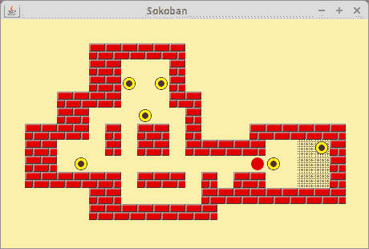

# Java 推箱子

> 原文： [https://zetcode.com/tutorials/javagamestutorial/sokoban/](https://zetcode.com/tutorials/javagamestutorial/sokoban/)

在 Java 2D 游戏教程的这一部分中，我们将创建 Java 推箱子游戏克隆。 源代码和图像可以在作者的 Github [Java-Sokoban-Game](https://github.com/janbodnar/Java-Sokoban-Game) 存储库中找到。

## 推箱子

推箱子是另一个经典的电脑游戏。 它由 Imabayashi Hiroyuki 于 1980 年创建。 推箱子是日语的仓库管理员。 玩家在迷宫周围推箱子。 目的是将所有盒子放置在指定的位置。

## Java 推箱子游戏的开发

我们使用光标键控制推箱子对象。 我们也可以按 `R` 键重新启动电平。 将所有行李放在目的地区域后，游戏结束。 我们在窗口的左上角绘制“已完成”字符串。

`Board.java`

```java
package com.zetcode;

import java.awt.Color;
import java.awt.Graphics;
import java.awt.event.KeyAdapter;
import java.awt.event.KeyEvent;
import java.util.ArrayList;
import javax.swing.JPanel;

public class Board extends JPanel {

    private final int OFFSET = 30;
    private final int SPACE = 20;
    private final int LEFT_COLLISION = 1;
    private final int RIGHT_COLLISION = 2;
    private final int TOP_COLLISION = 3;
    private final int BOTTOM_COLLISION = 4;

    private ArrayList<Wall> walls;
    private ArrayList<Baggage> baggs;
    private ArrayList<Area> areas;

    private Player soko;
    private int w = 0;
    private int h = 0;

    private boolean isCompleted = false;

    private String level
            = "    ######\n"
            + "    ##   #\n"
            + "    ##$  #\n"
            + "  ####  $##\n"
            + "  ##  $ $ #\n"
            + "#### # ## #   ######\n"
            + "##   # ## #####  ..#\n"
            + "## $  $          ..#\n"
            + "###### ### #@##  ..#\n"
            + "    ##     #########\n"
            + "    ########\n";

    public Board() {

        initBoard();
    }

    private void initBoard() {

        addKeyListener(new TAdapter());
        setFocusable(true);
        initWorld();
    }

    public int getBoardWidth() {
        return this.w;
    }

    public int getBoardHeight() {
        return this.h;
    }

    private void initWorld() {

        walls = new ArrayList<>();
        baggs = new ArrayList<>();
        areas = new ArrayList<>();

        int x = OFFSET;
        int y = OFFSET;

        Wall wall;
        Baggage b;
        Area a;

        for (int i = 0; i < level.length(); i++) {

            char item = level.charAt(i);

            switch (item) {

                case '\n':
                    y += SPACE;

                    if (this.w < x) {
                        this.w = x;
                    }

                    x = OFFSET;
                    break;

                case '#':
                    wall = new Wall(x, y);
                    walls.add(wall);
                    x += SPACE;
                    break;

                case '$':
                    b = new Baggage(x, y);
                    baggs.add(b);
                    x += SPACE;
                    break;

                case '.':
                    a = new Area(x, y);
                    areas.add(a);
                    x += SPACE;
                    break;

                case '@':
                    soko = new Player(x, y);
                    x += SPACE;
                    break;

                case ' ':
                    x += SPACE;
                    break;

                default:
                    break;
            }

            h = y;
        }
    }

    private void buildWorld(Graphics g) {

        g.setColor(new Color(250, 240, 170));
        g.fillRect(0, 0, this.getWidth(), this.getHeight());

        ArrayList<Actor> world = new ArrayList<>();

        world.addAll(walls);
        world.addAll(areas);
        world.addAll(baggs);
        world.add(soko);

        for (int i = 0; i < world.size(); i++) {

            Actor item = world.get(i);

            if (item instanceof Player || item instanceof Baggage) {

                g.drawImage(item.getImage(), item.x() + 2, item.y() + 2, this);
            } else {

                g.drawImage(item.getImage(), item.x(), item.y(), this);
            }

            if (isCompleted) {

                g.setColor(new Color(0, 0, 0));
                g.drawString("Completed", 25, 20);
            }

        }
    }

    @Override
    public void paintComponent(Graphics g) {
        super.paintComponent(g);

        buildWorld(g);
    }

    private class TAdapter extends KeyAdapter {

        @Override
        public void keyPressed(KeyEvent e) {

            if (isCompleted) {
                return;
            }

            int key = e.getKeyCode();

            switch (key) {

                case KeyEvent.VK_LEFT:

                    if (checkWallCollision(soko,
                            LEFT_COLLISION)) {
                        return;
                    }

                    if (checkBagCollision(LEFT_COLLISION)) {
                        return;
                    }

                    soko.move(-SPACE, 0);

                    break;

                case KeyEvent.VK_RIGHT:

                    if (checkWallCollision(soko, RIGHT_COLLISION)) {
                        return;
                    }

                    if (checkBagCollision(RIGHT_COLLISION)) {
                        return;
                    }

                    soko.move(SPACE, 0);

                    break;

                case KeyEvent.VK_UP:

                    if (checkWallCollision(soko, TOP_COLLISION)) {
                        return;
                    }

                    if (checkBagCollision(TOP_COLLISION)) {
                        return;
                    }

                    soko.move(0, -SPACE);

                    break;

                case KeyEvent.VK_DOWN:

                    if (checkWallCollision(soko, BOTTOM_COLLISION)) {
                        return;
                    }

                    if (checkBagCollision(BOTTOM_COLLISION)) {
                        return;
                    }

                    soko.move(0, SPACE);

                    break;

                case KeyEvent.VK_R:

                    restartLevel();

                    break;

                default:
                    break;
            }

            repaint();
        }
    }

    private boolean checkWallCollision(Actor actor, int type) {

        switch (type) {

            case LEFT_COLLISION:

                for (int i = 0; i < walls.size(); i++) {

                    Wall wall = walls.get(i);

                    if (actor.isLeftCollision(wall)) {

                        return true;
                    }
                }

                return false;

            case RIGHT_COLLISION:

                for (int i = 0; i < walls.size(); i++) {

                    Wall wall = walls.get(i);

                    if (actor.isRightCollision(wall)) {
                        return true;
                    }
                }

                return false;

            case TOP_COLLISION:

                for (int i = 0; i < walls.size(); i++) {

                    Wall wall = walls.get(i);

                    if (actor.isTopCollision(wall)) {

                        return true;
                    }
                }

                return false;

            case BOTTOM_COLLISION:

                for (int i = 0; i < walls.size(); i++) {

                    Wall wall = walls.get(i);

                    if (actor.isBottomCollision(wall)) {

                        return true;
                    }
                }

                return false;

            default:
                break;
        }

        return false;
    }

    private boolean checkBagCollision(int type) {

        switch (type) {

            case LEFT_COLLISION:

                for (int i = 0; i < baggs.size(); i++) {

                    Baggage bag = baggs.get(i);

                    if (soko.isLeftCollision(bag)) {

                        for (int j = 0; j < baggs.size(); j++) {

                            Baggage item = baggs.get(j);

                            if (!bag.equals(item)) {

                                if (bag.isLeftCollision(item)) {
                                    return true;
                                }
                            }

                            if (checkWallCollision(bag, LEFT_COLLISION)) {
                                return true;
                            }
                        }

                        bag.move(-SPACE, 0);
                        isCompleted();
                    }
                }

                return false;

            case RIGHT_COLLISION:

                for (int i = 0; i < baggs.size(); i++) {

                    Baggage bag = baggs.get(i);

                    if (soko.isRightCollision(bag)) {

                        for (int j = 0; j < baggs.size(); j++) {

                            Baggage item = baggs.get(j);

                            if (!bag.equals(item)) {

                                if (bag.isRightCollision(item)) {
                                    return true;
                                }
                            }

                            if (checkWallCollision(bag, RIGHT_COLLISION)) {
                                return true;
                            }
                        }

                        bag.move(SPACE, 0);
                        isCompleted();
                    }
                }
                return false;

            case TOP_COLLISION:

                for (int i = 0; i < baggs.size(); i++) {

                    Baggage bag = baggs.get(i);

                    if (soko.isTopCollision(bag)) {

                        for (int j = 0; j < baggs.size(); j++) {

                            Baggage item = baggs.get(j);

                            if (!bag.equals(item)) {

                                if (bag.isTopCollision(item)) {
                                    return true;
                                }
                            }

                            if (checkWallCollision(bag, TOP_COLLISION)) {
                                return true;
                            }
                        }

                        bag.move(0, -SPACE);
                        isCompleted();
                    }
                }

                return false;

            case BOTTOM_COLLISION:

                for (int i = 0; i < baggs.size(); i++) {

                    Baggage bag = baggs.get(i);

                    if (soko.isBottomCollision(bag)) {

                        for (int j = 0; j < baggs.size(); j++) {

                            Baggage item = baggs.get(j);

                            if (!bag.equals(item)) {

                                if (bag.isBottomCollision(item)) {
                                    return true;
                                }
                            }

                            if (checkWallCollision(bag,BOTTOM_COLLISION)) {

                                return true;
                            }
                        }

                        bag.move(0, SPACE);
                        isCompleted();
                    }
                }

                break;

            default:
                break;
        }

        return false;
    }

    public void isCompleted() {

        int nOfBags = baggs.size();
        int finishedBags = 0;

        for (int i = 0; i < nOfBags; i++) {

            Baggage bag = baggs.get(i);

            for (int j = 0; j < nOfBags; j++) {

                Area area =  areas.get(j);

                if (bag.x() == area.x() && bag.y() == area.y()) {

                    finishedBags += 1;
                }
            }
        }

        if (finishedBags == nOfBags) {

            isCompleted = true;
            repaint();
        }
    }

    public void restartLevel() {

        areas.clear();
        baggs.clear();
        walls.clear();

        initWorld();

        if (isCompleted) {
            isCompleted = false;
        }
    }
}

```

游戏简化了。 它仅提供非常基本的功能。 该代码比容易理解。 游戏只有一个关卡。

```java
private final int OFFSET = 30;
private final int SPACE = 20;
private final int LEFT_COLLISION = 1;
private final int RIGHT_COLLISION = 2;
private final int TOP_COLLISION = 3;
private final int BOTTOM_COLLISION = 4;

```

墙图片大小为`20x20`像素。 这反映了`SPACE`常数。 `OFFSET`是窗口边界和游戏世界之间的距离。 有四种类型的碰撞。 每个数字都由一个数字常数表示。

```java
private ArrayList<Wall> walls;
private ArrayList<Baggage> baggs;
private ArrayList<Area> areas;

```

墙壁，行李和区域是特殊的容器，可容纳游戏的所有墙壁，行李和区域。

```java
private String level =
          "    ######\n"
        + "    ##   #\n"
        + "    ##$  #\n"
        + "  ####  $##\n"
        + "  ##  $ $ #\n"
        + "#### # ## #   ######\n"
        + "##   # ## #####  ..#\n"
        + "## $  $          ..#\n"
        + "###### ### #@##  ..#\n"
        + "    ##     #########\n"
        + "    ########\n";

```

这是游戏的水平。 除空格外，还有五个字符。 井号（`#`）代表墙。 美元（`$`）表示要移动的框。 点（`.`）字符表示我们必须移动框的位置。 at 字符（`@`）是推箱子。 最后，换行符（`\n`）开始了世界的新行。

```java
private void initWorld() {

    walls = new ArrayList<>();
    baggs = new ArrayList<>();
    areas = new ArrayList<>();

    int x = OFFSET;
    int y = OFFSET;
...

```

`initWorld()`方法启动游戏世界。 它遍历级别字符串并填充上述列表。

```java
case '$':
    b = new Baggage(x, y);
    baggs.add(b);
    x += SPACE;
    break;

```

对于美元字符，我们创建一个`Baggage`对象。 该对象将附加到行李列表。 x 变量相应增加。

```java
private void buildWorld(Graphics g) {
...

```

`buildWorld()`方法在窗口上绘制游戏世界。

```java
ArrayList<Actor> world = new ArrayList<>();

world.addAll(walls);
world.addAll(areas);
world.addAll(baggs);
world.add(soko);

```

我们创建一个包含游戏所有对象的世界列表。

```java
for (int i = 0; i < world.size(); i++) {

    Actor item = world.get(i);

    if (item instanceof Player || item instanceof Baggage) {

        g.drawImage(item.getImage(), item.x() + 2, item.y() + 2, this);
    } else {

        g.drawImage(item.getImage(), item.x(), item.y(), this);
    }
...
}

```

我们遍历世界容器并绘制对象。 播放器和行李图像稍小。 我们在其坐标上添加 2px 以使其居中。

```java
if (isCompleted) {

    g.setColor(new Color(0, 0, 0));
    g.drawString("Completed", 25, 20);
}

```

如果完成该级别，则在窗口的左上角绘制“已完成”。

```java
case KeyEvent.VK_LEFT:

    if (checkWallCollision(soko,
            LEFT_COLLISION)) {
        return;
    }

    if (checkBagCollision(LEFT_COLLISION)) {
        return;
    }

    soko.move(-SPACE, 0);

    break;

```

在`keyPressed()`方法内部，我们检查了按下了哪些键。 我们用光标键控制推箱子对象。 如果按左光标键，我们将检查推箱子是否与墙壁或行李相撞。 如果没有，我们将推箱子向左移动。

```java
case KeyEvent.VK_R:

    restartLevel();

    break;

```

如果按`R`键，我们将重新启动该级别。

```java
case LEFT_COLLISION:

    for (int i = 0; i < walls.size(); i++) {

        Wall wall = walls.get(i);

        if (actor.isLeftCollision(wall)) {

            return true;
        }
    }

    return false;

```

创建`checkWallCollision()`方法以确保推箱子或行李不会通过墙壁。 有四种类型的碰撞。 上面几行检查是否有左碰撞。

```java
private boolean checkBagCollision(int type) {
...
}

```

`checkBagCollision()`涉及更多。 行李可能会与墙壁，推箱子或其他行李发生碰撞。 仅当行李与推箱子碰撞且不与其他行李或墙壁碰撞时，才可以移动行李。 搬运行李时，该通过调用`isCompleted()`方法检查水平是否已完成。

```java
for (int i = 0; i < nOfBags; i++) {

    Baggage bag = baggs.get(i);

    for (int j = 0; j < nOfBags; j++) {

        Area area =  areas.get(j);

        if (bag.x() == area.x() && bag.y() == area.y()) {

            finishedBags += 1;
        }
    }
}

```

`isCompleted()`方法检查级别是否完成。 我们得到行李数。 我们比较所有行李和目的地区域的 x 和 y 坐标。

```java
if (finishedBags == nOfBags) {

    isCompleted = true;
    repaint();
}

```

当`finishedBags`变量等于游戏中的行李数时，游戏结束。

```java
private void restartLevel() {

    areas.clear();
    baggs.clear();
    walls.clear();

    initWorld();

    if (isCompleted) {
        isCompleted = false;
    }
}

```

如果我们做了一些不好的动作，我们可以重新启动关卡。 我们从列表中删除所有对象，然后再次启动世界。 `isCompleted`变量设置为`false`。

`Actor.java`

```java
package com.zetcode;

import java.awt.Image;

public class Actor {

    private final int SPACE = 20;

    private int x;
    private int y;
    private Image image;

    public Actor(int x, int y) {

        this.x = x;
        this.y = y;
    }

    public Image getImage() {
        return image;
    }

    public void setImage(Image img) {
        image = img;
    }

    public int x() {

        return x;
    }

    public int y() {

        return y;
    }

    public void setX(int x) {

        this.x = x;
    }

    public void setY(int y) {

        this.y = y;
    }

    public boolean isLeftCollision(Actor actor) {

        return x() - SPACE == actor.x() && y() == actor.y();
    }

    public boolean isRightCollision(Actor actor) {

        return x() + SPACE == actor.x() && y() == actor.y();
    }

    public boolean isTopCollision(Actor actor) {

        return y() - SPACE == actor.y() && x() == actor.x();
    }

    public boolean isBottomCollision(Actor actor) {

        return y() + SPACE == actor.y() && x() == actor.x();
    }
}

```

这是`Actor`类。 该类是游戏中其他演员的基础类。 它封装了推箱子游戏中对象的基本功能。

```java
public boolean isLeftCollision(Actor actor) {

    return x() - SPACE == actor.x() && y() == actor.y();
}

```

此方法检查演员是否与左侧的另一个演员（墙壁，行李，推箱子）相撞。

`Wall.java`

```java
package com.zetcode;

import java.awt.Image;
import javax.swing.ImageIcon;

public class Wall extends Actor {

    private Image image;

    public Wall(int x, int y) {
        super(x, y);

        initWall();
    }

    private void initWall() {

        ImageIcon iicon = new ImageIcon("src/resources/wall.png");
        image = iicon.getImage();
        setImage(image);
    }
}

```

这是`Wall`类。 它继承自`Actor`类。 构建后，它将从资源中加载墙图像。

`Player.java`

```java
package com.zetcode;

import java.awt.Image;
import javax.swing.ImageIcon;

public class Player extends Actor {

    public Player(int x, int y) {
        super(x, y);

        initPlayer();
    }

    private void initPlayer() {

        ImageIcon iicon = new ImageIcon("src/resources/sokoban.png");
        Image image = iicon.getImage();
        setImage(image);
    }

    public void move(int x, int y) {

        int dx = x() + x;
        int dy = y() + y;

        setX(dx);
        setY(dy);
    }
}

```

这是`Player`类。

```java
public void move(int x, int y) {

    int dx = x() + x;
    int dy = y() + y;

    setX(dx);
    setY(dy);
}

```

`move()`方法将对象移动到世界内部。

`Baggage.java`

```java
package com.zetcode;

import java.awt.Image;
import javax.swing.ImageIcon;

public class Baggage extends Actor {

    public Baggage(int x, int y) {
        super(x, y);

        initBaggage();
    }

    private void initBaggage() {

        ImageIcon iicon = new ImageIcon("src/resources/baggage.png");
        Image image = iicon.getImage();
        setImage(image);
    }

    public void move(int x, int y) {

        int dx = x() + x;
        int dy = y() + y;

        setX(dx);
        setY(dy);
    }
}

```

这是`Baggage`对象的类。 该对象是可移动的，因此也具有`move()`方法。

`Area.java`

```java
package com.zetcode;

import java.awt.Image;
import javax.swing.ImageIcon;

public class Area extends Actor {

    public Area(int x, int y) {
        super(x, y);

        initArea();
    }

    private void initArea() {

        ImageIcon iicon = new ImageIcon("src/resources/area.png");
        Image image = iicon.getImage();
        setImage(image);
    }
}

```

这是`Area`类。 这是我们尝试放置行李的对象。

`Sokoban.java`

```java
package com.zetcode;

import java.awt.EventQueue;
import javax.swing.JFrame;

public class Sokoban extends JFrame {

    private final int OFFSET = 30;

    public Sokoban() {

        initUI();
    }

    private void initUI() {

        Board board = new Board();
        add(board);

        setTitle("Sokoban");

        setSize(board.getBoardWidth() + OFFSET,
                board.getBoardHeight() + 2 * OFFSET);

        setDefaultCloseOperation(JFrame.EXIT_ON_CLOSE);
        setLocationRelativeTo(null);
    }

    public static void main(String[] args) {

        EventQueue.invokeLater(() -> {

            Sokoban game = new Sokoban();
            game.setVisible(true);
        });
    }
}

```

这是主要的类。



图：推箱子

这是推箱子游戏。