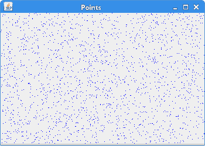
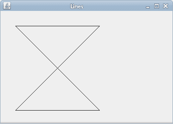
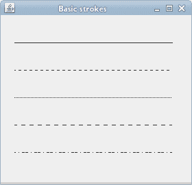
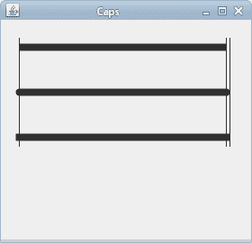
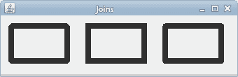

# 基本绘图

> 原文： [https://zetcode.com/gfx/java2d/basicdrawing/](https://zetcode.com/gfx/java2d/basicdrawing/)

在 Java 2D 教程的这一部分中，我们进行一些基本绘制。

## 点

最简单的图形原语就是点。 它是窗口上的一个点。 有一个`Point`类用于表示坐标空间中的一个点，但是没有绘制点的方法。 为了绘制一个点，我们使用了`drawLine()`方法，其中为该方法的两个参数都提供了一个点。

`PointsEx.java`

```java
package com.zetcode;

import java.awt.Color;
import java.awt.EventQueue;
import java.awt.Graphics;
import java.awt.Graphics2D;
import java.awt.event.ActionEvent;
import java.awt.event.ActionListener;
import java.awt.event.WindowAdapter;
import java.awt.event.WindowEvent;
import java.util.Random;
import javax.swing.JFrame;
import javax.swing.JPanel;
import javax.swing.Timer;

class Surface extends JPanel implements ActionListener {

    private final int DELAY = 150;
    private Timer timer;

    public Surface() {

        initTimer();
    }

    private void initTimer() {

        timer = new Timer(DELAY, this);
        timer.start();
    }

    public Timer getTimer() {

        return timer;
    }

    private void doDrawing(Graphics g) {

        Graphics2D g2d = (Graphics2D) g;

        g2d.setPaint(Color.blue);

        int w = getWidth();
        int h = getHeight();

        Random r = new Random();

        for (int i = 0; i < 2000; i++) {

            int x = Math.abs(r.nextInt()) % w;
            int y = Math.abs(r.nextInt()) % h;
            g2d.drawLine(x, y, x, y);
        }
    }

    @Override
    public void paintComponent(Graphics g) {

        super.paintComponent(g);
        doDrawing(g);
    }

    @Override
    public void actionPerformed(ActionEvent e) {
        repaint();
    }
}

public class PointsEx extends JFrame {

    public PointsEx() {

        initUI();
    }

    private void initUI() {

        final Surface surface = new Surface();
        add(surface);

        addWindowListener(new WindowAdapter() {
            @Override
            public void windowClosing(WindowEvent e) {
                Timer timer = surface.getTimer();
                timer.stop();
            }
        });

        setTitle("Points");
        setSize(350, 250);
        setLocationRelativeTo(null);
        setDefaultCloseOperation(JFrame.EXIT_ON_CLOSE);
    }

    public static void main(String[] args) {

        EventQueue.invokeLater(new Runnable() {
            @Override
            public void run() {

                PointsEx ex = new PointsEx();
                ex.setVisible(true);
            }
        });
    }
}

```

该示例在窗口上随机绘制 2000 个点。 计时器用于绘制循环中的点。

```java
private void initTimer() {

    timer = new Timer(DELAY, this);
    timer.start();
}

```

`javax.swing.Timer`用于创建动画。 它以指定的时间间隔触发`ActionEvents`。

```java
g2d.setPaint(Color.blue);

```

这些点被涂成蓝色。

```java
int w = getWidth();
int h = getHeight();

```

我们得到组件的宽度和高度。

```java
Random r = new Random();
int x = Math.abs(r.nextInt()) % w;
int y = Math.abs(r.nextInt()) % h;

```

我们得到一个上面计算出的区域大小范围内的随机数。

```java
g2d.drawLine(x, y, x, y);

```

在这里，我们指出了这一点。 如前所述，我们使用`drawLine()`方法。 我们两次指定相同的点。

```java
@Override
public void actionPerformed(ActionEvent e) {
    repaint();
}

```

每个动作事件，我们都调用`repaint()`方法。 这将导致整个客户区被重绘。

```java
addWindowListener(new WindowAdapter() {
    @Override
    public void windowClosing(WindowEvent e) {
        Timer timer = surface.getTimer();
        timer.stop();
    }
});

```

当窗口即将关闭时，我们检索计时器并使用其`stop()`方法将其关闭。 未明确取消的计时器可能无限期地占用资源。 `EXIT_ON_CLOSE`默认关闭操作将关闭 JVM 及其所有线程，因此对于我们的示例而言，这不是必需的。 但是，尽管如此，作为一种好的编程习惯，我们仍然会这样做。



图：点

## 直线

线是简单的图形基元。 线是连接两个点的对象。 使用`drawLine()`方法绘制线。

`LinesEx.java`

```java
package com.zetcode;

import java.awt.EventQueue;
import java.awt.Graphics;
import java.awt.Graphics2D;
import javax.swing.JFrame;
import javax.swing.JPanel;

class Surface extends JPanel {

    private void doDrawing(Graphics g) {

        Graphics2D g2d = (Graphics2D) g;

        g2d.drawLine(30, 30, 200, 30);
        g2d.drawLine(200, 30, 30, 200);
        g2d.drawLine(30, 200, 200, 200);
        g2d.drawLine(200, 200, 30, 30);
    }

    @Override
    public void paintComponent(Graphics g) {

        super.paintComponent(g);
        doDrawing(g);
    }
}

public class LinesEx extends JFrame {

    public LinesEx() {

        initUI();
    }

    private void initUI() {

        add(new Surface());

        setTitle("Lines");
        setSize(350, 250);
        setLocationRelativeTo(null);
        setDefaultCloseOperation(JFrame.EXIT_ON_CLOSE);
    }

    public static void main(String[] args) {

        EventQueue.invokeLater(new Runnable() {
            @Override
            public void run() {

                LinesEx ex = new LinesEx();
                ex.setVisible(true);
            }
        });
    }
}

```

我们用四个线画一个简单的对象。

```java
g2d.drawLine(30, 30, 200, 30);

```

画一条直线。 该方法的参数是两点的 x，y 坐标。



图：直线

## 基本轮廓

`BasicStroke`类为图形基元的轮廓定义了一组基本的渲染属性。 这些渲染属性包括宽度，端盖，线连接，斜接限制和破折号。

`BasicStrokesEx.java`

```java
package com.zetcode;

import java.awt.BasicStroke;
import java.awt.EventQueue;
import java.awt.Graphics;
import java.awt.Graphics2D;
import javax.swing.JFrame;
import javax.swing.JPanel;

class Surface extends JPanel {

    private void doDrawing(Graphics g) {

        Graphics2D g2d = (Graphics2D) g.create();

        float[] dash1 = {2f, 0f, 2f};
        float[] dash2 = {1f, 1f, 1f};
        float[] dash3 = {4f, 0f, 2f};
        float[] dash4 = {4f, 4f, 1f};

        g2d.drawLine(20, 40, 250, 40);

        BasicStroke bs1 = new BasicStroke(1, BasicStroke.CAP_BUTT,
                BasicStroke.JOIN_ROUND, 1.0f, dash1, 2f);

        BasicStroke bs2 = new BasicStroke(1, BasicStroke.CAP_BUTT,
                BasicStroke.JOIN_ROUND, 1.0f, dash2, 2f);

        BasicStroke bs3 = new BasicStroke(1, BasicStroke.CAP_BUTT,
                BasicStroke.JOIN_ROUND, 1.0f, dash3, 2f);

        BasicStroke bs4 = new BasicStroke(1, BasicStroke.CAP_BUTT,
                BasicStroke.JOIN_ROUND, 1.0f, dash4, 2f);

        g2d.setStroke(bs1);
        g2d.drawLine(20, 80, 250, 80);

        g2d.setStroke(bs2);
        g2d.drawLine(20, 120, 250, 120);

        g2d.setStroke(bs3);
        g2d.drawLine(20, 160, 250, 160);

        g2d.setStroke(bs4);
        g2d.drawLine(20, 200, 250, 200);

        g2d.dispose();
    }

    @Override
    public void paintComponent(Graphics g) {

        super.paintComponent(g);
        doDrawing(g);
    }
}

public class BasicStrokesEx extends JFrame {

    public BasicStrokesEx() {

        initUI();
    }

    private void initUI() {

        add(new Surface());

        setTitle("Basic strokes");
        setSize(280, 270);
        setLocationRelativeTo(null);        
        setDefaultCloseOperation(JFrame.EXIT_ON_CLOSE);
    }

    public static void main(String[] args) {

        EventQueue.invokeLater(new Runnable() {
            @Override
            public void run() {

                BasicStrokesEx ex = new BasicStrokesEx();
                ex.setVisible(true);
            }
        });
    }
}

```

在此示例中，我们显示了各种破折号。 破折号属性是一种模式，通过混合不透明部分和透明部分来创建。

```java
Graphics2D g2d = (Graphics2D) g.create();

```

我们将更改`Graphics`对象的`stroke`属性； 因此，我们使用`Graphics`对象的副本。 （请记住，如果我们更改字体，颜色或渲染提示以外的属性，则必须创建一个副本。）

```java
float[] dash1 = { 2f, 0f, 2f };
float[] dash2 = { 1f, 1f, 1f };
float[] dash3 = { 4f, 0f, 2f };
float[] dash4 = { 4f, 4f, 1f };

```

在这里，我们定义了四种不同的破折号模式。

```java
BasicStroke bs1 = new BasicStroke(1, BasicStroke.CAP_BUTT, 
    BasicStroke.JOIN_ROUND, 1.0f, dash1, 2f );

```

该行构造一个`BasicStroke`对象。

```java
g2d.setStroke(bs1);

```

我们使用`setStroke()`方法将`BasicStroke`应用于当前图形上下文。

```java
g2d.drawLine(20, 80, 250, 80);

```

用`drawLine()`方法画一条线。

```java
g2d.dispose();

```

最后，我们放置`Graphics`对象的副本。



Figure: Basic strokes

## 端帽

上限是应用于未封闭子路径和破折线段末端的装饰。 Java 2D 中有三种不同的端盖：`CAP_BUTT`，`CAP_ROUND`和`CAP_SQUARE`。

*   `CAP_BUTT`-结束未封闭的子路径和虚线段，不添加任何修饰。
*   `CAP_ROUND`-用圆形装饰结束未封闭的子路径和虚线段，该圆形装饰的半径等于笔的宽度的一半。
*   `CAP_SQUARE`-以方形投影结束未封闭的子路径和虚线段，该方形投影超出段的末端并延伸到等于线宽一半的距离。

`CapsEx.java`

```java
package com.zetcode;

import java.awt.BasicStroke;
import java.awt.EventQueue;
import java.awt.Graphics;
import java.awt.Graphics2D;
import java.awt.RenderingHints;
import javax.swing.JFrame;
import javax.swing.JPanel;

class Surface extends JPanel {

    private void doDrawing(Graphics g) {

        Graphics2D g2d = (Graphics2D) g.create();

        RenderingHints rh = new RenderingHints(
                RenderingHints.KEY_ANTIALIASING,
                RenderingHints.VALUE_ANTIALIAS_ON);

        rh.put(RenderingHints.KEY_RENDERING,
                RenderingHints.VALUE_RENDER_QUALITY);

        g2d.setRenderingHints(rh);

        BasicStroke bs1 = new BasicStroke(8, BasicStroke.CAP_BUTT,
                BasicStroke.JOIN_BEVEL);
        g2d.setStroke(bs1);
        g2d.drawLine(20, 30, 250, 30);

        BasicStroke bs2 = new BasicStroke(8, BasicStroke.CAP_ROUND,
                BasicStroke.JOIN_BEVEL);
        g2d.setStroke(bs2);
        g2d.drawLine(20, 80, 250, 80);

        BasicStroke bs3 = new BasicStroke(8, BasicStroke.CAP_SQUARE,
                BasicStroke.JOIN_BEVEL);
        g2d.setStroke(bs3);
        g2d.drawLine(20, 130, 250, 130);

        BasicStroke bs4 = new BasicStroke();
        g2d.setStroke(bs4);

        g2d.drawLine(20, 20, 20, 140);
        g2d.drawLine(250, 20, 250, 140);
        g2d.drawLine(254, 20, 254, 140);

        g2d.dispose();
    }

    @Override
    public void paintComponent(Graphics g) {

        super.paintComponent(g);
        doDrawing(g);
    }
}

public class CapsEx extends JFrame {

    public CapsEx() {

        initUI();
    }

    private void initUI() {

        add(new Surface());

        setTitle("Caps");
        setSize(280, 270);
        setLocationRelativeTo(null); 
        setDefaultCloseOperation(JFrame.EXIT_ON_CLOSE);
    }

    public static void main(String[] args) {

        EventQueue.invokeLater(new Runnable() {
            @Override
            public void run() {

                CapsEx ex = new CapsEx();
                ex.setVisible(true);
            }
        });
    }
}

```

在我们的示例中，我们显示了所有三种类型的端盖。

```java
BasicStroke bs1 = new BasicStroke(8, BasicStroke.CAP_BUTT,
        BasicStroke.JOIN_BEVEL);
g2d.setStroke(bs1);

```

创建并应用带有对接盖的基本笔划。 `CAP_BUTT`不添加装饰。

```java
g2d.drawLine(20, 20, 20, 140);
g2d.drawLine(250, 20, 250, 140);
g2d.drawLine(254, 20, 254, 140);

```

我们画了三根垂直线来解释端盖之间的差异。 具有`CAP_ROUND`和`CAP_SQUARE`的线比具有`CAP_BUTT`的线大。 究竟多大取决于行的大小。 在我们的情况下，线的宽度为 8 像素。 线长 8 像素-左侧 4 像素，右侧 4 像素。 从图片中应该清楚。



Figure: Caps

## 连接

线连接是应用于两个路径段的交点以及子路径端点的交点的修饰。 一共有三种装饰：`JOIN_BEVEL`，`JOIN_MITER`和`JOIN_ROUND`。

*   `JOIN_BEVEL`-通过将宽轮廓的外角与直线段相连来连接路径段。
*   `JOIN_MITER`-通过扩展路径段的外部边缘直到它们交汇来连接路径段。
*   `JOIN_ROUND`-通过以线宽一半的半径四舍五入拐角来连接路径段。

`JoinsEx.java`

```java
package com.zetcode;

import java.awt.BasicStroke;
import java.awt.EventQueue;
import java.awt.Graphics;
import java.awt.Graphics2D;
import javax.swing.JFrame;
import javax.swing.JPanel;

class Surface extends JPanel {

    private void doDrawing(Graphics g) {

        Graphics2D g2d = (Graphics2D) g.create();

        BasicStroke bs1 = new BasicStroke(8, BasicStroke.CAP_ROUND,
                BasicStroke.JOIN_BEVEL);
        g2d.setStroke(bs1);
        g2d.drawRect(15, 15, 80, 50);

        BasicStroke bs2 = new BasicStroke(8, BasicStroke.CAP_ROUND,
                BasicStroke.JOIN_MITER);
        g2d.setStroke(bs2);
        g2d.drawRect(125, 15, 80, 50);

        BasicStroke bs3 = new BasicStroke(8, BasicStroke.CAP_ROUND,
                BasicStroke.JOIN_ROUND);
        g2d.setStroke(bs3);
        g2d.drawRect(235, 15, 80, 50);

        g2d.dispose();
    }

    @Override
    public void paintComponent(Graphics g) {

        super.paintComponent(g);
        doDrawing(g);
    }
}

public class JoinsEx extends JFrame {

    public JoinsEx() {

        initUI();
    }

    private void initUI() {

        add(new Surface());

        setTitle("Joins");
        setSize(340, 110);
        setLocationRelativeTo(null);  
        setDefaultCloseOperation(JFrame.EXIT_ON_CLOSE);
    }

    public static void main(String[] args) {

        EventQueue.invokeLater(new Runnable() {
            @Override
            public void run() {

                JoinsEx ex = new JoinsEx();
                ex.setVisible(true);
            }
        });
    }
}

```

此代码示例显示了三个不同的线联接在起作用。

```java
BasicStroke bs1 = new BasicStroke(8, BasicStroke.CAP_ROUND,
        BasicStroke.JOIN_BEVEL);
g2d.setStroke(bs1);
g2d.drawRect(15, 15, 80, 50);

```

在这里，我们创建一个带有`JOIN_BEVEL`联接的矩形。



图：`Joins`

在 Java 2D 教程的这一部分中，我们做了一些基本的绘制。