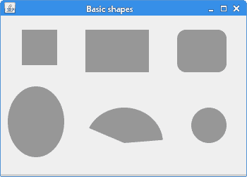
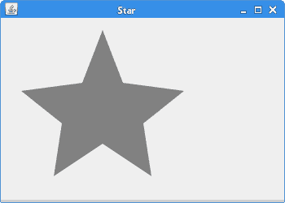
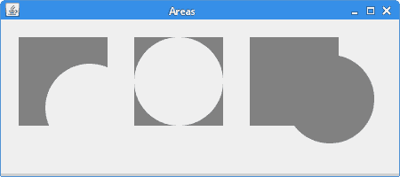
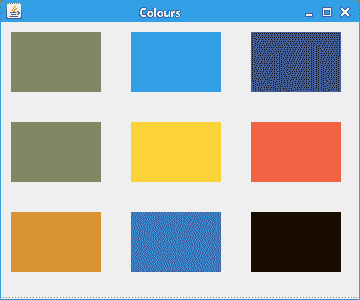
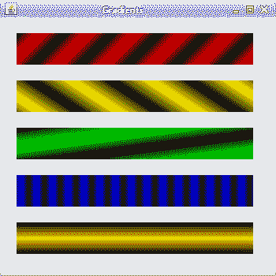
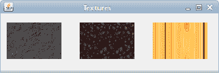

# 形状和填充

> 原文： [https://zetcode.com/gfx/java2d/shapesandfills/](https://zetcode.com/gfx/java2d/shapesandfills/)

在 Java 2D 教程的这一部分中，我们创建一些基本的和更高级的形状。 我们用纯色，渐变和纹理填充形状。

## 基本形状

首先，我们绘制一些基本的 Java 2D 形状。

`BasicShapes.java`

```java
package com.zetcode;

import java.awt.Color;
import java.awt.EventQueue;
import java.awt.Graphics;
import java.awt.Graphics2D;
import java.awt.RenderingHints;
import java.awt.geom.Ellipse2D;
import javax.swing.JFrame;
import javax.swing.JPanel;

class Surface extends JPanel {

    private void doDrawing(Graphics g) {

        Graphics2D g2d = (Graphics2D) g;

        g2d.setPaint(new Color(150, 150, 150));

        RenderingHints rh = new RenderingHints(
                RenderingHints.KEY_ANTIALIASING,
                RenderingHints.VALUE_ANTIALIAS_ON);

        rh.put(RenderingHints.KEY_RENDERING,
               RenderingHints.VALUE_RENDER_QUALITY);

        g2d.setRenderingHints(rh);

        g2d.fillRect(30, 20, 50, 50);
        g2d.fillRect(120, 20, 90, 60);
        g2d.fillRoundRect(250, 20, 70, 60, 25, 25);

        g2d.fill(new Ellipse2D.Double(10, 100, 80, 100));
        g2d.fillArc(120, 130, 110, 100, 5, 150);
        g2d.fillOval(270, 130, 50, 50);
   } 

    @Override
    public void paintComponent(Graphics g) {

        super.paintComponent(g);
        doDrawing(g);
    }    
}

public class BasicShapesEx extends JFrame {

    public BasicShapesEx() {

        initUI();
    }

    private void initUI() {

        add(new Surface());

        setTitle("Basic shapes");
        setSize(350, 250);
        setLocationRelativeTo(null);        
        setDefaultCloseOperation(JFrame.EXIT_ON_CLOSE);
    }

    public static void main(String[] args) {

        EventQueue.invokeLater(new Runnable() {

            @Override
            public void run() {
                BasicShapesEx ex = new BasicShapesEx();
                ex.setVisible(true);
            }
        });
    }
}

```

在此示例中，我们在面板上绘制了六个基本形状：正方形，矩形，圆角矩形，椭圆形，弧形和圆形。

```java
g2d.setPaint(new Color(150, 150, 150));

```

形状将以灰色背景绘制。

```java
g2d.fillRect(20, 20, 50, 50);
g2d.fillRect(120, 20, 90, 60);

```

`fillRect()`方法用于绘制矩形和正方形。 前两个参数是要绘制的形状的 x，y 坐标。 最后两个参数是形状的宽度和高度。

```java
g2d.fillRoundRect(250, 20, 70, 60, 25, 25);

```

在这里，我们创建一个圆角矩形。 最后两个参数是四个角处圆弧的水平和垂直直径。

```java
g2d.fill(new Ellipse2D.Double(10, 100, 80, 100));

```

`fill()`方法绘制给定形状的内部-椭圆。

```java
g2d.fillArc(120, 130, 110, 100, 5, 150);

```

`fillArc()`方法填充覆盖指定矩形的圆弧或椭圆弧。 圆弧是圆的圆周的一部分。

```java
g2d.fillOval(270, 130, 50, 50);

```

使用`fillOval()`方法绘制一个圆。



图：基本形状

## 一般路径

可以使用`GeneralPath`构造更复杂的形状。 它代表由直线，二次贝塞尔曲线和三次贝塞尔曲线构成的几何路径。

下面的示例使用此类创建星形。

`StarEx.java`

```java
package com.zetcode;

import java.awt.Color;
import java.awt.EventQueue;
import java.awt.Graphics;
import java.awt.Graphics2D;
import java.awt.RenderingHints;
import java.awt.geom.GeneralPath;
import javax.swing.JFrame;
import javax.swing.JPanel;

class Surface extends JPanel {

    private final double points[][] = { 
        { 0, 85 }, { 75, 75 }, { 100, 10 }, { 125, 75 }, 
        { 200, 85 }, { 150, 125 }, { 160, 190 }, { 100, 150 }, 
        { 40, 190 }, { 50, 125 }, { 0, 85 } 
    };

    private void doDrawing(Graphics g) {

        Graphics2D g2d = (Graphics2D) g.create();

        g2d.setRenderingHint(RenderingHints.KEY_ANTIALIASING,
                             RenderingHints.VALUE_ANTIALIAS_ON);

        g2d.setRenderingHint(RenderingHints.KEY_RENDERING,
                             RenderingHints.VALUE_RENDER_QUALITY);

        g2d.setPaint(Color.gray);
        g2d.translate(25, 5);

        GeneralPath star = new GeneralPath();

        star.moveTo(points[0][0], points[0][1]);

        for (int k = 1; k < points.length; k++)
            star.lineTo(points[k][0], points[k][1]);

        star.closePath();
        g2d.fill(star);        

        g2d.dispose();
    }

    @Override
    public void paintComponent(Graphics g) {
        super.paintComponent(g);

        doDrawing(g);
    }
}

public class StarEx extends JFrame {

    public StarEx() {

        initUI();
    }    

    private void initUI() {

        add(new Surface());

        setTitle("Star");
        setSize(350, 250);
        setLocationRelativeTo(null);           
        setDefaultCloseOperation(JFrame.EXIT_ON_CLOSE);
    }

    public static void main(String[] args) {

        EventQueue.invokeLater(new Runnable() {

            @Override
            public void run() {
                StarEx ex = new StarEx();
                ex.setVisible(true);
            }
        });
    }    
}

```

我们从一系列角度创造一颗星星。

```java
private final double points[][] = { 
    { 0, 85 }, { 75, 75 }, { 100, 10 }, { 125, 75 }, 
    { 200, 85 }, { 150, 125 }, { 160, 190 }, { 100, 150 }, 
    { 40, 190 }, { 50, 125 }, { 0, 85 } 
};

```

这些是星星的坐标。

```java
GeneralPath star = new GeneralPath();

```

在这里，我们实例化了`GeneralPath`类。

```java
star.moveTo(points[0][0], points[0][1]);

```

我们移到`GeneralPath`的初始坐标。

```java
for (int k = 1; k < points.length; k++)
    star.lineTo(points[k][0], points[k][1]);

```

在这里，我们连接星的所有坐标。

```java
star.closePath();
g2d.fill(star);

```

我们封闭路径并填充星星内部。



图：星星

## 区域

创建复杂形状的另一种方法是组成区域。 `Area`存储和操纵二维空间的封闭区域的与分辨率无关的描述。 可以通过加，减，交，异或运算来操纵它。

`AreasEx.java`

```java
package com.zetcode;

import java.awt.Color;
import java.awt.EventQueue;
import java.awt.Graphics;
import java.awt.Graphics2D;
import java.awt.RenderingHints;
import java.awt.geom.Area;
import java.awt.geom.Ellipse2D;
import java.awt.geom.Rectangle2D;
import javax.swing.JFrame;
import javax.swing.JPanel;

class Surface extends JPanel {

    public void doDrawing(Graphics g) {

        Graphics2D g2d = (Graphics2D) g;

        RenderingHints rh = new RenderingHints(
                RenderingHints.KEY_ANTIALIASING,
                RenderingHints.VALUE_ANTIALIAS_ON);

        rh.put(RenderingHints.KEY_RENDERING,
               RenderingHints.VALUE_RENDER_QUALITY);    
        g2d.setRenderingHints(rh);

        g2d.setPaint(Color.gray);

        Area a1 = new Area(new Rectangle2D.Double(20, 20, 100, 100));
        Area a2 = new Area(new Ellipse2D.Double(50, 50, 100, 100));

        a1.subtract(a2);
        g2d.fill(a1);

        Area a3 = new Area(new Rectangle2D.Double(150, 20, 100, 100));
        Area a4 = new Area(new Ellipse2D.Double(150, 20, 100, 100));        

        a3.subtract(a4);
        g2d.fill(a3);

        Area a5 = new Area(new Rectangle2D.Double(280, 20, 100, 100));
        Area a6 = new Area(new Ellipse2D.Double(320, 40, 100, 100));        

        a5.add(a6);
        g2d.fill(a5);        
    }

    @Override
    public void paintComponent(Graphics g) {

        super.paintComponent(g);
        doDrawing(g);
    }           
}

public class AreasEx extends JFrame {

    public AreasEx() {

        initUI();
    }

    private void initUI() {

        add(new Surface());

        setTitle("Areas");
        setSize(450, 200);
        setLocationRelativeTo(null);        
        setDefaultCloseOperation(JFrame.EXIT_ON_CLOSE);
    }

    public static void main(String[] args) {

        EventQueue.invokeLater(new Runnable() {

            @Override
            public void run() {
                AreasEx ex = new AreasEx();
                ex.setVisible(true);
            }
        });
    }
}

```

该示例通过操纵区域来创建三种不同的形状。

```java
Area a1 = new Area(new Rectangle2D.Double(20, 20, 100, 100));
Area a2 = new Area(new Ellipse2D.Double(50, 50, 100, 100));

a1.subtract(a2);
g2d.fill(a1);

```

此代码通过从矩形中减去椭圆来构造形状。

```java
Area a5 = new Area(new Rectangle2D.Double(280, 20, 100, 100));
Area a6 = new Area(new Ellipse2D.Double(320, 40, 100, 100));        

a5.add(a6);
g2d.fill(a5); 

```

这些线通过在椭圆上添加矩形来构造形状。



图：区域

## 色彩

`Color`类用于处理 Java 2D 中的颜色。 要使用当前颜色填充矩形，我们使用`fillRect()`方法。

`ColoursEx.java`

```java
package com.zetcode;

import java.awt.Color;
import java.awt.EventQueue;
import java.awt.Graphics;
import java.awt.Graphics2D;
import javax.swing.JFrame;
import javax.swing.JPanel;

class Surface extends JPanel {

    public void doDrawing(Graphics g) {

        Graphics2D g2d = (Graphics2D) g;

        g2d.setColor(new Color(125, 167, 116));
        g2d.fillRect(10, 10, 90, 60);

        g2d.setColor(new Color(42, 179, 231));
        g2d.fillRect(130, 10, 90, 60);

        g2d.setColor(new Color(70, 67, 123));
        g2d.fillRect(250, 10, 90, 60);

        g2d.setColor(new Color(130, 100, 84));
        g2d.fillRect(10, 100, 90, 60);

        g2d.setColor(new Color(252, 211, 61));
        g2d.fillRect(130, 100, 90, 60);

        g2d.setColor(new Color(241, 98, 69));
        g2d.fillRect(250, 100, 90, 60);

        g2d.setColor(new Color(217, 146, 54));
        g2d.fillRect(10, 190, 90, 60);

        g2d.setColor(new Color(63, 121, 186));
        g2d.fillRect(130, 190, 90, 60);

        g2d.setColor(new Color(31, 21, 1));
        g2d.fillRect(250, 190, 90, 60);
    }

    @Override
    public void paintComponent(Graphics g) {

        super.paintComponent(g);
        doDrawing(g);
    }           
}

public class ColoursEx extends JFrame {

    public ColoursEx() {

        initUI();
    }

    private void initUI() {

        add(new Surface());

        setTitle("Colours");
        setSize(360, 300);
        setLocationRelativeTo(null);        
        setDefaultCloseOperation(JFrame.EXIT_ON_CLOSE);
    }

    public static void main(String[] args) {

        EventQueue.invokeLater(new Runnable() {

            @Override
            public void run() {
                ColoursEx ex = new ColoursEx();
                ex.setVisible(true);
            }
        });
    }
}

```

在示例中，我们绘制了九个彩色矩形。

```java
Graphics2D g2d = (Graphics2D) g;

```

更改图形上下文的`color`属性时，无需创建`Graphics2D`类的副本或重置该值。

```java
g2d.setColor(new Color(125, 167, 116));

```

使用`Color`类创建新的颜色。 构造函数的参数是新颜色的红色，绿色和蓝色部分。 `setColor()`方法将图形上下文的当前颜色设置为指定的颜色值。 所有后续图形操作均使用此颜色值。

```java
g2d.fillRect(10, 15, 90, 60);

```

为了用颜色填充矩形，我们使用`fillRect()`方法。



图：颜色

## 渐变色

在计算机图形学中，渐变是从浅到深或从一种颜色到另一种颜色的阴影的平滑混合。 在 2D 绘图程序和绘画程序中，渐变用于创建彩色背景和特殊效果以及模拟灯光和阴影。 （answers.com）

`GradientsEx.java`

```java
package com.zetcode;

import java.awt.Color;
import java.awt.EventQueue;
import java.awt.GradientPaint;
import java.awt.Graphics;
import java.awt.Graphics2D;
import javax.swing.JFrame;
import javax.swing.JPanel;

class Surface extends JPanel {

    private void doDrawing(Graphics g) {

        Graphics2D g2d = (Graphics2D) g.create();

        GradientPaint gp1 = new GradientPaint(5, 5, 
            Color.red, 20, 20, Color.black, true);

        g2d.setPaint(gp1);
        g2d.fillRect(20, 20, 300, 40);

        GradientPaint gp2 = new GradientPaint(5, 25, 
            Color.yellow, 20, 2, Color.black, true);

        g2d.setPaint(gp2);
        g2d.fillRect(20, 80, 300, 40);

        GradientPaint gp3 = new GradientPaint(5, 25, 
            Color.green, 2, 2, Color.black, true);

        g2d.setPaint(gp3);
        g2d.fillRect(20, 140, 300, 40);

        GradientPaint gp4 = new GradientPaint(25, 25, 
            Color.blue, 15, 25, Color.black, true);

        g2d.setPaint(gp4);
        g2d.fillRect(20, 200, 300, 40);

        GradientPaint gp5 = new GradientPaint(0, 0, 
             Color.orange, 0, 20, Color.black, true);

        g2d.setPaint(gp5);
        g2d.fillRect(20, 260, 300, 40);   

        g2d.dispose();
    }

    @Override
    public void paintComponent(Graphics g) {

        super.paintComponent(g);
        doDrawing(g);
    }
}

public class GradientsEx extends JFrame {

    public GradientsEx() {

        initUI();
    }    

    private void initUI() {

        add(new Surface());

        setTitle("Gradients");
        setSize(350, 350);
        setLocationRelativeTo(null);            
        setDefaultCloseOperation(JFrame.EXIT_ON_CLOSE);
    }

    public static void main(String[] args) {

        EventQueue.invokeLater(new Runnable() {

            @Override
            public void run() {
                GradientsEx ex = new GradientsEx();
                ex.setVisible(true);
            }
        });
    }    
}

```

我们的代码示例展示了五个带有渐变的矩形。

```java
GradientPaint gp4 = new GradientPaint(25, 25, 
    Color.blue, 15, 25, Color.black, true);

```

要使用渐变，我们使用`GradientPaint`类。 通过操纵颜色值以及起点和终点，我们可以获得不同的结果。

```java
g2d.setPaint(gp4);

```

通过调用`setPaint()`方法激活渐变。



图：渐变

## 纹理

纹理是应用于形状的位图图像。 要在 Java 2D 中使用纹理，我们使用`TexturePaint`类。 通过`setPaint()`方法应用纹理。

`TexturesEx.java`

```java
package com.zetcode;

import java.awt.EventQueue;
import java.awt.Graphics;
import java.awt.Graphics2D;
import java.awt.Rectangle;
import java.awt.TexturePaint;
import java.awt.image.BufferedImage;
import java.io.File;
import java.io.IOException;
import java.util.logging.Level;
import java.util.logging.Logger;
import javax.imageio.ImageIO;
import javax.swing.JFrame;
import javax.swing.JPanel;

class Surface extends JPanel {

    private BufferedImage slate;
    private BufferedImage java;
    private BufferedImage pane;
    private TexturePaint slatetp;
    private TexturePaint javatp;
    private TexturePaint panetp;

    public Surface() {

        loadImages();
    }

    private void loadImages() {

        try {

            slate = ImageIO.read(new File("slate.png"));
            java = ImageIO.read(new File("java.png"));
            pane = ImageIO.read(new File("pane.png"));

        } catch (IOException ex) {

            Logger.getLogger(Surface.class.getName()).log(
                    Level.SEVERE, null, ex);
        }
    }

    private void doDrawing(Graphics g) {

        Graphics2D g2d = (Graphics2D) g.create();

        slatetp = new TexturePaint(slate, new Rectangle(0, 0, 90, 60));
        javatp = new TexturePaint(java, new Rectangle(0, 0, 90, 60));
        panetp = new TexturePaint(pane, new Rectangle(0, 0, 90, 60));

        g2d.setPaint(slatetp);
        g2d.fillRect(10, 15, 90, 60);

        g2d.setPaint(javatp);
        g2d.fillRect(130, 15, 90, 60);

        g2d.setPaint(panetp);
        g2d.fillRect(250, 15, 90, 60);

        g2d.dispose();
    }

    @Override
    public void paintComponent(Graphics g) {

        super.paintComponent(g);
        doDrawing(g);
    }
}

public class TexturesEx extends JFrame {

    public TexturesEx() {

        initUI();
    }

    private void initUI() {

        add(new Surface());

        setTitle("Textures");
        setSize(360, 120);
        setLocationRelativeTo(null);        
        setDefaultCloseOperation(JFrame.EXIT_ON_CLOSE);
    }

    public static void main(String[] args) {

        EventQueue.invokeLater(new Runnable() {

            @Override
            public void run() {
                TexturesEx ex = new TexturesEx();
                ex.setVisible(true);
            }
        });
    }
}

```

在代码示例中，我们用三个不同的纹理填充三个矩形。

```java
slate = ImageIO.read(new File("slate.png"));

```

使用`ImageIO`类，我们将图像读取到缓冲图像中。

```java
slatetp = new TexturePaint(slate, new Rectangle(0, 0, 90, 60));

```

我们从缓冲图像中创建一个`TexturePaint`类。

```java
g2d.setPaint(slatetp);
g2d.fillRect(10, 15, 90, 60);

```

我们用纹理填充矩形。



图：纹理

在 Java 2D 教程的这一部分中，我们介绍了 Java 2D 库的一些基本形状和更高级的形状。