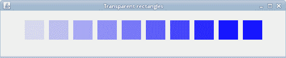
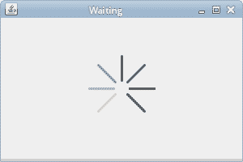

# 透明度

> 原文： [https://zetcode.com/gfx/java2d/transparency/](https://zetcode.com/gfx/java2d/transparency/)

在 Java 2D 的这一部分中，我们讨论透明性。 我们提供一些基本定义和一些有趣的透明效果。

## 透明度说明

透明性是指能够透视材料的质量。 了解透明度的最简单方法是想象一块玻璃或水。 从技术上讲，光线可以穿过玻璃，这样我们就可以看到玻璃后面的物体。

在计算机图形学中，我们可以使用 alpha 合成实现透明效果。 Alpha 合成是将图像与背景组合以创建部分透明外观的过程。 合成过程使用 alpha 通道。 Alpha 通道是图形文件格式的 8 位层，用于表达半透明性（透明度）。 每个像素的额外八位用作掩码，表示 256 级半透明。
（answers.com，wikipedia.org）

`AlphaComposite`类用于 Java 2D 中的透明性。 它实现了基本的 alpha 合成规则，用于合并源像素和目标像素，以实现图形和图像的融合和透明效果。 要创建`AlphaComposite`，我们提供两个值：规则指示符和 alpha 值。 该规则指定了我们如何组合源像素和目标像素。 最常见的是`AlphaComposite.SRC_OVER`。 alpha 值的范围可以从`0.0f`（完全透明）到`1.0f`（完全不透明）。

## 透明矩形

第一个示例绘制了十个具有不同透明度级别的矩形。

`TransparentRectanglesEx.java`

```
package com.zetcode;

import java.awt.AlphaComposite;
import java.awt.Color;
import java.awt.EventQueue;
import java.awt.Graphics;
import java.awt.Graphics2D;
import javax.swing.JFrame;
import javax.swing.JPanel;

class Surface extends JPanel {    

    private void doDrawing(Graphics g) {        

        Graphics2D g2d = (Graphics2D) g.create();

        g2d.setPaint(Color.blue);

        for (int i = 1; i <= 10; i++) {

            float alpha = i * 0.1f;
            AlphaComposite alcom = AlphaComposite.getInstance(
                    AlphaComposite.SRC_OVER, alpha);
            g2d.setComposite(alcom);
            g2d.fillRect(50 * i, 20, 40, 40);
        }        

        g2d.dispose();
    }

    @Override
    public void paintComponent(Graphics g) {

        super.paintComponent(g);
        doDrawing(g);
    }
}

public class TransparentRectanglesEx extends JFrame {

    public TransparentRectanglesEx() {

        initUI();
    }

    private void initUI() {

        add(new Surface());

        setTitle("Transparent rectangles");
        setSize(590, 120);
        setLocationRelativeTo(null);            
        setDefaultCloseOperation(JFrame.EXIT_ON_CLOSE);
    }

    public static void main(String[] args) {

        EventQueue.invokeLater(new Runnable() {
            @Override
            public void run() {

                TransparentRectanglesEx ex = new TransparentRectanglesEx();
                ex.setVisible(true);
            }
        });
    }
}

```

在我们的示例中，我们绘制了 10 个具有不同透明度级别的蓝色矩形。

```
float alpha = i * 0.1f;

```

alpha 值在`for`循环中动态变化。

```
AlphaComposite alcom = AlphaComposite.getInstance(
        AlphaComposite.SRC_OVER, alpha);

```

`AlphaComposite.getInstance()`方法使用指定的规则和常数 alpha 来创建`AlphaComposite`对象，以与源的 alpha 相乘。

```
g2d.setComposite(alcom);

```

`setComposite()`方法设置`Graphics2D`对象的复合属性。



Figure: Transparent rectangles

## 淡出演示

在下一个示例中，我们将淡出图像。 图像将逐渐变得更加透明，直到完全不可见为止。

`FadeOutEx.java`

```
package com.zetcode;

import java.awt.AlphaComposite;
import java.awt.Dimension;
import java.awt.EventQueue;
import java.awt.Graphics;
import java.awt.Graphics2D;
import java.awt.Image;
import java.awt.event.ActionEvent;
import java.awt.event.ActionListener;
import javax.swing.ImageIcon;
import javax.swing.JFrame;
import javax.swing.JPanel;
import javax.swing.Timer;

class Surface extends JPanel
        implements ActionListener {

    private Image img;
    private Timer timer;
    private float alpha = 1f;

    private final int DELAY = 40;
    private final int INITIAL_DELAY = 500;

    public Surface() {

        loadImage();
        setSurfaceSize();
        initTimer();
    }

    private void loadImage() {

        img = new ImageIcon("mushrooms.jpg").getImage();
    }

    private void setSurfaceSize() {

        int h = img.getHeight(this);
        int w = img.getWidth(this);
        setPreferredSize(new Dimension(w, h));
    }

    private void initTimer() {

        timer = new Timer(DELAY, this);
        timer.setInitialDelay(INITIAL_DELAY);
        timer.start();
    }

    private void doDrawing(Graphics g) {

        Graphics2D g2d = (Graphics2D) g.create();

        AlphaComposite acomp = AlphaComposite.getInstance(
                AlphaComposite.SRC_OVER, alpha);
        g2d.setComposite(acomp);
        g2d.drawImage(img, 0, 0, null);

        g2d.dispose();
    }

    @Override
    public void paintComponent(Graphics g) {

        super.paintComponent(g);
        doDrawing(g);
    }

    private void step() {

        alpha += -0.01f;

        if (alpha <= 0) {

            alpha = 0;
            timer.stop();
        }
    }

    @Override
    public void actionPerformed(ActionEvent e) {

        step();
        repaint();
    }
}

public class FadeOutEx extends JFrame {

    public FadeOutEx() {

        initUI();
    }

    private void initUI() {

        add(new Surface());

        pack();

        setTitle("Fade out");
        setLocationRelativeTo(null);
        setDefaultCloseOperation(JFrame.EXIT_ON_CLOSE);
    }

    public static void main(String[] args) {

        EventQueue.invokeLater(new Runnable() {
            @Override
            public void run() {

                FadeOutEx ex = new FadeOutEx();
                ex.setVisible(true);
            }
        });
    }
}

```

使用`AlphaComposite`，我们逐渐淡出面板上的图像。

```
private void setSurfaceSize() {

    int h = img.getHeight(this);
    int w = img.getWidth(this);
    setPreferredSize(new Dimension(w, h));        
}

```

`setSurfaceSize()`方法找出图像的尺寸并为面板设置首选尺寸。 首选尺寸与`pack()`方法的组合将显示恰好足以显示整个图像的窗口。

```
private void initTimer() {

    timer = new Timer(DELAY, this);
    timer.setInitialDelay(INITIAL_DELAY);
    timer.start();
}

```

`initTimer()`方法启动一个计时器。 计时器在指定的初始延迟后触发操作事件。 在事件之间延迟之后会生成连续的动作事件。 为了响应动作事件，我们将更改 Alpha 值并重新绘制面板。

```
AlphaComposite acomp = AlphaComposite.getInstance(
        AlphaComposite.SRC_OVER, alpha);
g2d.setComposite(acomp);
g2d.drawImage(img, 0, 0, null); 

```

此代码在面板上绘制具有增加的透明度的图像。

```
private void step() {

    alpha += -0.01f;

    if (alpha <= 0) {

        alpha = 0;
        timer.stop();
    }
}

```

`step()`方法代表淡出周期。 `alpha`逐渐降低。 请注意，alpha 值不得为负。 当达到零时，计时器停止。

```
repaint();

```

`repaint()`方法重新绘制组件。 它调用面板组件的`paint()`方法，然后又调用`paintComponent()`方法。

## 等待演示

在此示例中，我们使用透明效果创建一个等待演示。 我们绘制了 8 条逐渐消失的线，从而产生了一条线在移动的错觉。 此类效果通常用于通知用户幕后正在进行繁重的任务。 例如，通过互联网流式传输视频时。

`WaitingEx.java`

```
package com.zetcode;

import java.awt.AlphaComposite;
import java.awt.BasicStroke;
import java.awt.EventQueue;
import java.awt.Graphics;
import java.awt.Graphics2D;
import java.awt.RenderingHints;
import java.awt.event.ActionEvent;
import java.awt.event.ActionListener;
import javax.swing.JFrame;
import javax.swing.JPanel;
import javax.swing.Timer;

class Surface extends JPanel
        implements ActionListener {

    private Timer timer;
    private int count;
    private final int INITIAL_DELAY = 200;
    private final int DELAY = 80;
    private final int NUMBER_OF_LINES = 8;
    private final int STROKE_WIDTH = 3;

    private final double[][] trs = {
        {0.0, 0.15, 0.30, 0.5, 0.65, 0.80, 0.9, 1.0},
        {1.0, 0.0, 0.15, 0.30, 0.5, 0.65, 0.8, 0.9},
        {0.9, 1.0, 0.0, 0.15, 0.3, 0.5, 0.65, 0.8},
        {0.8, 0.9, 1.0, 0.0, 0.15, 0.3, 0.5, 0.65},
        {0.65, 0.8, 0.9, 1.0, 0.0, 0.15, 0.3, 0.5},
        {0.5, 0.65, 0.8, 0.9, 1.0, 0.0, 0.15, 0.3},
        {0.3, 0.5, 0.65, 0.8, 0.9, 1.0, 0.0, 0.15},
        {0.15, 0.3, 0.5, 0.65, 0.8, 0.9, 1.0, 0.0}
    };

    public Surface() {

        initTimer();
    }

    private void initTimer() {

        timer = new Timer(DELAY, this);
        timer.setInitialDelay(INITIAL_DELAY);
        timer.start();        
    }

    private void doDrawing(Graphics g) {

        Graphics2D g2d = (Graphics2D) g.create();

        g2d.setRenderingHint(RenderingHints.KEY_ANTIALIASING,
                RenderingHints.VALUE_ANTIALIAS_ON);
        g2d.setRenderingHint(RenderingHints.KEY_RENDERING,
                RenderingHints.VALUE_RENDER_QUALITY);

        int width = getWidth();
        int height = getHeight();

        g2d.setStroke(new BasicStroke(STROKE_WIDTH, BasicStroke.CAP_ROUND,
                BasicStroke.JOIN_ROUND));
        g2d.translate(width / 2, height / 2);

        for (int i = 0; i < NUMBER_OF_LINES; i++) {

            float alpha = (float) trs[count % NUMBER_OF_LINES][i];
            AlphaComposite acomp = AlphaComposite.getInstance(
                    AlphaComposite.SRC_OVER, alpha);
            g2d.setComposite(acomp);

            g2d.rotate(Math.PI / 4f);
            g2d.drawLine(0, -10, 0, -40);
        }

        g2d.dispose();
    }

    @Override
    public void paintComponent(Graphics g) {

        super.paintComponent(g);
        doDrawing(g);
    }

    @Override
    public void actionPerformed(ActionEvent e) {

        repaint();
        count++;
    }
}

public class WaitingEx extends JFrame {

    public WaitingEx() {

        initUI();
    }

    private void initUI() {

        add(new Surface());

        setTitle("Waiting");
        setSize(300, 200);
        setLocationRelativeTo(null);
        setDefaultCloseOperation(JFrame.EXIT_ON_CLOSE);
    }

    public static void main(String[] args) {

        EventQueue.invokeLater(new Runnable() {
            @Override
            public void run() {

                WaitingEx ex = new WaitingEx();
                ex.setVisible(true);
            }
        });
    }
}

```

我们用八个不同的 alpha 值绘制八条线。

```
private final double[][] trs = { 
...
};

```

这是此演示中使用的透明度值的二维数组。 有 8 行，每行一种状态。 8 行中的每行将连续使用这些值。

```
g2d.setStroke(new BasicStroke(STROKE_WIDTH, BasicStroke.CAP_ROUND,
        BasicStroke.JOIN_ROUND));

```

我们使线条更粗一些，以便更好地显示它们。 我们用圆帽画线。

```
g2d.rotate(Math.PI/4f);
g2d.drawLine(0, -10, 0, -40);

```

这段代码绘制了八行。 `rotate()`方法用于沿直线旋转线。



Figure: Waiting

在 Java 2D 教程的这一部分中，我们讨论了透明性。