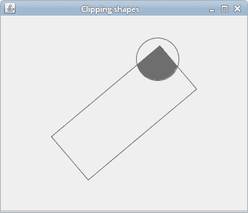

# 剪裁

> 原文： [https://zetcode.com/gfx/java2d/clipping/](https://zetcode.com/gfx/java2d/clipping/)

在 Java 2D 教程的这一部分中，我们将讨论裁剪。

## 剪裁

剪裁将图形限制在某个区域。 这样做是出于效率原因并产生各种效果。 使用剪辑时，我们必须使用`Graphics`对象的副本，或者恢复原始的剪辑属性。 更改剪辑不会影响现有像素； 它仅影响将来的渲染。

在以下示例中，我们将图像裁剪为圆形。

`ClippingEx.java`

```java
package com.zetcode;

import java.awt.Dimension;
import java.awt.EventQueue;
import java.awt.Graphics;
import java.awt.Graphics2D;
import java.awt.Image;
import java.awt.event.ActionEvent;
import java.awt.event.ActionListener;
import java.awt.geom.Ellipse2D;
import javax.swing.ImageIcon;
import javax.swing.JFrame;
import javax.swing.JPanel;
import javax.swing.Timer;

class Surface extends JPanel 
        implements ActionListener {

    private int pos_x = 8;
    private int pos_y = 8;
    private final int RADIUS = 90;
    private final int DELAY = 35;

    private Timer timer;
    private Image image;

    private final double delta[] = { 3, 3 };

    public Surface() {

        loadImage();
        determineAndSetImageSize();
        initTimer();
    }

    private void loadImage() {

        image = new ImageIcon("mushrooms.jpg").getImage();
    }

    private void determineAndSetImageSize() {

        int h = image.getHeight(this);
        int w = image.getWidth(this);
        setPreferredSize(new Dimension(w, h));        
    }    

    private void initTimer() {   

        timer = new Timer(DELAY, this);
        timer.start();
    }

    private void doDrawing(Graphics g) {

        Graphics2D g2d = (Graphics2D) g.create();

        g2d.clip(new Ellipse2D.Double(pos_x, pos_y, RADIUS, RADIUS));
        g2d.drawImage(image, 0, 0, null); 

        g2d.dispose();
    }

    @Override
    public void paintComponent(Graphics g) {

        super.paintComponent(g);
        doDrawing(g);
    }

    @Override
    public void actionPerformed(ActionEvent e) {

        moveCircle();
        repaint();
    }

    private void moveCircle() {

        int w = getWidth();
        int h = getHeight();

        if (pos_x < 0) {

            delta[0] = Math.random() % 4 + 5;
        } else if (pos_x > w - RADIUS) {

            delta[0] = -(Math.random() % 4 + 5);
        }

        if (pos_y < 0 ) {

            delta[1] = Math.random() % 4 + 5;
        } else if (pos_y > h - RADIUS) {

            delta[1] = -(Math.random() % 4 + 5);
        }

        pos_x += delta[0];
        pos_y += delta[1];
    }       
}

public class ClippingEx extends JFrame {

    public ClippingEx() {

        initUI();
    }

    private void initUI() {

        setTitle("Clipping");

        add(new Surface());

        pack();
        setDefaultCloseOperation(JFrame.EXIT_ON_CLOSE);
        setLocationRelativeTo(null);        
    }

    public static void main(String[] args) {

        EventQueue.invokeLater(new Runnable() {

            @Override
            public void run() {
                ClippingEx cl = new ClippingEx();
                cl.setVisible(true);
            }
        });        
    }
}

```

屏幕上正在移动一个圆圈，并显示了一部分基础图像。 这就像我们从孔中看一样。

```java
Graphics2D g2d = (Graphics2D) g.create();

```

我们创建`Graphics2D`对象的副本。 因此，更改剪辑不会影响其他在`Graphics2D`对象被重用的 Swing 零件。

```java
g2d.clip(new Ellipse2D.Double(pos_x, pos_y, RADIUS, RADIUS));

```

`clip()`方法将现有剪辑与作为参数给出的形状结合在一起。 所得的相交设置为片段。 在我们的例子中，最终的剪辑是圆形。

```java
if (pos_x < 0) {

    delta[0] = Math.random() % 4 + 5;
} else if (pos_x > w - RADIUS) {

    delta[0] = -(Math.random() % 4 + 5);
}

```

如果圆碰到窗口的左侧或右侧，则圆的移动方向会随机变化。 顶部和底部也一样。

```java
g2d.dispose();

```

完成绘画后，我们必须释放`Graphics2D`对象的副本。

## 剪裁形状

在下面的示例中，我们将剪切到两个形状的交点：矩形和圆形。

`ClippingShapesEx.java`

```java
package com.zetcode;

import java.awt.Color;
import java.awt.EventQueue;
import java.awt.Graphics;
import java.awt.Graphics2D;
import java.awt.Rectangle;
import java.awt.RenderingHints;
import java.awt.Shape;
import java.awt.event.ActionEvent;
import java.awt.event.ActionListener;
import java.awt.geom.AffineTransform;
import java.awt.geom.Ellipse2D;
import java.awt.geom.GeneralPath;
import javax.swing.JFrame;
import javax.swing.JPanel;
import javax.swing.Timer;

class Surface extends JPanel
        implements ActionListener {

    private Timer timer;
    private double rotate = 1;
    private int pos_x = 8;
    private int pos_y = 8;
    private final double delta[] = {1, 1};

    private final int RADIUS = 60;

    public Surface() {

        initTimer();
    }

    private void initTimer() {

        timer = new Timer(10, this);
        timer.start();
    }

    private void doDrawing(Graphics g) {

        Graphics2D g2d = (Graphics2D) g;

        g2d.setRenderingHint(RenderingHints.KEY_ANTIALIASING,
                RenderingHints.VALUE_ANTIALIAS_ON);

        g2d.setRenderingHint(RenderingHints.KEY_RENDERING,
                RenderingHints.VALUE_RENDER_QUALITY);

        Shape oldClip = g2d.getClip();

        int w = getWidth();
        int h = getHeight();

        Rectangle rect = new Rectangle(0, 0, 200, 80);

        AffineTransform tx = new AffineTransform();
        tx.rotate(Math.toRadians(rotate), w / 2, h / 2);
        tx.translate(w / 2 - 100, h / 2 - 40);

        Ellipse2D circle = new Ellipse2D.Double(pos_x, pos_y,
                RADIUS, RADIUS);

        GeneralPath path = new GeneralPath();
        path.append(tx.createTransformedShape(rect), false);

        g2d.clip(circle);
        g2d.clip(path);

        g2d.setPaint(new Color(110, 110, 110));
        g2d.fill(circle);

        g2d.setClip(oldClip);

        g2d.draw(circle);
        g2d.draw(path);
    }

    @Override
    public void paintComponent(Graphics g) {
        super.paintComponent(g);

        doDrawing(g);
    }

    public void step() {

        int w = getWidth();
        int h = getHeight();

        rotate += 1;

        if (pos_x < 0) {

            delta[0] = 1;
        } else if (pos_x > w - RADIUS) {

            delta[0] = -1;
        }

        if (pos_y < 0) {

            delta[1] = 1;
        } else if (pos_y > h - RADIUS) {

            delta[1] = -1;
        }

        pos_x += delta[0];
        pos_y += delta[1];
    }

    @Override
    public void actionPerformed(ActionEvent e) {

        step();
        repaint();
    }
}

public class ClippingShapesEx extends JFrame {

    public ClippingShapesEx() {

        initUI();
    }

    private void initUI() {

        setTitle("Clipping shapes");

        add(new Surface());

        setSize(350, 300);
        setDefaultCloseOperation(JFrame.EXIT_ON_CLOSE);
        setLocationRelativeTo(null);
    }

    public static void main(String[] args) {

        EventQueue.invokeLater(new Runnable() {

            @Override
            public void run() {
                ClippingShapesEx ex = new ClippingShapesEx();
                ex.setVisible(true);
            }
        });
    }
}

```

在我们的示例中，我们有一个弹跳的圆和一个旋转的矩形。 当这些形状重叠时，结果区域将充满颜色。

```java
Shape oldClip = g2d.getClip();

```

由于我们没有创建`Graphics2D`对象的副本，因此我们将存储旧剪辑以供以后使用。 最后，我们必须将剪辑重置为原始剪辑。

```java
Rectangle rect = new Rectangle(0, 0, 200, 80);

AffineTransform tx = new AffineTransform();
tx.rotate(Math.toRadians(rotate), w / 2, h / 2);
tx.translate(w / 2 - 100, h / 2 - 40);

```

矩形正在旋转。 它始终位于面板的中间。

```java
GeneralPath path = new GeneralPath();
path.append(tx.createTransformedShape(rect), false);

```

在这里，我们得到了旋转矩形的形状。

```java
g2d.clip(circle);
g2d.clip(path);

g2d.setPaint(new Color(110, 110, 110));
g2d.fill(circle);

```

在这里，我们将绘图限制为两个形状的交点。 如果它们重叠，则结果形状的内部将充满颜色。 `clip()`方法将初始剪辑（组件的客户区域）与给定的两个形状组合在一起。

```java
g2d.setClip(oldClip);

```

使用`setClip()`方法，我们在绘制形状之前将剪辑区域重置为旧剪辑。 与`clip()`方法不同，`setClip()`不合并剪切区域。 它将剪辑重置到新区域。 因此，此方法应专门用于还原旧剪辑。



Figure: Clipping shapes

在 Java 2D 教程的这一部分中，我们讨论了剪辑。