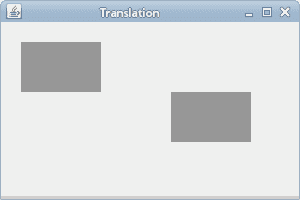
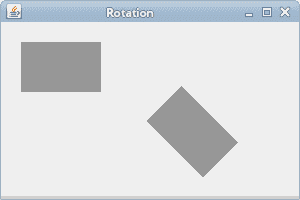
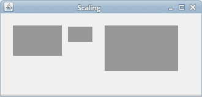
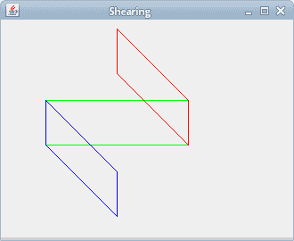

# 转变

> 原文： [https://zetcode.com/gfx/java2d/transformations/](https://zetcode.com/gfx/java2d/transformations/)

在 Java 2D 编程教程的这一部分中，我们将讨论转换。

仿射变换由零个或多个线性变换（旋转，缩放或剪切）和平移（移位）组成。 几个线性变换可以组合成一个矩阵。 旋转是使刚体绕固定点移动的变换。 缩放是一种放大或缩小对象的变换。 比例因子在所有方向上都是相同的。 平移是使每个点在指定方向上移动恒定距离的变换。 剪切是一种使对象垂直于给定轴移动的变换，该值在轴的一侧比另一侧更大。 资料来源：（wikipedia.org，freedictionary.com）

`AffineTransform`是 Java 2D 中用于执行仿射变换的类。

## 翻译

以下示例描述了一个简单的翻译。

`TranslationEx.java`

```
package com.zetcode;

import java.awt.Color;
import java.awt.EventQueue;
import java.awt.Graphics;
import java.awt.Graphics2D;
import javax.swing.JFrame;
import javax.swing.JPanel;

class Surface extends JPanel {

    private void doDrawing(Graphics g) {

        Graphics2D g2d = (Graphics2D) g.create();

        g2d.setPaint(new Color(150, 150, 150));
        g2d.fillRect(20, 20, 80, 50);
        g2d.translate(150, 50);
        g2d.fillRect(20, 20, 80, 50);

        g2d.dispose();
    }

    @Override
    public void paintComponent(Graphics g) {

        super.paintComponent(g);
        doDrawing(g);
    }
}

public class TranslationEx extends JFrame {

    public TranslationEx() {

        initUI();
    }

    private void initUI() {

        add(new Surface());

        setTitle("Translation");
        setSize(300, 200);
        setLocationRelativeTo(null);        
        setDefaultCloseOperation(JFrame.EXIT_ON_CLOSE);
    }

    public static void main(String[] args) {

        EventQueue.invokeLater(new Runnable() {
            @Override
            public void run() {

                TranslationEx ex = new TranslationEx();
                ex.setVisible(true);
            }
        });                    
    }
}

```

该示例绘制一个矩形。 然后，我们进行平移并再次绘制相同的矩形。

```
g2d.translate(150, 50);

```

这条线将`Graphics2D`上下文的原点移到新点。



Figure: Translation

## 回转

下一个示例演示了旋转。

`RotationEx.java`

```
package com.zetcode;

import java.awt.Color;
import java.awt.EventQueue;
import java.awt.Graphics;
import java.awt.Graphics2D;
import javax.swing.JFrame;
import javax.swing.JPanel;

class Surface extends JPanel {

    private void doDrawing(Graphics g) {

        Graphics2D g2d = (Graphics2D) g.create();

        g2d.setPaint(new Color(150, 150, 150));
        g2d.fillRect(20, 20, 80, 50);
        g2d.translate(180, -50);
        g2d.rotate(Math.PI/4);
        g2d.fillRect(80, 80, 80, 50);

        g2d.dispose();
    }

    @Override
    public void paintComponent(Graphics g) {

        super.paintComponent(g);
        doDrawing(g);
    }
}

public class RotationEx extends JFrame {

    public RotationEx() {

        initUI();
    }

    private void initUI() {

        setTitle("Rotation");

        add(new Surface());

        setSize(300, 200);
        setLocationRelativeTo(null);        
        setDefaultCloseOperation(JFrame.EXIT_ON_CLOSE);
    }

    public static void main(String[] args) {

        EventQueue.invokeLater(new Runnable() {
            @Override
            public void run() {

                RotationEx ex = new RotationEx();
                ex.setVisible(true);
            }
        });                    
    }
}

```

该示例绘制一个矩形，执行平移和旋转，然后再次绘制相同的矩形。

```
g2d.rotate(Math.PI/4);

```

`rotate()`方法执行旋转。 请注意，旋转参数以弧度为单位。



Figure: Rotation

## 缩放比例

下一个示例演示对象的缩放。 缩放是通过`scale()`方法完成的。 在此方法中，我们提供了两个参数。 它们是 x 比例因子和 y 比例因子，通过它们分别沿 x 或 y 轴缩放坐标。

`ScalingEx.java`

```
package com.zetcode;

import java.awt.Color;
import java.awt.EventQueue;
import java.awt.Graphics;
import java.awt.Graphics2D;
import java.awt.geom.AffineTransform;
import javax.swing.JFrame;
import javax.swing.JPanel;

class Surface extends JPanel {

    private void doDrawing(Graphics g) {

        Graphics2D g2d = (Graphics2D) g.create();

        g2d.setColor(new Color(150, 150, 150));
        g2d.fillRect(20, 20, 80, 50);

        AffineTransform tx1 = new AffineTransform();
        tx1.translate(110, 22);
        tx1.scale(0.5, 0.5);

        g2d.setTransform(tx1);
        g2d.fillRect(0, 0, 80, 50);

        AffineTransform tx2 = new AffineTransform();
        tx2.translate(170, 20);
        tx2.scale(1.5, 1.5);

        g2d.setTransform(tx2);
        g2d.fillRect(0, 0, 80, 50);

        g2d.dispose();
    }

    @Override
    public void paintComponent(Graphics g) {

        super.paintComponent(g);
        doDrawing(g);
    }
}

public class ScalingEx extends JFrame {

    public ScalingEx() {

        initUI();
    }

    private void initUI() {

        add(new Surface());

        setTitle("Scaling");
        setSize(330, 160);
        setLocationRelativeTo(null);
        setDefaultCloseOperation(JFrame.EXIT_ON_CLOSE);
    }

    public static void main(String[] args) {

        EventQueue.invokeLater(new Runnable() {
            @Override
            public void run() {

                ScalingEx ex = new ScalingEx();
                ex.setVisible(true);
            }
        });
    }
}

```

我们有一个矩形。 首先，我们将其按比例缩小，然后再按比例放大。

```
AffineTransform tx2 = new AffineTransform();
tx2.translate(170, 20);
tx2.scale(1.5, 1.5);

```

另一种缩放将添加到第一个。 因此，我们需要创建并应用新的仿射变换。



Figure: Scaling

## 剪力

在以下示例中，我们执行剪切。 我们使用`share()`方法。

`ShearingEx.java`

```
package com.zetcode;

import java.awt.Color;
import java.awt.EventQueue;
import java.awt.Graphics;
import java.awt.Graphics2D;
import java.awt.Rectangle;
import java.awt.geom.AffineTransform;
import javax.swing.JFrame;
import javax.swing.JPanel;

class Surface extends JPanel {

    private void doDrawing(Graphics g) {

        Graphics2D g2d = (Graphics2D) g.create();

        AffineTransform tx1 = new AffineTransform();
        tx1.translate(50, 90);

        g2d.setTransform(tx1);
        g2d.setPaint(Color.green);
        g2d.drawRect(0, 0, 160, 50);

        AffineTransform tx2 = new AffineTransform();
        tx2.translate(50, 90);
        tx2.shear(0, 1);

        g2d.setTransform(tx2);
        g2d.setPaint(Color.blue);

        g2d.draw(new Rectangle(0, 0, 80, 50));

        AffineTransform tx3 = new AffineTransform();
        tx3.translate(130, 10);
        tx3.shear(0, 1);

        g2d.setTransform(tx3);
        g2d.setPaint(Color.red);
        g2d.drawRect(0, 0, 80, 50);

        g2d.dispose();
    }

    @Override
    public void paintComponent(Graphics g) {

        super.paintComponent(g);
        doDrawing(g);
    }
}

public class ShearingEx extends JFrame {

    public ShearingEx() {

        initUI();
    }

    private void initUI() {

        add(new Surface());

        setTitle("Shearing");
        setSize(330, 270);
        setLocationRelativeTo(null);
        setDefaultCloseOperation(JFrame.EXIT_ON_CLOSE);
    }

    public static void main(String[] args) {

        EventQueue.invokeLater(new Runnable() {
            @Override
            public void run() {

                ShearingEx ex = new ShearingEx();
                ex.setVisible(true);
            }
        });
    }
}

```

在此示例中，我们以三种不同的颜色绘制了三个矩形。 它们形成一个结构。 他们两个被剪掉了。

```
tx2.shear(0, 1);

```

这两个参数是乘数，坐标在 x 和 y 轴的方向上移动。



Figure: Shearing

## 甜甜圈

在下面的示例中，我们通过旋转椭圆来创建复杂的形状。

`DonutEx.java`

```
package com.zetcode;

import java.awt.BasicStroke;
import java.awt.Color;
import java.awt.Dimension;
import java.awt.EventQueue;
import java.awt.Graphics;
import java.awt.Graphics2D;
import java.awt.RenderingHints;
import java.awt.geom.AffineTransform;
import java.awt.geom.Ellipse2D;
import javax.swing.JFrame;
import javax.swing.JPanel;

class Surface extends JPanel {

    private void doDrawing(Graphics g) {

        Graphics2D g2d = (Graphics2D) g.create();

        RenderingHints rh = new RenderingHints(RenderingHints.KEY_ANTIALIASING,
                RenderingHints.VALUE_ANTIALIAS_ON);

        rh.put(RenderingHints.KEY_RENDERING,
                RenderingHints.VALUE_RENDER_QUALITY);

        g2d.setRenderingHints(rh);

        Dimension size = getSize();
        double w = size.getWidth();
        double h = size.getHeight();

        Ellipse2D e = new Ellipse2D.Double(0, 0, 80, 130);
        g2d.setStroke(new BasicStroke(1));
        g2d.setPaint(Color.gray);

        for (double deg = 0; deg < 360; deg += 5) {
            AffineTransform at =
                    AffineTransform.getTranslateInstance(w / 2, h / 2);
            at.rotate(Math.toRadians(deg));
            g2d.draw(at.createTransformedShape(e));
        }
    }

    @Override
    public void paintComponent(Graphics g) {

        super.paintComponent(g);
        doDrawing(g);
    }
}

public class DonutEx extends JFrame {

    public DonutEx() {

        initUI();
    }

    private void initUI() {

        add(new Surface());

        setTitle("Donut");
        setSize(370, 320);
        setLocationRelativeTo(null);
        setDefaultCloseOperation(JFrame.EXIT_ON_CLOSE);
    }

    public static void main(String[] args) {

        EventQueue.invokeLater(new Runnable() {
            @Override
            public void run() {

                DonutEx ex = new DonutEx();
                ex.setVisible(true);
            }
        });
    }
}

```

在此示例中，我们创建一个甜甜圈形状。

```
Ellipse2D e = new Ellipse2D.Double(0, 0, 80, 130);
g2d.setStroke(new BasicStroke(1));
g2d.setPaint(Color.gray);

```

刚开始时有一个椭圆。

```
for (double deg = 0; deg < 360; deg += 5) {
    AffineTransform at =
            AffineTransform.getTranslateInstance(w / 2, h / 2);
    at.rotate(Math.toRadians(deg));
    g2d.draw(at.createTransformedShape(e));
}

```

旋转几圈后，有一个甜甜圈。

在 Java 2D 教程的这一部分中，我们讨论了转换。