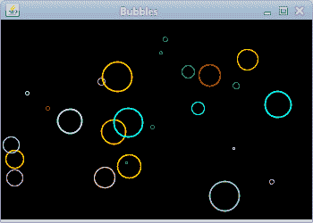

# 特效

> 原文： [https://zetcode.com/gfx/java2d/effects/](https://zetcode.com/gfx/java2d/effects/)

在 Java 2D 编程教程的这一部分中，我们将展示一些效果。

## 泡泡

在第一个示例中，我们将看到不断增长的彩色气泡，它们在屏幕上随机出现和消失。 该示例来自 Java 2D 演示。

`BubblesEx.java`

```java
package com.zetcode;

import java.awt.BasicStroke;
import java.awt.Color;
import java.awt.Dimension;
import java.awt.EventQueue;
import java.awt.Graphics;
import java.awt.Graphics2D;
import java.awt.RenderingHints;
import java.awt.event.ActionEvent;
import java.awt.event.ActionListener;
import java.awt.geom.Ellipse2D;
import javax.swing.JFrame;
import javax.swing.JPanel;
import javax.swing.Timer;

class Surface extends JPanel
        implements ActionListener {

    private final Color colors[] = {
        Color.blue, Color.cyan, Color.green,
        Color.magenta, Color.orange, Color.pink,
        Color.red, Color.yellow, Color.lightGray, Color.white
    };

    private Ellipse2D.Float[] ellipses;
    private double esize[];
    private float estroke[];
    private double maxSize = 0;
    private final int NUMBER_OF_ELLIPSES = 25;
    private final int DELAY = 30;
    private final int INITIAL_DELAY = 150;    
    private Timer timer;

    public Surface() {

        initSurface();
        initEllipses();
        initTimer();
    }

    private void initSurface() {

        setBackground(Color.black);
        ellipses = new Ellipse2D.Float[NUMBER_OF_ELLIPSES];
        esize = new double[ellipses.length];
        estroke = new float[ellipses.length];
    }

    private void initEllipses() {

        int w = 350;
        int h = 250;

        maxSize = w / 10;

        for (int i = 0; i < ellipses.length; i++) {

            ellipses[i] = new Ellipse2D.Float();
            posRandEllipses(i, maxSize * Math.random(), w, h);
        }
    }

    private void initTimer() {

        timer = new Timer(DELAY, this);
        timer.setInitialDelay(INITIAL_DELAY);
        timer.start();
    }

    private void posRandEllipses(int i, double size, int w, int h) {

        esize[i] = size;
        estroke[i] = 1.0f;
        double x = Math.random() * (w - (maxSize / 2));
        double y = Math.random() * (h - (maxSize / 2));
        ellipses[i].setFrame(x, y, size, size);
    }

    private void doStep(int w, int h) {

        for (int i = 0; i < ellipses.length; i++) {

            estroke[i] += 0.025f;
            esize[i]++;

            if (esize[i] > maxSize) {

                posRandEllipses(i, 1, w, h);
            } else {

                ellipses[i].setFrame(ellipses[i].getX(), ellipses[i].getY(),
                        esize[i], esize[i]);
            }
        }
    }

    private void drawEllipses(Graphics2D g2d) {

        for (int i = 0; i < ellipses.length; i++) {

            g2d.setColor(colors[i % colors.length]);
            g2d.setStroke(new BasicStroke(estroke[i]));
            g2d.draw(ellipses[i]);
        }
    }

    private void doDrawing(Graphics g) {

        Graphics2D g2d = (Graphics2D) g.create();

        RenderingHints rh
                = new RenderingHints(RenderingHints.KEY_ANTIALIASING,
                        RenderingHints.VALUE_ANTIALIAS_ON);

        rh.put(RenderingHints.KEY_RENDERING,
                RenderingHints.VALUE_RENDER_QUALITY);

        g2d.setRenderingHints(rh);

        Dimension size = getSize();
        doStep(size.width, size.height);
        drawEllipses(g2d);

        g2d.dispose();
    }

    @Override
    public void paintComponent(Graphics g) {

        super.paintComponent(g);
        doDrawing(g);
    }

    @Override
    public void actionPerformed(ActionEvent e) {

        repaint();
    }
}

public class BubblesEx extends JFrame {

    public BubblesEx() {

        initUI();
    }

    private void initUI() {

        add(new Surface());

        setTitle("Bubbles");
        setSize(350, 250);
        setLocationRelativeTo(null);
        setDefaultCloseOperation(JFrame.EXIT_ON_CLOSE);
    }

    public static void main(String[] args) {

        EventQueue.invokeLater(new Runnable() {
            @Override
            public void run() {

                BubblesEx ex = new BubblesEx();
                ex.setVisible(true);
            }
        });
    }
}

```

这是泡泡的示例。

```java
private final Color colors[] = {
    Color.blue, Color.cyan, Color.green,
    Color.magenta, Color.orange, Color.pink,
    Color.red, Color.yellow, Color.lightGray, Color.white
};

```

这些颜色用于绘制气泡。

```java
private void initSurface() {

    setBackground(Color.black);
    ellipses = new Ellipse2D.Float[NUMBER_OF_ELLIPSES];
    esize = new double[ellipses.length];
    estroke = new float[ellipses.length];
}

```

`initSurface()`方法为面板设置黑色背景。 我们创建三个数组。 椭圆数组（椭圆是椭圆的一种特殊情况），每个椭圆大小的数组以及椭圆笔划的数组。 动画期间，气泡的大小和笔触都会增加。

```java
private void initEllipses() {

    int w = 350;
    int h = 250;

    maxSize = w / 10;

    for (int i = 0; i < ellipses.length; i++) {

        ellipses[i] = new Ellipse2D.Float();
        posRandEllipses(i, maxSize * Math.random(), w, h);
    }
}    

```

`ellipses`数组填充有椭圆对象。 `posRandEllipses()`方法将椭圆对象随机放置在窗口上。 椭圆的初始大小也是随机选择的。

```java
private void initTimer() {

    timer = new Timer(DELAY, this);
    timer.setInitialDelay(INITIAL_DELAY);
    timer.start();
}

```

将创建并启动一个计时器对象。 用于创建动画。

```java
private void posRandEllipses(int i, double size, int w, int h) {

    esize[i] = size;
    estroke[i] = 1.0f;
    double x = Math.random() * (w - (maxSize / 2));
    double y = Math.random() * (h - (maxSize / 2));
    ellipses[i].setFrame(x, y, size, size);
}

```

`posRandEllipses()`方法将椭圆随机放置在窗口上。 `esize`和`estroke`数组填充有值。 `setFrame()`方法设置椭圆框架矩形的位置和大小。

```java
private void doStep(int w, int h) {

    for (int i = 0; i < ellipses.length; i++) {

        estroke[i] += 0.025f;
        esize[i]++;

        if (esize[i] > maxSize) {

            posRandEllipses(i, 1, w, h);
        } else {

            ellipses[i].setFrame(ellipses[i].getX(), ellipses[i].getY(),
                    esize[i], esize[i]);
        }
    }
}

```

动画包括步骤。 在每个步骤中，我们增加每个椭圆的笔触和大小值。 气泡达到最大大小后，将其重置为最小大小，并在面板上随机重新放置。 否则，将显示增加的值。

```java
private void drawEllipses(Graphics2D g2d) {

    for (int i = 0; i < ellipses.length; i++) {

        g2d.setColor(colors[i % colors.length]);
        g2d.setStroke(new BasicStroke(estroke[i]));
        g2d.draw(ellipses[i]);
    }
}

```

`drawEllipses()`方法从面板上的阵列绘制所有椭圆。

```java
Dimension size = getSize();
doStep(size.width, size.height);

```

在`doDrawing()`方法中，我们计算面板的大小。 如果调整窗口大小，气泡将随机分布在窗口的整个区域。

```java
@Override
public void actionPerformed(ActionEvent e) {

    repaint();
}

```

计时器对象以指定的时间间隔触发动作事件。 `repaint()`方法重新绘制面板组件。



Figure: Bubbles

## 星星

下一个示例显示了一个旋转和缩放的星星。

`StarDemoEx.java`

```java
package com.zetcode;

import java.awt.EventQueue;
import java.awt.Graphics;
import java.awt.Graphics2D;
import java.awt.RenderingHints;
import java.awt.event.ActionEvent;
import java.awt.event.ActionListener;
import java.awt.geom.GeneralPath;
import javax.swing.JFrame;
import javax.swing.JPanel;
import javax.swing.Timer;

class Surface extends JPanel
        implements ActionListener {

    private final int points[][] = {
        {0, 85}, {75, 75}, {100, 10}, {125, 75},
        {200, 85}, {150, 125}, {160, 190}, {100, 150},
        {40, 190}, {50, 125}, {0, 85}
    };

    private Timer timer;
    private double angle = 0;
    private double scale = 1;
    private double delta = 0.01;

    private final int DELAY = 10;

    public Surface() {

        initTimer();
    }

    private void initTimer() {

        timer = new Timer(DELAY, this);
        timer.start();        
    }

    private void doDrawing(Graphics g) {

        int h = getHeight();
        int w = getWidth();

        Graphics2D g2d = (Graphics2D) g.create();

        g2d.setRenderingHint(RenderingHints.KEY_ANTIALIASING,
                RenderingHints.VALUE_ANTIALIAS_ON);

        g2d.setRenderingHint(RenderingHints.KEY_RENDERING,
                RenderingHints.VALUE_RENDER_QUALITY);

        g2d.translate(w / 2, h / 2);
        GeneralPath star = new GeneralPath();
        star.moveTo(points[0][0], points[0][1]);

        for (int k = 1; k < points.length; k++) {

            star.lineTo(points[k][0], points[k][1]);
        }

        g2d.rotate(angle);
        g2d.scale(scale, scale);
        g2d.fill(star);        

        g2d.dispose();
    }

    @Override
    public void paintComponent(Graphics g) {

        super.paintComponent(g);
        doDrawing(g);
    }

    private void step() {

        if (scale < 0.01) {

            delta = -delta;
        } else if (scale > 0.99) {

            delta = -delta;
        }

        scale += delta;
        angle += 0.01;        
    }

    @Override
    public void actionPerformed(ActionEvent e) {

        step();
        repaint();
    }
}

public class StarDemoEx extends JFrame {

    public StarDemoEx() {

        initUI();
    }

    private void initUI() {

        add(new Surface());

        setTitle("Star");
        setSize(420, 250);
        setLocationRelativeTo(null);        
        setDefaultCloseOperation(JFrame.EXIT_ON_CLOSE);
    }

    public static void main(String[] args) {

        EventQueue.invokeLater(new Runnable() {
            @Override
            public void run() {

                StarDemoEx ex = new StarDemoEx();
                ex.setVisible(true);
            }
        });
    }
}

```

在此演示中，我们有一颗星星。 星星旋转生长然后收缩。

```java
private final int points[][] = {
    {0, 85}, {75, 75}, {100, 10}, {125, 75},
    {200, 85}, {150, 125}, {160, 190}, {100, 150},
    {40, 190}, {50, 125}, {0, 85}
};

```

这些点用于绘制星形。

```java
private double angle = 0;
private double scale = 1;
private double delta = 0.01;

```

当我们旋转星星时使用`angle`。 `scale`因子确定星星的大小。 最后，`delta`因子是刻度的变化量。

```java
g2d.translate(w / 2, h / 2);

```

使用`translate()`方法将坐标系移到窗口的中间。

```java
GeneralPath star = new GeneralPath();
star.moveTo(points[0][0], points[0][1]);

for (int k = 1; k < points.length; k++) {

    star.lineTo(points[k][0], points[k][1]);
}

```

`GeneralPath`用于创建星形。 通过`moveTo()`方法将第一点添加到路径。 通过`lineTo()`方法添加星星的后续点。

```java
g2d.rotate(angle);
g2d.scale(scale, scale);

```

我们执行旋转和缩放操作。

```java
g2d.fill(star);        

```

`fill()`方法填充星形的内部。

```java
if (scale < 0.01) {

    delta = -delta;
} else if (scale > 0.99) {

    delta = -delta;
}

```

该代码控制星的收缩和增长量。

## 泡芙

接下来，我们显示粉扑效果。 这种效果在 Flash 动画或电影介绍中很常见。 文本在屏幕上逐渐增长，一段时间后它逐渐消失。

`PuffEx.java`

```java
package com.zetcode;

import java.awt.AlphaComposite;
import java.awt.Dimension;
import java.awt.EventQueue;
import java.awt.Font;
import java.awt.FontMetrics;
import java.awt.Graphics;
import java.awt.Graphics2D;
import java.awt.RenderingHints;
import java.awt.event.ActionEvent;
import java.awt.event.ActionListener;
import javax.swing.JFrame;
import javax.swing.JPanel;
import javax.swing.Timer;

class Surface extends JPanel 
        implements ActionListener {

    private Timer timer;
    private int x = 1;
    private float alpha = 1;
    private final int DELAY = 15;
    private final int INITIAL_DELAY = 200;

    public Surface() {

        initTimer();
    }

    private void initTimer() {

        timer = new Timer(DELAY, this);
        timer.setInitialDelay(INITIAL_DELAY);
        timer.start();               
    }

    private void doDrawing(Graphics g) {

        Graphics2D g2d = (Graphics2D) g.create();

        RenderingHints rh =
            new RenderingHints(RenderingHints.KEY_ANTIALIASING,
            RenderingHints.VALUE_ANTIALIAS_ON);

        rh.put(RenderingHints.KEY_RENDERING,
               RenderingHints.VALUE_RENDER_QUALITY);

        g2d.setRenderingHints(rh);

        Font font = new Font("Dialog", Font.PLAIN, x);
        g2d.setFont(font);

        FontMetrics fm = g2d.getFontMetrics();
        String s = "ZetCode";
        Dimension size = getSize();

        int w = (int) size.getWidth();
        int h = (int) size.getHeight();

        int stringWidth = fm.stringWidth(s);
        AlphaComposite ac = AlphaComposite.getInstance(
                AlphaComposite.SRC_OVER, alpha);
        g2d.setComposite(ac);

        g2d.drawString(s, (w - stringWidth) / 2, h / 2);        

        g2d.dispose();
    }

    @Override
    public void paintComponent(Graphics g) {

        super.paintComponent(g);        
        doDrawing(g);
    }   

    private void step() {

        x += 1;

        if (x > 40)
            alpha -= 0.01;

        if (alpha <= 0.01)
            timer.stop();        
    }

    @Override
    public void actionPerformed(ActionEvent e) {

        step();
        repaint();
    }        
}

public class PuffEx extends JFrame {    

    public PuffEx() {

        initUI();
    }

    private void initUI() {

        setTitle("Puff");

        add(new Surface());

        setSize(400, 300);
        setDefaultCloseOperation(JFrame.EXIT_ON_CLOSE);
        setLocationRelativeTo(null);        
    }

    public static void main(String[] args) {

        EventQueue.invokeLater(new Runnable() {
            @Override
            public void run() {

                PuffEx ex = new PuffEx();
                ex.setVisible(true);
            }
        });      
    }
}

```

该示例在窗口上绘制了一个不断增长的文本，从某个角度看，该文本变得越来越透明，直到看不见为止。

```java
Font font = new Font("Dialog", Font.PLAIN, x);
g2d.setFont(font);

```

这是我们用于文本的字体。

```java
FontMetrics fm = g2d.getFontMetrics();

```

`getFontMetrics()`返回`FontMetrics`类。 该类存储有关在特定屏幕上呈现特定字体的信息。

```java
int stringWidth = fm.stringWidth(s);

```

我们使用`FontMetrics`对象的`stringWidth()`方法来获取字符串的宽度。

```java
AlphaComposite ac = AlphaComposite.getInstance(
        AlphaComposite.SRC_OVER, alpha);
g2d.setComposite(ac);

```

在这里，我们设置所绘制文本的透明度。

```java
g2d.drawString(s, (w - stringWidth) / 2, h / 2);

```

此代码行在窗口的（水平）中间绘制字符串。

```java
if (x > 40)
    alpha -= 0.01;

```

琴弦高于 40 点后，琴弦开始褪色。

在 Java 2D 教程的这一部分中，我们做了一些视觉效果。