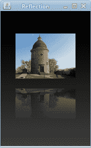

# 图像

> 原文： [https://zetcode.com/gfx/java2d/java2dimages/](https://zetcode.com/gfx/java2d/java2dimages/)

在 Java 2D 教程的这一部分中，我们将处理图像。

`BufferedImage`是使用 Java 2D 处理图像的基础类。 它是存储在内存中的像素矩形。

## 显示图像

在第一个示例中，我们在面板上显示图像。

`DisplayImageEx.java`

```java
package com.zetcode;

import java.awt.Dimension;
import java.awt.EventQueue;
import java.awt.Graphics;
import java.awt.Graphics2D;
import java.awt.Image;
import javax.swing.ImageIcon;
import javax.swing.JFrame;
import javax.swing.JPanel;

class Surface extends JPanel {

    private Image mshi;

    public Surface() {

        loadImage();
        setSurfaceSize();
    }

    private void loadImage() {

        mshi = new ImageIcon("mushrooms.jpg").getImage();
    }

    private void setSurfaceSize() {

        Dimension d = new Dimension();
        d.width = mshi.getWidth(null);
        d.height = mshi.getHeight(null);
        setPreferredSize(d);        
    }

    private void doDrawing(Graphics g) {

        Graphics2D g2d = (Graphics2D) g;
        g2d.drawImage(mshi, 0, 0, null);
    }

    @Override
    public void paintComponent(Graphics g) {

        super.paintComponent(g);
        doDrawing(g);
    }
}

public class DisplayImageEx extends JFrame {

    public DisplayImageEx() {

        initUI();
    }

    private void initUI() {

        add(new Surface());

        pack();

        setTitle("Mushrooms");
        setLocationRelativeTo(null);
        setDefaultCloseOperation(JFrame.EXIT_ON_CLOSE);
    }

    public static void main(String[] args) {

        EventQueue.invokeLater(new Runnable() {
            @Override
            public void run() {
                DisplayImageEx ex = new DisplayImageEx();
                ex.setVisible(true);
            }
        });
    }
}

```

在示例中，我们在面板上显示图像。 调整窗口大小以适合图像的大小。

```java
private void loadImage() {

    mshi = new ImageIcon("mushrooms.jpg").getImage();
}

```

我们使用`ImageIcon`类加载图像。 该图像位于当前工作目录中。

```java
private void setSurfaceSize() {

    Dimension d = new Dimension();
    d.width = mshi.getWidth(null);
    d.height = mshi.getHeight(null);
    setPreferredSize(d);        
}

```

我们确定加载图像的大小。 使用`setPreferredSize()`方法，我们设置`Surface`面板的首选大小。 `JFrame`容器的`pack()`方法将使框架适合其子代的大小。 在我们的例子中是`Surface`面板。 结果，窗口将被调整大小以精确显示加载的图像。

```java
private void doDrawing(Graphics g) {

    Graphics2D g2d = (Graphics2D) g;
    g2d.drawImage(mshi, 0, 0, null);
}

```

使用`drawImage()`方法在面板上绘制图像。 最后一个参数是`ImageObserver`类。 有时用于异步加载。 当我们不需要异步加载图像时，可以将`null`放在此处。

```java
private void initUI() {
    ...
    pack();
    ...
}

```

`pack()`方法调整容器的大小以适合子面板的大小。

## 灰度图像

在计算中，灰度数字图像是其中每个像素的值是单个样本的图像，也就是说，它携带有关其强度的完整（且唯一）信息。 这种图像仅由中性灰色阴影组成，从最弱的黑色到最强的白色不等。 （维基百科）

在下一个示例中，我们使用 Java 2D 创建灰度图像。

`GrayScaleImage.java`

```java
package com.zetcode;

import java.awt.Dimension;
import java.awt.EventQueue;
import java.awt.Graphics;
import java.awt.Graphics2D;
import java.awt.Image;
import java.awt.image.BufferedImage;
import javax.swing.ImageIcon;
import javax.swing.JFrame;
import javax.swing.JPanel;

class Surface extends JPanel {

    private Image mshi;
    private BufferedImage bufimg;
    private Dimension d;

    public Surface() {

        loadImage();
        determineAndSetSize();
        createGrayImage();
    }

    private void determineAndSetSize() {

        d = new Dimension();
        d.width = mshi.getWidth(null);
        d.height = mshi.getHeight(null);
        setPreferredSize(d);
    }

    private void createGrayImage() {

        bufimg = new BufferedImage(d.width, d.height, 
                BufferedImage.TYPE_BYTE_GRAY);

        Graphics2D g2d = bufimg.createGraphics();
        g2d.drawImage(mshi, 0, 0, null);
        g2d.dispose();        
    }

    private void loadImage() {

        mshi = new ImageIcon("mushrooms.jpg").getImage();
    }

    private void doDrawing(Graphics g) {

        Graphics2D g2d = (Graphics2D) g;
        g2d.drawImage(bufimg, null, 0, 0);
    }

    @Override
    public void paintComponent(Graphics g) {

        super.paintComponent(g);
        doDrawing(g);
    }
}

public class GrayScaleImageEx extends JFrame {

    public GrayScaleImageEx() {

        initUI();
    }

    private void initUI() {

        Surface dpnl = new Surface();
        add(dpnl);

        pack();

        setTitle("GrayScale image");
        setLocationRelativeTo(null);
        setDefaultCloseOperation(JFrame.EXIT_ON_CLOSE);
    }

    public static void main(String[] args) {

        EventQueue.invokeLater(new Runnable() {
            @Override
            public void run() {
                GrayScaleImageEx ex = new GrayScaleImageEx();
                ex.setVisible(true);
            }
        });
    }
}

```

有几种创建灰度图像的方法。 我们通过将图像数据写入`BufferedImage.TYPE_BYTE_GRAY`类型的缓冲图像中来实现。

```java
bufimg = new BufferedImage(d.width, d.height, 
        BufferedImage.TYPE_BYTE_GRAY);

```

我们创建一个`BufferedImage.TYPE_BYTE_GRAY`类型的`BufferedImage`类。

```java
Graphics2D g2d = bufimg.createGraphics();
g2d.drawImage(mshi, 0, 0, null);

```

在这里，我们将蘑菇图像绘制到缓冲图像中。

```java
g2d.dispose();      

```

使用`createGraphics()`方法创建的图形对象应手动释放。 当这些对象返回时，作为对象的`paint()`和`update()`方法的参数提供的图形对象将由系统自动释放。

```java
private void doDrawing(Graphics g) {

    Graphics2D g2d = (Graphics2D) g;
    g2d.drawImage(bufimg, null, 0, 0);
}

```

缓冲的图像通过`drawImage()`方法绘制在面板上。

## 图像翻转

以下示例翻转图像。 我们将要过滤图像。 有一种`filter()`方法正在转换图像。

`FlippedImageEx.java`

```java
package com.zetcode;

import java.awt.Dimension;
import java.awt.EventQueue;
import java.awt.Graphics;
import java.awt.Graphics2D;
import java.awt.Image;
import java.awt.geom.AffineTransform;
import java.awt.image.AffineTransformOp;
import java.awt.image.BufferedImage;
import javax.swing.ImageIcon;
import javax.swing.JFrame;
import javax.swing.JPanel;

class Surface extends JPanel {

    private Image mshi;
    private BufferedImage bufimg;
    private final int SPACE = 10;

    public Surface() {

        loadImage();
        createFlippedImage();
        setSurfaceSize();
    }

    private void loadImage() {

        mshi = new ImageIcon("mushrooms.jpg").getImage();
    }

    private void createFlippedImage() {

        bufimg = new BufferedImage(mshi.getWidth(null),
                mshi.getHeight(null), BufferedImage.TYPE_INT_RGB);

        Graphics gb = bufimg.getGraphics();
        gb.drawImage(mshi, 0, 0, null);
        gb.dispose();

        AffineTransform tx = AffineTransform.getScaleInstance(-1, 1);
        tx.translate(-mshi.getWidth(null), 0);
        AffineTransformOp op = new AffineTransformOp(tx,
                AffineTransformOp.TYPE_NEAREST_NEIGHBOR);
        bufimg = op.filter(bufimg, null);        
    }

    private void setSurfaceSize() {

        int w = bufimg.getWidth();
        int h = bufimg.getHeight();

        Dimension d = new Dimension(3*SPACE+2*w, h+2*SPACE);
        setPreferredSize(d);
    }

    private void doDrawing(Graphics g) {

        Graphics2D g2d = (Graphics2D) g;

        g2d.drawImage(mshi, SPACE, SPACE, null);
        g2d.drawImage(bufimg, null, 2*SPACE + bufimg.getWidth(), SPACE);
    }

    @Override
    public void paintComponent(Graphics g) {

        super.paintComponent(g);
        doDrawing(g);
    }
}

public class FlippedImageEx extends JFrame {

    public FlippedImageEx() {

        initUI();
    }

    private void initUI() {

        add(new Surface());
        pack();

        setTitle("Flipped image");
        setLocationRelativeTo(null);
        setDefaultCloseOperation(JFrame.EXIT_ON_CLOSE);
    }

    public static void main(String[] args) {

        EventQueue.invokeLater(new Runnable() {
            @Override
            public void run() {
                FlippedImageEx ex = new FlippedImageEx();
                ex.setVisible(true);
            }
        });
    }
}

```

在我们的代码示例中，我们水平翻转图像。

```java
AffineTransform tx = AffineTransform.getScaleInstance(-1, 1);
tx.translate(-castle.getWidth(null), 0);

```

翻转图像意味着对其进行缩放和平移。 因此，我们进行了`AffineTransform`操作。

```java
AffineTransformOp op = new AffineTransformOp(tx, 
                        AffineTransformOp.TYPE_NEAREST_NEIGHBOR);
bufferedImage = op.filter(bufferedImage, null)

```

这是可用的过滤操作之一。 这也可以通过像素操纵来完成。 但是 Java 2D 提供了高级类，使操作图像更加容易。 在我们的情况下，`AffineTransformOp`类对图像像素执行缩放和平移。

```java
private void doDrawing(Graphics g) {

    Graphics2D g2d = (Graphics2D) g;

    g2d.drawImage(mshi, SPACE, SPACE, null);
    g2d.drawImage(bufimg, null, 2*SPACE + bufimg.getWidth(), SPACE);
}

```

这两个图像都画在面板上。

```java
private void setSurfaceSize() {

    int w = bufimg.getWidth();
    int h = bufimg.getHeight();

    Dimension d = new Dimension(3*SPACE+2*w, h+2*SPACE);
    setPreferredSize(d);
}

```

我们设置面板的首选大小。 我们计算大小，以便可以在面板上放置两个图像，并在它们之间以及图像和窗口边框之间留一些空间。

## 图像模糊

下一个代码示例使图像模糊。 模糊意味着没有聚焦的图像。 为了模糊图像，我们使用了卷积运算。 这是一种数学运算，也用于边缘检测或噪声消除。 模糊操作可用于各种图形效果。 例如，创建速度错觉或显示人的注意力不集中。

模糊滤镜操作用像素及其邻居的平均值替换图像中的每个像素。 卷积是每个像素的运算。 对图像中的每个像素重复相同的算法。 内核可以看作是一个二维的数字网格，它按顺序遍历图像的每个像素，并一路执行计算。 由于图像也可以被视为数字的二维网格，因此将内核应用于图像可以可视化为在较大的网格（图像）上移动的小网格（内核）。 （developer.apple.com）

`BlurredImageEx.java`

```java
package com.zetcode;

import java.awt.Dimension;
import java.awt.EventQueue;
import java.awt.Graphics;
import java.awt.Graphics2D;
import java.awt.image.BufferedImage;
import java.awt.image.BufferedImageOp;
import java.awt.image.ConvolveOp;
import java.awt.image.Kernel;
import java.io.File;
import java.io.IOException;
import java.util.logging.Level;
import java.util.logging.Logger;
import javax.imageio.ImageIO;
import javax.swing.JFrame;
import javax.swing.JPanel;

class Surface extends JPanel {

    private BufferedImage mshi;
    private BufferedImage bluri;

    public Surface() {

        loadImage();
        createBlurredImage();
        setSurfaceSize();
    }

    private void loadImage() {

        try {

            mshi = ImageIO.read(new File("mushrooms.jpg"));
        } catch (IOException ex) {

            Logger.getLogger(Surface.class.getName()).log(
                    Level.WARNING, null, ex);
        }
    }

    private void createBlurredImage() {

        float[] blurKernel = {
            1 / 9f, 1 / 9f, 1 / 9f,
            1 / 9f, 1 / 9f, 1 / 9f,
            1 / 9f, 1 / 9f, 1 / 9f
        };

        BufferedImageOp blur = new ConvolveOp(new Kernel(3, 3, blurKernel));
        bluri = blur.filter(mshi, new BufferedImage(mshi.getWidth(),
                mshi.getHeight(), mshi.getType()));
    }

    private void setSurfaceSize() {

        Dimension d = new Dimension();
        d.width = mshi.getWidth(null);
        d.height = mshi.getHeight(null);
        setPreferredSize(d);        
    }

    private void doDrawing(Graphics g) {

        Graphics2D g2d = (Graphics2D) g;
        g2d.drawImage(bluri, null, 0, 0);
    }

    @Override
    public void paintComponent(Graphics g) {

        super.paintComponent(g);
        doDrawing(g);
    }
}

public class BlurredImageEx extends JFrame {

    public BlurredImageEx() {

        setTitle("Blurred image");
        add(new Surface());

        pack();

        setLocationRelativeTo(null);
        setDefaultCloseOperation(JFrame.EXIT_ON_CLOSE);
    }

    public static void main(String[] args) {

        EventQueue.invokeLater(new Runnable() {
            @Override
            public void run() {

                BlurredImageEx ex = new BlurredImageEx();
                ex.setVisible(true);
            }
        });
    }
}

```

在代码示例中，我们从磁盘加载图像，对图像执行模糊操作，然后在窗口上显示结果。

```java
private void loadImage() {

    try {

        mshi = ImageIO.read(new File("mushrooms.jpg"));
    } catch (IOException ex) {

        Logger.getLogger(Surface.class.getName()).log(
                Level.WARNING, null, ex);
    }
}

```

`ImageIO`类的`read()`方法从磁盘读取图像并返回`BufferedImage`。

```java
float[] blurKernel = {
    1 / 9f, 1 / 9f, 1 / 9f,
    1 / 9f, 1 / 9f, 1 / 9f,
    1 / 9f, 1 / 9f, 1 / 9f
};

```

该矩阵称为内核。 所述值是应用于改变的像素的相邻值的权重。

```java
BufferedImageOp blur = new ConvolveOp(new Kernel(3, 3, blurKernel));
bluri = blur.filter(mshi, new BufferedImage(mshi.getWidth(),
        mshi.getHeight(), mshi.getType()));

```

在这里，我们对图像应用模糊滤镜。

```java
private void doDrawing(Graphics g) {

    Graphics2D g2d = (Graphics2D) g;
    g2d.drawImage(bluri, null, 0, 0);
}

```

模糊的图像绘制在窗口上。

## 反射

在下一个示例中，我们显示反射图像。 这种效果使人产生幻觉，好像图像在水中被反射一样。 以下代码示例受到 [jhlabs.com](http://www.jhlabs.com/java/java2d/reflections/index.html) 中代码的启发。

`ReflectionEx.java`

```java
package com.zetcode;

import java.awt.AlphaComposite;
import java.awt.Color;
import java.awt.Dimension;
import java.awt.EventQueue;
import java.awt.GradientPaint;
import java.awt.Graphics;
import java.awt.Graphics2D;
import java.awt.image.BufferedImage;
import java.io.File;
import java.util.logging.Level;
import java.util.logging.Logger;
import javax.imageio.ImageIO;
import javax.swing.JFrame;
import javax.swing.JPanel;

class Surface extends JPanel {

    private BufferedImage image;
    private BufferedImage refImage;
    private int img_w;
    private int img_h;
    private final int SPACE = 30;

    public Surface() {

        loadImage();
        getImageSize();
        createReflectedImage();
    }

    private void loadImage() {

        try {

            image = ImageIO.read(new File("rotunda.jpg"));
        } catch (Exception ex) {

            Logger.getLogger(Surface.class.getName()).log(
                    Level.WARNING, null, ex);
        }
    }

    private void getImageSize() {

        img_w = image.getWidth();
        img_h = image.getHeight();
    }

    private void createReflectedImage() {

        float opacity = 0.4f;
        float fadeHeight = 0.3f;

        refImage = new BufferedImage(img_w, img_h,
                BufferedImage.TYPE_INT_ARGB);        
        Graphics2D rg = refImage.createGraphics();
        rg.drawImage(image, 0, 0, null);
        rg.setComposite(AlphaComposite.getInstance(AlphaComposite.DST_IN));
        rg.setPaint(new GradientPaint(0, img_h * fadeHeight,
                new Color(0.0f, 0.0f, 0.0f, 0.0f), 0, img_h,
                new Color(0.0f, 0.0f, 0.0f, opacity)));

        rg.fillRect(0, 0, img_w, img_h);
        rg.dispose();
    }

    private void doDrawing(Graphics g) {

        Graphics2D g2d = (Graphics2D) g.create();

        int win_w = getWidth();
        int win_h = getHeight();

        int gap = 20;

        g2d.setPaint(new GradientPaint(0, 0, Color.black, 0, 
                win_h, Color.darkGray));
        g2d.fillRect(0, 0, win_w, win_h);
        g2d.translate((win_w - img_w) / 2, win_h / 2 - img_h);
        g2d.drawImage(image, 0, 0, null);
        g2d.translate(0, 2 * img_h + gap);
        g2d.scale(1, -1);

        g2d.drawImage(refImage, 0, 0, null);

        g2d.dispose();
    }

    @Override
    public void paintComponent(Graphics g) {

        super.paintComponent(g);
        doDrawing(g);
    }

    @Override
    public Dimension getPreferredSize() {

        return new Dimension(img_w + 2 * SPACE, 2 * img_h + 3 * SPACE);
    }
}

public class ReflectionEx extends JFrame {

    public ReflectionEx() {

        initUI();
    }

    private void initUI() {

        add(new Surface());
        pack();

        setTitle("Reflection");
        setLocationRelativeTo(null);
        setDefaultCloseOperation(JFrame.EXIT_ON_CLOSE);
    }

    public static void main(String[] args) {

        EventQueue.invokeLater(new Runnable() {
            @Override
            public void run() {

                ReflectionEx ex = new ReflectionEx();
                ex.setVisible(true);
            }
        });
    }
}

```

在示例中，我们创建了反射图像的错觉。

```java
refImage = new BufferedImage(img_w, img_h,
        BufferedImage.TYPE_INT_ARGB);        
Graphics2D rg = refImage.createGraphics();
rg.drawImage(image, 0, 0, null);

```

创建已加载图像的副本。

```java
rg.setComposite(AlphaComposite.getInstance(AlphaComposite.DST_IN));
rg.setPaint(new GradientPaint(0, img_h * fadeHeight,
        new Color(0.0f, 0.0f, 0.0f, 0.0f), 0, img_h,
        new Color(0.0f, 0.0f, 0.0f, opacity)));

rg.fillRect(0, 0, img_w, img_h);

```

这是代码中最重要的部分。 我们使第二个图像透明。 但是透明度不是恒定不变的。 图像逐渐淡出。 这是通过`GradientPaint`类实现的。

```java
g2d.setPaint(new GradientPaint(0, 0, Color.black, 0, 
        win_h, Color.darkGray));
g2d.fillRect(0, 0, win_w, win_h);

```

窗口的背景填充有渐变颜料。 涂料是从黑色到深灰色的平滑混合。

```java
g2d.translate((win_w - img_w) / 2, win_h / 2 - img_h);
g2d.drawImage(image, 0, 0, null);

```

普通图像将移动到窗口的中心并绘制。

```java
g2d.translate(0, 2 * imageHeight + gap);
g2d.scale(1, -1);

```

此代码翻转图像并将其转换为原始图像下方。 平移操作是必需的，因为缩放操作会使图像上下颠倒并向上平移图像。 要了解发生了什么，只需拍摄照片并将其放在桌子上并翻转即可。

```java
g2d.drawImage(refImage, 0, 0, null);

```

绘制反射的图像。

```java
@Override
public Dimension getPreferredSize() {

    return new Dimension(img_w + 2 * SPACE, 2 * img_h + 3 * SPACE);
}

```

设置组件的首选大小的另一种方法是重写`getPreferredSize()`方法。



图：反射

在 Java2D 教程的这一部分中，我们处理了图像。