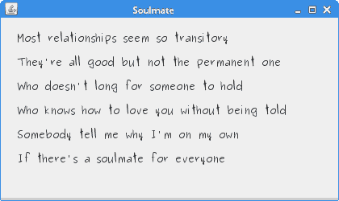
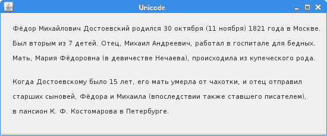
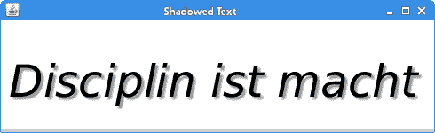
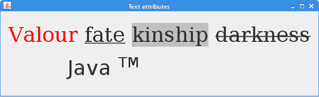
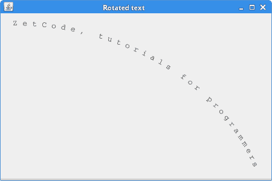

# 文字和字体

> 原文： [https://zetcode.com/gfx/java2d/textfonts/](https://zetcode.com/gfx/java2d/textfonts/)

在 Java 2D 教程的这一部分中，我们将使用文本和字体。

## 文字和字体

渲染文本是另一个复杂的话题。 它很容易填满一本专门的书。 在这里，我们仅提供一些基本示例。

字符是表示诸如字母，数字或标点符号之类的项目的符号。 字形是用于呈现字符或字符序列的形状。 在拉丁字母中，字形通常代表一个字符。 在其他书写系统中，一个字符可能由几个字形组成，例如ť，ž，ú，ô。 这些是带有重音符号的拉丁字符。

字体有两种：物理字体和逻辑字体。 实际的字体是实际的字体库。 逻辑字体是 Java 平台定义的五个字体家族：Serif，SansSerif，Monospaced，Dialog 和 DialogInput。 逻辑字体不是实际的字体库。 Java 运行时环境将逻辑字体名称映射到物理字体。

可以使用各种字体在窗口上绘制文本。 字体是一组具有特定字体设计和大小的字体字符。 各种字体包括 Helvetica，Georgia，Times 或 Verdana。 具有特定样式的字形的集合形成字体面。 字体的集合构成字体家族。 （docs.oracle.com，answers.com）

## 系统字体

此控制台示例将在您的平台上打印所有可用字体。

`AllFontsEx.java`

```java
package com.zetcode;

import java.awt.Font;
import java.awt.GraphicsEnvironment;

public class AllFontsEx {

    public static void main(String[] args) {

        GraphicsEnvironment ge = GraphicsEnvironment.getLocalGraphicsEnvironment();
        Font[] fonts = ge.getAllFonts();

        for (Font font : fonts) {
            System.out.print(font.getFontName() + " : ");
            System.out.println(font.getFamily());
        }
    }
}

```

我们打印每种已安装字体的名称和系列。

```java
GraphicsEnvironment ge = GraphicsEnvironment.getLocalGraphicsEnvironment();

```

有些对象是特定平台的典型对象，其中包括字体。 Unix，OS X 和 Windows 平台上的字体集合有所不同。 `GraphicsEnvironment`类描述特定平台上可用的`GraphicsDevice`对象和`Font`对象的集合。

```java
Font[] fonts = ge.getAllFonts();

```

`getAllFonts()`返回`GraphicsEnvironment`中可用的所有字体。

```java
System.out.print(fonts[i].getFontName() + " : ");
System.out.println(fonts[i].getFamily());

```

字体名称和字体系列会打印到终端上。

```java
...
URW Bookman L Demi Bold : URW Bookman L
URW Bookman L Demi Bold Italic : URW Bookman L
URW Bookman L Light : URW Bookman L
URW Bookman L Light Italic : URW Bookman L
URW Chancery L Medium Italic : URW Chancery L
URW Gothic L Book : URW Gothic L
URW Gothic L Book Oblique : URW Gothic L
URW Gothic L Demi : URW Gothic L
URW Gothic L Demi Oblique : URW Gothic L
URW Palladio L Bold : URW Palladio L
URW Palladio L Bold Italic : URW Palladio L
URW Palladio L Italic : URW Palladio L
URW Palladio L Roman : URW Palladio L
Ubuntu : Ubuntu
Ubuntu Bold : Ubuntu
Ubuntu Bold Italic : Ubuntu
Ubuntu Condensed : Ubuntu Condensed
Ubuntu Italic : Ubuntu
...

```

这是 Ubuntu Linux 上所有字体的摘录。

## 灵魂伴侣

在下一个示例中，我们将在面板上显示一些歌词。

`SoulmateEx.java`

```java
package com.zetcode;

import java.awt.EventQueue;
import java.awt.Font;
import java.awt.Graphics;
import java.awt.Graphics2D;
import java.awt.RenderingHints;
import javax.swing.JFrame;
import javax.swing.JPanel;

class Surface extends JPanel {

    private void doDrawing(Graphics g) {

        Graphics2D g2d = (Graphics2D) g;

        RenderingHints rh =
            new RenderingHints(RenderingHints.KEY_ANTIALIASING, 
            RenderingHints.VALUE_ANTIALIAS_ON);

        rh.put(RenderingHints.KEY_RENDERING,
               RenderingHints.VALUE_RENDER_QUALITY);

        g2d.setRenderingHints(rh);

        g2d.setFont(new Font("Purisa", Font.PLAIN, 13));

        g2d.drawString("Most relationships seem so transitory", 20, 30);
        g2d.drawString("They're all good but not the permanent one", 20, 60);
        g2d.drawString("Who doesn't long for someone to hold", 20, 90);
        g2d.drawString("Who knows how to love you without being told", 20, 120);
        g2d.drawString("Somebody tell me why I'm on my own", 20, 150);
        g2d.drawString("If there's a soulmate for everyone", 20, 180);        
    }

    @Override
    public void paintComponent(Graphics g) {

        super.paintComponent(g);
        doDrawing(g);
    }
}

public class SoulmateEx extends JFrame {

    public SoulmateEx() {

        initUI();
    }

    private void initUI() {

        setTitle("Soulmate");

        add(new Surface());

        setSize(420, 250);
        setDefaultCloseOperation(JFrame.EXIT_ON_CLOSE);
        setLocationRelativeTo(null);      
    }

    public static void main(String[] args) {

        EventQueue.invokeLater(new Runnable() {

            @Override
            public void run() {
                SoulmateEx ex = new SoulmateEx();
                ex.setVisible(true);
            }
        });
    }
}

```

在此示例中，我们在面板上绘制文本。 我们选择一种特定的字体类型。

```java
g2d.setFont(new Font("Purisa", Font.PLAIN, 13));

```

在这里，我们设置 Purisa 字体类型。

```java
g2d.drawString("Most relationships seem so transitory", 20, 30);

```

`drawString()`方法使用`Graphics2D`上下文中的当前文本属性状态来呈现文本。



图：灵魂伴侣

## Unicode

下一个示例演示如何显示 Unicode 文本。 请注意，在实际应用中，文本将放置在代码之外的单独资源中。

```java
$ cat fyodor
Фёдор Михайлович Достоевский родился 30 октября (11 ноября) 1821 года в Москве. 
Был вторым из 7 детей. Отец, Михаил Андреевич, работал в госпитале для бедных. 
...

```

我们有一个名为`fyodor`的文件，其中的文本在西里尔字母中。

```java
$ native2ascii fyodor unicode

```

我们使用名为`native2ascii`的工具，可以在 jdk 的`bin`目录中找到该工具。 它将带有本地编码字符的文件转换为带有 Unicode 编码字符的文件。 第一个参数是输入文件，第二个参数是输出文件。

```java
$ cat unicode
\u0424\u0451\u0434\u043e\u0440 \u041c\u0438\u0445\u0430\u0439\u043b\u043e\u0432\u0438\u0447 
...

```

unicode 编码中的相同文本。

`UnicodeEx.java`

```java
package com.zetcode;

import java.awt.EventQueue;
import java.awt.Font;
import java.awt.Graphics;
import java.awt.Graphics2D;
import java.awt.RenderingHints;
import javax.swing.JFrame;
import javax.swing.JPanel;

class Surface extends JPanel {

    String sent1 = "\u0424\u0451\u0434\u043e\u0440 \u041c\u0438\u0445" +
"\u0430\u0439\u043b\u043e\u0432\u0438\u0447 \u0414\u043e\u0441\u0442" +
"\u043e\u0435\u0432\u0441\u043a\u0438\u0439 \u0440\u043e\u0434\u0438" +
"\u043b\u0441\u044f 30 \u043e\u043a\u0442\u044f\u0431\u0440\u044f " +
"(11 \u043d\u043e\u044f\u0431\u0440\u044f) 1821 \u0433\u043e\u0434" +
"\u0430 \u0432 \u041c\u043e\u0441\u043a\u0432\u0435\. ";

    String sent2 = "\u0411\u044b\u043b \u0432\u0442\u043e\u0440\u044b\u043c " +
"\u0438\u0437 7 \u0434\u0435\u0442\u0435\u0439\. \u041e\u0442\u0435\u0446, " +
"\u041c\u0438\u0445\u0430\u0438\u043b \u0410\u043d\u0434\u0440\u0435\u0435" +
"\u0432\u0438\u0447, \u0440\u0430\u0431\u043e\u0442\u0430\u043b \u0432 " +
"\u0433\u043e\u0441\u043f\u0438\u0442\u0430\u043b\u0435 \u0434\u043b\u044f " +
"\u0431\u0435\u0434\u043d\u044b\u0445."; 

    String sent3 = "\u041c\u0430\u0442\u044c, \u041c\u0430\u0440\u0438\u044f " +
"\u0424\u0451\u0434\u043e\u0440\u043e\u0432\u043d\u0430 " +
"(\u0432 \u0434\u0435\u0432\u0438\u0447\u0435\u0441\u0442\u0432\u0435 " +
"\u041d\u0435\u0447\u0430\u0435\u0432\u0430), \u043f\u0440\u043e\u0438\u0441" +
"\u0445\u043e\u0434\u0438\u043b\u0430 \u0438\u0437 \u043a\u0443\u043f\u0435" +
"\u0447\u0435\u0441\u043a\u043e\u0433\u043e \u0440\u043e\u0434\u0430.";

    String sent4 = "\u041a\u043e\u0433\u0434\u0430 \u0414\u043e\u0441\u0442" +
"\u043e\u0435\u0432\u0441\u043a\u043e\u043c\u0443 \u0431\u044b\u043b\u043e 15 " +
"\u043b\u0435\u0442, \u0435\u0433\u043e \u043c\u0430\u0442\u044c " +
"\u0443\u043c\u0435\u0440\u043b\u0430 \u043e\u0442 \u0447\u0430\u0445\u043e" +
"\u0442\u043a\u0438, \u0438 \u043e\u0442\u0435\u0446 \u043e\u0442\u043f\u0440" +
"\u0430\u0432\u0438\u043b";

    String sent5 = "\u0441\u0442\u0430\u0440\u0448\u0438\u0445 \u0441\u044b" +
"\u043d\u043e\u0432\u0435\u0439, \u0424\u0451\u0434\u043e\u0440\u0430 \u0438 " +
"\u041c\u0438\u0445\u0430\u0438\u043b\u0430 (\u0432\u043f\u043e\u0441\u043b" +
"\u0435\u0434\u0441\u0442\u0432\u0438\u0438 \u0442\u0430\u043a\u0436\u0435 " +
"\u0441\u0442\u0430\u0432\u0448\u0435\u0433\u043e \u043f\u0438\u0441\u0430" +
"\u0442\u0435\u043b\u0435\u043c),"; 

    String sent6 = "\u0432 \u043f\u0430\u043d\u0441\u0438\u043e\u043d \u041a. " +
"\u0424\. \u041a\u043e\u0441\u0442\u043e\u043c\u0430\u0440\u043e\u0432\u0430 " +
"\u0432 \u041f\u0435\u0442\u0435\u0440\u0431\u0443\u0440\u0433\u0435.";

    private void doDrawing(Graphics g) {

        Graphics2D g2d = (Graphics2D) g;

        RenderingHints rh =
            new RenderingHints(RenderingHints.KEY_ANTIALIASING, 
            RenderingHints.VALUE_ANTIALIAS_ON);

        rh.put(RenderingHints.KEY_RENDERING,
               RenderingHints.VALUE_RENDER_QUALITY);

        g2d.setRenderingHints(rh);

        g2d.setFont(new Font("Franklin Gothic Medium", Font.PLAIN, 11));

        g2d.drawString(sent1, 20, 30);
        g2d.drawString(sent2, 20, 55);
        g2d.drawString(sent3, 20, 80);
        g2d.drawString(sent4, 20, 120);
        g2d.drawString(sent5, 20, 145);
        g2d.drawString(sent6, 20, 170);        
    }

    @Override
    public void paintComponent(Graphics g) {

        super.paintComponent(g);
        doDrawing(g);
    }
}

public class UnicodeEx extends JFrame {

    public UnicodeEx() {

        initUI();
    }

    private void initUI() {

        setTitle("Unicode");

        add(new Surface());

        setSize(550, 230);
        setDefaultCloseOperation(JFrame.EXIT_ON_CLOSE);
        setLocationRelativeTo(null);        
    }

    public static void main(String[] args) {

        EventQueue.invokeLater(new Runnable() {

            @Override
            public void run() {
                UnicodeEx ex = new UnicodeEx();
                ex.setVisible(true);
            }
        });        
    }
}

```

请注意，文本将超出实际程序中的源代码范围。 为了简化起见，此处将文本保留在源代码中。

```java
String sent1 = "\u0424\u0451\u0434\u043e\u0440 \u041c\u0438\u0445" +
...

```

这是第一个 Unicode 句子。

```java
g2d.drawString(sent1, 20, 30);

```

用`drawString()`方法绘制句子。



Figure: Unicode

## 阴影文字

在下一个示例中，我们创建阴影文本。 通过两次绘制相同的文本来创建效果。 一个文本用作主体文本，另一个作为阴影。 阴影的文本会稍微移动一点，以浅灰色显示并模糊。

`ShadowedTextEx.java`

```java
package com.zetcode;

import java.awt.Color;
import java.awt.EventQueue;
import java.awt.Font;
import java.awt.Graphics2D;
import java.awt.RenderingHints;
import java.awt.font.TextLayout;
import java.awt.image.BufferedImage;
import java.awt.image.ConvolveOp;
import java.awt.image.Kernel;
import javax.swing.ImageIcon;
import javax.swing.JFrame;
import javax.swing.JLabel;

public class ShadowedTextEx extends JFrame {

    private final int width = 490;
    private final int height = 150;

    private final String text = "Disciplin ist macht";
    private TextLayout textLayout;

    public ShadowedTextEx() {

        initUI();
    }

    private void initUI() {

        setTitle("Shadowed Text");

        BufferedImage image = createImage();
        add(new JLabel(new ImageIcon(image)));

        setSize(490, 150);
        setLocationRelativeTo(null);       
        setDefaultCloseOperation(JFrame.EXIT_ON_CLOSE);
    }

    private void setRenderingHints(Graphics2D g) {

        g.setRenderingHint(RenderingHints.KEY_TEXT_ANTIALIASING,
                           RenderingHints.VALUE_TEXT_ANTIALIAS_ON);
        g.setRenderingHint(RenderingHints.KEY_FRACTIONALMETRICS,
                           RenderingHints.VALUE_FRACTIONALMETRICS_ON);
    }

    private BufferedImage createImage()  {

        int x = 10;
        int y = 100;

        Font font = new Font("Georgia", Font.ITALIC, 50);

        BufferedImage image = new BufferedImage(width, height, 
                BufferedImage.TYPE_INT_RGB);
        Graphics2D g1d = image.createGraphics();
        setRenderingHints(g1d);
        textLayout = new TextLayout(text, font, g1d.getFontRenderContext());
        g1d.setPaint(Color.WHITE);
        g1d.fillRect(0, 0, width, height);

        g1d.setPaint(new Color(150, 150, 150));
        textLayout.draw(g1d, x+3, y+3);
        g1d.dispose();

        float[] kernel = {
          1f / 9f, 1f / 9f, 1f / 9f, 
          1f / 9f, 1f / 9f, 1f / 9f, 
          1f / 9f, 1f / 9f, 1f / 9f 
        };

        ConvolveOp op =  new ConvolveOp(new Kernel(3, 3, kernel), 
                ConvolveOp.EDGE_NO_OP, null);
        BufferedImage image2 = op.filter(image, null);

        Graphics2D g2d = image2.createGraphics();
        setRenderingHints(g2d);
        g2d.setPaint(Color.BLACK);
        textLayout.draw(g2d, x, y);

        g2d.dispose();

        return image2;
    }        

    public static void main(String[] args) {

        EventQueue.invokeLater(new Runnable() {

            @Override
            public void run() {
                ShadowedTextEx ex = new ShadowedTextEx();
                ex.setVisible(true);
            }
        });
    }
}

```

这次我们不使用`paintComponent()`方法。 相反，我们绘制成缓冲的图像。

```java
Font font = new Font("Georgia", Font.ITALIC, 50);

```

我们选择斜体格鲁吉亚，大小为 50 点。

```java
BufferedImage image = new BufferedImage(width, height, 
        BufferedImage.TYPE_INT_RGB);

```

我们创建第一个缓冲图像。

```java
Graphics2D g1d = image.createGraphics();

```

从缓冲的图像创建一个`Graphics2D`对象。 它将用于绘制缓冲图像。

```java
textLayout = new TextLayout(text, font, g1d.getFontRenderContext());

```

我们创建一个`TextLayout`类。 `TextLayout`是样式字符数据的不可变图形表示。 它用于对文本和字体进行高级操作。

```java
textLayout.draw(g1d, x+3, y+3);

```

`draw()`方法在指定的`Graphics2D`上下文中的指定位置呈现此`TextLayout`。 第二和第三个参数指定`TextLayout`的原点坐标。

```java
float[] kernel = {
    1f / 9f, 1f / 9f, 1f / 9f, 
    1f / 9f, 1f / 9f, 1f / 9f, 
    1f / 9f, 1f / 9f, 1f / 9f 
};

ConvolveOp op =  new ConvolveOp(new Kernel(3, 3, kernel), 
        ConvolveOp.EDGE_NO_OP, null);

```

此操作将产生模糊效果。 该效果用于阴影文本。

```java
BufferedImage image2 = op.filter(image, null);

```

我们对第一张图像应用模糊效果，然后将结果复制到第二张缓冲的图像。

```java
textLayout.draw(g2d, x, y);

```

此时，`TextLayout`对象中同时包含原始文本和模糊文本。



Figure: Shadowed text

## 文字属性

绘制文本时，我们可以控制其各种属性。 我们可以使用`Font`，`TextAttributes`和`AttributeString`类修改文本呈现。 `Font`类表示用于呈现文本的字体。 `TextAttribute`类定义用于文本呈现的属性键和属性值。 最后，`AttributedString`类保存文本和相关的属性信息。

`TextAttributesEx.java`

```java
package com.zetcode;

import java.awt.Color;
import java.awt.EventQueue;
import java.awt.Font;
import java.awt.Graphics;
import java.awt.Graphics2D;
import java.awt.RenderingHints;
import java.awt.font.TextAttribute;
import java.text.AttributedString;
import javax.swing.JFrame;
import javax.swing.JPanel;

class Surface extends JPanel {

    private final String words = "Valour fate kinship darkness";
    private final String java = "Java TM";

    private void doDrawing(Graphics g) {

        Graphics2D g2d = (Graphics2D) g;

        g2d.setRenderingHint(RenderingHints.KEY_ANTIALIASING,
                RenderingHints.VALUE_ANTIALIAS_ON);

        Font font = new Font("Serif", Font.PLAIN, 40);

        AttributedString as1 = new AttributedString(words);
        as1.addAttribute(TextAttribute.FONT, font);

        as1.addAttribute(TextAttribute.FOREGROUND, Color.red, 0, 6);
        as1.addAttribute(TextAttribute.UNDERLINE, 
                TextAttribute.UNDERLINE_ON, 7, 11);
        as1.addAttribute(TextAttribute.BACKGROUND, Color.LIGHT_GRAY, 12, 19);
        as1.addAttribute(TextAttribute.STRIKETHROUGH,
                TextAttribute.STRIKETHROUGH_ON, 20, 28);

        g2d.drawString(as1.getIterator(), 15, 60);

        AttributedString as2 = new AttributedString(java);

        as2.addAttribute(TextAttribute.SIZE, 40);
        as2.addAttribute(TextAttribute.SUPERSCRIPT,
                TextAttribute.SUPERSCRIPT_SUPER, 5, 7);

        g2d.drawString(as2.getIterator(), 130, 125);
    }

    @Override
    public void paintComponent(Graphics g) {

        super.paintComponent(g);
        doDrawing(g);
    }
}

public class TextAttributesEx extends JFrame {

    public TextAttributesEx() {

        initUI();
    }

    private void initUI() {

        add(new Surface());

        setSize(620, 190);
        setTitle("Text attributes");
        setLocationRelativeTo(null);
        setDefaultCloseOperation(JFrame.EXIT_ON_CLOSE);
    }

    public static void main(String[] args) {

        EventQueue.invokeLater(new Runnable() {

            @Override
            public void run() {
                TextAttributesEx ex = new TextAttributesEx();
                ex.setVisible(true);
            }
        });
    }
}

```

在我们的示例中，我们演示了各种文本呈现方式。

```java
AttributedString as1 = new AttributedString(words);

```

我们从`words`字符串中创建一个`AttributeString`。

```java
as1.addAttribute(TextAttribute.FOREGROUND, Color.red, 0, 6);

```

在这里，我们向`AttributeString`类添加了一个新属性。 此属性指定前七个字符将显示为红色。

```java
g2d.drawString(as1.getIterator(), 15, 60);

```

第一个文本绘制在面板上。 因为此刻我们使用`AttributeString`类而不是直接使用字符串，所以我们使用重载的`drawString()`方法，该方法将`AttributedCharacterIterator`实例作为其第一个参数。



Figure: Text Attributes

## 旋转文字

在最后一个示例中，我们在面板上显示了旋转的文本。 要旋转文本，我们执行旋转和平移操作。 如前所述，`glyph`是用于呈现字符的形状。 因此，在我们的代码示例中，我们需要获取文本的所有字形，获取它们的度量值并对其进行逐一处理。

我们将与几个重要的班级一起工作。 `FontRenderContext`类是正确测量文本所需信息的容器。 `GlyphVector`对象是一个字形的集合，其中包含用于将每个字形放置在变换后的坐标空间中的几何信息。

`RotatedTextEx.java`

```java
package com.zetcode;

import java.awt.EventQueue;
import java.awt.Font;
import java.awt.Graphics;
import java.awt.Graphics2D;
import java.awt.RenderingHints;
import java.awt.Shape;
import java.awt.font.FontRenderContext;
import java.awt.font.GlyphVector;
import java.awt.geom.AffineTransform;
import java.awt.geom.Point2D;
import javax.swing.JFrame;
import javax.swing.JPanel;

class Surface extends JPanel {

    private void doDrawing(Graphics g) {

        Graphics2D g2d = (Graphics2D) g.create();

        g2d.setRenderingHint(RenderingHints.KEY_ANTIALIASING,
                RenderingHints.VALUE_ANTIALIAS_ON);

        String s = "ZetCode, tutorials for programmers";

        Font font = new Font("Courier", Font.PLAIN, 13);

        g2d.translate(20, 20);

        FontRenderContext frc = g2d.getFontRenderContext();

        GlyphVector gv = font.createGlyphVector(frc, s);
        int length = gv.getNumGlyphs();

        for (int i = 0; i < length; i++) {

            Point2D p = gv.getGlyphPosition(i);
            double theta = (double) i / (double) (length - 1) * Math.PI / 3;
            AffineTransform at = AffineTransform.getTranslateInstance(p.getX(),
                    p.getY());
            at.rotate(theta);

            Shape glyph = gv.getGlyphOutline(i);
            Shape transformedGlyph = at.createTransformedShape(glyph);
            g2d.fill(transformedGlyph);
        }        

        g2d.dispose();
    }    

    @Override
    public void paintComponent(Graphics g) {

        super.paintComponent(g);
        doDrawing(g);
    }       
}

public class RotatedTextEx extends JFrame {

    public RotatedTextEx() {

        initUI();
    }

    private void initUI() {

        add(new Surface());

        setTitle("Rotated text");
        setSize(450, 300);
        setLocationRelativeTo(null);        
        setDefaultCloseOperation(JFrame.EXIT_ON_CLOSE);
    }

    public static void main(String[] args) {

        EventQueue.invokeLater(new Runnable() {

            @Override
            public void run() {
                RotatedTextEx ex = new RotatedTextEx();
                ex.setVisible(true);
            }
        });       
    }
}

```

这是一个旋转的文本示例。

```java
String s = "ZetCode, tutorials for programmers";

```

我们旋转此文本。 因为文本采用 Latin1 编码，所以字形以一对一方式对应于字符。

```java
GlyphVector gv = font.createGlyphVector(frc, s);

```

在这里，我们创建一个`GlyphVector`对象。 `GlyphVector`是字形及其位置的集合。

```java
int length = gv.getNumGlyphs();

```

在这里，我们获得文本的字形数量。 如果将数字打印到控制台，则得到 34。因此，在本例中，每个字符都是一个字形。

```java
Point2D p = gv.getGlyphPosition(i);

```

遍历字形向量时，我们使用`getGlyphPosition()`方法计算字形的位置。

```java
double theta = (double) i / (double) (length - 1) * Math.PI / 3;

```

我们计算字形旋转的程度。

```java
AffineTransform at = AffineTransform.getTranslateInstance(p.getX(),
    p.getY());
at.rotate(theta);

```

我们进行仿射旋转变换。

```java
Shape glyph = gv.getGlyphOutline(i);
Shape transformedGlyph = at.createTransformedShape(glyph);

```

`getGlyphOutline()`方法返回指定字形的`Shape`。 `createTransformedShape()`方法返回通过仿射变换操作修改的新`Shape`对象。

```java
g2d.fill(transformedGlyph);

```

最后，我们绘制字形。



Figure: Rotated text

在 Java 2D 教程的这一部分中，我们介绍了文本和字体。