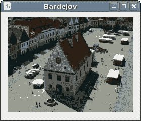

# Java 游戏基础

> 原文： [https://zetcode.com/tutorials/javagamestutorial/basics/](https://zetcode.com/tutorials/javagamestutorial/basics/)

在 Java 2D 游戏教程的这一部分中，我们将介绍创建游戏所需的一些基础知识。 我们创建一个基本应用，绘制一个甜甜圈，并显示图片。

## 关于

这是 Java 2D 游戏教程。 它是针对初学者的。 本教程将教您使用 Java 编程语言和 Swing GUI 工具箱进行 2D 游戏编程的基础。 可以在此处下载本教程中使用的图像。

## 应用

在本教程中，我们将显示每个游戏的框架。

`Board.java`

```java
package com.zetcode;

import javax.swing.JPanel;

public class Board extends JPanel {

    public Board() {}
}

```

`Board`是进行游戏的面板。

`Application.java`

```java
package com.zetcode;

import java.awt.EventQueue;
import javax.swing.JFrame;

public class Application extends JFrame {

    public Application() {

        initUI();
    }

    private void initUI() {

        add(new Board());

        setSize(250, 200);

        setTitle("Application");
        setDefaultCloseOperation(JFrame.EXIT_ON_CLOSE);
        setLocationRelativeTo(null);
    }    

    public static void main(String[] args) {

        EventQueue.invokeLater(() -> {
            Application ex = new Application();
            ex.setVisible(true);
        });
    }
}

```

这是游戏的切入点。 这里我们有主要方法。

```java
add(new Board());

```

在这里，我们将`Board`放置在`JFrame`容器的中心。

```java
setSize(250, 200);

```

此行设置窗口的大小。

```java
setDefaultCloseOperation(EXIT_ON_CLOSE);

```

当我们单击关闭按钮时，这将关闭应用。 这不是默认行为。

```java
setLocationRelativeTo(null);

```

将`null`传递给`setLocationRelativeTo()`方法时，窗口将在屏幕上居中。

```java
public static void main(String[] args) {

    EventQueue.invokeLater(() -> {
        Application ex = new Application();
        ex.setVisible(true);
    });
}

```

我们创建代码示例的实例，并使它在屏幕上可见。

## 甜甜圈

板上的对象可以是图像，也可以使用 Java 2D API 提供的绘画工具绘制。 在下一个示例中，我们绘制一个甜甜圈形状。

`Board.java`

```java
package com.zetcode;

import java.awt.BasicStroke;
import java.awt.Color;
import java.awt.Dimension;
import java.awt.Graphics;
import java.awt.Graphics2D;
import java.awt.RenderingHints;
import java.awt.geom.AffineTransform;
import java.awt.geom.Ellipse2D;
import javax.swing.JPanel;

public class Board extends JPanel {

    @Override
    public void paintComponent(Graphics g) {
        super.paintComponent(g);

        drawDonut(g);
    }

    private void drawDonut(Graphics g) {

        Graphics2D g2d = (Graphics2D) g;

        RenderingHints rh
                = new RenderingHints(RenderingHints.KEY_ANTIALIASING,
                        RenderingHints.VALUE_ANTIALIAS_ON);

        rh.put(RenderingHints.KEY_RENDERING,
                RenderingHints.VALUE_RENDER_QUALITY);

        g2d.setRenderingHints(rh);

        Dimension size = getSize();
        double w = size.getWidth();
        double h = size.getHeight();

        Ellipse2D e = new Ellipse2D.Double(0, 0, 80, 130);
        g2d.setStroke(new BasicStroke(1));
        g2d.setColor(Color.gray);

        for (double deg = 0; deg < 360; deg += 5) {
            AffineTransform at
                    = AffineTransform.getTranslateInstance(w/2, h/2);
            at.rotate(Math.toRadians(deg));
            g2d.draw(at.createTransformedShape(e));
        }
    }
}

```

绘画是在`paintComponent()`方法内完成的。

```java
private void drawDonut(Graphics g) {
...
}

```

将实际绘画委派给特定方法是一种很好的编程习惯。

```java
Graphics2D g2d = (Graphics2D) g;

```

`Graphics2D`类扩展了`Graphics`类。 它提供了对几何图形，坐标转换，颜色管理和文本布局的更复杂的控制。

```java
RenderingHints rh
        = new RenderingHints(RenderingHints.KEY_ANTIALIASING,
                RenderingHints.VALUE_ANTIALIAS_ON);

rh.put(RenderingHints.KEY_RENDERING,
        RenderingHints.VALUE_RENDER_QUALITY);

g2d.setRenderingHints(rh);

```

渲染提示用于使绘图平滑。

```java
Dimension size = getSize();
double w = size.getWidth();
double h = size.getHeight();

```

我们得到窗口的高度和宽度。 我们需要它们将甜甜圈形状在窗口上居中。

```java
Ellipse2D e = new Ellipse2D.Double(0, 0, 80, 130);
g2d.setStroke(new BasicStroke(1));
g2d.setColor(Color.gray);

```

在这里，我们创建椭圆。

```java
for (double deg = 0; deg < 360; deg += 5) {
    AffineTransform at
            = AffineTransform.getTranslateInstance(w/2, h/2);
    at.rotate(Math.toRadians(deg));
    g2d.draw(at.createTransformedShape(e));
}

```

在此，椭圆旋转 72 次以创建一个甜甜圈形状。

`Donut.java`

```java
package com.zetcode;

import java.awt.EventQueue;
import javax.swing.JFrame;

public class DonutExample extends JFrame {

    public DonutExample() {

        initUI();
    }

    private void initUI() {

        add(new Board());

        setSize(330, 330);

        setTitle("Donut");
        setDefaultCloseOperation(JFrame.EXIT_ON_CLOSE);
        setLocationRelativeTo(null);
    }    

    public static void main(String[] args) {

        EventQueue.invokeLater(() -> {
            DonutExample ex = new DonutExample();
            ex.setVisible(true);
        });
    }
}

```

这是主要的类。

## 绘制图像

当我们创建计算机游戏时，我们经常使用图像。 在下一个示例中，我们加载图像并将其绘制在板上。 如果找不到图像文件，请查看 Java 教程中的[显示图像](/java/displayimage/)。

`Board.java`

```java
package com.zetcode;

import java.awt.Dimension;
import java.awt.Graphics;
import java.awt.Image;
import javax.swing.ImageIcon;
import javax.swing.JPanel;

public class Board extends JPanel {

    private Image bardejov;

    public Board() {

        initBoard();
    }

    private void initBoard() {

        loadImage();

        int w = bardejov.getWidth(this);
        int h =  bardejov.getHeight(this);
        setPreferredSize(new Dimension(w, h));        
    }

    private void loadImage() {

        ImageIcon ii = new ImageIcon("src/resources/bardejov.png");
        bardejov = ii.getImage();        
    }

    @Override
    public void paintComponent(Graphics g) {

        g.drawImage(bardejov, 0, 0, null);
    }
}

```

我们为董事会制作了一个城镇形象。 图像绘制在`paintComponent()`方法内部。

```java
ImageIcon ii = new ImageIcon("src/resources/bardejov.png");

```

我们创建一个`ImageIcon`。

```java
bardejov = ii.getImage();

```

我们从`ImageIcon`中得到一个`Image`。

```java
g.drawImage(bardejov, 0, 0, null);

```

我们在窗口上绘制图像。

```java
int w = bardejov.getWidth(this);
int h =  bardejov.getHeight(this);
setPreferredSize(new Dimension(w, h));

```

我们确定图像的宽度和高度。 面板的首选尺寸设置为图像尺寸。 与`JFrame`的`pack()`方法配合使用时，窗口正好足以显示图像。

`ImageExample.java`

```java
package com.zetcode;

import java.awt.EventQueue;
import javax.swing.JFrame;

public class ImageExample extends JFrame {

    public ImageExample() {

        initUI();
    }

    private void initUI() {

        add(new Board());

        pack();

        setTitle("Bardejov");
        setDefaultCloseOperation(JFrame.EXIT_ON_CLOSE);
        setLocationRelativeTo(null);
    }

    public static void main(String[] args) {

        EventQueue.invokeLater(() -> {
            ImageExample ex = new ImageExample();
            ex.setVisible(true);
        });
    }
}

```

这是示例的主要类。



Figure: Image

在本章中，我们介绍了 Java 游戏编程的一些基础知识。