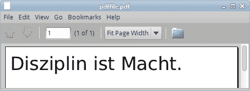
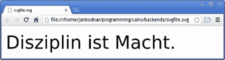
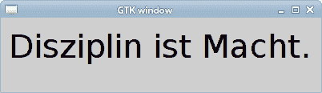

# Cairo 后端

> 原文： [https://zetcode.com/gfx/cairo/cairobackends/](https://zetcode.com/gfx/cairo/cairobackends/)

Cairo 库支持各种后端。 在 Cairo 图形教程的这一部分中，我们将使用 Cairo 创建 PNG 图像，PDF 文件，SVG 文件，并在 GTK 窗口上绘制。

## PNG 图像

在第一个示例中，我们将创建一个 PNG 图像。

```
#include <cairo.h>

int main(void)
{
  cairo_surface_t *surface;
  cairo_t *cr;

  surface = cairo_image_surface_create(CAIRO_FORMAT_ARGB32, 390, 60);
  cr = cairo_create(surface);

  cairo_set_source_rgb(cr, 0, 0, 0);
  cairo_select_font_face(cr, "Sans", CAIRO_FONT_SLANT_NORMAL,
      CAIRO_FONT_WEIGHT_NORMAL);
  cairo_set_font_size(cr, 40.0);

  cairo_move_to(cr, 10.0, 50.0);
  cairo_show_text(cr, "Disziplin ist Macht.");

  cairo_surface_write_to_png(surface, "image.png");

  cairo_destroy(cr);
  cairo_surface_destroy(surface);

  return 0;
}

```

本示例是一个小型控制台应用，它将创建一个 PNG 图像。

```
#include <cairo.h>

```

在此头文件中，我们将找到函数和常量的声明。

```
cairo_surface_t *surface;
cairo_t *cr;

```

在这里，我们声明一个表面和一个Cairo 上下文。

```
surface = cairo_image_surface_create(CAIRO_FORMAT_ARGB32, 390, 60);
cr = cairo_create(surface);

```

我们创建一个表面和一个Cairo 上下文。 表面是 390x60 像素的图像。

```
cairo_set_source_rgb(cr, 0, 0, 0);

```

我们将用黑色墨水绘制。

```
cairo_select_font_face(cr, "Sans", CAIRO_FONT_SLANT_NORMAL,
    CAIRO_FONT_WEIGHT_NORMAL);
cairo_set_font_size(cr, 40.0);

```

我们选择一种字体类型并设置其大小。

```
cairo_move_to(cr, 10.0, 50.0);
cairo_show_text(cr, "Disziplin ist Macht.");

```

我们移到图像内的（10.0，50.0）位置并绘制文本。

```
cairo_surface_write_to_png(surface, "image.png");

```

此函数调用将创建 PNG 图像。

```
cairo_destroy(cr);
cairo_surface_destroy(surface);

```

最后，我们清理资源。

## PDF 文件

在第二个示例中，我们将使用 Cairo 库创建一个简单的 PDF 文件。

```
#include <cairo.h>
#include <cairo-pdf.h>

int main(void) 
{
  cairo_surface_t *surface;
  cairo_t *cr;

  surface = cairo_pdf_surface_create("pdffile.pdf", 504, 648);
  cr = cairo_create(surface);

  cairo_set_source_rgb(cr, 0, 0, 0);
  cairo_select_font_face (cr, "Sans", CAIRO_FONT_SLANT_NORMAL,
      CAIRO_FONT_WEIGHT_NORMAL);
  cairo_set_font_size (cr, 40.0);

  cairo_move_to(cr, 10.0, 50.0);
  cairo_show_text(cr, "Disziplin ist Macht.");

  cairo_show_page(cr);

  cairo_surface_destroy(surface);
  cairo_destroy(cr);

  return 0;
}

```

我们必须在 PDF 查看器中打开 PDF 文件。 Linux 用户可以使用 KPDF 或 Evince 查看器。

```
surface = cairo_pdf_surface_create("pdffile.pdf", 504, 648);

```

要渲染 PDF 文件，我们必须使用`cairo_pdf_surface_create()`函数调用来创建 PDF 曲面。 PDF 文件的大小以磅为单位指定，这是排版的标准。

```
cairo_show_page(cr);

```

`cairo_show_page()`完成 PDF 文件的渲染。



Figure: PDF file in Evince

## SVG 文件

下一个示例创建一个简单的 SVG（可缩放矢量图形）文件。 SVG 是当今最热门的技术之一。

```
#include <cairo.h>
#include <cairo-svg.h> 

int main(void) 
{
  cairo_surface_t *surface;
  cairo_t *cr;

  surface = cairo_svg_surface_create("svgfile.svg", 390, 60);
  cr = cairo_create(surface);

  cairo_set_source_rgb(cr, 0, 0, 0);
  cairo_select_font_face(cr, "Sans", CAIRO_FONT_SLANT_NORMAL,
      CAIRO_FONT_WEIGHT_NORMAL);
  cairo_set_font_size(cr, 40.0);

  cairo_move_to(cr, 10.0, 50.0);
  cairo_show_text(cr, "Disziplin ist Macht.");

  cairo_surface_destroy(surface);
  cairo_destroy(cr);

  return 0;
}

```

我们可以使用 Firefox，Opera 或 Inkscape 程序打开 svgfile.svg 文件。

```
surface = cairo_svg_surface_create("svgfile.svg", 390, 60);

```

要在Cairo 创建 SVG 文件，我们必须使用`cairo_svg_surface_create()`函数调用来创建 svg 曲面。

```
cr = cairo_create(surface);

```

Cairo 上下文是从 SVG 曲面创建的。

其余代码与前面的示例相同。



SVG file in Chrome

## GTK 窗口

在最后一个示例中，我们将在 GTK 窗口上绘制。 该后端将在本教程的其余部分中使用。

```
#include <cairo.h>
#include <gtk/gtk.h>

static void do_drawing(cairo_t *);

static gboolean on_draw_event(GtkWidget *widget, cairo_t *cr, 
    gpointer user_data)
{      
  do_drawing(cr);

  return FALSE;
}

static void do_drawing(cairo_t *cr)
{
  cairo_set_source_rgb(cr, 0, 0, 0);
  cairo_select_font_face(cr, "Sans", CAIRO_FONT_SLANT_NORMAL,
      CAIRO_FONT_WEIGHT_NORMAL);
  cairo_set_font_size(cr, 40.0);

  cairo_move_to(cr, 10.0, 50.0);
  cairo_show_text(cr, "Disziplin ist Macht.");    
}

int main(int argc, char *argv[])
{
  GtkWidget *window;
  GtkWidget *darea;

  gtk_init(&argc, &argv);

  window = gtk_window_new(GTK_WINDOW_TOPLEVEL);

  darea = gtk_drawing_area_new();
  gtk_container_add(GTK_CONTAINER(window), darea);

  g_signal_connect(G_OBJECT(darea), "draw", 
      G_CALLBACK(on_draw_event), NULL); 
  g_signal_connect(window, "destroy",
      G_CALLBACK(gtk_main_quit), NULL);

  gtk_window_set_position(GTK_WINDOW(window), GTK_WIN_POS_CENTER);
  gtk_window_set_default_size(GTK_WINDOW(window), 400, 90); 
  gtk_window_set_title(GTK_WINDOW(window), "GTK window");

  gtk_widget_show_all(window);

  gtk_main();

  return 0;
}

```

该示例弹出一个居中的 GTK 窗口，在该窗口上绘制“ Disziplin ist Macht”文本。

```
#include <cairo.h>
#include <gtk/gtk.h>

```

我们包括必要的 Cairo 和 GTK 标头。

```
static gboolean on_draw_event(GtkWidget *widget, cairo_t *cr, 
    gpointer user_data)
{      
  do_drawing(cr);

  return FALSE;
}

```

我们将实际图形委托给`do_drawing()`功能。 发送的参数是 Cairo 上下文。

```
static void do_drawing(cairo_t *cr)
{
  cairo_set_source_rgb(cr, 0, 0, 0);
  cairo_select_font_face(cr, "Sans", CAIRO_FONT_SLANT_NORMAL,
      CAIRO_FONT_WEIGHT_NORMAL);
  cairo_set_font_size(cr, 40.0);

  cairo_move_to(cr, 10.0, 50.0);
  cairo_show_text(cr, "Disziplin ist Macht.");    
}

```

Cairo 功能执行绘图。

```
darea = gtk_drawing_area_new();
gtk_container_add(GTK_CONTAINER(window), darea);

```

我们创建一个`GtkDrawingArea`小部件，并将其添加到容器窗口。 用于自定义绘图。

```
g_signal_connect(G_OBJECT(darea), "draw", 
    G_CALLBACK(on_draw_event), NULL); 

```

当需要重新绘制`GtkDrawingArea`小部件时，它将发出`draw`信号。 我们将该信号连接到`on_draw_event()`回调。



Figure: GTK window

在本章中，我们介绍了受支持的Cairo 后端。