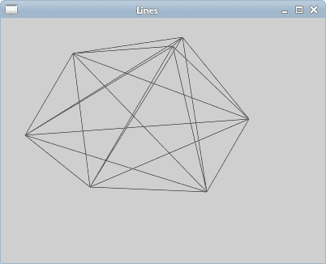
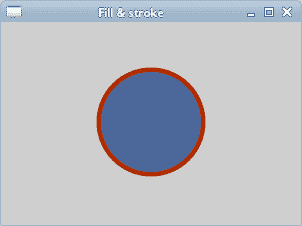
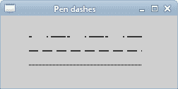
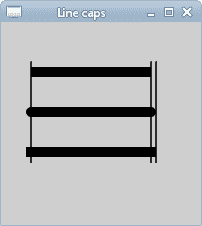
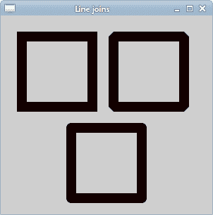

# Cairo 基本图形

> 原文： [https://zetcode.com/gfx/cairo/basicdrawing/](https://zetcode.com/gfx/cairo/basicdrawing/)

在 Cairo 图形教程的这一部分中，我们将绘制一些基本图元。 我们将绘制简单的线条，使用填充和描边操作，我们将讨论破折号，线帽和线连接。

## 直线

线是非常基本的矢量对象。 要画一条线，我们使用两个函数调用。 通过`cairo_move_to()`调用指定起点。 线的终点通过`cairo_line_to()`调用指定。

```c
#include <cairo.h>
#include <gtk/gtk.h>

static void do_drawing(cairo_t *);

struct {
  int count;
  double coordx[100];
  double coordy[100];
} glob;

static gboolean on_draw_event(GtkWidget *widget, cairo_t *cr, 
    gpointer user_data)
{
  do_drawing(cr);

  return FALSE;
}

static void do_drawing(cairo_t *cr)
{
  cairo_set_source_rgb(cr, 0, 0, 0);
  cairo_set_line_width(cr, 0.5);

  int i, j;
  for (i = 0; i <= glob.count - 1; i++ ) {
      for (j = 0; j <= glob.count - 1; j++ ) {
          cairo_move_to(cr, glob.coordx[i], glob.coordy[i]);
          cairo_line_to(cr, glob.coordx[j], glob.coordy[j]);
      }
  }

  glob.count = 0;
  cairo_stroke(cr);    
}

static gboolean clicked(GtkWidget *widget, GdkEventButton *event,
    gpointer user_data)
{
    if (event->button == 1) {
        glob.coordx[glob.count] = event->x;
        glob.coordy[glob.count++] = event->y;
    }

    if (event->button == 3) {
        gtk_widget_queue_draw(widget);
    }

    return TRUE;
}

int main(int argc, char *argv[])
{
  GtkWidget *window;
  GtkWidget *darea;

  glob.count = 0;

  gtk_init(&argc, &argv);

  window = gtk_window_new(GTK_WINDOW_TOPLEVEL);

  darea = gtk_drawing_area_new();
  gtk_container_add(GTK_CONTAINER(window), darea);

  gtk_widget_add_events(window, GDK_BUTTON_PRESS_MASK);

  g_signal_connect(G_OBJECT(darea), "draw", 
      G_CALLBACK(on_draw_event), NULL); 
  g_signal_connect(window, "destroy",
      G_CALLBACK(gtk_main_quit), NULL);  

  g_signal_connect(window, "button-press-event", 
      G_CALLBACK(clicked), NULL);

  gtk_window_set_position(GTK_WINDOW(window), GTK_WIN_POS_CENTER);
  gtk_window_set_default_size(GTK_WINDOW(window), 400, 300); 
  gtk_window_set_title(GTK_WINDOW(window), "Lines");

  gtk_widget_show_all(window);

  gtk_main();

  return 0;
}

```

在我们的示例中，我们用鼠标左键随机单击一个窗口。 每次点击都存储在一个数组中。 当我们右键单击窗口时，所有点都与数组中的每个点相连。 这样，我们可以创建一些有趣的对象。 右键单击绘制的对象将清除窗口，我们可以单击另一个对象。

```c
cairo_set_source_rgb(cr, 0, 0, 0);
cairo_set_line_width (cr, 0.5);

```

线条将用黑色墨水绘制，宽度为 0.5 点。

```c
int i, j;
for (i = 0; i <= glob.count - 1; i++ ) {
    for (j = 0; j <= glob.count - 1; j++ ) {
        cairo_move_to(cr, glob.coordx[i], glob.coordy[i]);
        cairo_line_to(cr, glob.coordx[j], glob.coordy[j]);
    }
}

```

我们将数组中的每个点连接到其他每个点。

```c
cairo_stroke(cr);

```

`cairo_stroke()`调用画线。

```c
g_signal_connect(window, "button-press-event", 
    G_CALLBACK(clicked), NULL);

```

我们将`button-press-event`连接到单击的回调。

```c
if (event->button == 1) {
    glob.coordx[glob.count] = event->x;
    glob.coordy[glob.count++] = event->y;
}

```

在单击的回调中，我们确定是单击鼠标左键还是单击鼠标右键。 如果单击鼠标左键，则将 x，y 坐标存储到数组中。

```c
if (event->button == 3) {
    gtk_widget_queue_draw(widget);
}

```

通过右键单击，我们重新绘制窗口。



图：直线

## 填充和描边

描边操作绘制形状的轮廓，填充操作填充形状的内部。

```c
#include <cairo.h>
#include <gtk/gtk.h>
#include <math.h>

static void do_drawing(cairo_t *, GtkWidget *);

static gboolean on_draw_event(GtkWidget *widget, cairo_t *cr, 
    gpointer user_data)
{  
  do_drawing(cr, widget);  

  return FALSE;
}

static void do_drawing(cairo_t *cr, GtkWidget *widget)
{
  GtkWidget *win = gtk_widget_get_toplevel(widget);

  int width, height;
  gtk_window_get_size(GTK_WINDOW(win), &width, &height);

  cairo_set_line_width(cr, 9);  
  cairo_set_source_rgb(cr, 0.69, 0.19, 0);

  cairo_translate(cr, width/2, height/2);
  cairo_arc(cr, 0, 0, 50, 0, 2 * M_PI);
  cairo_stroke_preserve(cr);

  cairo_set_source_rgb(cr, 0.3, 0.4, 0.6); 
  cairo_fill(cr);      
}

int main (int argc, char *argv[])
{
  GtkWidget *window;
  GtkWidget *darea;

  gtk_init(&argc, &argv);

  window = gtk_window_new(GTK_WINDOW_TOPLEVEL);

  darea = gtk_drawing_area_new();
  gtk_container_add(GTK_CONTAINER(window), darea);

  g_signal_connect(G_OBJECT(darea), "draw", 
      G_CALLBACK(on_draw_event), NULL);
  g_signal_connect(G_OBJECT(window), "destroy",
      G_CALLBACK(gtk_main_quit), NULL);

  gtk_window_set_position(GTK_WINDOW(window), GTK_WIN_POS_CENTER);
  gtk_window_set_default_size(GTK_WINDOW(window), 300, 200); 
  gtk_window_set_title(GTK_WINDOW(window), "Fill & stroke");

  gtk_widget_show_all(window);

  gtk_main();

  return 0;
}

```

在我们的示例中，我们将绘制一个圆并用纯色填充它。

```c
#include <math.h>

```

`M_PI`常量需要此头文件。

```c
GtkWidget *win = gtk_widget_get_toplevel(widget);

int width, height;
gtk_window_get_size(GTK_WINDOW(win), &width, &height);

```

在这里，我们获得了窗口的宽度和高度。 绘制圆时，将需要这些值。 当我们调整窗口大小时，圆圈将被调整大小。

```c
cairo_set_line_width(cr, 9);  
cairo_set_source_rgb(cr, 0.69, 0.19, 0);

```

我们使用`set_line_width()`方法设置线宽。 我们使用`set_source_rgb()`方法将光源设置为深红色。

```c
cairo_translate(cr, width/2, height/2);
cairo_arc(cr, 0, 0, 50, 0, 2 * M_PI);
cairo_stroke_preserve(cr);

```

使用`cairo_translate()`方法，我们将图形原点移动到窗口的中心。 我们希望我们的圈子居中。 `arc()`方法向 Cairo 绘图上下文添加了新的圆形路径。 最后，`stroke_preserve()`方法绘制圆的轮廓。 与`stroke()`方法不同，它还保留了形状以供以后绘制。

```c
cairo_set_source_rgb(cr, 0.3, 0.4, 0.6); 
cairo_fill(cr);

```

在这里，我们用蓝色填充线圈。



图：填充和笔划

## 笔划线

每条线可以用不同的笔划线绘制。 它定义了线条的样式。 破折号由`cairo_stroke()`函数调用使用。 破折号由`cairo_set_dash()`功能指定。 该模式由虚线数组设置，该数组是一个正浮点值的数组。 他们设置破折号图案的开和关部分。 我们还指定了数组的长度和偏移值。 如果长度为 0，则禁用虚线。 如果为 1，则假定对称图案，并交替显示由虚线表示的单个值指定的大小的打开和关闭部分。

```c
static void do_drawing(cairo_t *cr)
{
  cairo_set_source_rgba(cr, 0, 0, 0, 1);

  static const double dashed1[] = {4.0, 21.0, 2.0};
  static int len1  = sizeof(dashed1) / sizeof(dashed1[0]);

  static const double dashed2[] = {14.0, 6.0};
  static int len2  = sizeof(dashed2) / sizeof(dashed2[0]);

  static const double dashed3[] = {1.0};

  cairo_set_line_width(cr, 1.5);

  cairo_set_dash(cr, dashed1, len1, 0);

  cairo_move_to(cr, 40, 30);  
  cairo_line_to(cr, 200, 30);
  cairo_stroke(cr);

  cairo_set_dash(cr, dashed2, len2, 1);

  cairo_move_to(cr, 40, 50);  
  cairo_line_to(cr, 200, 50);
  cairo_stroke(cr);

  cairo_set_dash(cr, dashed3, 1, 0);

  cairo_move_to(cr, 40, 70);  
  cairo_line_to(cr, 200, 70);
  cairo_stroke(cr);  
}

```

在此示例中，我们将绘制三条具有不同破折号图案的线。

```c
static const double dashed1[] = {4.0, 21.0, 2.0};

```

我们有三个数字的模式。 我们得出 4 分，未得出 21 分，得出 2 分。 然后，未绘制 4 点，未绘制 21 点和未绘制 2 点。 该模式轮流直到行尾。

```c
static int len1  = sizeof(dashed1) / sizeof(dashed1[0]);

```

我们得到数组的大小。

```c
cairo_set_dash(cr, dashed1, len1, 0);

```

我们设置破折号。

```c
static const double dashed3[] = {1.0};
...
cairo_set_dash(cr, dashed3, 1, 0);

cairo_move_to(cr, 40, 70);  
cairo_line_to(cr, 200, 70);
cairo_stroke(cr);  

```

这些线创建了一条带有笔划的对称划线交替交替的单个点和断开点的线。



图：虚线

## 线帽

线帽是线的端点。

*   CAIRO_LINE_CAP_SQUARE
*   CAIRO_LINE_CAP_ROUND
*   CAIRO_LINE_CAP_BUTT

Cairo 有三种不同的线帽样式。


图：正方形，圆和端帽

带有`CAIRO_LINE_CAP_SQUARE`上限的行的大小将不同于带有`CAIRO_LINE_CAP_BUTT`上限的行。 如果一条线的宽度为 px 宽，则带有`CAIRO_LINE_CAP_SQUARE`上限的线的宽度将恰好为 px 宽度。 开头为`width / 2`像素，结尾为`width / 2`像素。

```c
static void do_drawing(cairo_t *cr)
{
  cairo_set_line_width(cr, 10);

  cairo_set_line_cap(cr, CAIRO_LINE_CAP_BUTT); 
  cairo_move_to(cr, 30, 50); 
  cairo_line_to(cr, 150, 50);
  cairo_stroke(cr);

  cairo_set_line_cap(cr, CAIRO_LINE_CAP_ROUND); 
  cairo_move_to(cr, 30, 90); 
  cairo_line_to(cr, 150, 90);
  cairo_stroke(cr);

  cairo_set_line_cap(cr, CAIRO_LINE_CAP_SQUARE); 
  cairo_move_to(cr, 30, 130); 
  cairo_line_to(cr, 150, 130);
  cairo_stroke(cr);

  cairo_set_line_width(cr, 1.5);

  cairo_move_to(cr, 30, 40);  
  cairo_line_to(cr, 30, 140);
  cairo_stroke(cr);

  cairo_move_to(cr, 150, 40);  
  cairo_line_to(cr, 150, 140);
  cairo_stroke(cr);

  cairo_move_to(cr, 155, 40);  
  cairo_line_to(cr, 155, 140);
  cairo_stroke(cr);    
}

```

该示例绘制了具有三个不同上限的三条线。 它还将以图形方式显示行大小的差异。

```c
cairo_set_line_width(cr, 10);

```

我们的线将是 10 像素宽。

```c
cairo_set_line_cap(cr, CAIRO_LINE_CAP_ROUND); 
cairo_move_to(cr, 30, 90); 
cairo_line_to(cr, 150, 90);
cairo_stroke(cr);

```

在这里，我们用`CAIRO_LINE_CAP_ROUND`帽画一条水平线。

```c
cairo_set_line_width(cr, 1.5);

cairo_move_to(cr, 30, 40);  
cairo_line_to(cr, 30, 140);
cairo_stroke(cr);

```

这是用来说明大小差异的三条垂直线之一。



图：线帽

## 线连接

可以使用三种不同的连接样式来连接线：

*   `CAIRO_LINE_JOIN_BEVEL`
*   `CAIRO_LINE_JOIN_ROUND`
*   `CAIRO_LINE_JOIN_MITER`


图：斜角，圆角，斜接线连接

`CAIRO_LINE_JOIN_BEVEL`使用切除连接，其中切除距离接合点的线宽一半。 `CAIRO_LINE_JOIN_ROUND`使用圆形连接，其中圆心是连接点。 `CAIRO_LINE_JOIN_MITER`使用了一个尖角。

```c
static void do_drawing(cairo_t *cr)
{
  cairo_set_source_rgb(cr, 0.1, 0, 0);

  cairo_rectangle(cr, 30, 30, 100, 100);
  cairo_set_line_width(cr, 14);
  cairo_set_line_join(cr, CAIRO_LINE_JOIN_MITER); 
  cairo_stroke(cr);

  cairo_rectangle(cr, 160, 30, 100, 100);
  cairo_set_line_width(cr, 14);
  cairo_set_line_join(cr, CAIRO_LINE_JOIN_BEVEL); 
  cairo_stroke(cr);

  cairo_rectangle(cr, 100, 160, 100, 100);
  cairo_set_line_width(cr, 14);
  cairo_set_line_join(cr, CAIRO_LINE_JOIN_ROUND); 
  cairo_stroke(cr);    
}

```

在此示例中，我们绘制了三个具有各种线连接的粗矩形。

```c
cairo_rectangle(cr, 30, 30, 100, 100);
cairo_set_line_width(cr, 14);
cairo_set_line_join(cr, CAIRO_LINE_JOIN_MITER); 
cairo_stroke(cr);

```

在此代码示例中，我们绘制具有`CAIRO_LINE_JOIN_MITER`连接样式的矩形。 线宽为 14px。



图：直线连接

在本章中，我们做了一些基本绘图。