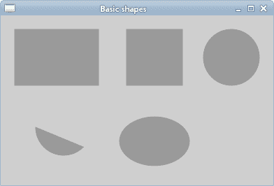
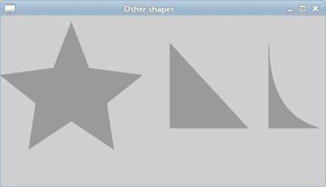
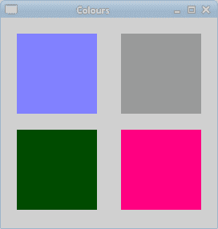

# 形状和填充

> 原文： [https://zetcode.com/gfx/cairo/shapesfills/](https://zetcode.com/gfx/cairo/shapesfills/)

在Cairo 教程的这一部分中，我们将创建一些基本的和更高级的形状。 我们将用纯色，图案和渐变填充它们。 渐变将在单独的章节中介绍。

## 基本形状

Cairo API 具有一些用于创建简单形状的基本功能。

```
static void do_drawing(cairo_t *cr)
{
  cairo_set_source_rgb(cr, 0.6, 0.6, 0.6);
  cairo_set_line_width(cr, 1);

  cairo_rectangle(cr, 20, 20, 120, 80);
  cairo_rectangle(cr, 180, 20, 80, 80);
  cairo_stroke_preserve(cr);
  cairo_fill(cr);

  cairo_arc(cr, 330, 60, 40, 0, 2*M_PI);
  cairo_stroke_preserve(cr);
  cairo_fill(cr);

  cairo_arc(cr, 90, 160, 40, M_PI/4, M_PI);
  cairo_close_path(cr);
  cairo_stroke_preserve(cr);
  cairo_fill(cr);

  cairo_translate(cr, 220, 180);
  cairo_scale(cr, 1, 0.7);
  cairo_arc(cr, 0, 0, 50, 0, 2*M_PI);
  cairo_stroke_preserve(cr);
  cairo_fill(cr);
}

```

在此示例中，我们将创建一个矩形，正方形，圆形，弧形和椭圆形。

```
cairo_rectangle(cr, 20, 20, 120, 80);
cairo_rectangle(cr, 180, 20, 80, 80);

```

`cairo_rectangle()`用于创建正方形和矩形。 正方形只是矩形的一种特定类型。

```
cairo_arc(cr, 330, 60, 40, 0, 2*M_PI);

```

这条线创建一个圆。

```
cairo_scale(cr, 1, 0.7);
cairo_arc(cr, 0, 0, 50, 0, 2*M_PI);

```

我们使用`cairo_scale()`函数调用来创建一个椭圆。



Figure: Basic shapes

可以使用基本图元的组合来创建其他形状。

```
#include <cairo.h>
#include <gtk/gtk.h>

static void do_drawing(cairo_t *);

int points[11][2] = { 
    { 0, 85 }, 
    { 75, 75 }, 
    { 100, 10 }, 
    { 125, 75 }, 
    { 200, 85 },
    { 150, 125 }, 
    { 160, 190 },
    { 100, 150 }, 
    { 40, 190 },
    { 50, 125 },
    { 0, 85 } 
};

static gboolean on_draw_event(GtkWidget *widget, cairo_t *cr, 
    gpointer user_data)
{
  do_drawing(cr);

  return FALSE;
}

static void do_drawing(cairo_t *cr)
{ 
  cairo_set_source_rgb(cr, 0.6, 0.6, 0.6);
  cairo_set_line_width(cr, 1);

  gint i;
  for (i = 0; i < 10; i++) {
      cairo_line_to(cr, points[i][0], points[i][1]);
  }

  cairo_close_path(cr);
  cairo_stroke_preserve(cr);
  cairo_fill(cr);

  cairo_move_to(cr, 240, 40);
  cairo_line_to(cr, 240, 160);
  cairo_line_to(cr, 350, 160);
  cairo_close_path(cr);

  cairo_stroke_preserve(cr);
  cairo_fill(cr);

  cairo_move_to(cr, 380, 40);
  cairo_line_to(cr, 380, 160);
  cairo_line_to(cr, 450, 160);
  cairo_curve_to(cr, 440, 155, 380, 145, 380, 40);

  cairo_stroke_preserve(cr);
  cairo_fill(cr);  
}

int main(int argc, char *argv[])
{
  GtkWidget *window;
  GtkWidget *darea;

  gtk_init(&argc, &argv);

  window = gtk_window_new(GTK_WINDOW_TOPLEVEL);

  darea = gtk_drawing_area_new();
  gtk_container_add(GTK_CONTAINER(window), darea);

  g_signal_connect(G_OBJECT(darea), "draw", 
      G_CALLBACK(on_draw_event), NULL);  
  g_signal_connect(window, "destroy",
      G_CALLBACK(gtk_main_quit), NULL);

  gtk_window_set_position(GTK_WINDOW(window), GTK_WIN_POS_CENTER);
  gtk_window_set_default_size(GTK_WINDOW(window), 460, 240); 
  gtk_window_set_title(GTK_WINDOW(window), "Other shapes");

  gtk_widget_show_all(window);

  gtk_main();

  return 0;
}

```

在此示例中，我们将星形对象创建为三角形和修改后的三角形。 这些对象是使用直线和一条曲线创建的。

```
gint i;
for (i = 0; i < 10; i++ ) {
    cairo_line_to(cr, points[i][0], points[i][1]);
}

cairo_close_path(cr);

```

通过连接点数组中的所有点来绘制星形。 通过调用`cairo_close_path()`函数将星星结束，该函数将星星的最后两个点连接在一起。

```
cairo_move_to(cr, 380, 40);
cairo_line_to(cr, 380, 160);
cairo_line_to(cr, 450, 160);
cairo_curve_to(cr, 440, 155, 380, 145, 380, 40);

```

修改后的三角形是两条直线和一条曲线的简单组合。



Figure: Other shapes

## 填充

填充填充形状的内部。 填充可以是纯色，图案或渐变。

### 纯色

颜色是代表红色，绿色和蓝色（RGB）强度值的组合的对象。 Cairo 有效 RGB 值在 0 到 1 的范围内。

```
static void do_drawing(cairo_t *cr)
{ 
  cairo_set_source_rgb(cr, 0.5, 0.5, 1);
  cairo_rectangle(cr, 20, 20, 100, 100);
  cairo_fill(cr);

  cairo_set_source_rgb(cr, 0.6, 0.6, 0.6);
  cairo_rectangle(cr, 150, 20, 100, 100);
  cairo_fill(cr);

  cairo_set_source_rgb(cr, 0, 0.3, 0);
  cairo_rectangle(cr, 20, 140, 100, 100);
  cairo_fill(cr);

  cairo_set_source_rgb(cr, 1, 0, 0.5);
  cairo_rectangle(cr, 150, 140, 100, 100);
  cairo_fill(cr);  
}

```

在示例中，我们绘制了四个彩色矩形。

```
cairo_set_source_rgb(cr, 0.5, 0.5, 1);
cairo_rectangle(cr, 20, 20, 100, 100);
cairo_fill(cr);

```

`cairo_set_source_rgb()`函数调用将源设置为不透明的颜色。 参数是红色，绿色和蓝色强度值。 通过调用`cairo_fill()`函数，源可用于填充矩形的内部。



Figure: Solid colours

### 图案

图案是可以填充形状的复杂图形对象。

```
#include <cairo.h>
#include <gtk/gtk.h>

static void do_drawing(cairo_t *);

cairo_surface_t *surface1;
cairo_surface_t *surface2;
cairo_surface_t *surface3;
cairo_surface_t *surface4;

static void create_surfaces() {
  surface1 = cairo_image_surface_create_from_png("blueweb.png");
  surface2 = cairo_image_surface_create_from_png("maple.png");
  surface3 = cairo_image_surface_create_from_png("crack.png");
  surface4 = cairo_image_surface_create_from_png("chocolate.png");
}

static void destroy_surfaces() {
  cairo_surface_destroy(surface1);
  cairo_surface_destroy(surface2);
  cairo_surface_destroy(surface3);
  cairo_surface_destroy(surface4);
}

static gboolean on_draw_event(GtkWidget *widget, cairo_t *cr, 
    gpointer user_data)
{
  do_drawing(cr);

  return FALSE;
}

static void do_drawing(cairo_t *cr)
{
  cairo_pattern_t *pattern1;
  cairo_pattern_t *pattern2;
  cairo_pattern_t *pattern3;
  cairo_pattern_t *pattern4;

  pattern1 = cairo_pattern_create_for_surface(surface1);
  pattern2 = cairo_pattern_create_for_surface(surface2);
  pattern3 = cairo_pattern_create_for_surface(surface3);
  pattern4 = cairo_pattern_create_for_surface(surface4);

  cairo_set_source(cr, pattern1);
  cairo_pattern_set_extend(cairo_get_source(cr), CAIRO_EXTEND_REPEAT);
  cairo_rectangle(cr, 20, 20, 100, 100);
  cairo_fill(cr);

  cairo_set_source(cr, pattern2); 
  cairo_pattern_set_extend(cairo_get_source(cr), CAIRO_EXTEND_REPEAT); 
  cairo_rectangle(cr, 150, 20, 100, 100);
  cairo_fill(cr);

  cairo_set_source(cr, pattern3);
  cairo_pattern_set_extend(cairo_get_source(cr), CAIRO_EXTEND_REPEAT);
  cairo_rectangle(cr, 20, 140, 100, 100);
  cairo_fill(cr);

  cairo_set_source(cr, pattern4);
  cairo_pattern_set_extend(cairo_get_source(cr), CAIRO_EXTEND_REPEAT);
  cairo_rectangle(cr, 150, 140, 100, 100);
  cairo_fill(cr);

  cairo_pattern_destroy(pattern1);
  cairo_pattern_destroy(pattern2);
  cairo_pattern_destroy(pattern3);
  cairo_pattern_destroy(pattern4);      
}

int main(int argc, char *argv[])
{
  GtkWidget *window;
  GtkWidget *darea;

  gtk_init(&argc, &argv);

  window = gtk_window_new(GTK_WINDOW_TOPLEVEL);

  darea = gtk_drawing_area_new();
  gtk_container_add(GTK_CONTAINER(window), darea);  

  g_signal_connect(G_OBJECT(darea), "draw", 
      G_CALLBACK(on_draw_event), NULL);  
  g_signal_connect(G_OBJECT(window), "destroy",
      G_CALLBACK(gtk_main_quit), NULL);

  create_surfaces();

  gtk_window_set_position(GTK_WINDOW(window), GTK_WIN_POS_CENTER);
  gtk_window_set_default_size(GTK_WINDOW(window), 270, 260); 
  gtk_window_set_title(GTK_WINDOW(window), "Patterns");

  gtk_widget_show_all(window);

  gtk_main();

  destroy_surfaces();

  return 0;
}

```

在此示例中，我们再次绘制了四个矩形。 这次，我们用一些模式填充它们。 我们使用来自 Gimp 图像处理程序的四个图案图像。 我们必须保留这些模式的原始大小，因为我们将对它们进行平铺。

我们在`on_draw_event()`功能之外创建图像表面。 每次需要重新绘制窗口时，每次从硬盘读取数据都不是很有效。

```
pattern1 = cairo_pattern_create_for_surface(surface1);

```

我们通过调用`cairo_pattern_create_for_surface()`函数从表面创建图案。

```
cairo_set_source(cr, pattern1);
cairo_pattern_set_extend(cairo_get_source(cr), CAIRO_EXTEND_REPEAT);
cairo_rectangle(cr, 20, 20, 100, 100);
cairo_fill(cr);

```

在这里，我们绘制第一个矩形。 `cairo_set_source()`告诉 Cairo 上下文使用图案作为绘图源。 图像图案可能不完全适合形状。 我们将模式设置为`CAIRO_EXTEND_REPEAT`，这将导致图案通过重复平铺。 `cairo_rectangle()`创建一个矩形路径。 最后，`cairo_fill()`用源填充路径。

本章介绍了Cairo 的形状和填充。