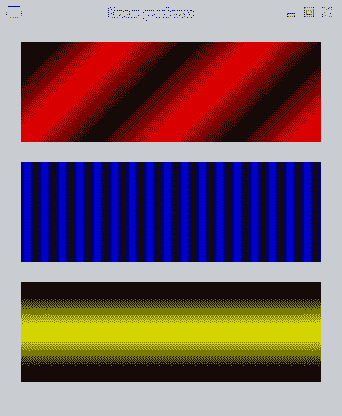

# 渐变色

> 原文： [https://zetcode.com/gfx/cairo/gradients/](https://zetcode.com/gfx/cairo/gradients/)

在Cairo 图形教程的这一部分中，我们将介绍渐变。 我们将提到线性和径向渐变。

在计算机图形学中，渐变是从浅到深或从一种颜色到另一种颜色的阴影的平滑混合。 在 2D 绘图程序和绘画程序中，渐变用于创建彩色背景和特殊效果以及模拟灯光和阴影。 （answers.com）

## 线性渐变

线性渐变是沿着一条线的颜色混合或颜色阴影混合。 它们是使用`cairo_pattern_create_linear()`功能创建的。

```
#include <cairo.h>
#include <gtk/gtk.h>

void draw_gradient1(cairo_t *);
void draw_gradient2(cairo_t *);
void draw_gradient3(cairo_t *);

static gboolean on_draw_event(GtkWidget *widget, cairo_t *cr, 
    gpointer user_data)
{         
  draw_gradient1(cr);
  draw_gradient2(cr);
  draw_gradient3(cr);  

  return FALSE;
}

void draw_gradient1(cairo_t *cr)
{
  cairo_pattern_t *pat1;  
  pat1 = cairo_pattern_create_linear(0.0, 0.0,  350.0, 350.0);

  gdouble j;
  gint count = 1;
  for ( j = 0.1; j < 1; j += 0.1 ) {
      if (( count % 2 ))  {
          cairo_pattern_add_color_stop_rgb(pat1, j, 0, 0, 0);
      } else { 
          cairo_pattern_add_color_stop_rgb(pat1, j, 1, 0, 0);
      }
   count++;
  }

  cairo_rectangle(cr, 20, 20, 300, 100);
  cairo_set_source(cr, pat1);
  cairo_fill(cr);  

  cairo_pattern_destroy(pat1);
}

void draw_gradient2(cairo_t *cr)
{
  cairo_pattern_t *pat2;
  pat2 = cairo_pattern_create_linear(0.0, 0.0,  350.0, 0.0);

  gdouble i;
  gint count = 1;
  for ( i = 0.05; i < 0.95; i += 0.025 ) {
      if (( count % 2 ))  {
          cairo_pattern_add_color_stop_rgb(pat2, i, 0, 0, 0);
      } else { 
          cairo_pattern_add_color_stop_rgb(pat2, i, 0, 0, 1);
      }
   count++;
  }

  cairo_rectangle(cr, 20, 140, 300, 100);
  cairo_set_source(cr, pat2);
  cairo_fill(cr);  

  cairo_pattern_destroy(pat2);
}

void draw_gradient3(cairo_t *cr)
{
  cairo_pattern_t *pat3;
  pat3 = cairo_pattern_create_linear(20.0, 260.0, 20.0, 360.0);

  cairo_pattern_add_color_stop_rgb(pat3, 0.1, 0, 0, 0);
  cairo_pattern_add_color_stop_rgb(pat3, 0.5, 1, 1, 0);
  cairo_pattern_add_color_stop_rgb(pat3, 0.9, 0, 0, 0);

  cairo_rectangle(cr, 20, 260, 300, 100);
  cairo_set_source(cr, pat3);
  cairo_fill(cr);  

  cairo_pattern_destroy(pat3);
}

int main(int argc, char *argv[])
{
  GtkWidget *window;
  GtkWidget *darea;  

  gtk_init(&argc, &argv);

  window = gtk_window_new(GTK_WINDOW_TOPLEVEL);

  darea = gtk_drawing_area_new();
  gtk_container_add(GTK_CONTAINER (window), darea);

  g_signal_connect(G_OBJECT(darea), "draw", 
      G_CALLBACK(on_draw_event), NULL);  
  g_signal_connect(G_OBJECT(window), "destroy",
      G_CALLBACK(gtk_main_quit), NULL);

  gtk_window_set_position(GTK_WINDOW(window), GTK_WIN_POS_CENTER);
  gtk_window_set_default_size(GTK_WINDOW(window), 340, 390); 
  gtk_window_set_title(GTK_WINDOW(window), "Linear gradients");

  gtk_widget_set_app_paintable(window, TRUE);
  gtk_widget_show_all(window);

  gtk_main();

  return 0;
}

```

该示例绘制了三个填充有线性渐变的矩形。

```
pat3 = cairo_pattern_create_linear(20.0, 260.0, 20.0, 360.0);

```

在这里，我们创建一个线性渐变图案。 参数指定直线，沿着该直线绘制渐变。 在我们的情况下，这是一条垂直线。

```
cairo_pattern_add_color_stop_rgb(pat3, 0.1, 0, 0, 0);
cairo_pattern_add_color_stop_rgb(pat3, 0.5, 1, 1, 0);
cairo_pattern_add_color_stop_rgb(pat3, 0.9, 0, 0, 0);

```

我们定义色标以产生渐变图案。 在这种情况下，渐变是黑色和黄色的混合。 通过添加两个黑色和一个黄色色标，我们创建了一个水平渐变图案。 这些停止实际上是什么意思？ 在我们的情况下，我们从黑色开始，该颜色将以尺寸的 1/10 停止。 然后，我们开始逐渐涂成黄色，最终达到形状的中心。 黄色停在大小的 9/10，我们再次开始用黑色绘画，直到结束。



Figure: Linear gradients

## 径向渐变

径向渐变是两个圆之间颜色或阴影的混合。 `cairo_pattern_create_radial()`函数 s 用于在Cairo 创建径向渐变。

```
#include <cairo.h>
#include <math.h>
#include <gtk/gtk.h>

void draw_gradient1(cairo_t *);
void draw_gradient2(cairo_t *);

static gboolean on_draw_event(GtkWidget *widget, cairo_t *cr, 
    gpointer user_data)
{         
  draw_gradient1(cr);
  draw_gradient2(cr); 

  return FALSE;
}

void draw_gradient1(cairo_t *cr)
{
  cairo_pattern_t *r1; 

  cairo_set_source_rgba(cr, 0, 0, 0, 1);
  cairo_set_line_width(cr, 12);  
  cairo_translate(cr, 60, 60);

  r1 = cairo_pattern_create_radial(30, 30, 10, 30, 30, 90);
  cairo_pattern_add_color_stop_rgba(r1, 0, 1, 1, 1, 1);
  cairo_pattern_add_color_stop_rgba(r1, 1, 0.6, 0.6, 0.6, 1);
  cairo_set_source(cr, r1);
  cairo_arc(cr, 0, 0, 40, 0, M_PI * 2);
  cairo_fill(cr);

  cairo_pattern_destroy(r1);
}

void draw_gradient2(cairo_t *cr)
{
  cairo_pattern_t *r2; 

  cairo_translate(cr, 120, 0);

  r2 = cairo_pattern_create_radial(0, 0, 10, 0, 0, 40);  
  cairo_pattern_add_color_stop_rgb(r2, 0, 1, 1, 0);
  cairo_pattern_add_color_stop_rgb(r2, 0.8, 0, 0, 0);
  cairo_set_source(cr, r2);
  cairo_arc(cr, 0, 0, 40, 0, M_PI * 2);
  cairo_fill(cr);     
}

int main(int argc, char *argv[])
{
  GtkWidget *window;
  GtkWidget *darea;  

  gtk_init(&argc, &argv);

  window = gtk_window_new(GTK_WINDOW_TOPLEVEL);

  darea = gtk_drawing_area_new();
  gtk_container_add(GTK_CONTAINER (window), darea);

  g_signal_connect(G_OBJECT(darea), "draw", 
      G_CALLBACK(on_draw_event), NULL);  
  g_signal_connect(G_OBJECT(window), "destroy",
      G_CALLBACK(gtk_main_quit), NULL);

  gtk_window_set_position(GTK_WINDOW(window), GTK_WIN_POS_CENTER);
  gtk_window_set_default_size(GTK_WINDOW(window), 300, 200); 
  gtk_window_set_title(GTK_WINDOW(window), "Radial gradients");

  gtk_widget_set_app_paintable(window, TRUE);
  gtk_widget_show_all(window);

  gtk_main();

  return 0;
}

```

在示例中，我们绘制了两个径向渐变。

```
r1 = cairo_pattern_create_radial(30, 30, 10, 30, 30, 90);
cairo_pattern_add_color_stop_rgba(r1, 0, 1, 1, 1, 1);
cairo_pattern_add_color_stop_rgba(r1, 1, 0.6, 0.6, 0.6, 1);
cairo_set_source(cr, r1);
cairo_arc(cr, 0, 0, 40, 0, M_PI * 2);
cairo_fill(cr);

```

我们画一个圆，并用径向渐变填充其内部。 径向梯度由两个圆定义。 `cairo_pattern_add_color_stop_rgba()`功能定义颜色。 我们可以试验圆的位置或半径的长度。 在第一个渐变示例中，我们创建了一个类似于 3D 形状的对象。

```
r2 = cairo_pattern_create_radial(0, 0, 10, 0, 0, 40);  
cairo_pattern_add_color_stop_rgb(r2, 0, 1, 1, 0);
cairo_pattern_add_color_stop_rgb(r2, 0.8, 0, 0, 0);
cairo_set_source(cr, r2);
cairo_arc(cr, 0, 0, 40, 0, M_PI * 2);
cairo_fill(cr); 

```

在此示例中，定义径向渐变的圆和自定义绘制的圆具有共同的中心点。


Figure: Radial gradients

在Cairo 图形教程的这一章中，我们介绍了渐变。