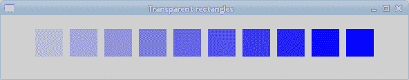
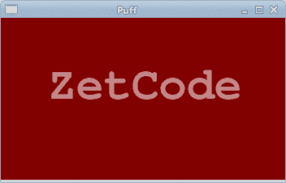
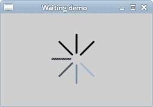

# 透明度

> 原文： [https://zetcode.com/gfx/cairo/transparency/](https://zetcode.com/gfx/cairo/transparency/)

在 Cairo C API 教程的这一部分中，我们将讨论透明度。 我们将提供一些基本定义和两个有趣的透明效果。

透明性是指能够透视材料的质量。 了解透明度的最简单方法是想象一块玻璃或水。 从技术上讲，光线可以穿过玻璃，这样我们就可以看到玻璃后面的物体。

在计算机图形学中，我们可以使用 alpha 合成实现透明效果。 Alpha 合成是将图像与背景组合以创建部分透明外观的过程。 合成过程使用 alpha 通道。 Alpha 通道是图形文件格式的 8 位层，用于表达半透明性（透明度）。 每个像素的额外八位用作掩码，表示 256 级半透明。
（answers.com，wikipedia.org）

## 透明矩形

第一个示例将绘制十个透明度不同的矩形。

```c
static void do_drawing(cairo_t *cr)
{
  gint i;
  for ( i = 1; i <= 10; i++) {
      cairo_set_source_rgba(cr, 0, 0, 1, i*0.1);
      cairo_rectangle(cr, 50*i, 20, 40, 40);
      cairo_fill(cr);  
  }      
}

```

`cairo_set_source_rgba()`具有可选的 alpha 参数以提供透明度。 此代码创建十个矩形，其 alpha 值从 0.1 到 1。



图：透明度

## 泡芙效果

在以下示例中，我们创建一个粉扑效果。 该示例将显示一个不断增长的居中文本，该文本将从某个点逐渐淡出。 这是一个非常常见的效果，我们经常可以在 Flash 动画中看到它。 `cairo_paint_with_alpha()`方法对于产生效果至关重要。

```c
#include <cairo.h>
#include <gtk/gtk.h>

void do_drawing(cairo_t *, GtkWidget *);

struct {
  gboolean timer; 
  gdouble alpha;
  gdouble size;
} glob;

static gboolean on_draw_event(GtkWidget *widget, cairo_t *cr, 
    gpointer user_data)
{      
  do_drawing(cr, widget);

  return FALSE;
}

void do_drawing(cairo_t *cr, GtkWidget *widget)
{
  cairo_text_extents_t extents;

  GtkWidget *win = gtk_widget_get_toplevel(widget);

  gint width, height;
  gtk_window_get_size(GTK_WINDOW(win), &width, &height);  

  gint x = width/2;
  gint y = height/2;

  cairo_set_source_rgb(cr, 0.5, 0, 0); 
  cairo_paint(cr);   

  cairo_select_font_face(cr, "Courier",
      CAIRO_FONT_SLANT_NORMAL,
      CAIRO_FONT_WEIGHT_BOLD);

  glob.size += 0.8;

  if (glob.size > 20) {
      glob.alpha -= 0.01;
  }

  cairo_set_font_size(cr, glob.size);
  cairo_set_source_rgb(cr, 1, 1, 1); 

  cairo_text_extents(cr, "ZetCode", &extents);
  cairo_move_to(cr, x - extents.width/2, y);
  cairo_text_path(cr, "ZetCode");
  cairo_clip(cr);

  cairo_paint_with_alpha(cr, glob.alpha);

  if (glob.alpha <= 0) {
      glob.timer = FALSE;
  }     
}

static gboolean time_handler(GtkWidget *widget)
{ 
  if (!glob.timer) return FALSE;
  gtk_widget_queue_draw(widget);

  return TRUE;
}

int main(int argc, char *argv[])
{
  GtkWidget *window;
  GtkWidget *darea;  

  glob.timer = TRUE;
  glob.alpha = 1.0;
  glob.size = 1.0;

  gtk_init(&argc, &argv);

  window = gtk_window_new(GTK_WINDOW_TOPLEVEL);

  darea = gtk_drawing_area_new();
  gtk_container_add(GTK_CONTAINER (window), darea);

  g_signal_connect(G_OBJECT(darea), "draw", 
      G_CALLBACK(on_draw_event), NULL); 
  g_signal_connect(window, "destroy",
      G_CALLBACK(gtk_main_quit), NULL);

  gtk_window_set_position(GTK_WINDOW(window), GTK_WIN_POS_CENTER);
  gtk_window_set_default_size(GTK_WINDOW(window), 350, 200); 
  gtk_window_set_title(GTK_WINDOW(window), "Puff");

  g_timeout_add(14, (GSourceFunc) time_handler, (gpointer) window);

  gtk_widget_show_all(window);

  gtk_main();

  return 0;
}

```

该示例在窗口上创建一个逐渐增长和褪色的文本。

```c
struct {
  gboolean timer; 
  gdouble alpha;
  gdouble size;
} glob; 

```

在这里，我们在结构内部定义了一些变量。 这用于避免使用全局变量。

```c
draw_text(cr, widget); 

```

文本的实际绘制委托给`draw_text()`函数。

```c
GtkWidget *win = gtk_widget_get_toplevel(widget);

gint width, height;
gtk_window_get_size(GTK_WINDOW(win), &width, &height);  

gint x = width/2;
gint y = height/2;

```

文本将在窗口上居中。 因此，我们需要找出父窗口小部件的大小。

```c
cairo_set_source_rgb(cr, 0.5, 0, 0); 
cairo_paint(cr); 

```

窗口的背景充满了一些深红色。

```c
cairo_select_font_face(cr, "Courier",
    CAIRO_FONT_SLANT_NORMAL,
    CAIRO_FONT_WEIGHT_BOLD);

```

文本将以 Courier 粗体显示。

```c
glob.size += 0.8;

if (glob.size > 20) {
    glob.alpha -= 0.01;
}

```

文本大小增加了 0.8 个单位。 达到 20 个单位后，alpha 值开始减小。 文本逐渐消失。

```c
cairo_text_extents(cr, "ZetCode", &extents);
cairo_move_to(cr, x - extents.width/2, y);

```

我们得到了文本指标。 我们将仅使用文本宽度。 我们移动到文本将在窗口上居中的位置。

```c
cairo_text_path(cr, "ZetCode");
cairo_clip(cr);

cairo_paint_with_alpha(cr, glob.alpha);

```

我们使用`cairo_text_path()`方法获得文本的路径。 我们使用`cairo_clip()`方法将绘画限制为当前路径。 `cairo_paint_with_alpha()`方法使用 alpha 值的掩码在当前剪裁区域内的任何地方绘制当前源。

```c
glob.timer = TRUE;
glob.alpha = 1.0;
glob.size = 1.0;

```

我们初始化三个变量。

```c
static gboolean time_handler(GtkWidget *widget)
{
  if (!glob.timer) return FALSE;

  gtk_widget_queue_draw(widget);

  return TRUE;
}

```

`time_handler`调用的主要功能是定期重绘窗口。 当函数返回`FALSE`时，超时功能将停止工作。

```c
g_timeout_add(14, (GSourceFunc) time_handler, (gpointer) window);

```

我们创建一个计时器函数。 该函数每 14 毫秒调用一次`time_handler`。



图：粉扑效果

## 等待演示

在此示例中，我们使用透明效果创建一个等待演示。 我们将绘制 8 条线，这些线将逐渐消失，从而产生一种错觉，即一条线在移动。 此类效果通常用于通知用户幕后正在进行繁重的任务。 一个示例是通过互联网流式传输视频。

```c
#include <cairo.h>
#include <gtk/gtk.h>
#include <math.h>

static void do_drawing(cairo_t *, GtkWidget *);

struct {
  gushort count;
} glob;

static gboolean on_draw_event(GtkWidget *widget, cairo_t *cr, 
    gpointer user_data)
{      
  do_drawing(cr, widget);

  return FALSE;
}

static void do_drawing(cairo_t *cr, GtkWidget *widget)
{  
  static gdouble const trs[8][8] = {
      { 0.0, 0.15, 0.30, 0.5, 0.65, 0.80, 0.9, 1.0 },
      { 1.0, 0.0,  0.15, 0.30, 0.5, 0.65, 0.8, 0.9 },
      { 0.9, 1.0,  0.0,  0.15, 0.3, 0.5, 0.65, 0.8 },
      { 0.8, 0.9,  1.0,  0.0,  0.15, 0.3, 0.5, 0.65},
      { 0.65, 0.8, 0.9,  1.0,  0.0,  0.15, 0.3, 0.5 },
      { 0.5, 0.65, 0.8, 0.9, 1.0,  0.0,  0.15, 0.3 },
      { 0.3, 0.5, 0.65, 0.8, 0.9, 1.0,  0.0,  0.15 },
      { 0.15, 0.3, 0.5, 0.65, 0.8, 0.9, 1.0,  0.0, }
  };

  GtkWidget *win = gtk_widget_get_toplevel(widget);

  gint width, height;
  gtk_window_get_size(GTK_WINDOW(win), &width, &height);

  cairo_translate(cr, width/2, height/2);

  gint i = 0;
  for (i = 0; i < 8; i++) {
      cairo_set_line_width(cr, 3);
      cairo_set_line_cap(cr, CAIRO_LINE_CAP_ROUND);
      cairo_set_source_rgba(cr, 0, 0, 0, trs[glob.count%8][i]);

      cairo_move_to(cr, 0.0, -10.0);
      cairo_line_to(cr, 0.0, -40.0);
      cairo_rotate(cr, M_PI/4);

      cairo_stroke(cr);
  }   
}

static gboolean time_handler(GtkWidget *widget)
{
  glob.count += 1;
  gtk_widget_queue_draw(widget);

  return TRUE;
}

int main(int argc, char *argv[])
{
  GtkWidget *window;
  GtkWidget *darea;  

  glob.count = 0;

  gtk_init(&argc, &argv);

  window = gtk_window_new(GTK_WINDOW_TOPLEVEL);

  darea = gtk_drawing_area_new();
  gtk_container_add(GTK_CONTAINER (window), darea);

  g_signal_connect(G_OBJECT(darea), "draw", 
      G_CALLBACK(on_draw_event), NULL);  
  g_signal_connect(G_OBJECT(window), "destroy",
      G_CALLBACK(gtk_main_quit), NULL);

  gtk_window_set_position(GTK_WINDOW(window), GTK_WIN_POS_CENTER);
  gtk_window_set_default_size(GTK_WINDOW(window), 250, 150); 
  gtk_window_set_title(GTK_WINDOW(window), "Waiting demo");

  g_timeout_add(100, (GSourceFunc) time_handler, (gpointer) window);
  gtk_widget_show_all(window);  

  gtk_main();

  return 0;
}

```

我们用八个不同的 alpha 值绘制八条线。

```c
 static gdouble const trs[8][8] = {
     { 0.0, 0.15, 0.30, 0.5, 0.65, 0.80, 0.9, 1.0 },
     { 1.0, 0.0,  0.15, 0.30, 0.5, 0.65, 0.8, 0.9 },
     { 0.9, 1.0,  0.0,  0.15, 0.3, 0.5, 0.65, 0.8 },
     { 0.8, 0.9,  1.0,  0.0,  0.15, 0.3, 0.5, 0.65},
     { 0.65, 0.8, 0.9,  1.0,  0.0,  0.15, 0.3, 0.5 },
     { 0.5, 0.65, 0.8, 0.9, 1.0,  0.0,  0.15, 0.3 },
     { 0.3, 0.5, 0.65, 0.8, 0.9, 1.0,  0.0,  0.15 },
     { 0.15, 0.3, 0.5, 0.65, 0.8, 0.9, 1.0,  0.0, }
 };

```

这是此演示中使用的透明度值的二维数组。 有 8 行，每行一种状态。 8 行中的每行将连续使用这些值。

```c
cairo_set_line_width(cr, 3);
cairo_set_line_cap(cr, CAIRO_LINE_CAP_ROUND);

```

我们使线条更粗一些，以便更好地显示它们。 我们用带帽的线画线。

```c
cairo_set_source_rgba(cr, 0, 0, 0, trs[glob.count%8][i]);

```

在这里，我们定义了一条线的透明度值。

```c
cairo_move_to(cr, 0.0, -10.0);
cairo_line_to(cr, 0.0, -40.0);
cairo_rotate(cr, M_PI/4);

```

这些代码将绘制八行中的每一行。

```c
g_timeout_add(100, (GSourceFunc) time_handler, (gpointer) window);

```

我们使用计时器函数来创建动画。



图：等待 demo

在 Cairo 教程的这一部分中，我们介绍了透明度。