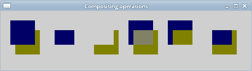

# 合成

> 原文： [https://zetcode.com/gfx/cairo/compositing/](https://zetcode.com/gfx/cairo/compositing/)

在 Cairo 图形编程教程的这一部分中，我们将定义合成操作。

合成是将来自不同来源的视觉元素组合成单个图像。 它们被用来创建一种幻觉，即所有这些元素都是同一场景的一部分。 合成在电影行业中被广泛使用来创造人群，否则将是昂贵或不可能创造的整个新世界。 （wikipedia.org）

## 工作方式

有几种合成操作。 Cairo 图形库具有 14 种不同的合成操作。

```c
#include <cairo.h>
#include <gtk/gtk.h>

void do_drawing(cairo_t *cr, gint x, gint w,
    gint h, cairo_operator_t op)
{
  cairo_t *first_cr, *second_cr;
  cairo_surface_t *first, *second;

  first = cairo_surface_create_similar(cairo_get_target(cr),
      CAIRO_CONTENT_COLOR_ALPHA, w, h);

  second = cairo_surface_create_similar(cairo_get_target(cr),
      CAIRO_CONTENT_COLOR_ALPHA, w, h);

  first_cr = cairo_create(first);
  cairo_set_source_rgb(first_cr, 0, 0, 0.4);
  cairo_rectangle(first_cr, x, 20, 50, 50);
  cairo_fill(first_cr);

  second_cr = cairo_create(second);
  cairo_set_source_rgb(second_cr, 0.5, 0.5, 0);
  cairo_rectangle(second_cr, x+10, 40, 50, 50);
  cairo_fill(second_cr);

  cairo_set_operator(first_cr, op);
  cairo_set_source_surface(first_cr, second, 0, 0);
  cairo_paint(first_cr);

  cairo_set_source_surface(cr, first, 0, 0);
  cairo_paint(cr);

  cairo_surface_destroy(first);
  cairo_surface_destroy(second);

  cairo_destroy(first_cr);
  cairo_destroy(second_cr);

}

static gboolean on_draw_event(GtkWidget *widget, cairo_t *cr, 
    gpointer user_data)
{      
  cairo_operator_t oper[] = {
    CAIRO_OPERATOR_DEST_OVER, 
    CAIRO_OPERATOR_DEST_IN, 
    CAIRO_OPERATOR_OUT,
    CAIRO_OPERATOR_ADD, 
    CAIRO_OPERATOR_ATOP,
    CAIRO_OPERATOR_DEST_ATOP,
  };

  GtkWidget *win = gtk_widget_get_toplevel(widget);

  gint width, height;
  gtk_window_get_size(GTK_WINDOW(win), &width, &height);

  gint i;
  gint x, y;
  for(x=20, y=20, i=0; i < 6; x+=80, i++) {
      do_drawing(cr, x, width, height, oper[i] );
  }

  return FALSE;
}

int main(int argc, char *argv[])
{
  GtkWidget *window;
  GtkWidget *darea;  

  gtk_init(&argc, &argv);

  window = gtk_window_new(GTK_WINDOW_TOPLEVEL);

  darea = gtk_drawing_area_new();
  gtk_container_add(GTK_CONTAINER (window), darea);

  g_signal_connect(G_OBJECT(darea), "draw", 
      G_CALLBACK(on_draw_event), NULL);  
  g_signal_connect(window, "destroy",
      G_CALLBACK(gtk_main_quit), NULL);

  gtk_window_set_position(GTK_WINDOW(window), GTK_WIN_POS_CENTER);
  gtk_window_set_default_size(GTK_WINDOW(window), 510, 120);
  gtk_window_set_title(GTK_WINDOW(window), "Compositing operations");

  gtk_widget_show_all(window);

  gtk_main();

  return 0;
}

```

在我们的示例中，我们将在两个正方形上显示 6 种不同的合成操作。

```c
first = cairo_surface_create_similar(cairo_get_target(cr),
    CAIRO_CONTENT_COLOR_ALPHA, w, h);

second = cairo_surface_create_similar(cairo_get_target(cr),
    CAIRO_CONTENT_COLOR_ALPHA, w, h);

```

我们创建两个曲面。

```c
first_cr = cairo_create(first);
cairo_set_source_rgb(first_cr, 0, 0, 0.4);
cairo_rectangle(first_cr, x, 20, 50, 50);
cairo_fill(first_cr);

```

我们在表面绘制一个矩形。

```c
cairo_set_operator(first_cr, op);
cairo_set_source_surface(first_cr, second, 0, 0);
cairo_paint(first_cr);

```

我们在曲面上应用合成操作。

```c
cairo_set_source_surface(cr, first, 0, 0);
cairo_paint(cr);

```

最后，我们将结果绘制到 GTK+ 窗口上。

```c
cairo_operator_t oper[] = {
  CAIRO_OPERATOR_DEST_OVER, 
  CAIRO_OPERATOR_DEST_IN, 
  CAIRO_OPERATOR_OUT,
  CAIRO_OPERATOR_ADD, 
  CAIRO_OPERATOR_ATOP,
  CAIRO_OPERATOR_DEST_ATOP,
};

```

在我们的示例中，我们使用这六个合成操作。



Figure: Compositing operations

本章介绍了 Cairo 合成。