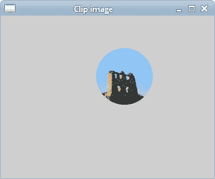
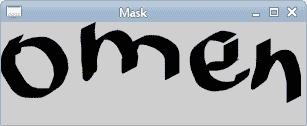

# 剪裁和遮罩

> 原文： [https://zetcode.com/gfx/cairo/clippingmasking/](https://zetcode.com/gfx/cairo/clippingmasking/)

在 Cairo 教程的这一部分中，我们将讨论剪切和遮罩。

## 剪裁

剪裁将图形限制在某个区域。 这样做是出于效率方面的考虑，并会产生有趣的效果。

在下面的示例中，我们将裁剪图像。

```c
#include <cairo.h>
#include <gtk/gtk.h>
#include <math.h>

static void do_drawing(cairo_t *, GtkWidget *);

struct {
  cairo_surface_t *image;
} glob;

static gboolean on_draw_event(GtkWidget *widget, cairo_t *cr, 
    gpointer user_data)
{      
  do_drawing(cr, widget);

  return FALSE;
}

static void do_drawing(cairo_t *cr, GtkWidget *widget)
{
  static gint pos_x = 128;
  static gint pos_y = 128;
  static gint radius = 40;  
  static gint delta[] = { 3, 3 };

  GtkWidget *win = gtk_widget_get_toplevel(widget);

  gint width, height;
  gtk_window_get_size(GTK_WINDOW(win), &width, &height);

  if (pos_x < 0 + radius) {
      delta[0] = rand() % 4 + 5;
  } else if (pos_x > width - radius) {
      delta[0] = -(rand() % 4 + 5);
  }

  if (pos_y < 0 + radius) {
      delta[1] = rand() % 4 + 5;
  } else if (pos_y > height - radius) {
      delta[1] = -(rand() % 4 + 5);
  }

  pos_x += delta[0];
  pos_y += delta[1];

  cairo_set_source_surface(cr, glob.image, 1, 1);
  cairo_arc(cr, pos_x, pos_y, radius, 0, 2*M_PI);
  cairo_clip(cr);
  cairo_paint(cr);      
}

static gboolean time_handler(GtkWidget *widget)
{  
  gtk_widget_queue_draw(widget);
  return TRUE;
}

int main(int argc, char *argv[])
{
  GtkWidget *window;
  GtkWidget *darea;  
  gint width, height;  

  glob.image = cairo_image_surface_create_from_png("turnacastle.png");
  width = cairo_image_surface_get_width(glob.image);
  height = cairo_image_surface_get_height(glob.image); 

  gtk_init(&argc, &argv);

  window = gtk_window_new(GTK_WINDOW_TOPLEVEL);
  darea = gtk_drawing_area_new();
  gtk_container_add(GTK_CONTAINER (window), darea);

  g_signal_connect(G_OBJECT(darea), "draw", 
      G_CALLBACK(on_draw_event), NULL);  
  g_signal_connect(G_OBJECT(window), "destroy",
      G_CALLBACK(gtk_main_quit), NULL);

  gtk_window_set_position(GTK_WINDOW(window), GTK_WIN_POS_CENTER);
  gtk_window_set_default_size(GTK_WINDOW(window), width+2, height+2); 
  gtk_window_set_title(GTK_WINDOW(window), "Clip image");

  gtk_widget_show_all(window);
  g_timeout_add(100, (GSourceFunc) time_handler, (gpointer) window);

  gtk_main();

  cairo_surface_destroy(glob.image);

  return 0;
}

```

在此示例中，我们将裁剪图像。 屏幕上正在移动一个圆圈，并显示了一部分基础图像。 这就像我们从孔中看一样。

```c
if (pos_x < 0 + radius) {
    delta[0] = rand() % 4 + 5;
} else if (pos_x > width - radius) {
    delta[0] = -(rand() % 4 + 5);
}

```

如果圆碰到窗口的左侧或右侧，则圆的移动方向会随机变化。 顶部和底部也一样。

```c
cairo_set_source_surface(cr, glob.image, 1, 1);
cairo_arc(cr, pos_x, pos_y, radius, 0, 2*M_PI);

```

在这里，我们绘制图像和一个圆。 请注意，我们目前不在窗口上绘制，而仅在内存中绘制。

```c
cairo_clip(cr);

```

`cairo_clip()`设置剪切区域。 裁剪区域是当前使用的路径。 当前路径是通过`cairo_arc()`函数调用创建的。

```c
cairo_paint(cr);

```

`cairo_paint()`在当前剪裁区域内的任何地方绘制当前源。

```c
glob.image = cairo_image_surface_create_from_png("turnacastle.png");

```

使用`cairo_image_surface_create_from_png()`函数从 PNG 图像创建图像表面。



图：剪裁图像

## 遮罩

在将源应用于表面之前，先对其进行过滤。 遮罩用作过滤器。 遮罩确定在哪里应用源，在哪里不应用。 遮罩的不透明部分允许复制源。 透明零件不允许将源复制到表面。

```c
#include <cairo.h>
#include <gtk/gtk.h>

static void do_drawing(cairo_t *);

struct {
  cairo_surface_t *surface;
} glob;

static gboolean on_draw_event(GtkWidget *widget, cairo_t *cr, 
    gpointer user_data)
{      
  do_drawing(cr);  

  return FALSE;
}

static void do_drawing(cairo_t *cr)
{
  cairo_set_source_rgb(cr, 0, 0, 0);  
  cairo_mask_surface(cr, glob.surface, 0, 0);
  cairo_fill(cr);      
}

static void create_surface()
{
  glob.surface = cairo_image_surface_create_from_png("omen.png");
}

static void destroy_surface()
{
  cairo_surface_destroy(glob.surface);
}

int main(int argc, char *argv[])
{
  GtkWidget *window;
  GtkWidget *darea;  

  gtk_init(&argc, &argv);

  create_surface();

  window = gtk_window_new(GTK_WINDOW_TOPLEVEL);

  darea = gtk_drawing_area_new();
  gtk_container_add(GTK_CONTAINER(window), darea);

  g_signal_connect(G_OBJECT(darea), "draw", 
      G_CALLBACK(on_draw_event), NULL);  
  g_signal_connect(G_OBJECT(window), "destroy",
      G_CALLBACK(gtk_main_quit), NULL);

  gtk_window_set_position(GTK_WINDOW(window), GTK_WIN_POS_CENTER);
  gtk_window_set_default_size(GTK_WINDOW(window), 305, 100); 
  gtk_window_set_title(GTK_WINDOW(window), "Mask");

  gtk_widget_show_all(window);

  gtk_main();

  destroy_surface();

  return 0;
}

```

这个小例子清楚地说明了遮罩背后的基本思想。 遮罩可确定在何处绘画和不在何处绘画。

```c
static void do_drawing(cairo_t *cr)
{
  cairo_set_source_rgb(cr, 0, 0, 0);  
  cairo_mask_surface(cr, glob.surface, 0, 0);
  cairo_fill(cr);      
}

```

在`do_drawing()`函数中，我们使用图像作为遮罩。 因此，它显示在窗口上。



图：应用遮罩

## 蒙蔽效果

在此代码示例中，我们将忽略图像。 这类似于我们使用卷帘所做的。

```c
#include <cairo.h>
#include <gtk/gtk.h>

static void do_drawing(cairo_t *);

struct {
  cairo_surface_t *image;
  cairo_surface_t *surface;
  gboolean timer;
  gint img_width;
  gint img_height;
} glob;

static gboolean on_draw_event(GtkWidget *widget, cairo_t *cr, 
    gpointer user_data)
{      
  do_drawing(cr);

  return FALSE;
}

static gboolean time_handler(GtkWidget *widget)
{
  if (!glob.timer) return FALSE;

  gtk_widget_queue_draw(widget);
  return TRUE;
}

static void do_drawing(cairo_t *cr)
{
  cairo_t *ic;    
  static gint h = 0;     

  ic = cairo_create(glob.surface);

  cairo_rectangle(ic, 0, 0, glob.img_width, h);
  cairo_fill(ic);

  h += 1;
  if ( h == glob.img_height) glob.timer = FALSE;

  cairo_set_source_surface(cr, glob.image, 10, 10);
  cairo_mask_surface(cr, glob.surface, 10, 10);

  cairo_destroy(ic);  
}

static void init_vars()
{  
  glob.timer = TRUE;
  glob.image = cairo_image_surface_create_from_png("beckov.png");  
  glob.img_width = cairo_image_surface_get_width(glob.image);
  glob.img_height = cairo_image_surface_get_height(glob.image);  
  glob.surface = cairo_image_surface_create(CAIRO_FORMAT_ARGB32, 
                     glob.img_width, glob.img_height);
}

static void cleanup()
{
  cairo_surface_destroy(glob.image);
  cairo_surface_destroy(glob.surface);   
}

int main(int argc, char *argv[])
{
  GtkWidget *window;
  GtkWidget *darea;    

  gtk_init(&argc, &argv);

  init_vars();

  window = gtk_window_new(GTK_WINDOW_TOPLEVEL);

  darea = gtk_drawing_area_new();
  gtk_container_add(GTK_CONTAINER(window), darea);

  g_signal_connect(G_OBJECT(darea), "draw", 
      G_CALLBACK(on_draw_event), NULL); 
  g_signal_connect(G_OBJECT(window), "destroy",
      G_CALLBACK(gtk_main_quit), NULL);

  gtk_window_set_position(GTK_WINDOW(window), GTK_WIN_POS_CENTER);
  gtk_window_set_default_size(GTK_WINDOW(window), 325, 250); 
  gtk_window_set_title(GTK_WINDOW(window), "Blind down");

  g_timeout_add(15, (GSourceFunc) time_handler, (gpointer) window);

  gtk_widget_show_all(window);

  gtk_main();

  cleanup();

  return 0;
}

```

盲目效应背后的想法很简单。 图像高度为`h`像素。 我们绘制高度为 1px 的 0、1、2 ... 线。 每个周期，图像的一部分高 1px，直到整个图像可见为止。

```c
struct {
  cairo_surface_t *image;
  cairo_surface_t *surface;
  gboolean timer;
  gint img_width;
  gint img_height;
} glob;

```

在全局结构中，我们将存储两个表面，一个计时器以及图像的宽度和高度变量。

```c
static void init_vars()
{  
  glob.timer = TRUE;
  glob.image = cairo_image_surface_create_from_png("beckov.png");  
  glob.img_width = cairo_image_surface_get_width(glob.image);
  glob.img_height = cairo_image_surface_get_height(glob.image);  
  glob.surface = cairo_image_surface_create(CAIRO_FORMAT_ARGB32, 
                     glob.img_width, glob.img_height);
}

```

在`init_vars()`函数中，我们初始化先前声明的变量。 最后一行创建一个空的图像表面。 它将用我们之前创建的图像表面的像素线填充。

```c
ic = cairo_create(glob.surface);

```

我们从空图像源创建一个 cairo 上下文。

```c
cairo_rectangle(ic, 0, 0, glob.img_width, h);
cairo_fill(ic);

```

我们在最初为空的图像中绘制一个矩形。 矩形每个周期将高出 1 像素。 以这种方式创建的图像稍后将用作遮罩。

```c
h += 1;

```

要显示的图像高度增加一个单位。

```c
if ( h == glob.img_height) glob.timer = FALSE;

```

当我们在 GTK 窗口上绘制整个图像时，我们将停止计时器函数。

```c
cairo_set_source_surface(cr, glob.image, 10, 10);
cairo_mask_surface(cr, glob.surface, 10, 10);

```

城堡的图像被设置为绘画的来源。 `cairo_mask_surface()`使用表面的 Alpha 通道作为遮罩来绘制电流源。

```c
static void cleanup()
{
  cairo_surface_destroy(glob.image);
  cairo_surface_destroy(glob.surface);   
}

```

在`cleanup()`函数中，我们销毁了创建的曲面。

本章涉及在 Cairo 的​​剪切和遮罩。