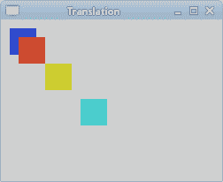
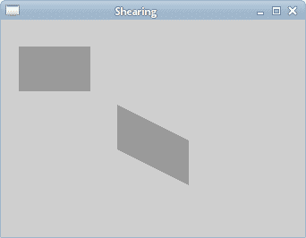
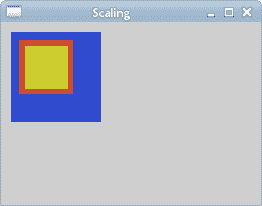
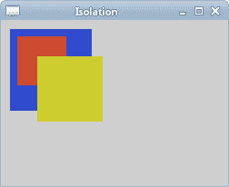

# 变换

> 原文： [https://zetcode.com/gfx/cairo/transformations/](https://zetcode.com/gfx/cairo/transformations/)

在 Cairo 图形编程教程的这一部分中，我们将讨论变换。

仿射变换由零个或多个线性变换（旋转，缩放或剪切）和平移（移位）组成。 几个线性变换可以组合成一个矩阵。 旋转是使刚体绕固定点移动的变换。 缩放比例是一种放大或缩小对象的变换。 比例因子在所有方向上都是相同的。 变换是一种变换，可以使每个点在指定方向上移动恒定的距离。 剪切是一种将对象垂直于给定轴移动的变换，该值在轴的一侧比另一侧更大。

资料来源：（wikipedia.org，freedictionary.com）

## 平移

以下示例描述了一个简单的平移。

```c
static void do_drawing(cairo_t *cr)
{ 
  cairo_set_source_rgb(cr, 0.2, 0.3, 0.8);
  cairo_rectangle(cr, 10, 10, 30, 30);
  cairo_fill(cr);

  cairo_translate(cr, 20, 20);
  cairo_set_source_rgb(cr, 0.8, 0.3, 0.2);
  cairo_rectangle(cr, 0, 0, 30, 30);
  cairo_fill(cr);

  cairo_translate(cr, 30, 30);
  cairo_set_source_rgb(cr, 0.8, 0.8, 0.2);
  cairo_rectangle(cr, 0, 0, 30, 30);
  cairo_fill(cr);

  cairo_translate(cr, 40, 40);
  cairo_set_source_rgb(cr, 0.3, 0.8, 0.8);
  cairo_rectangle(cr, 0, 0, 30, 30);
  cairo_fill(cr);    
}

```

该示例画一个矩形。 然后，我们进行平移并再次绘制相同的矩形。

```c
cairo_translate(cr, 20, 20);

```

`cairo_translate()`函数通过变换用户空间原点来修改当前变换矩阵。 在我们的例子中，我们在两个方向上将原点移动了 20 个单位。



Figure: Translation

## 剪切

在以下示例中，我们执行剪切操作。 剪切是沿特定轴的对象变形。 此操作没有剪切功能。 我们需要创建自己的变换矩阵。 注意，可以通过创建变换矩阵来执行每个仿射变换。

```c
static void do_drawing(cairo_t *cr)
{  
  cairo_matrix_t matrix;

  cairo_set_source_rgb(cr, 0.6, 0.6, 0.6);
  cairo_rectangle(cr, 20, 30, 80, 50);
  cairo_fill(cr);
  cairo_matrix_init(&matrix,
      1.0, 0.5,
      0.0, 1.0,
      0.0, 0.0);

  cairo_transform(cr, &matrix);
  cairo_rectangle(cr, 130, 30, 80, 50);
  cairo_fill(cr);
}

```

在此代码示例中，我们执行一个简单的剪切操作。

```c
cairo_matrix_t matrix;

```

`cairo_matrix_t`是具有仿射变换的结构。

```c
cairo_matrix_init(&matrix,
    1.0, 0.5,
    0.0, 1.0,
    0.0, 0.0);

```

此变换将 y 值剪切为 x 值的 0.5。

```c
cairo_transform(cr, &matrix);

```

我们使用`transform()`方法执行变换。



Figure: Shearing

## 缩放

下一个示例演示了缩放操作。 缩放是一种变换操作，其中对象被放大或缩小。

```c
static void do_drawing(cairo_t *cr)
{        
  cairo_set_source_rgb(cr, 0.2, 0.3, 0.8);
  cairo_rectangle(cr, 10, 10, 90, 90);    
  cairo_fill(cr);

  cairo_scale(cr, 0.6, 0.6);
  cairo_set_source_rgb(cr, 0.8, 0.3, 0.2);
  cairo_rectangle(cr, 30, 30, 90, 90);    
  cairo_fill(cr);  

  cairo_scale(cr, 0.8, 0.8);
  cairo_set_source_rgb(cr, 0.8, 0.8, 0.2);
  cairo_rectangle(cr, 50, 50, 90, 90);    
  cairo_fill(cr);      
}

```

我们绘制三个`90x90px`的矩形。 在其中两个上，我们执行缩放操作。

```c
cairo_scale(cr, 0.6, 0.6);
cairo_set_source_rgb(cr, 0.8, 0.3, 0.2);
cairo_rectangle(cr, 30, 30, 90, 90);    
cairo_fill(cr);  

```

我们将矩形均匀缩放 0.6 倍。

```c
cairo_scale(cr, 0.8, 0.8);
cairo_set_source_rgb(cr, 0.8, 0.8, 0.2);
cairo_rectangle(cr, 50, 50, 90, 90);    
cairo_fill(cr); 

```

在这里，我们以 0.8 的系数执行另一个缩放操作。 如果看图片，我们看到第三个黄色矩形是最小的矩形。 即使我们使用了较小的比例因子。 这是因为变换操作是累加的。 实际上，第三个矩形的缩放比例为 0.528（`0.6x0.8`）。



Figure: Scaling

## 隔离变换

变换操作是累加的。 为了将一个操作与另一个操作隔离开，我们可以使用`cairo_save()`和`cairo_restore()`功能。 `cairo_save()`功能可复制图形上下文的当前状态，并将其保存在已保存状态的内部堆栈中。 `cairo_restore()`功能将把上下文重新建立为保存状态。

```c
static void do_drawing(cairo_t *cr)
{     
  cairo_set_source_rgb(cr, 0.2, 0.3, 0.8);
  cairo_rectangle(cr, 10, 10, 90, 90);    
  cairo_fill(cr);

  cairo_save(cr);
  cairo_scale(cr, 0.6, 0.6);
  cairo_set_source_rgb(cr, 0.8, 0.3, 0.2);
  cairo_rectangle(cr, 30, 30, 90, 90);    
  cairo_fill(cr);
  cairo_restore(cr);

  cairo_save(cr);
  cairo_scale(cr, 0.8, 0.8);
  cairo_set_source_rgb(cr, 0.8, 0.8, 0.2);
  cairo_rectangle(cr, 50, 50, 90, 90);    
  cairo_fill(cr);        
  cairo_restore(cr);
}

```

在示例中，我们缩放了两个矩形。 这次我们将缩放操作相互隔离。

```c
cairo_save(cr);
cairo_scale(cr, 0.6, 0.6);
cairo_set_source_rgb(cr, 0.8, 0.3, 0.2);
cairo_rectangle(cr, 30, 30, 90, 90);    
cairo_fill(cr);
cairo_restore(cr);

```

我们通过将`cairo_save()`和`cairo_restore()`函数之间的`cairo_scale()`函数隔离缩放操作。



Figure: Isolating transformations

现在，第三个黄色矩形大于第二个红色矩形。

## 甜甜圈

在下面的示例中，我们通过旋转一堆椭圆来创建复杂的形状。

```c
#include <cairo.h>
#include <gtk/gtk.h>
#include <math.h>

static void do_drawing(cairo_t *, GtkWidget *widget);

static gboolean on_draw_event(GtkWidget *widget, cairo_t *cr, 
    gpointer user_data)
{        
  do_drawing(cr, widget);

  return FALSE;
}

static void do_drawing(cairo_t *cr, GtkWidget *widget)
{         
  GtkWidget *win = gtk_widget_get_toplevel(widget);

  gint width, height;
  gtk_window_get_size(GTK_WINDOW(win), &width, &height);

  cairo_set_line_width(cr, 0.5);
  cairo_translate(cr, width/2, height/2);
  cairo_arc(cr, 0, 0, 120, 0, 2 * M_PI);
  cairo_stroke(cr);

  gint i;
  for (i = 0; i < 36; i++) {
      cairo_save(cr);
      cairo_rotate(cr, i*M_PI/36);
      cairo_scale(cr, 0.3, 1);
      cairo_arc(cr, 0, 0, 120, 0, 2 * M_PI);
      cairo_restore(cr);
      cairo_stroke(cr);      
  }    
}

int main(int argc, char *argv[])
{
  GtkWidget *window;
  GtkWidget *darea;

  gtk_init(&argc, &argv);

  window = gtk_window_new(GTK_WINDOW_TOPLEVEL);

  darea = gtk_drawing_area_new();
  gtk_container_add(GTK_CONTAINER (window), darea);

  g_signal_connect(G_OBJECT(darea), "draw", 
      G_CALLBACK(on_draw_event), NULL);
  g_signal_connect(G_OBJECT(window), "destroy",
      G_CALLBACK(gtk_main_quit), NULL);

  gtk_window_set_position(GTK_WINDOW(window), GTK_WIN_POS_CENTER);
  gtk_window_set_default_size(GTK_WINDOW(window), 350, 250); 
  gtk_window_set_title(GTK_WINDOW(window), "Donut");

  gtk_widget_show_all(window);

  gtk_main();

  return 0;
}

```

我们将进行旋转和缩放操作。 我们还将保存和恢复 Cairo 上下文。

```c
cairo_translate(cr, width/2, height/2);
cairo_arc(cr, 0, 0, 120, 0, 2 * M_PI);
cairo_stroke(cr);

```

在 GTK+ 窗口的中间，我们创建了一个圆。 这将是我们椭圆的边界圆。

```c
gint i;
for (i = 0; i < 36; i++) {
    cairo_save(cr);
    cairo_rotate(cr, i*M_PI/36);
    cairo_scale(cr, 0.3, 1);
    cairo_arc(cr, 0, 0, 120, 0, 2 * M_PI);
    cairo_restore(cr);
    cairo_stroke(cr);      
}   

```

我们沿着边界圆的路径创建了 36 个椭圆。 我们使用`cairo_save()`和`cairo_restore()`方法将每个旋转和缩放操作相互隔离。

## 星星

下一个示例显示了一个旋转和缩放的星星。

```c
#include <cairo.h>
#include <gtk/gtk.h>

static void do_drawing(cairo_t *, GtkWidget *widget);

int points[11][2] = { 
    { 0, 85 }, 
    { 75, 75 }, 
    { 100, 10 }, 
    { 125, 75 }, 
    { 200, 85 },
    { 150, 125 }, 
    { 160, 190 },
    { 100, 150 }, 
    { 40, 190 },
    { 50, 125 },
    { 0, 85 } 
};

static gboolean on_draw_event(GtkWidget *widget, cairo_t *cr, 
    gpointer user_data)
{      
  do_drawing(cr, widget);

  return FALSE;
}

static void do_drawing(cairo_t *cr, GtkWidget *widget)
{
  static gdouble angle = 0;
  static gdouble scale = 1;
  static gdouble delta = 0.01;

  GtkWidget *win = gtk_widget_get_toplevel(widget);

  gint width, height;
  gtk_window_get_size(GTK_WINDOW(win), &width, &height);

  cairo_set_source_rgb(cr, 0, 0.44, 0.7);
  cairo_set_line_width(cr, 1);

  cairo_translate(cr, width/2, height/2 );
  cairo_rotate(cr, angle);
  cairo_scale(cr, scale, scale);

  gint i;

  for ( i = 0; i < 10; i++ ) {
      cairo_line_to(cr, points[i][0], points[i][1]);
  }

  cairo_close_path(cr);
  cairo_fill(cr);
  cairo_stroke(cr);

  if ( scale < 0.01 ) {
      delta = -delta;
  } else if (scale > 0.99) {
      delta = -delta;
  }

  scale += delta;
  angle += 0.01;    
}

static gboolean time_handler(GtkWidget *widget)
{
  gtk_widget_queue_draw(widget);

  return TRUE;
}

int main(int argc, char *argv[])
{
  GtkWidget *window;
  GtkWidget *darea;

  gtk_init(&argc, &argv);

  window = gtk_window_new(GTK_WINDOW_TOPLEVEL);

  darea = gtk_drawing_area_new();
  gtk_container_add(GTK_CONTAINER (window), darea);  

  g_signal_connect(G_OBJECT(darea), "draw", 
      G_CALLBACK(on_draw_event), NULL); 
  g_signal_connect(window, "destroy",
      G_CALLBACK(gtk_main_quit), NULL);

  gtk_window_set_position(GTK_WINDOW(window), GTK_WIN_POS_CENTER);
  gtk_window_set_default_size(GTK_WINDOW(window), 400, 300); 
  gtk_window_set_title(GTK_WINDOW(window), "Star");

  g_timeout_add(10, (GSourceFunc) time_handler, (gpointer) window);  

  gtk_widget_show_all(window);

  gtk_main();

  return 0;
}

```

在此示例中，我们创建一个星形对象。 我们将对其进行平移，旋转和缩放。

```c
int points[11][2] = { 
    { 0, 85 }, 
    { 75, 75 }, 
    { 100, 10 }, 
...

```

从这些点将构造星形对象。

```c
static gdouble angle = 0;
static gdouble scale = 1;
static gdouble delta = 0.01;

```

我们初始化三个重要变量。 角度用于旋转，比例用于缩放星形对象。 `delta`变量控制星星何时生长以及何时收缩。

```c
cairo_translate(cr, width/2, height/2);
cairo_rotate(cr, angle);
cairo_scale(cr, scale, scale);

```

我们将星星移到窗口中间。 旋转并缩放比例。

```c
gint i;
for ( i = 0; i < 10; i++ ) {
    cairo_line_to(cr, points[i][0], points[i][1]);
}

cairo_close_path(cr);
cairo_fill(cr);
cairo_stroke(cr);

```

在这里，我们绘制星形对象。

```c
if ( scale < 0.01 ) {
    delta = -delta;
} else if (scale > 0.99) {
    delta = -delta;
}

```

这些线控制星形对象的生长或收缩。

在 Cairo 图形教程的这一部分中，我们讨论了变换。