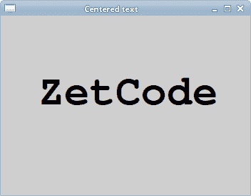
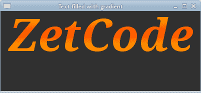

# Cairo 文字

> 原文： [https://zetcode.com/gfx/cairo/cairotext/](https://zetcode.com/gfx/cairo/cairotext/)

在 Cairo 图形教程的这一部分中，我们将处理文本。

## 灵魂伴侣

在第一个示例中，我们将在 GTK+ 窗口上显示一些歌词。

```c
static void do_drawing(cairo_t *cr)
{
  cairo_set_source_rgb(cr, 0.1, 0.1, 0.1); 

  cairo_select_font_face(cr, "Purisa",
      CAIRO_FONT_SLANT_NORMAL,
      CAIRO_FONT_WEIGHT_BOLD);

  cairo_set_font_size(cr, 13);

  cairo_move_to(cr, 20, 30);
  cairo_show_text(cr, "Most relationships seem so transitory");  
  cairo_move_to(cr, 20, 60);
  cairo_show_text(cr, "They're all good but not the permanent one");

  cairo_move_to(cr, 20, 120);
  cairo_show_text(cr, "Who doesn't long for someone to hold");

  cairo_move_to(cr, 20, 150);
  cairo_show_text(cr, "Who knows how to love you without being told");
  cairo_move_to(cr, 20, 180);
  cairo_show_text(cr, "Somebody tell me why I'm on my own");
  cairo_move_to(cr, 20, 210);
  cairo_show_text(cr, "If there's a soulmate for everyone");    
}

```

在此示例中，我们显示了 Natasha Bedingfield 的 Soulmate 歌曲的部分歌词。

```c
cairo_select_font_face(cr, "Purisa",
   CAIRO_FONT_SLANT_NORMAL,
   CAIRO_FONT_WEIGHT_BOLD);

```

在这里，我们选择字体。 该函数采用三个参数，字体系列，字体倾斜度和字体粗细。

```c
cairo_set_font_size(cr, 13);

```

在这里，我们指定字体大小。

```c
cairo_move_to(cr, 20, 30);
cairo_show_text(cr, "Most relationships seem so transitory"); 

```

通过指定文本的位置并调用`cairo_show_text()`函数，可以在窗口上显示文本。


Figure: Soulmate

## 居中文字

接下来，我们将展示如何在窗口上居中放置文本。

```c
static void do_drawing(cairo_t *cr, GtkWidget *widget)
{
  cairo_text_extents_t extents;

  GtkWidget *win = gtk_widget_get_toplevel(widget);

  gint w, h;
  gtk_window_get_size(GTK_WINDOW(win), &w, &h);    

  cairo_select_font_face(cr, "Courier",
      CAIRO_FONT_SLANT_NORMAL,
      CAIRO_FONT_WEIGHT_BOLD);

  cairo_set_font_size(cr, 60);

  cairo_text_extents(cr, "ZetCode", &extents);

  cairo_move_to(cr, w/2 - extents.width/2, h/2);  
  cairo_show_text(cr, "ZetCode");    
}

```

该代码将使文本在窗口上居中。 即使我们调整窗口大小，它仍然居中。

```c
GtkWidget *win = gtk_widget_get_toplevel(widget);

gint w, h;
gtk_window_get_size(GTK_WINDOW(win), &w, &h);    

```

为了使文本在窗口上居中，有必要获取父窗口的大小。

```c
cairo_select_font_face(cr, "Courier",
    CAIRO_FONT_SLANT_NORMAL,
    CAIRO_FONT_WEIGHT_BOLD);

cairo_set_font_size(cr, 60);

```

我们选择要显示的字体及其大小。

```c
cairo_text_extents(cr, "ZetCode", &extents);

```

我们得到了文本范围。 这些是描述文字的数字。 我们的示例需要文本的宽度。

```c
cairo_move_to(cr, w/2 - extents.width/2, h/2);  
cairo_show_text(cr, "ZetCode");   

```

我们将文本放置在窗口的中间，并使用`cairo_show_text()`方法显示它。



Figure: Centered text

## 带阴影的文字

现在，我们将在窗口上显示阴影文本。

```c
static void do_drawing(cairo_t *cr, GtkWidget *widget)
{
  cairo_select_font_face(cr, "Serif", CAIRO_FONT_SLANT_NORMAL,
      CAIRO_FONT_WEIGHT_BOLD);
  cairo_set_font_size(cr, 50);

  cairo_set_source_rgb(cr, 0, 0, 0);
  cairo_move_to(cr, 40, 60);  
  cairo_show_text(cr, "ZetCode");  

  cairo_set_source_rgb(cr, 0.5, 0.5, 0.5);
  cairo_move_to(cr, 43, 63);  
  cairo_show_text(cr, "ZetCode");    
}

```

要创建阴影，我们将文本绘制两次。 以不同的颜色。 第二个文本向右和向下移动一点。

```c
cairo_set_source_rgb(cr, 0, 0, 0);
cairo_move_to(cr, 40, 60);  
cairo_show_text(cr, "ZetCode"); 

```

第一个文本用黑色墨水绘制。 它充当阴影。

```c
cairo_set_source_rgb(cr, 0.5, 0.5, 0.5);
cairo_move_to(cr, 43, 63);  
cairo_show_text(cr, "ZetCode");  

```

第二个文本用灰色墨水绘制。 它向右和向下移动了 3px。


Figure: Shaded text

## 渐变填充文本

以下示例将产生很好的效果。 我们将使用一些线性渐变填充文本。

```c
static void do_drawing(cairo_t *cr, GtkWidget *widget)
{  
  cairo_pattern_t *pat; 

  cairo_set_source_rgb(cr, 0.2, 0.2, 0.2);
  cairo_paint(cr);

  gint h = 90;

  cairo_select_font_face(cr, "Serif", CAIRO_FONT_SLANT_ITALIC, 
      CAIRO_FONT_WEIGHT_BOLD);
  cairo_set_font_size(cr, h);

  pat = cairo_pattern_create_linear(0, 15, 0, h*0.8);
  cairo_pattern_set_extend(pat, CAIRO_EXTEND_REPEAT);
  cairo_pattern_add_color_stop_rgb(pat, 0.0, 1, 0.6, 0);
  cairo_pattern_add_color_stop_rgb(pat, 0.5, 1, 0.3, 0);

  cairo_move_to(cr, 15, 80);
  cairo_text_path(cr, "ZetCode");
  cairo_set_source(cr, pat);
  cairo_fill(cr);
}

```

我们在充满线性渐变的窗口上绘制文本。 颜色是一些橙色。

```c
cairo_set_source_rgb(cr, 0.2, 0.2, 0.2);
cairo_paint(cr);

```

为了使其更具视觉吸引力，我们将背景涂成深灰色。

```c
pat = cairo_pattern_create_linear(0, 15, 0, h*0.8);
cairo_pattern_set_extend(pat, CAIRO_EXTEND_REPEAT);
cairo_pattern_add_color_stop_rgb(pat, 0.0, 1, 0.6, 0);
cairo_pattern_add_color_stop_rgb(pat, 0.5, 1, 0.3, 0);

```

将创建线性渐变。

```c
cairo_move_to(cr, 15, 80);
cairo_text_path(cr, "ZetCode");
cairo_set_source(cr, pat);
cairo_fill(cr);

```

文本显示在窗口上。 我们使用渐变作为绘画源。



Figure: Text filled with gradient

## 字形

`cairo_show_text()`方法仅适用于简单的文本呈现。 Cairo 开发人员将其称为玩具方法。 使用字形可以完成更专业的文本渲染。 标志符号是图形符号，可提供字符形式。 字符提供含义。 它可以有多个字形。 角色没有内在的外观。 字形没有内在的含义。

请注意，Pango 库解决了许多常见的编程要求，包括文本。

```c
static void do_drawing(cairo_t *cr, GtkWidget *widget)
{    
  cairo_select_font_face(cr, "Serif", CAIRO_FONT_SLANT_NORMAL,
      CAIRO_FONT_WEIGHT_NORMAL);
  cairo_set_font_size(cr, 13);

  const int n_glyphs = 20 * 35;
  cairo_glyph_t glyphs[n_glyphs];

  gint i = 0;  
  gint x, y;

  for (y=0; y<20; y++) {
      for (x=0; x<35; x++) {
          glyphs[i] = (cairo_glyph_t) {i, x*15 + 20, y*18 + 20};
          i++;
      }
  }

  cairo_show_glyphs(cr, glyphs, n_glyphs);
} 

```

该代码显示了所选字体的 700 个字形。

```c
const int n_glyphs = 20 * 35;
cairo_glyph_t glyphs[n_glyphs];

```

字形数组将存储三个整数值。 第一个值是字形到所选字体类型的索引。 第二和第三值是字形的 x，y 位置。

```c
cairo_show_glyphs(cr, glyphs, n_glyphs);

```

`cairo_show_glyphs()`方法在窗口上显示字形。

本章介绍了 Cairo 文本。