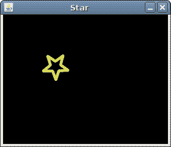

# 动画

> 原文： [https://zetcode.com/tutorials/javagamestutorial/animation/](https://zetcode.com/tutorials/javagamestutorial/animation/)

在 Java 2D 游戏教程的这一部分中，我们将使用动画。

## 动画

动画是图像序列的快速显示，会产生运动的错觉。 我们将为董事会上的星星设置动画。 我们将以三种基本方式实施这一运动。 我们将使用 Swing 计时器，标准实用程序计时器和线程。

动画是游戏编程中的一个复杂主题。 Java 游戏有望在具有不同硬件规格的多种操作系统上运行。 线程提供了最准确的计时解决方案。 但是，对于我们简单的 2D 游戏，其他两个选项也可以是一个选项。

## 摇摆计时器

在第一个示例中，我们将使用 Swing 计时器来创建动画。 这是在 Java 游戏中为对象设置动画的最简单但最无效的方法。

`SwingTimerEx.java`

```
package com.zetcode;

import java.awt.EventQueue;
import javax.swing.JFrame;

public class SwingTimerEx extends JFrame {

    public SwingTimerEx() {

        initUI();
    }

    private void initUI() {

        add(new Board());

        setResizable(false);
        pack();

        setTitle("Star");
        setLocationRelativeTo(null);        
        setDefaultCloseOperation(JFrame.EXIT_ON_CLOSE);
    }

    public static void main(String[] args) {

        EventQueue.invokeLater(() -> {
            SwingTimerEx ex = new SwingTimerEx();
            ex.setVisible(true);
        });
    }
}

```

这是代码示例的主要类。

```
setResizable(false);
pack();

```

`setResizable()`设置是否可以调整帧大小。 `pack()`方法使此窗口的大小适合其子级的首选大小和布局。 请注意，这两种方法的调用顺序很重要。 （`setResizable()`在某些平台上更改了帧的插入；在`pack()`方法之后调用此方法可能会导致错误的结果-星号不会精确地进入窗口的右下边界。）

`Board.java`

```
package com.zetcode;

import java.awt.Color;
import java.awt.Dimension;
import java.awt.Graphics;
import java.awt.Image;
import java.awt.Toolkit;
import java.awt.event.ActionEvent;
import java.awt.event.ActionListener;
import javax.swing.ImageIcon;
import javax.swing.JPanel;
import javax.swing.Timer;

public class Board extends JPanel
        implements ActionListener {

    private final int B_WIDTH = 350;
    private final int B_HEIGHT = 350;
    private final int INITIAL_X = -40;
    private final int INITIAL_Y = -40;
    private final int DELAY = 25;

    private Image star;
    private Timer timer;
    private int x, y;

    public Board() {

        initBoard();
    }

    private void loadImage() {

        ImageIcon ii = new ImageIcon("src/resources/star.png");
        star = ii.getImage();
    }

    private void initBoard() {

        setBackground(Color.BLACK);
        setPreferredSize(new Dimension(B_WIDTH, B_HEIGHT));

        loadImage();

        x = INITIAL_X;
        y = INITIAL_Y;

        timer = new Timer(DELAY, this);
        timer.start();
    }

    @Override
    public void paintComponent(Graphics g) {
        super.paintComponent(g);

        drawStar(g);
    }

    private void drawStar(Graphics g) {

        g.drawImage(star, x, y, this);
        Toolkit.getDefaultToolkit().sync();
    }

    @Override
    public void actionPerformed(ActionEvent e) {

        x += 1;
        y += 1;

        if (y > B_HEIGHT) {

            y = INITIAL_Y;
            x = INITIAL_X;
        }

        repaint();
    }
}

```

在`Board`类中，我们将星星从左上角移到右下角。

```
private final int B_WIDTH = 350;
private final int B_HEIGHT = 350;
private final int INITIAL_X = -40;
private final int INITIAL_Y = -40;
private final int DELAY = 25;

```

定义了五个常数。 前两个常数是板的宽度和高度。 第三和第四是恒星的初始坐标。 最后一个确定动画的速度。

```
private void loadImage() {

    ImageIcon ii = new ImageIcon("src/resources/star.png");
    star = ii.getImage();
}

```

在`loadImage()`方法中，我们创建`ImageIcon`类的实例。 该图像位于项目目录中。 `getImage()`方法将从此类返回`Image`对象。 该对象将绘制在板上。

```
timer = new Timer(DELAY, this);
timer.start();

```

在这里，我们创建一个 Swing `Timer`类，并调用其`start()`方法。 计时器每`DELAY`毫秒就会调用一次`actionPerformed()`方法。 为了使用`actionPerformed()`方法，我们必须实现`ActionListener`接口。

```
@Override
public void paintComponent(Graphics g) {
    super.paintComponent(g);

    drawStar(g);
}

```

自定义绘画是通过`paintComponent()`方法完成的。 请注意，我们还调用其父级的`paintComponent()`方法。 实际绘画将委托给 drawStar（）方法。

```
private void drawStar(Graphics g) {

    g.drawImage(star, x, y, this);
    Toolkit.getDefaultToolkit().sync();
}

```

在 drawStar（）方法中，我们使用`drawImage()`方法在窗口上绘制图像。 `Toolkit.getDefaultToolkit().sync()`在缓冲图形事件的系统上同步绘画。 没有这条线，动画在 Linux 上可能会不流畅。

```
@Override
public void actionPerformed(ActionEvent e) {

    x += 1;
    y += 1;

    if (y > B_HEIGHT) {

        y = INITIAL_Y;
        x = INITIAL_X;
    }

    repaint();
}

```

计时器反复调用`actionPerformed()`方法。 在方法内部，我们增加星形对象的 x 和 y 值。 然后我们调用`repaint()`方法，这将导致`paintComponent()`被调用。 这样，我们可以定期重绘`Board`从而制作动画。



Figure: Star

## 实用计时器

这与以前的方法非常相似。 我们使用`java.util.Timer`代替`javax.Swing.Timer`。 对于 Java Swing 游戏，这种方式更为准确。

`UtilityTimerEx.java`

```
package com.zetcode;

import java.awt.EventQueue;
import javax.swing.JFrame;

public class UtilityTimerEx extends JFrame {

    public UtilityTimerEx() {

        initUI();
    }

    private void initUI() {

        add(new Board());

        setResizable(false);
        pack();

        setTitle("Star");
        setLocationRelativeTo(null);
        setDefaultCloseOperation(JFrame.EXIT_ON_CLOSE);        
    }

    public static void main(String[] args) {

        EventQueue.invokeLater(() -> {
            JFrame ex = new UtilityTimerEx();
            ex.setVisible(true);
        });
    }
}

```

这是主要的类。

`Board.java`

```
package com.zetcode;

import java.awt.Color;
import java.awt.Dimension;
import java.awt.Graphics;
import java.awt.Image;
import java.awt.Toolkit;
import java.util.Timer;
import java.util.TimerTask;
import javax.swing.ImageIcon;
import javax.swing.JPanel;

public class Board extends JPanel  {

    private final int B_WIDTH = 350;
    private final int B_HEIGHT = 350;
    private final int INITIAL_X = -40;
    private final int INITIAL_Y = -40;    
    private final int INITIAL_DELAY = 100;
    private final int PERIOD_INTERVAL = 25;

    private Image star;
    private Timer timer;
    private int x, y;

    public Board() {

        initBoard();        
    }

    private void loadImage() {

        ImageIcon ii = new ImageIcon("src/resources/star.png");
        star = ii.getImage();        
    }

    private void initBoard() {

        setBackground(Color.BLACK);
        setPreferredSize(new Dimension(B_WIDTH, B_HEIGHT));

        loadImage();

        x = INITIAL_X;
        y = INITIAL_Y;

        timer = new Timer();
        timer.scheduleAtFixedRate(new ScheduleTask(), 
                INITIAL_DELAY, PERIOD_INTERVAL);        
    }

    @Override
    public void paintComponent(Graphics g) {
        super.paintComponent(g);

        drawStar(g);
    }

    private void drawStar(Graphics g) {

        g.drawImage(star, x, y, this);
        Toolkit.getDefaultToolkit().sync();
    }

    private class ScheduleTask extends TimerTask {

        @Override
        public void run() {

            x += 1;
            y += 1;

            if (y > B_HEIGHT) {
                y = INITIAL_Y;
                x = INITIAL_X;
            }

            repaint();
        }
    }
}

```

在此示例中，计时器将定期调用`ScheduleTask`类的`run()`方法。

```
timer = new Timer();
timer.scheduleAtFixedRate(new ScheduleTask(), 
        INITIAL_DELAY, PERIOD_INTERVAL); 

```

在这里，我们创建一个计时器并按特定的时间间隔安排任务。 有一个初始延迟。

```
@Override
public void run() {
    ...
}

```

计时器每 10 毫秒将调用此`run()`方法。

## 线

使用线程对对象进行动画处理是最有效，最准确的动画处理方式。

`ThreadAnimationEx.java`

```
package com.zetcode;

import java.awt.EventQueue;
import javax.swing.JFrame;

public class ThreadAnimationEx extends JFrame {

    public ThreadAnimationEx() {

        initUI();
    }

    private void initUI() {

        add(new Board());

        setResizable(false);
        pack();

        setTitle("Star");    
        setLocationRelativeTo(null);
        setDefaultCloseOperation(JFrame.EXIT_ON_CLOSE);        
    }

    public static void main(String[] args) {

        EventQueue.invokeLater(() -> {
            JFrame ex = new ThreadAnimationEx();
            ex.setVisible(true);
        });
    }
}

```

This is the main class.

`Board.java`

```
package com.zetcode;

import java.awt.Color;
import java.awt.Dimension;
import java.awt.Graphics;
import java.awt.Image;
import java.awt.Toolkit;
import javax.swing.ImageIcon;
import javax.swing.JOptionPane;
import javax.swing.JPanel;

public class Board extends JPanel
        implements Runnable {

    private final int B_WIDTH = 350;
    private final int B_HEIGHT = 350;
    private final int INITIAL_X = -40;
    private final int INITIAL_Y = -40;
    private final int DELAY = 25;

    private Image star;
    private Thread animator;
    private int x, y;

    public Board() {

        initBoard();
    }

    private void loadImage() {

        ImageIcon ii = new ImageIcon("src/resources/star.png");
        star = ii.getImage();
    }

    private void initBoard() {

        setBackground(Color.BLACK);
        setPreferredSize(new Dimension(B_WIDTH, B_HEIGHT));

        loadImage();

        x = INITIAL_X;
        y = INITIAL_Y;
    }

    @Override
    public void addNotify() {
        super.addNotify();

        animator = new Thread(this);
        animator.start();
    }

    @Override
    public void paintComponent(Graphics g) {
        super.paintComponent(g);

        drawStar(g);
    }

    private void drawStar(Graphics g) {

        g.drawImage(star, x, y, this);
        Toolkit.getDefaultToolkit().sync();
    }

    private void cycle() {

        x += 1;
        y += 1;

        if (y > B_HEIGHT) {

            y = INITIAL_Y;
            x = INITIAL_X;
        }
    }

    @Override
    public void run() {

        long beforeTime, timeDiff, sleep;

        beforeTime = System.currentTimeMillis();

        while (true) {

            cycle();
            repaint();

            timeDiff = System.currentTimeMillis() - beforeTime;
            sleep = DELAY - timeDiff;

            if (sleep < 0) {
                sleep = 2;
            }

            try {
                Thread.sleep(sleep);
            } catch (InterruptedException e) {

                String msg = String.format("Thread interrupted: %s", e.getMessage());

                JOptionPane.showMessageDialog(this, msg, "Error", 
                    JOptionPane.ERROR_MESSAGE);
            }

            beforeTime = System.currentTimeMillis();
        }
    }
}

```

在前面的示例中，我们以特定的间隔执行任务。 在此示例中，动画将在线程内进行。 `run()`方法仅被调用一次。 这就是为什么我们在方法中有一个 while 循环的原因。 从该方法中，我们称为`cycle()`和`repaint()`方法。

```
@Override
public void addNotify() {
    super.addNotify();

    animator = new Thread(this);
    animator.start();
}

```

在将我们的`JPanel`添加到`JFrame`组件后，将调用`addNotify()`方法。 此方法通常用于各种初始化任务。

我们希望我们的游戏以恒定的速度平稳运行。 因此，我们计算系统时间。

```
timeDiff = System.currentTimeMillis() - beforeTime;
sleep = DELAY - timeDiff;

```

`cycle()`和`repaint()`方法可能在不同的 while 周期中花费不同的时间。 我们计算两种方法的运行时间，并将其从`DELAY`常数中减去。 这样，我们要确保每个 while 周期都在恒定时间运行。 在我们的情况下，每个周期为`DELAY` ms。

Java 2D 游戏教程的这一部分涵盖了动画。