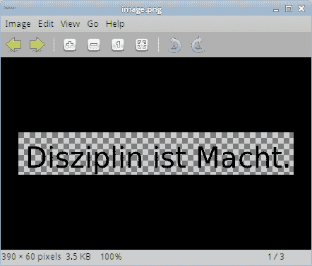
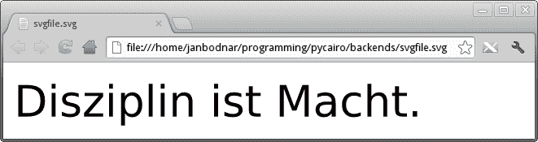
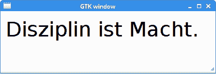

# PyCairo 后端

> 原文： [https://zetcode.com/gfx/pycairo/backends/](https://zetcode.com/gfx/pycairo/backends/)

PyCairo 支持各种后端。 后端是可以显示 PyCairo 产生的图形的地方。 我们使用 PyCairo 创建 PNG 图像，PDF 文件，SVG 文件，然后在 GTK 窗口上绘制。

## PNG 图像

在第一个示例中，我们创建一个 PNG 图像。

`pngimage.py`

```
#!/usr/bin/python

'''
ZetCode PyCairo tutorial 

This program uses PyCairo to 
produce a PNG image.

Author: Jan Bodnar
Website: zetcode.com 
Last edited: April 2016
'''

import cairo

def main():

    ims = cairo.ImageSurface(cairo.FORMAT_ARGB32, 390, 60)
    cr = cairo.Context(ims)

    cr.set_source_rgb(0, 0, 0)
    cr.select_font_face("Sans", cairo.FONT_SLANT_NORMAL,
        cairo.FONT_WEIGHT_NORMAL)
    cr.set_font_size(40)

    cr.move_to(10, 50)
    cr.show_text("Disziplin ist Macht.")

    ims.write_to_png("image.png")

if __name__ == "__main__":    
    main()

```

此示例是一个小型控制台应用，可创建 PNG 图像。

```
import cairo

```

我们导入 PyCairo 模块。

```
ims = cairo.ImageSurface(cairo.FORMAT_ARGB32, 390, 60)
cr = cairo.Context(ims)

```

我们创建一个曲面，并从该曲面创建一个 Cairo 上下文。 表面是 390x60 像素的图像。

```
cr.set_source_rgb(0, 0, 0)

```

我们用黑色墨水绘制文本。 墨水通过`set_source_rgb()`方法指定。

```
cr.select_font_face("Sans", cairo.FONT_SLANT_NORMAL,
    cairo.FONT_WEIGHT_NORMAL)
cr.set_font_size(40)

```

我们通过`select_font_face()`方法选择一种字体类型，并通过`set_font_size()`方法设置字体大小。

```
cr.move_to(10, 50)
cr.show_text("Disziplin ist Macht.")

```

我们将图像内的位置移至`x = 10.0`，`y = 50.0`并绘制文本。

```
ims.write_to_png("image.png")

```

`write_to_png()`方法将表面的内容写入 PNG 图像。



Figure: PNG image in Eye of Gnome

## PDF 文件

在第二个示例中，我们创建一个简单的 PDF 文件。

`pdffile.py`

```
#!/usr/bin/python

'''
ZetCode PyCairo tutorial 

This program uses PyCairo to 
produce a PDF image.

Author: Jan Bodnar
Website: zetcode.com 
Last edited: April 2016
'''

import cairo

def main():

    ps = cairo.PDFSurface("pdffile.pdf", 504, 648)
    cr = cairo.Context(ps)

    cr.set_source_rgb(0, 0, 0)
    cr.select_font_face("Sans", cairo.FONT_SLANT_NORMAL,
        cairo.FONT_WEIGHT_NORMAL)
    cr.set_font_size(40)

    cr.move_to(10, 50)
    cr.show_text("Disziplin ist Macht.")
    cr.show_page()

if __name__ == "__main__":    
    main()

```

我们必须在 PDF 查看器中打开 PDF 文件。 Linux 用户可以使用 KPDF 或 Evince 查看器。

```
ps = cairo.PDFSurface("pdffile.pdf", 504, 648)

```

要渲染 PDF 文件，我们必须使用`cairo.PDFSurface`对象创建 PDF 曲面。 PDF 文件的大小以磅为单位指定，这是排版的标准。

```
cr.show_page()

```

`show_page()`完成 PDF 文件的渲染。


Figure: PDF file in Evince

## SVG 文件

下一个示例创建一个简单的 SVG（可缩放矢量图形）文件。 SVG 文件是基于 XML 的文件格式。

`svgfile.py`

```
#!/usr/bin/python

'''
ZetCode PyCairo tutorial 

This program uses PyCairo to 
produce a SVG file.

Author: Jan Bodnar
Website: zetcode.com 
Last edited: April 2016
'''

import cairo

def main():

    ps = cairo.SVGSurface("svgfile.svg", 390, 60)
    cr = cairo.Context(ps)

    cr.set_source_rgb(0, 0, 0)
    cr.select_font_face("Sans", cairo.FONT_SLANT_NORMAL,
        cairo.FONT_WEIGHT_NORMAL)
    cr.set_font_size(40)

    cr.move_to(10, 50)
    cr.show_text("Disziplin ist Macht.")
    cr.show_page()

if __name__ == "__main__":    
    main()

```

我们可以使用网络浏览器（例如 Google Chrome）或矢量绘图程序（例如 Inkscape）打开 SVG 文件。

```
ps = cairo.SVGSurface("svgfile.svg", 390, 60)

```

要在 PyCairo 中创建 SVG 文件，我们必须使用`cairo.SVGSurface`对象创建 SVG 表面。

```
cr.show_page()

```

`show_page()`方法调用完成了 SVG 文件的呈现。



SVG file in Chrome

## GTK 窗口

在最后一个示例中，我们在 GTK 窗口上绘制。 该后端将在本教程的其余部分中使用。

`gtkwindow.py`

```
#!/usr/bin/python

'''
ZetCode PyCairo tutorial 

This program uses PyCairo to 
draw on a window in GTK.

Author: Jan Bodnar
Website: zetcode.com 
Last edited: April 2016
'''

from gi.repository import Gtk
import cairo

class Example(Gtk.Window):

    def __init__(self):
        super(Example, self).__init__()

        self.init_ui()

    def init_ui(self):    

        darea = Gtk.DrawingArea()
        darea.connect("draw", self.on_draw)
        self.add(darea)

        self.set_title("GTK window")
        self.resize(420, 120)
        self.set_position(Gtk.WindowPosition.CENTER)
        self.connect("delete-event", Gtk.main_quit)
        self.show_all()

    def on_draw(self, wid, cr):

        cr.set_source_rgb(0, 0, 0)
        cr.select_font_face("Sans", cairo.FONT_SLANT_NORMAL,
            cairo.FONT_WEIGHT_NORMAL)
        cr.set_font_size(40)

        cr.move_to(10, 50)
        cr.show_text("Disziplin ist Macht.")

def main():

    app = Example()
    Gtk.main()

if __name__ == "__main__":    
    main()

```

该示例弹出一个居中的 GTK 窗口，在该窗口上绘制“Disziplin ist Macht”文本。

```
from gi.repository import Gtk
import cairo

```

我们导入必要的 PyCairo 和 GTK 模块。

```
darea = Gtk.DrawingArea()

```

我们将使用`Gtk.DrawingArea`小部件。

```
darea.connect("draw", self.on_draw)

```

重新绘制窗口时，会发出`draw`信号。 我们将该信号连接到`on_draw()`回调。

```
def on_draw(self, wid, cr):
...

```

绘图是在`on_draw()`方法内部完成的。 第三个参数是 Cairo 上下文。 它是自动提供给我们的； Cairo 库内置在 GTK 系统中。



Figure: GTK window

在本章中，我们介绍了受支持的 PyCairo 后端。