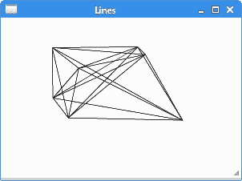
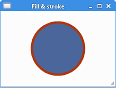
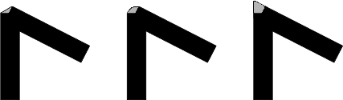
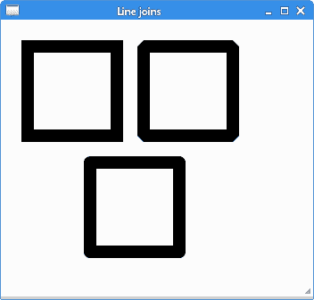
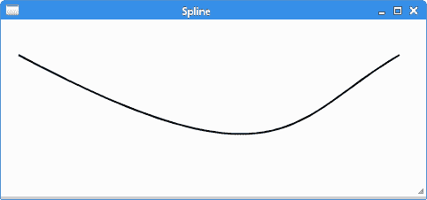

# PyCairo 中的基本绘图

> 原文： [https://zetcode.com/gfx/pycairo/basicdrawing/](https://zetcode.com/gfx/pycairo/basicdrawing/)

在 PyCairo 教程的这一部分中，我们绘制了一些基本图元。 我们使用填充和描边操作，破折号，线帽和线连接。

## 直线

线是非常基本的矢量对象。 要画一条线，我们使用两个方法调用。 通过`move_to()`调用指定起点。 线的终点通过`line_to()`调用指定。

`lines.py`

```
#!/usr/bin/python

'''
ZetCode PyCairo tutorial 

In this program, we connect all mouse
clicks with a line.

Author: Jan Bodnar
Website: zetcode.com 
Last edited: April 2016
'''

from gi.repository import Gtk, Gdk
import cairo

class MouseButtons:

    LEFT_BUTTON = 1
    RIGHT_BUTTON = 3

class Example(Gtk.Window):

    def __init__(self):
        super(Example, self).__init__()

        self.init_ui()

    def init_ui(self):    

        self.darea = Gtk.DrawingArea()
        self.darea.connect("draw", self.on_draw)
        self.darea.set_events(Gdk.EventMask.BUTTON_PRESS_MASK)        
        self.add(self.darea)

        self.coords = []

        self.darea.connect("button-press-event", self.on_button_press)

        self.set_title("Lines")
        self.resize(300, 200)
        self.set_position(Gtk.WindowPosition.CENTER)
        self.connect("delete-event", Gtk.main_quit)
        self.show_all()

    def on_draw(self, wid, cr):

        cr.set_source_rgb(0, 0, 0)
        cr.set_line_width(0.5)

        for i in self.coords:
            for j in self.coords:

                cr.move_to(i[0], i[1])
                cr.line_to(j[0], j[1]) 
                cr.stroke()

        del self.coords[:]            

    def on_button_press(self, w, e):

        if e.type == Gdk.EventType.BUTTON_PRESS \
            and e.button == MouseButtons.LEFT_BUTTON:

            self.coords.append([e.x, e.y])

        if e.type == Gdk.EventType.BUTTON_PRESS \
            and e.button == MouseButtons.RIGHT_BUTTON:

            self.darea.queue_draw()           

def main():

    app = Example()
    Gtk.main()

if __name__ == "__main__":    
    main()

```

在我们的示例中，我们用鼠标左键随机单击窗口。 每次点击都存储在一个列表中。 当我们右键单击窗口时，所有点都与列表中的每个其他点相连。 右键单击将清除窗口。

```
class MouseButtons:

    LEFT_BUTTON = 1
    RIGHT_BUTTON = 3

```

GTK 文档仅声明鼠标左键的编号为 1，鼠标右键的编号为 3。我们创建了一个自定义类，其中包含一些鼠标键的标识符。

```
self.darea.set_events(Gdk.EventMask.BUTTON_PRESS_MASK)   

```

默认情况下，某些事件未启用。 鼠标按下事件就在其中。 因此，我们需要使用`set_event()`方法启用鼠标按下事件。

```
self.darea.connect("button-press-event", self.on_button_press)

```

在此代码示例中，我们对鼠标按下事件做出反应。

```
cr.set_source_rgb(0, 0, 0)
cr.set_line_width(0.5)

```

线条以黑色墨水绘制，宽度为 0.5 点。

```
for i in self.coords:
    for j in self.coords:

        cr.move_to(i[0], i[1])
        cr.line_to(j[0], j[1]) 
        cr.stroke()

```

我们将列表中的每个点连接到其他每个点。 `stroke()`调用画线。

```
del self.coords[:]    

```

最后，将删除所有坐标。 现在，我们可以创建另一个对象。

```
def on_button_press(self, w, e):

    if e.type == Gdk.EventType.BUTTON_PRESS \
        and e.button == MouseButtons.LEFT_BUTTON:

        self.coords.append([e.x, e.y])
...

```

如果按下鼠标左键，我们会将其`x`和`y`坐标添加到`self.coords`列表中。

```
if e.type == Gdk.EventType.BUTTON_PRESS \
    and e.button == MouseButtons.RIGHT_BUTTON:

    self.darea.queue_draw()

```

在按下鼠标右键的情况下，我们调用`queue_draw()`方法来重绘绘图区域。 所有的点都用线连接。



Figure: Lines

## 填充和描边

笔划操作绘制形状的轮廓，填充操作填充形状的内部。

`fillstroke.py`

```
#!/usr/bin/python

'''
ZetCode PyCairo tutorial 

This code example draws a circle
using the PyCairo library.

Author: Jan Bodnar
Website: zetcode.com 
Last edited: April 2016
'''

from gi.repository import Gtk
import cairo
import math

class Example(Gtk.Window):

    def __init__(self):
        super(Example, self).__init__()

        self.init_ui()

    def init_ui(self):    

        darea = Gtk.DrawingArea()
        darea.connect("draw", self.on_draw)
        self.add(darea)

        self.set_title("Fill & stroke")
        self.resize(230, 150)
        self.set_position(Gtk.WindowPosition.CENTER)
        self.connect("delete-event", Gtk.main_quit)
        self.show_all()

    def on_draw(self, wid, cr):

        cr.set_line_width(9)
        cr.set_source_rgb(0.7, 0.2, 0.0)

        w, h = self.get_size()      

        cr.translate(w/2, h/2)
        cr.arc(0, 0, 50, 0, 2*math.pi)
        cr.stroke_preserve()

        cr.set_source_rgb(0.3, 0.4, 0.6)
        cr.fill()

def main():

    app = Example()
    Gtk.main()

if __name__ == "__main__":    
    main()

```

在示例中，我们绘制了一个圆圈，并用纯色填充。

```
import math

```

用于绘制圆的`pi`常数需要此模块。

```
cr.set_line_width(9)
cr.set_source_rgb(0.7, 0.2, 0.0)

```

我们使用`set_line_width()`方法设置线宽。 我们使用`set_source_rgb()`方法将光源设置为深红色。

```
w, h = self.get_size()     

```

在这里，我们获得了窗口的宽度和高度。 我们需要这些值使圆在窗口上居中。

```
cr.translate(w/2, h/2)
cr.arc(0, 0, 50, 0, 2*math.pi)
cr.stroke_preserve()

```

使用`translate()`方法，我们将图形原点移动到窗口的中心。 我们希望我们的圈子居中。 `arc()`方法向Cairo 图形上下文添加了新的圆形路径。 最后，`stroke_preserve()`方法绘制圆的轮廓。 与`stroke()`方法不同，它还保留了形状以供以后绘制。

```
cr.set_source_rgb(0.3, 0.4, 0.6)
cr.fill()

```

我们使用`fill()`方法更改绘制颜色，并用新颜色填充圆。



Figure: Fill & stroke

## 笔划线

每条线可以用不同的笔划线绘制。 笔破折号定义线条的样式。 破折号由`set_dash()`方法指定。 该模式由破折号列表设置，破折号列表是浮点值的列表。 他们设置破折号图案的开和关部分。 `stroke()`方法使用破折号创建一条线。 如果破折号为 0，则禁用破折号。 如果破折号的数量为 1，则假定使用对称模式，其中交替的开和关部分由破折号中的单个值指定。

```
def on_draw(self, wid, cr):

    cr.set_source_rgba(0, 0, 0, 1)
    cr.set_line_width(2)

    cr.set_dash([4.0, 21.0, 2.0])

    cr.move_to(40, 30)  
    cr.line_to(250, 30)
    cr.stroke()

    cr.set_dash([14.0, 6.0])

    cr.move_to(40, 50)
    cr.line_to(250, 50)
    cr.stroke()

    cr.set_dash([1.0])

    cr.move_to(40, 70)
    cr.line_to(250, 70)
    cr.stroke()                

```

我们用三个不同的笔划线画了三条线。

```
cr.set_dash([4.0, 21.0, 2.0])

```

我们有三个数字的模式。 我们绘制了 4 个点，未绘制 21 个，绘制了 2 个点，然后绘制了 4 个点，绘制了 21 个点。 和 2 未绘制。 该模式轮流直到行尾。

```
cr.set_dash([14.0, 6.0])

```

在这种模式下，我们总是绘制 14 点，未绘制 6 点。

```
cr.set_dash([1.0])

```

在这里，我们创建了一个对称图案的笔划线，该图案交替出现单个接通和断开点。


Figure: Pen dashes

## 线帽

线帽是线的端点。

*   `Cairo.LINE_CAP_BUTT`
*   `Cairo.LINE_CAP_ROUND`
*   `Cairo.LINE_CAP_SQUARE`

Cairo 有三种不同的线帽样式。


Figure: Square, round and butt caps

带有`cairo.LINE_CAP_SQUARE`帽的线的大小与带有`cairo.LINE_CAP_BUTT`帽的线的大小不同。 如果一行的宽度是`x`单位，则带`cairo.LINE_CAP_SQUARE`上限的行的尺寸将恰好是`x`单位； 开头`x / 2`个单位，结尾`x / 2`个单位。

```
def on_draw(self, wid, cr):

    cr.set_source_rgba(0, 0, 0, 1)
    cr.set_line_width(12)

    cr.set_line_cap(cairo.LINE_CAP_BUTT)
    cr.move_to(30, 50)
    cr.line_to(150, 50)
    cr.stroke()

    cr.set_line_cap(cairo.LINE_CAP_ROUND)
    cr.move_to(30, 90)
    cr.line_to(150, 90)
    cr.stroke()

    cr.set_line_cap(cairo.LINE_CAP_SQUARE)
    cr.move_to(30, 130)
    cr.line_to(150, 130)
    cr.stroke()

    cr.set_line_width(1.5)

    cr.move_to(30, 35)
    cr.line_to(30, 145)
    cr.stroke()

    cr.move_to(150, 35)
    cr.line_to(150, 145)
    cr.stroke()

    cr.move_to(155, 35)
    cr.line_to(155, 145)
    cr.stroke()

```

该示例绘制具有三个不同线帽的三条线。 通过绘制三条额外的细垂直线，它还将以图形方式显示线的大小差异。

```
cr.set_line_width(12)

```

我们的生产线将是 12 个单位宽。 默认线宽为 2。

```
cr.set_line_cap(cairo.LINE_CAP_ROUND)
cr.move_to(30, 90)
cr.line_to(150, 90)
cr.stroke()

```

在这里，我们用`cairo.LINE_CAP_ROUND`帽画一条水平线。

```
cr.set_line_width(1.5)

cr.move_to(30, 35)
cr.line_to(30, 145)
cr.stroke()

```

这是用来说明大小差异的三条垂直线之一。


Figure: Line caps

## 线连接

可以使用三种不同的连接样式来连接线。

*   `Cairo.LINE_JOIN_MITER`
*   `Cairo.LINE_JOIN_BEVEL`
*   `Cairo.LINE_JOIN_ROUND`



Figure: Bevel, Round, Miter line joins

```
def on_draw(self, wid, cr):

    cr.set_line_width(14)

    cr.rectangle(30, 30, 100, 100)        
    cr.set_line_join(cairo.LINE_JOIN_MITER)
    cr.stroke()

    cr.rectangle(160, 30, 100, 100)
    cr.set_line_join(cairo.LINE_JOIN_BEVEL)
    cr.stroke()

    cr.rectangle(100, 160, 100, 100)
    cr.set_line_join(cairo.LINE_JOIN_ROUND)
    cr.stroke()

```

在此示例中，我们绘制了三个具有各种线连接的粗矩形。

```
cr.set_line_width(14)

```

线宽为 14 个单位。

```
cr.rectangle(30, 30, 100, 100)        
cr.set_line_join(cairo.LINE_JOIN_MITER)
cr.stroke()

```

在这里，我们绘制一个具有`cairo.LINE_JOIN_MITER`连接样式的矩形。



Figure: Line joins

## 贝塞尔曲线

贝塞尔曲线是由数学公式定义的曲线。 绘制曲线的数学方法由 PierreBézier 在 1960 年代后期创建，用于雷诺的汽车制造。

```
curve_to(x1, y1, x2, y2, x3, y3)

```

`curve_to()`方法将三次贝塞尔曲线样条添加到路径。 参数为第一控制点的`x`和`y`坐标，第二控制点的`x`和`y`坐标以及曲线末端的`x`和`y`坐标。

```
def on_draw(self, wid, cr):

    cr.move_to(20, 40)
    cr.curve_to(320, 200, 330, 110, 450, 40)        
    cr.stroke()

```

在此示例中，使用`curve_to()`方法绘制了贝塞尔曲线。



Figure: Bézier curve

在 PyCairo 教程的这一章中，我们做了一些基本的绘制。