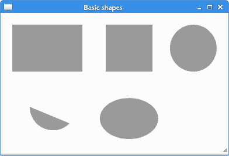
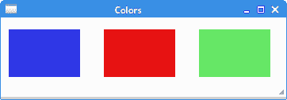

# PyCairo 形状和填充

> 原文： [https://zetcode.com/gfx/pycairo/shapesfills/](https://zetcode.com/gfx/pycairo/shapesfills/)

在 PyCairo 教程的这一部分中，我们创建一些基本的和更高级的形状。 我们用纯色，图案和渐变填充这些形状。 渐变将在单独的章节中介绍。

## 基本形状

PyCairo 有一些创建简单形状的基本方法。

```py
def on_draw(self, wid, cr):

    cr.set_source_rgb(0.6, 0.6, 0.6)

    cr.rectangle(20, 20, 120, 80)
    cr.rectangle(180, 20, 80, 80)
    cr.fill()

    cr.arc(330, 60, 40, 0, 2*math.pi)
    cr.fill()

    cr.arc(90, 160, 40, math.pi/4, math.pi)
    cr.fill()

    cr.translate(220, 180)
    cr.scale(1, 0.7)
    cr.arc(0, 0, 50, 0, 2*math.pi)
    cr.fill()

```

在此示例中，我们创建一个矩形，一个正方形，一个圆形，一个弧形和一个椭圆形。

```py
cr.rectangle(20, 20, 120, 80)
cr.rectangle(180, 20, 80, 80)

```

`rectangle()`方法用于创建正方形和矩形。 正方形只是矩形的一种特定类型。 参数是窗口左上角的 x 和 y 坐标以及矩形的宽度和高度。

```py
cr.arc(330, 60, 40, 0, 2*math.pi)

```

`arc()`方法创建一个圆。 参数是弧度中心的 x 和 y 坐标，半径以及弧度的开始和结束角度。

```py
cr.arc(90, 160, 40, math.pi/4, math.pi)

```

在这里，我们画一条弧，是圆的一部分。

```py
cr.scale(1, 0.7)
cr.arc(0, 0, 50, 0, 2*math.pi)

```

我们使用`scale()`和`arc()`方法创建一个椭圆。



Figure: Basic Shapes

可以使用基本图元的组合来创建其他形状。

`complex_shapes.py`

```py
#!/usr/bin/python

'''
ZetCode PyCairo tutorial 

This code example draws another
three shapes in PyCairo.

Author: Jan Bodnar
Website: zetcode.com 
Last edited: April 2016
'''

from gi.repository import Gtk
import cairo

class cv(object):

    points = ( 
        ( 0, 85 ), 
        ( 75, 75 ), 
        ( 100, 10 ), 
        ( 125, 75 ), 
        ( 200, 85 ),
        ( 150, 125 ), 
        ( 160, 190 ),
        ( 100, 150 ), 
        ( 40, 190 ),
        ( 50, 125 ),
        ( 0, 85 )
    )

class Example(Gtk.Window):

    def __init__(self):
        super(Example, self).__init__()

        self.init_ui()

    def init_ui(self):    

        darea = Gtk.DrawingArea()
        darea.connect("draw", self.on_draw)
        self.add(darea)

        self.set_title("Complex shapes")
        self.resize(460, 240)
        self.set_position(Gtk.WindowPosition.CENTER)
        self.connect("delete-event", Gtk.main_quit)
        self.show_all()

    def on_draw(self, wid, cr):

        cr.set_source_rgb(0.6, 0.6, 0.6)
        cr.set_line_width(1)

        for i in range(10):
            cr.line_to(cv.points[i][0], cv.points[i][1])

        cr.fill()

        cr.move_to(240, 40)
        cr.line_to(240, 160)
        cr.line_to(350, 160)
        cr.fill()

        cr.move_to(380, 40)
        cr.line_to(380, 160)
        cr.line_to(450, 160)
        cr.curve_to(440, 155, 380, 145, 380, 40)
        cr.fill()

def main():

    app = Example()
    Gtk.main()

if __name__ == "__main__":    
    main()

```

在此示例中，我们创建一个星形对象，一个三角形和一个修改后的三角形。 这些对象是使用直线和一条曲线创建的。

```py
for i in range(10):
    cr.line_to(cv.points[i][0], cv.points[i][1])

cr.fill()

```

通过连接点元组中的所有点来绘制星形。 `fill()`方法用当前颜色填充星形对象。

```py
cr.move_to(240, 40)
cr.line_to(240, 160)
cr.line_to(350, 160)
cr.fill()

```

这些线创建一个三角形。 最后两点将自动合并。

```py
cr.move_to(380, 40)
cr.line_to(380, 160)
cr.line_to(450, 160)
cr.curve_to(440, 155, 380, 145, 380, 40)
cr.fill()

```

修改后的三角形是两条直线和一条曲线的简单组合。


Figure: Complex shapes

## 填充

填充填充形状的内部。 填充可以是纯色，图案或渐变。

### 纯色

颜色是代表红色，绿色和蓝色（RGB）强度值的组合的对象。 PyCairo 的有效 RGB 值在 0 到 1 的范围内。

```py
def on_draw(self, wid, cr):

    cr.set_source_rgb(0.2, 0.23, 0.9)
    cr.rectangle(10, 15, 90, 60)
    cr.fill()

    cr.set_source_rgb(0.9, 0.1, 0.1)
    cr.rectangle(130, 15, 90, 60)
    cr.fill()

    cr.set_source_rgb(0.4, 0.9, 0.4)
    cr.rectangle(250, 15, 90, 60)
    cr.fill()           

```

在示例中，我们绘制了四个彩色矩形。

```py
cr.set_source_rgb(0.2, 0.23, 0.9)
cr.rectangle(10, 15, 90, 60)
cr.fill()

```

`set_source_rgb()`方法将源设置为不透明的颜色。 参数是红色，绿色，蓝色强度值。 通过调用`fill()`方法，该源用于填充矩形的内部。



Figure: Solid colors

### 图案

图案是可以用于填充形状的复杂图形对象。

`patterns.py`

```py
#!/usr/bin/python

'''
ZetCode PyCairo tutorial 

This program shows how to work
with patterns in PyCairo.

Author: Jan Bodnar
Website: zetcode.com 
Last edited: April 2016
'''

from gi.repository import Gtk
import cairo

class Example(Gtk.Window):

    def __init__(self):
        super(Example, self).__init__()

        self.init_ui()
        self.create_surpat()

    def init_ui(self):    

        darea = Gtk.DrawingArea()
        darea.connect("draw", self.on_draw)
        self.add(darea)

        self.set_title("Patterns")
        self.resize(300, 290)
        self.set_position(Gtk.WindowPosition.CENTER)
        self.connect("delete-event", Gtk.main_quit)
        self.show_all()

    def create_surpat(self):

        sr1 = cairo.ImageSurface.create_from_png("blueweb.png")
        sr2 = cairo.ImageSurface.create_from_png("maple.png")
        sr3 = cairo.ImageSurface.create_from_png("crack.png")
        sr4 = cairo.ImageSurface.create_from_png("chocolate.png")

        self.pt1 = cairo.SurfacePattern(sr1)
        self.pt1.set_extend(cairo.EXTEND_REPEAT)
        self.pt2 = cairo.SurfacePattern(sr2)
        self.pt2.set_extend(cairo.EXTEND_REPEAT)
        self.pt3 = cairo.SurfacePattern(sr3)
        self.pt3.set_extend(cairo.EXTEND_REPEAT)
        self.pt4 = cairo.SurfacePattern(sr4)
        self.pt4.set_extend(cairo.EXTEND_REPEAT)        

    def on_draw(self, wid, cr):

        cr.set_source(self.pt1)
        cr.rectangle(20, 20, 100, 100)
        cr.fill()

        cr.set_source(self.pt2) 
        cr.rectangle(150, 20, 100, 100)
        cr.fill()

        cr.set_source(self.pt3)
        cr.rectangle(20, 140, 100, 100)
        cr.fill()

        cr.set_source(self.pt4)
        cr.rectangle(150, 140, 100, 100)
        cr.fill()

def main():

    app = Example()
    Gtk.main()

if __name__ == "__main__":    
    main()

```

在此示例中，我们绘制了四个矩形。 这次我们用一些模式填充它们。 我们使用来自 Gimp 图像处理程序的四个图案图像。 我们必须保留这些图案的原始大小，因为我们将它们平铺。

我们在`draw()`方法之外创建图像表面。 每次需要重新绘制窗口时，从硬盘读取数据都不会很有效。

```py
sr1 = cairo.ImageSurface.create_from_png("blueweb.png")

```

从 PNG 图像创建图像表面。

```py
self.pt1 = cairo.SurfacePattern(sr1)
self.pt1.set_extend(cairo.EXTEND_REPEAT)

```

从表面创建图案。 我们将模式设置为`cairo.EXTEND_REPEAT`，这将导致图案通过重复平铺。

```py
cr.set_source(self.pt1)
cr.rectangle(20, 20, 100, 100)
cr.fill()

```

在这里，我们绘制第一个矩形。 `set_source()`方法告诉 Cairo 上下文使用图案作为绘图源。 图像图案可能不完全适合形状。 `rectangle()`创建一个矩形路径。 最后，`fill()`方法用源填充路径。

本章介绍了 PyCairo 的形状和填充。