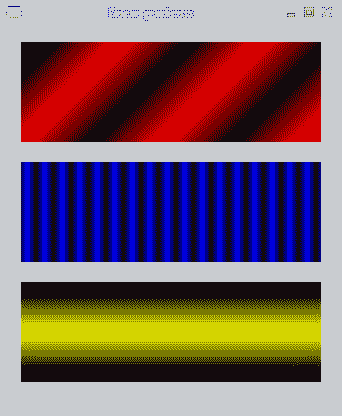
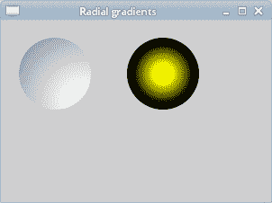

# PyCairo 渐变

> 原文： [https://zetcode.com/gfx/pycairo/gradients/](https://zetcode.com/gfx/pycairo/gradients/)

在 PyCairo 教程的这一部分中，我们将介绍渐变。 我们将提到线性和径向渐变。

在计算机图形学中，渐变是从浅到深或从一种颜色到另一种颜色的阴影的平滑混合。 在 2D 绘图程序和绘画程序中，渐变用于创建彩色背景和特殊效果以及模拟灯光和阴影。 （answers.com）

## 线性渐变

线性渐变是沿着一条线的颜色混合或颜色阴影混合。 它们由 PyCairo 中的`cairo.LinearGradient`类表示。

```py
#!/usr/bin/python

'''
ZetCode PyCairo tutorial 

This program works with linear
gradients in PyCairo.

author: Jan Bodnar
website: zetcode.com 
last edited: August 2012
'''

from gi.repository import Gtk
import cairo

class Example(Gtk.Window):

    def __init__(self):
        super(Example, self).__init__()

        self.init_ui()

    def init_ui(self):    

        darea = Gtk.DrawingArea()
        darea.connect("draw", self.on_draw)
        self.add(darea)

        self.set_title("Linear gradients")
        self.resize(340, 390)
        self.set_position(Gtk.WindowPosition.CENTER)
        self.connect("delete-event", Gtk.main_quit)
        self.show_all()

    def on_draw(self, wid, cr):

        self.draw_gradient1(cr)
        self.draw_gradient2(cr)
        self.draw_gradient3(cr)

    def draw_gradient1(self, cr):

        lg1 = cairo.LinearGradient(0.0, 0.0, 350.0, 350.0)

        count = 1

        i = 0.1    
        while i < 1.0: 
            if count % 2:
                lg1.add_color_stop_rgba(i, 0, 0, 0, 1)
            else:
                lg1.add_color_stop_rgba(i, 1, 0, 0, 1)
            i = i + 0.1
            count = count + 1      

        cr.rectangle(20, 20, 300, 100)
        cr.set_source(lg1)
        cr.fill()

    def draw_gradient2(self, cr):        

        lg2 = cairo.LinearGradient(0.0, 0.0, 350.0, 0)

        count = 1

        i = 0.05    
        while i < 0.95: 
            if count % 2:
                lg2.add_color_stop_rgba(i, 0, 0, 0, 1)
            else:
                lg2.add_color_stop_rgba(i, 0, 0, 1, 1)
            i = i + 0.025
            count = count + 1        

        cr.rectangle(20, 140, 300, 100)
        cr.set_source(lg2)
        cr.fill()

    def draw_gradient3(self, cr):        

        lg3 = cairo.LinearGradient(20.0, 260.0,  20.0, 360.0)
        lg3.add_color_stop_rgba(0.1, 0, 0, 0, 1) 
        lg3.add_color_stop_rgba(0.5, 1, 1, 0, 1) 
        lg3.add_color_stop_rgba(0.9, 0, 0, 0, 1) 

        cr.rectangle(20, 260, 300, 100)
        cr.set_source(lg3)
        cr.fill()

def main():

    app = Example()
    Gtk.main()

if __name__ == "__main__":    
    main()

```

该示例绘制了三个填充有线性渐变的矩形。

```py
lg3 = cairo.LinearGradient(20.0, 260.0,  20.0, 360.0)

```

在这里，我们创建一个线性渐变。 参数指定直线，沿着该直线绘制渐变。 这是一条水平线。

```py
lg3.add_color_stop_rgba(0.1, 0, 0, 0, 1) 
lg3.add_color_stop_rgba(0.5, 1, 1, 0, 1) 
lg3.add_color_stop_rgba(0.9, 0, 0, 0, 1) 

```

我们定义色标以产生渐变图案。 在这种情况下，渐变是黑色和黄色的混合。 通过添加两个黑色和一个黄色色标，我们创建了一个水平渐变图案。 这些停止实际上是什么意思？ 在我们的情况下，我们从黑色开始，该黑色将停止在大小的 1/10 处。 然后，我们开始逐渐涂成黄色，最终达到形状的中心。 黄色停在大小的 9/10，我们再次开始用黑色绘画，直到结束。



图：线性渐变

## 径向渐变

径向渐变是两个圆之间颜色或阴影的混合。 `cairo.RadialGradient`类用于在 PyCairo 中创建径向渐变。

```py
#!/usr/bin/python

'''
ZetCode PyCairo tutorial

This program works with radial
gradients in PyCairo.

author: Jan Bodnar
website: zetcode.com 
last edited: August 2012
'''

from gi.repository import Gtk
import cairo
import math

class Example(Gtk.Window):

    def __init__(self):
        super(Example, self).__init__()

        self.init_ui()

    def init_ui(self):    

        darea = Gtk.DrawingArea()
        darea.connect("draw", self.on_draw)
        self.add(darea)

        self.set_title("Radial gradients")
        self.resize(300, 200)
        self.set_position(Gtk.WindowPosition.CENTER)
        self.connect("delete-event", Gtk.main_quit)
        self.show_all()

    def on_draw(self, wid, cr):

        self.draw_gradient1(cr)
        self.draw_gradient2(cr)

    def draw_gradient1(self, cr):

        cr.set_source_rgba(0, 0, 0, 1)
        cr.set_line_width(12)

        cr.translate(60, 60)

        r1 = cairo.RadialGradient(30, 30, 10, 30, 30, 90)
        r1.add_color_stop_rgba(0, 1, 1, 1, 1)
        r1.add_color_stop_rgba(1, 0.6, 0.6, 0.6, 1)
        cr.set_source(r1)
        cr.arc(0, 0, 40, 0, math.pi * 2)
        cr.fill()

        cr.translate(120, 0)

    def draw_gradient2(self, cr):        

        r2 = cairo.RadialGradient(0, 0, 10, 0, 0, 40)
        r2.add_color_stop_rgb(0, 1, 1, 0)
        r2.add_color_stop_rgb(0.8, 0, 0, 0)
        cr.set_source(r2)
        cr.arc(0, 0, 40, 0, math.pi * 2)
        cr.fill()   

def main():

    app = Example()
    Gtk.main()

if __name__ == "__main__":    
    main()

```

在示例中，我们绘制了两个径向渐变。

```py
r1 = cairo.RadialGradient(30, 30, 10, 30, 30, 90)
r1.add_color_stop_rgba(0, 1, 1, 1, 1)
r1.add_color_stop_rgba(1, 0.6, 0.6, 0.6, 1)
cr.set_source(r1)
cr.arc(0, 0, 40, 0, math.pi * 2)
cr.fill()

```

我们画一个圆，并用径向渐变填充其内部。 径向梯度由两个圆定义。 `add_color_stop_rgba()`方法定义颜色。 我们可以试验圆的位置或半径的长度。 在第一个渐变示例中，我们创建了一个类似于 3D 形状的对象。

```py
r2 = cairo.RadialGradient(0, 0, 10, 0, 0, 40)
r2.add_color_stop_rgb(0, 1, 1, 0)
r2.add_color_stop_rgb(0.8, 0, 0, 0)
cr.set_source(r2)
cr.arc(0, 0, 40, 0, math.pi * 2)
cr.fill()  

```

在此示例中，定义径向渐变的圆和自定义绘制的圆具有共同的中心点。



图：径向渐变

在本章中，我们介绍了 PyCairo 渐变。