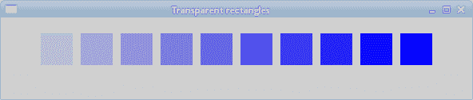
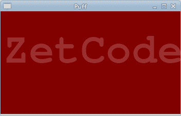
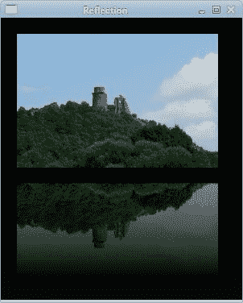
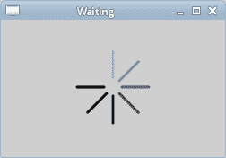

# PyCairo 的透明度

> 原文： [https://zetcode.com/gfx/pycairo/transparency/](https://zetcode.com/gfx/pycairo/transparency/)

在 PyCairo 教程的这一部分中，我们将讨论透明度。 我们将提供一些基本定义和三个有趣的透明度示例。

透明性是指能够透视材料的质量。 了解透明度的最简单方法是想象一块玻璃或水。 从技术上讲，光线可以穿过玻璃，这样我们就可以看到玻璃后面的物体。

在计算机图形学中，我们可以使用 alpha 合成实现透明效果。 Alpha 合成是将图像与背景组合以创建部分透明外观的过程。 合成过程使用 alpha 通道。 Alpha 通道是图形文件格式的 8 位层，用于表达半透明性（透明度）。 每个像素的额外八位用作掩码，表示 256 级半透明。
（answers.com，wikipedia.org）

## 透明矩形

第一个示例将绘制十个透明度不同的矩形。

```py
def on_draw(self, wid, cr):

    for i in range(1, 11):

        cr.set_source_rgba(0, 0, 1, i*0.1)
        cr.rectangle(50*i, 20, 40, 40)
        cr.fill()        

```

`set_source_rgba()`方法具有 alpha 参数以提供透明度。

```py
for i in range(1, 11):

    cr.set_source_rgba(0, 0, 1, i*0.1)
    cr.rectangle(50*i, 20, 40, 40)
    cr.fill()

```

此代码创建十个矩形，其 alpha 值从 0.1 到 1。



图：透明矩形

## 泡芙效果

在以下示例中，我们创建一个粉扑效果。 该示例将显示一个不断增长的居中文本，该文本将从某个点逐渐淡出。 这是一个非常常见的效果，我们经常可以在 Flash 动画中看到它。 `paint_with_alpha()`方法对于产生效果至关重要。

```py
#!/usr/bin/python

'''
ZetCode PyCairo tutorial 

This program creates a 'puff'
effect.

author: Jan Bodnar
website: zetcode.com 
last edited: August 2012
'''

from gi.repository import Gtk, GLib
import cairo

class cv(object):

    SPEED = 14
    TEXT_SIZE_MAX = 20
    ALPHA_DECREASE = 0.01
    SIZE_INCREASE = 0.8

class Example(Gtk.Window):

    def __init__(self):
        super(Example, self).__init__()

        self.init_ui()

    def init_ui(self):    

        self.darea = Gtk.DrawingArea()
        self.darea.connect("draw", self.on_draw)
        self.add(self.darea)

        self.timer = True
        self.alpha = 1.0
        self.size = 1.0       

        GLib.timeout_add(cv.SPEED, self.on_timer)

        self.set_title("Puff")
        self.resize(350, 200)
        self.set_position(Gtk.WindowPosition.CENTER)
        self.connect("delete-event", Gtk.main_quit)
        self.show_all()

    def on_timer(self):

        if not self.timer: return False

        self.darea.queue_draw()
        return True        

    def on_draw(self, wid, cr):

        w, h = self.get_size()

        cr.set_source_rgb(0.5, 0, 0)
        cr.paint()

        cr.select_font_face("Courier", cairo.FONT_SLANT_NORMAL, 
            cairo.FONT_WEIGHT_BOLD)

        self.size = self.size + cv.SIZE_INCREASE

        if self.size > cv.TEXT_SIZE_MAX:
            self.alpha = self.alpha - cv.ALPHA_DECREASE

        cr.set_font_size(self.size)
        cr.set_source_rgb(1, 1, 1)

        (x, y, width, height, dx, dy) = cr.text_extents("ZetCode")

        cr.move_to(w/2 - width/2, h/2)
        cr.text_path("ZetCode")
        cr.clip()
        cr.paint_with_alpha(self.alpha)

        if self.alpha <= 0:
            self.timer = False

def main():

    app = Example()
    Gtk.main()

if __name__ == "__main__":    
    main()

```

该示例在窗口上创建一个逐渐增长和褪色的文本。

```py
class cv(object):

    SPEED = 14
    TEXT_SIZE_MAX = 20
    ALPHA_DECREASE = 0.01
    SIZE_INCREASE = 0.8

```

在这里，我们定义了示例中使用的一些常量。

```py
self.alpha = 1.0
self.size = 1.0     

```

这两个变量存储当前的 alpha 值和文本大小。

```py
GLib.timeout_add(cv.SPEED, self.on_timer)

```

每 14 毫秒调用一次`on_timer()`方法。

```py
def on_timer(self):

    if not self.timer: return False

    self.darea.queue_draw()
    return True 

```

在`on_timer()`方法中，我们使用`queue_draw()`方法重绘绘图区域小部件。

```py
def on_draw(self, wid, cr):

    w, h = self.get_size()

    cr.set_source_rgb(0.5, 0, 0)
    cr.paint()

    cr.select_font_face("Courier", cairo.FONT_SLANT_NORMAL, 
        cairo.FONT_WEIGHT_BOLD)
...

```

在`on_draw()`方法中，我们获得窗口工作区的宽度和高度。 这些值用于使文本居中。 我们用一些深红色填充窗口的背景。 我们为文本选择一种 Courier 字体。

```py
(x, y, width, height, dx, dy) = cr.text_extents("ZetCode")

```

我们得到了文本指标。 我们将仅使用文本宽度。

```py
cr.move_to(w/2 - width/2, h/2)

```

我们移动到文本将在窗口上居中的位置。

```py
cr.text_path("ZetCode")
cr.clip()
cr.paint_with_alpha(self.alpha)

```

我们使用`text_path()`方法获得文本的路径。 我们使用`clip()`方法将绘画限制为当前路径。 `paint_with_alpha()`方法使用 alpha 值的掩码在当前剪辑区域内的任何地方绘制当前源。



图：粉扑效果

## 反射图像

在下一个示例中，我们显示反射图像。 这种效果使人产生幻觉，好像图像在水中被反射一样。

```py
#!/usr/bin/python

'''
ZetCode PyCairo tutorial 

This program creates an image reflection.

author: Jan Bodnar
website: zetcode.com 
last edited: August 2012
'''

from gi.repository import Gtk
import cairo
import sys

class Example(Gtk.Window):

    def __init__(self):
        super(Example, self).__init__()

        self.init_ui()
        self.load_image()
        self.init_vars()

    def init_ui(self):    

        darea = Gtk.DrawingArea()
        darea.connect("draw", self.on_draw)
        self.add(darea)

        self.set_title("Reflection")
        self.resize(300, 350)
        self.set_position(Gtk.WindowPosition.CENTER)
        self.connect("delete-event", Gtk.main_quit)
        self.show_all()

    def load_image(self):          

        try:
            self.s = cairo.ImageSurface.create_from_png("slanec.png")
        except Exception, e:
            print e.message
            sys.exit(1)              

    def init_vars(self):

        self.imageWidth = self.s.get_width()
        self.imageHeight = self.s.get_height()
        self.gap = 40
        self.border = 20                

    def on_draw(self, wid, cr):

        w, h = self.get_size()

        lg = cairo.LinearGradient(w/2, 0, w/2, h*3)
        lg.add_color_stop_rgba(0, 0, 0, 0, 1)
        lg.add_color_stop_rgba(h, 0.2, 0.2, 0.2, 1)

        cr.set_source(lg)
        cr.paint()

        cr.set_source_surface(self.s, self.border, self.border)
        cr.paint()

        alpha = 0.7
        step = 1.0 / self.imageHeight

        cr.translate(0, 2 * self.imageHeight + self.gap)
        cr.scale(1, -1)

        i = 0

        while(i < self.imageHeight):

            cr.rectangle(self.border, self.imageHeight-i, 
                self.imageWidth, 1)

            i = i + 1

            cr.save()
            cr.clip()
            cr.set_source_surface(self.s, self.border, 
                self.border)

            alpha = alpha - step

            cr.paint_with_alpha(alpha)
            cr.restore()

def main():

    app = Example()
    Gtk.main()

if __name__ == "__main__":    
    main()

```

窗户上显示了一座城堡的倒影。

```py
def load_image(self):          

    try:
        self.s = cairo.ImageSurface.create_from_png("slanec.png")
    except Exception, e:
        print e.message
        sys.exit(1)    

```

在`load_image()`方法中，从 PNG 图像创建图像表面。

```py
def init_vars(self):

    self.imageWidth = self.s.get_width()
    self.imageHeight = self.s.get_height()
    self.gap = 40
    self.border = 20  

```

在`init_vars()`方法内部，我们获得图像的宽度和高度。 我们还定义了两个变量。

```py
lg = cairo.LinearGradient(w/2, 0, w/2, h*3)
lg.add_color_stop_rgba(0, 0, 0, 0, 1)
lg.add_color_stop_rgba(h, 0.2, 0.2, 0.2, 1)

cr.set_source(lg)
cr.paint()

```

窗口的背景填充有渐变颜料。 涂料是从黑色到深灰色的平滑混合。

```py
cr.translate(0, 2 * self.imageHeight + self.gap)
cr.scale(1, -1)

```

此代码翻转图像并将其转换为原始图像下方。 平移操作是必需的，因为缩放操作会使图像上下颠倒并向上平移图像。 要了解发生了什么，只需拍摄一张照片并将其放在桌子上即可。 并翻转它。

```py
i = 0

while(i < self.imageHeight):

    cr.rectangle(self.border, self.imageHeight-i, 
        self.imageWidth, 1)

    i = i + 1

    cr.save()
    cr.clip()
    cr.set_source_surface(self.s, self.border, 
        self.border)

    alpha = alpha - step

    cr.paint_with_alpha(alpha)
    cr.restore()

```

这是最后一部分。 我们使第二个图像透明。 但是透明度不是恒定的。 图像逐渐淡出。 反射的图像逐行绘制。 `clip()`方法将图形限制为高度为 1 的矩形。`paint_with_alpha()`在绘制图像表面的当前剪辑时会考虑透明度。



Figure: Reflected image

## 等待演示

在此示例中，我们使用透明效果创建一个等待演示。 我们将绘制 8 条线，这些线将逐渐消失，从而产生一种错觉，即一条线在移动。 此类效果通常用于通知用户幕后正在进行繁重的任务。 一个示例是通过互联网流式传输视频。

```py
#!/usr/bin/python

'''
ZetCode PyCairo tutorial 

This program creates a 'waiting' effect.

author: Jan Bodnar
website: zetcode.com 
last edited: August 2012
'''

from gi.repository import Gtk, GLib
import cairo
import math

class cv(object):

    trs = (
        ( 0.0, 0.15, 0.30, 0.5, 0.65, 0.80, 0.9, 1.0 ),
        ( 1.0, 0.0,  0.15, 0.30, 0.5, 0.65, 0.8, 0.9 ),
        ( 0.9, 1.0,  0.0,  0.15, 0.3, 0.5, 0.65, 0.8 ),
        ( 0.8, 0.9,  1.0,  0.0,  0.15, 0.3, 0.5, 0.65 ),
        ( 0.65, 0.8, 0.9,  1.0,  0.0,  0.15, 0.3, 0.5 ),
        ( 0.5, 0.65, 0.8, 0.9, 1.0,  0.0,  0.15, 0.3 ),
        ( 0.3, 0.5, 0.65, 0.8, 0.9, 1.0,  0.0,  0.15 ),
        ( 0.15, 0.3, 0.5, 0.65, 0.8, 0.9, 1.0,  0.0, )
    )

    SPEED = 100
    CLIMIT = 1000
    NLINES = 8  

class Example(Gtk.Window):

    def __init__(self):
        super(Example, self).__init__()

        self.init_ui()

    def init_ui(self):    

        self.darea = Gtk.DrawingArea()
        self.darea.connect("draw", self.on_draw)
        self.add(self.darea)

        self.count = 0

        GLib.timeout_add(cv.SPEED, self.on_timer)        

        self.set_title("Waiting")
        self.resize(250, 150)
        self.set_position(Gtk.WindowPosition.CENTER)
        self.connect("delete-event", Gtk.main_quit)
        self.show_all()

    def on_timer(self):    

        self.count = self.count + 1

        if self.count >= cv.CLIMIT:
            self.count = 0        

        self.darea.queue_draw()

        return True        

    def on_draw(self, wid, cr):

        cr.set_line_width(3)
        cr.set_line_cap(cairo.LINE_CAP_ROUND)

        w, h = self.get_size()

        cr.translate(w/2, h/2)

        for i in range(cv.NLINES):

            cr.set_source_rgba(0, 0, 0, cv.trs[self.count%8][i])
            cr.move_to(0.0, -10.0)
            cr.line_to(0.0, -40.0)
            cr.rotate(math.pi/4)
            cr.stroke()

def main():

    app = Example()
    Gtk.main()

if __name__ == "__main__":    
    main()

```

我们用八个不同的 alpha 值绘制八条线。

```py
class cv(object):

    trs = (
        ( 0.0, 0.15, 0.30, 0.5, 0.65, 0.80, 0.9, 1.0 ),
        ( 1.0, 0.0,  0.15, 0.30, 0.5, 0.65, 0.8, 0.9 ),
        ( 0.9, 1.0,  0.0,  0.15, 0.3, 0.5, 0.65, 0.8 ),
        ( 0.8, 0.9,  1.0,  0.0,  0.15, 0.3, 0.5, 0.65 ),
        ( 0.65, 0.8, 0.9,  1.0,  0.0,  0.15, 0.3, 0.5 ),
        ( 0.5, 0.65, 0.8, 0.9, 1.0,  0.0,  0.15, 0.3 ),
        ( 0.3, 0.5, 0.65, 0.8, 0.9, 1.0,  0.0,  0.15 ),
        ( 0.15, 0.3, 0.5, 0.65, 0.8, 0.9, 1.0,  0.0, )
    )
...

```

这是此演示中使用的透明度值的二维元组。 有 8 行，每行一种状态。 8 行中的每行将连续使用这些值。

```py
SPEED = 100
CLIMIT = 1000
NLINES = 8  

```

`SPEED`常数控制动画的速度。 `CLIMIT`是`self.count`变量的最大数量。 达到此限制后，变量将重置为 0。`NLINES`是示例中绘制的行数。

```py
GLib.timeout_add(cv.SPEED, self.on_timer)

```

我们使用计时器功能来创建动画。 `on_timer()`方法的每个`cv.SPEED` ms 被调用。

```py
def on_timer(self):    

    self.count = self.count + 1

    if self.count >= cv.CLIMIT:
        self.count = 0        

    self.darea.queue_draw()

    return True  

```

在`on_timer()`方法中，我们增加`self.count`变量。 如果变量达到`cv.CLIMIT`常量，则将其设置为 0。我们防止溢出，并且不使用大数。

```py
def on_draw(self, wid, cr):

    cr.set_line_width(3)
    cr.set_line_cap(cairo.LINE_CAP_ROUND)
...

```

我们使线条更粗一些，以便更好地显示它们。 我们用带帽的线画线。

```py
w, h = self.get_size()

cr.translate(w/2, h/2)

```

我们将图形放置在窗口的中央。

```py
for i in range(cv.NLINES):

    cr.set_source_rgba(0, 0, 0, cv.trs[self.count%8][i])
    cr.move_to(0.0, -10.0)
    cr.line_to(0.0, -40.0)
    cr.rotate(math.pi/4)
    cr.stroke()

```

在`for`循环中，我们绘制了 8 条具有不同透明度值的旋转线。 线以 45 度角分开。



图：等待 demo

在 PyCairo 教程的这一部分中，我们介绍了透明度。