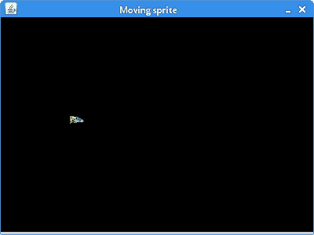
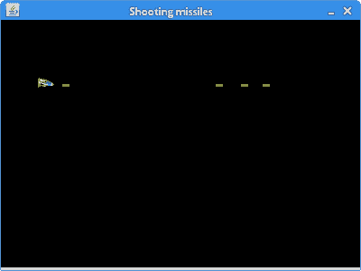

# 移动精灵

> 原文： [https://zetcode.com/tutorials/javagamestutorial/movingsprites/](https://zetcode.com/tutorials/javagamestutorial/movingsprites/)

在 Java 2D 游戏教程的这一部分中，我们将使用精灵。

术语精灵具有多种含义。 它用于表示场景中的图像或动画。

它也用于表示游戏中的任何可移动对象。 含义之一也是在游戏中封装角色的代码。 在我们的教程中，通过使用精灵，我们引用了一个可移动对象或其 Java 类。

## 移动精灵

在第一个示例中，我们有一个太空飞船。 我们可以使用光标键在板上移动宇宙飞船。

`SpaceShip.java`

```java
package com.zetcode;

import java.awt.Image;
import java.awt.event.KeyEvent;
import javax.swing.ImageIcon;

public class SpaceShip {

    private int dx;
    private int dy;
    private int x = 40;
    private int y = 60;
    private int w;
    private int h;
    private Image image;

    public SpaceShip() {

        loadImage();
    }

    private void loadImage() {

        ImageIcon ii = new ImageIcon("src/resources/spaceship.png");
        image = ii.getImage(); 

        w = image.getWidth(null);
        h = image.getHeight(null);
    }

    public void move() {

        x += dx;
        y += dy;
    }

    public int getX() {

        return x;
    }

    public int getY() {

        return y;
    }

    public int getWidth() {

        return w;
    }

    public int getHeight() {

        return h;
    }    

    public Image getImage() {

        return image;
    }

    public void keyPressed(KeyEvent e) {

        int key = e.getKeyCode();

        if (key == KeyEvent.VK_LEFT) {
            dx = -2;
        }

        if (key == KeyEvent.VK_RIGHT) {
            dx = 2;
        }

        if (key == KeyEvent.VK_UP) {
            dy = -2;
        }

        if (key == KeyEvent.VK_DOWN) {
            dy = 2;
        }
    }

    public void keyReleased(KeyEvent e) {

        int key = e.getKeyCode();

        if (key == KeyEvent.VK_LEFT) {
            dx = 0;
        }

        if (key == KeyEvent.VK_RIGHT) {
            dx = 0;
        }

        if (key == KeyEvent.VK_UP) {
            dy = 0;
        }

        if (key == KeyEvent.VK_DOWN) {
            dy = 0;
        }
    }
}

```

此类代表一艘太空飞船。 在此类中，我们保留子画面的图像和子画面的坐标。 `keyPressed()`和`keyReleased()`方法控制精灵是否在移动。

```java
public void move() {
    x += dx;
    y += dy;
}

```

`move()`方法更改子画面的坐标。 这些 x 和 y 值在`paintComponent()`方法中用于绘制子画面的图像。

```java
if (key == KeyEvent.VK_LEFT) {
    dx = 0;
}

```

释放左光标键时，将`dx`变量设置为零。 航天器将停止移动。

`Board.java`

```java
package com.zetcode;

import java.awt.Color;
import java.awt.Graphics;
import java.awt.Graphics2D;
import java.awt.Toolkit;
import java.awt.event.ActionEvent;
import java.awt.event.ActionListener;
import java.awt.event.KeyAdapter;
import java.awt.event.KeyEvent;
import javax.swing.JPanel;
import javax.swing.Timer;

public class Board extends JPanel implements ActionListener {

    private Timer timer;
    private SpaceShip spaceShip;
    private final int DELAY = 10;

    public Board() {

        initBoard();
    }

    private void initBoard() {

        addKeyListener(new TAdapter());
        setBackground(Color.black);
	setFocusable(true);

        spaceShip = new SpaceShip();

        timer = new Timer(DELAY, this);
        timer.start();
    }

    @Override
    public void paintComponent(Graphics g) {
        super.paintComponent(g);

        doDrawing(g);

        Toolkit.getDefaultToolkit().sync();
    }

    private void doDrawing(Graphics g) {

        Graphics2D g2d = (Graphics2D) g;

        g2d.drawImage(spaceShip.getImage(), spaceShip.getX(), 
            spaceShip.getY(), this);
    }

    @Override
    public void actionPerformed(ActionEvent e) {

        step();
    }

    private void step() {

        spaceShip.move();

        repaint(spaceShip.getX()-1, spaceShip.getY()-1, 
                spaceShip.getWidth()+2, spaceShip.getHeight()+2);     
    }    

    private class TAdapter extends KeyAdapter {

        @Override
        public void keyReleased(KeyEvent e) {
            spaceShip.keyReleased(e);
        }

        @Override
        public void keyPressed(KeyEvent e) {
            spaceShip.keyPressed(e);
        }
    }
}

```

这是`Board`类。

```java
private void doDrawing(Graphics g) {

    Graphics2D g2d = (Graphics2D) g;

    g2d.drawImage(ship.getImage(), ship.getX(), ship.getY(), this);
}

```

在`doDrawing()`方法中，我们使用`drawImage()`方法绘制宇宙飞船。 我们从精灵类中获得图像和坐标。

```java
@Override
public void actionPerformed(ActionEvent e) {

    step();
}

```

`actionPerformed()`方法每`DELAY` ms 调用一次。 我们称为`step()`方法。

```java
private void step() {

    ship.move();
    repaint(ship.getX()-1, ship.getY()-1, 
            ship.getWidth()+2, ship.getHeight()+2);     
}    

```

我们移动精灵并重新粉刷已更改的电路板部分。 我们使用一种小的优化技术，该技术仅重新绘制实际更改的窗口的小区域。

```java
private class TAdapter extends KeyAdapter {

    @Override
    public void keyReleased(KeyEvent e) {
        craft.keyReleased(e);
    }

    @Override
    public void keyPressed(KeyEvent e) {
        craft.keyPressed(e);
    }
}

```

在`Board`类中，我们监听关键事件。 `KeyAdapter`类的重写方法将处理委托给`Craft`类的方法。

`MovingSpriteEx.java`

```java
package com.zetcode;

import java.awt.EventQueue;
import javax.swing.JFrame;

public class MovingSpriteEx extends JFrame {

    public MovingSpriteEx() {

        initUI();
    }

    private void initUI() {

        add(new Board());

        setTitle("Moving sprite");
        setSize(400, 300);

        setLocationRelativeTo(null);
        setResizable(false);
        setDefaultCloseOperation(JFrame.EXIT_ON_CLOSE);
    }

    public static void main(String[] args) {

        EventQueue.invokeLater(() -> {
            MovingSpriteEx ex = new MovingSpriteEx();
            ex.setVisible(true);
        });
    }
}

```

这是主要的类。



图：移动精灵

## 射击导弹

在下一个示例中，我们在示例中添加了另一个精灵类型-导弹。 用 `Space` 键发射导弹。

`Sprite.java`

```java
package com.zetcode;

import java.awt.Image;
import javax.swing.ImageIcon;

public class Sprite {

    protected int x;
    protected int y;
    protected int width;
    protected int height;
    protected boolean visible;
    protected Image image;

    public Sprite(int x, int y) {

        this.x = x;
        this.y = y;
        visible = true;
    }

    protected void loadImage(String imageName) {

        ImageIcon ii = new ImageIcon(imageName);
        image = ii.getImage();
    }

    protected void getImageDimensions() {

        width = image.getWidth(null);
        height = image.getHeight(null);
    }    

    public Image getImage() {
        return image;
    }

    public int getX() {
        return x;
    }

    public int getY() {
        return y;
    }

    public boolean isVisible() {
        return visible;
    }

    public void setVisible(Boolean visible) {
        this.visible = visible;
    }
}

```

`Sprite`类共享`Missile`和`SpaceShip`类的通用代码。

```java
public Sprite(int x, int y) {

    this.x = x;
    this.y = y;

    visible = true;
}

```

构造器初始化 x 和 y 坐标以及`visible`变量。

`Missile.java`

```java
package com.zetcode;

public class Missile extends Sprite {

    private final int BOARD_WIDTH = 390;
    private final int MISSILE_SPEED = 2;

    public Missile(int x, int y) {
        super(x, y);

        initMissile();
    }

    private void initMissile() {

        loadImage("src/resources/missile.png");  
        getImageDimensions();
    }

    public void move() {

        x += MISSILE_SPEED;

        if (x > BOARD_WIDTH) {
            visible = false;
        }
    }
}

```

在这里，我们有一个名为`Missile`的新精灵。

```java
public void move() {

    x += MISSILE_SPEED;

    if (x > BOARD_WIDTH) {
        vis = false;
    }
}

```

导弹以恒定速度运动。 当它碰到`Board`的右边界时，它变得不可见。 然后将其从导弹列表中删除。

`SpaceShip.java`

```java
package com.zetcode;

import java.awt.event.KeyEvent;
import java.util.ArrayList;
import java.util.List;

public class SpaceShip extends Sprite {

    private int dx;
    private int dy;
    private List<Missile> missiles;

    public SpaceShip(int x, int y) {
        super(x, y);

        initSpaceShip();
    }

    private void initSpaceShip() {

        missiles = new ArrayList<>();

        loadImage("src/resources/spaceship.png"); 
        getImageDimensions();
    }

    public void move() {
        x += dx;
        y += dy;
    }

    public List<Missile> getMissiles() {
        return missiles;
    }

    public void keyPressed(KeyEvent e) {

        int key = e.getKeyCode();

        if (key == KeyEvent.VK_SPACE) {
            fire();
        }

        if (key == KeyEvent.VK_LEFT) {
            dx = -1;
        }

        if (key == KeyEvent.VK_RIGHT) {
            dx = 1;
        }

        if (key == KeyEvent.VK_UP) {
            dy = -1;
        }

        if (key == KeyEvent.VK_DOWN) {
            dy = 1;
        }
    }

    public void fire() {
        missiles.add(new Missile(x + width, y + height / 2));
    }

    public void keyReleased(KeyEvent e) {

        int key = e.getKeyCode();

        if (key == KeyEvent.VK_LEFT) {
            dx = 0;
        }

        if (key == KeyEvent.VK_RIGHT) {
            dx = 0;
        }

        if (key == KeyEvent.VK_UP) {
            dy = 0;
        }

        if (key == KeyEvent.VK_DOWN) {
            dy = 0;
        }
    }
}

```

这是`SpaceShip`类。

```java
if (key == KeyEvent.VK_SPACE) {
    fire();
}

```

如果按`空格键`，则会触发。

```java
public void fire() {
    missiles.add(new Missile(x + width, y + height / 2));
}

```

`fire()`方法创建一个新的`Missile`对象并将其添加到导弹列表中。

```java
public List<Missile> getMissiles() {
    return missiles;
}

```

`getMissiles()`方法返回导弹列表。 从`Board`类调用它。

`Board.java`

```java
package com.zetcode;

import java.awt.Color;
import java.awt.Graphics;
import java.awt.Graphics2D;
import java.awt.Toolkit;
import java.awt.event.ActionEvent;
import java.awt.event.ActionListener;
import java.awt.event.KeyAdapter;
import java.awt.event.KeyEvent;
import java.util.List;
import javax.swing.JPanel;
import javax.swing.Timer;

public class Board extends JPanel implements ActionListener {

    private final int ICRAFT_X = 40;
    private final int ICRAFT_Y = 60;
    private final int DELAY = 10;
    private Timer timer;
    private SpaceShip spaceShip;

    public Board() {

        initBoard();
    }

    private void initBoard() {

        addKeyListener(new TAdapter());
        setBackground(Color.BLACK);
        setFocusable(true);

        spaceShip = new SpaceShip(ICRAFT_X, ICRAFT_Y);

        timer = new Timer(DELAY, this);
        timer.start();
    }

    @Override
    public void paintComponent(Graphics g) {
        super.paintComponent(g);

        doDrawing(g);

        Toolkit.getDefaultToolkit().sync();
    }

    private void doDrawing(Graphics g) {

        Graphics2D g2d = (Graphics2D) g;

        g2d.drawImage(spaceShip.getImage(), spaceShip.getX(),
                spaceShip.getY(), this);

        List<Missile> missiles = spaceShip.getMissiles();

        for (Missile missile : missiles) {

            g2d.drawImage(missile.getImage(), missile.getX(),
                    missile.getY(), this);
        }
    }

    @Override
    public void actionPerformed(ActionEvent e) {

        updateMissiles();
        updateSpaceShip();

        repaint();
    }

    private void updateMissiles() {

        List<Missile> missiles = spaceShip.getMissiles();

        for (int i = 0; i < missiles.size(); i++) {

            Missile missile = missiles.get(i);

            if (missile.isVisible()) {

                missile.move();
            } else {

                missiles.remove(i);
            }
        }
    }

    private void updateSpaceShip() {

        spaceShip.move();
    }

    private class TAdapter extends KeyAdapter {

        @Override
        public void keyReleased(KeyEvent e) {
            spaceShip.keyReleased(e);
        }

        @Override
        public void keyPressed(KeyEvent e) {
            spaceShip.keyPressed(e);
        }
    }
}

```

This is the `Board` class.

```java
private void doDrawing(Graphics g) {

    Graphics2D g2d = (Graphics2D) g;

    g2d.drawImage(spaceShip.getImage(), spaceShip.getX(),
            spaceShip.getY(), this);

    List<Missile> missiles = spaceShip.getMissiles();

    for (Missile missile : missiles) {

        g2d.drawImage(missile.getImage(), missile.getX(),
                missile.getY(), this);
    }
}

```

在`doDrawing()`方法中，我们绘制飞行器和所有可用的导弹。

```java
private void updateMissiles() {

    List<Missile> missiles = spaceShip.getMissiles();

    for (int i = 0; i < missiles.size(); i++) {

        Missile missile = missiles.get(i);

        if (missile.isVisible()) {

            missile.move();
        } else {

            missiles.remove(i);
        }
    }
}

```

在`updateMissiles()`方法中，我们解析`missiles`列表中的所有导弹。 根据`isVisible()`方法返回的内容，我们要么移动导弹，要么将其从容器中取出。

`ShootingMissilesEx.java`

```java
package com.zetcode;

import java.awt.EventQueue;
import javax.swing.JFrame;

public class ShootingMissilesEx extends JFrame {

    public ShootingMissilesEx() {

        initUI();
    }

    private void initUI() {

        add(new Board());

        setSize(400, 300);
        setResizable(false);

        setTitle("Shooting missiles");
        setLocationRelativeTo(null);
        setDefaultCloseOperation(JFrame.EXIT_ON_CLOSE);
    }

    public static void main(String[] args) {

        EventQueue.invokeLater(() -> {
            ShootingMissilesEx ex = new ShootingMissilesEx();
            ex.setVisible(true);
        });
    }
}

```

最后，这是主要类。



图：发射导弹

在本章中，我们介绍了精灵。