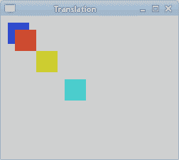
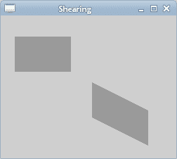
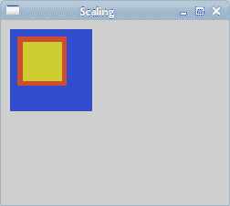
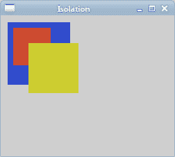
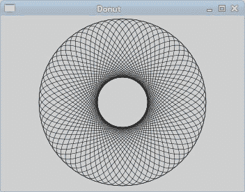

# PyCairo 中的转换

> 原文： [https://zetcode.com/gfx/pycairo/transformations/](https://zetcode.com/gfx/pycairo/transformations/)

在 PyCairo 图形编程教程的这一部分中，我们将讨论转换。

仿射变换由零个或多个线性变换（旋转，缩放或剪切）和平移（移位）组成。 几个线性变换可以组合成一个矩阵。 旋转是使刚体绕固定点移动的变换。 缩放比例是一种放大或缩小对象的变换。 比例因子在所有方向上都是相同的。 转换是一种转换，可以使每个点在指定方向上移动恒定的距离。 剪切是一种将对象垂直于给定轴移动的变换，该值在轴的一侧比另一侧更大。

资料来源：（wikipedia.org，freedictionary.com）

## 翻译

以下示例描述了一个简单的翻译。

```
def on_draw(self, wid, cr):

    cr.set_source_rgb(0.2, 0.3, 0.8)
    cr.rectangle(10, 10, 30, 30)
    cr.fill()

    cr.translate(20, 20)
    cr.set_source_rgb(0.8, 0.3, 0.2)
    cr.rectangle(0, 0, 30, 30)
    cr.fill()

    cr.translate(30, 30)
    cr.set_source_rgb(0.8, 0.8, 0.2)
    cr.rectangle(0, 0, 30, 30)
    cr.fill()    

    cr.translate(40, 40)
    cr.set_source_rgb(0.3, 0.8, 0.8)
    cr.rectangle(0, 0, 30, 30)
    cr.fill()                

```

该示例绘制一个矩形。 然后，我们进行平移并再次绘制相同的矩形几次。

```
cr.translate(20, 20)

```

`translate()`函数通过转换用户空间原点来修改当前转换矩阵。 在我们的例子中，我们在两个方向上将原点移动了 20 个单位。



Figure: Translation operation

## 剪力

在以下示例中，我们执行剪切操作。 剪切是沿特定轴的对象变形。 此操作没有剪切方法。 我们需要创建自己的转换矩阵。 注意，可以通过创建变换矩阵来执行每个仿射变换。

```
def on_draw(self, wid, cr):

    cr.set_source_rgb(0.6, 0.6, 0.6)
    cr.rectangle(20, 30, 80, 50)
    cr.fill()

    mtx = cairo.Matrix(1.0, 0.5,
                0.0, 1.0,
                0.0, 0.0)

    cr.transform(mtx)
    cr.rectangle(130, 30, 80, 50)
    cr.fill()             

```

在此代码示例中，我们执行一个简单的剪切操作。

```
mtx = cairo.Matrix(1.0, 0.5,
            0.0, 1.0,
            0.0, 0.0)

```

此变换将 y 值剪切为 x 值的 0.5。

```
cr.transform(mtx)

```

我们使用`transform()`方法执行转换。



Figure: Shearing operation

## 缩放比例

下一个示例演示了缩放操作。 缩放是一种变换操作，其中对象被放大或缩小。

```
def on_draw(self, wid, cr):

    cr.set_source_rgb(0.2, 0.3, 0.8)
    cr.rectangle(10, 10, 90, 90)
    cr.fill()

    cr.scale(0.6, 0.6)
    cr.set_source_rgb(0.8, 0.3, 0.2)
    cr.rectangle(30, 30, 90, 90)
    cr.fill()

    cr.scale(0.8, 0.8)
    cr.set_source_rgb(0.8, 0.8, 0.2)
    cr.rectangle(50, 50, 90, 90)
    cr.fill()  

```

我们绘制三个 90x90px 的矩形。 在其中两个上，我们执行缩放操作。

```
cr.scale(0.6, 0.6)
cr.set_source_rgb(0.8, 0.3, 0.2)
cr.rectangle(30, 30, 90, 90)
cr.fill()

```

我们将矩形均匀缩放 0.6 倍。

```
cr.scale(0.8, 0.8)
cr.set_source_rgb(0.8, 0.8, 0.2)
cr.rectangle(50, 50, 90, 90)
cr.fill()    

```

在这里，我们以 0.8 的系数执行另一个缩放操作。 如果看图片，我们可以看到第三个黄色矩形是最小的一个。 即使我们使用了较小的比例因子。 这是因为转换操作是累加的。 实际上，第三个矩形的缩放比例为 0.528（0.6x0.8）。



Figure: Scaling operation

## 隔离转换

转换操作是累加的。 为了将一个操作与另一个操作隔离开，我们可以使用`save()`和`restore()`方法。 `save()`方法复制图形上下文的当前状态，并将其保存在保存状态的内部堆栈中。 `restore()`方法将把上下文重新建立为保存状态。

```
def on_draw(self, wid, cr):

    cr.set_source_rgb(0.2, 0.3, 0.8)
    cr.rectangle(10, 10, 90, 90)
    cr.fill()

    cr.save()
    cr.scale(0.6, 0.6)
    cr.set_source_rgb(0.8, 0.3, 0.2)
    cr.rectangle(30, 30, 90, 90)
    cr.fill()
    cr.restore()

    cr.save()
    cr.scale(0.8, 0.8)
    cr.set_source_rgb(0.8, 0.8, 0.2)
    cr.rectangle(50, 50, 90, 90)
    cr.fill()    
    cr.restore()

```

在示例中，我们缩放了两个矩形。 这次我们将缩放操作相互隔离。

```
cr.save()
cr.scale(0.6, 0.6)
cr.set_source_rgb(0.8, 0.3, 0.2)
cr.rectangle(30, 30, 90, 90)
cr.fill()
cr.restore() 

```

我们通过将`scale()`方法放在`save()`和`restore()`方法之间来隔离缩放操作。



Figure: Isolating transformations

现在，第三个黄色矩形大于第二个红色矩形。

## 甜甜圈

在下面的示例中，我们通过旋转一堆椭圆来创建复杂的形状。

```
#!/usr/bin/python

'''
ZetCode PyCairo tutorial 

This program creates a 'donut' shape
in PyCairo.

author: Jan Bodnar
website: zetcode.com 
last edited: August 2012
'''

from gi.repository import Gtk
import cairo
import math

class Example(Gtk.Window):

    def __init__(self):
        super(Example, self).__init__()

        self.init_ui()

    def init_ui(self):    

        darea = Gtk.DrawingArea()
        darea.connect("draw", self.on_draw)
        self.add(darea)

        self.set_title("Donut")
        self.resize(350, 250)
        self.set_position(Gtk.WindowPosition.CENTER)
        self.connect("delete-event", Gtk.main_quit)
        self.show_all()

    def on_draw(self, wid, cr):

        cr.set_line_width(0.5)

        w, h = self.get_size()

        cr.translate(w/2, h/2)
        cr.arc(0, 0, 120, 0, 2*math.pi)
        cr.stroke()

        for i in range(36):
            cr.save()
            cr.rotate(i*math.pi/36)
            cr.scale(0.3, 1)
            cr.arc(0, 0, 120, 0, 2*math.pi)
            cr.restore()
            cr.stroke()

def main():

    app = Example()
    Gtk.main()

if __name__ == "__main__":    
    main()

```

我们将进行旋转和缩放操作。 我们还将保存和还原 PyCairo 上下文。

```
cr.translate(w/2, h/2)
cr.arc(0, 0, 120, 0, 2*math.pi)
cr.stroke()

```

在 GTK 窗口的中间，我们创建了一个圆。 这将是我们椭圆的边界圆。

```
for i in range(36):
    cr.save()
    cr.rotate(i*math.pi/36)
    cr.scale(0.3, 1)
    cr.arc(0, 0, 120, 0, 2*math.pi)
    cr.restore()
    cr.stroke()

```

我们沿着边界圆的路径创建了 36 个椭圆。 我们使用`save()`和`restore()`方法将每个旋转和缩放操作相互隔离。



Figure: Donut

## 星

下一个示例显示了一个旋转和缩放的恒星。

```
#!/usr/bin/python

'''
ZetCode PyCairo tutorial 

This is a star example which 
demonstrates scaling, translating and
rotating operations in PyCairo.

author: Jan Bodnar
website: zetcode.com 
last edited: August 2012
'''

from gi.repository import Gtk, GLib
import cairo

class cv(object):

    points = ( 
        ( 0, 85 ), 
        ( 75, 75 ), 
        ( 100, 10 ), 
        ( 125, 75 ), 
        ( 200, 85 ),
        ( 150, 125 ), 
        ( 160, 190 ),
        ( 100, 150 ), 
        ( 40, 190 ),
        ( 50, 125 ),
        ( 0, 85 )
    )

    SPEED = 20
    TIMER_ID = 1

class Example(Gtk.Window):

    def __init__(self):
        super(Example, self).__init__()

        self.init_ui()
        self.init_vars()

    def init_ui(self):    

        self.darea = Gtk.DrawingArea()
        self.darea.connect("draw", self.on_draw)
        self.add(self.darea)

        self.set_title("Star")
        self.resize(400, 300)
        self.set_position(Gtk.WindowPosition.CENTER)
        self.connect("delete-event", Gtk.main_quit)
        self.show_all()

    def init_vars(self):   

        self.angle = 0
        self.scale = 1
        self.delta = 0.01    

        GLib.timeout_add(cv.SPEED, self.on_timer)   

    def on_timer(self):

        if self.scale < 0.01:
            self.delta = -self.delta

        elif self.scale > 0.99:
            self.delta = -self.delta

        self.scale += self.delta
        self.angle += 0.01    

        self.darea.queue_draw()

        return True 

    def on_draw(self, wid, cr):

        w, h = self.get_size()

        cr.set_source_rgb(0, 0.44, 0.7)
        cr.set_line_width(1)

        cr.translate(w/2, h/2)
        cr.rotate(self.angle)
        cr.scale(self.scale, self.scale)

        for i in range(10):
            cr.line_to(cv.points[i][0], cv.points[i][1])

        cr.fill()

def main():

    app = Example()
    Gtk.main()

if __name__ == "__main__":    
    main()

```

在此示例中，我们创建一个星形对象。 我们将对其进行平移，旋转和缩放。

```
points = ( 
    ( 0, 85 ), 
    ( 75, 75 ), 
    ( 100, 10 ), 
    ( 125, 75 ), 
    ( 200, 85 ),
...

```

从这些点将构造星形对象。

```
def init_vars(self):   

    self.angle = 0
    self.scale = 1
    self.delta = 0.01  
...

```

在`init_vars()`方法中，我们初始化了三个变量。 `self.angle`用于旋转，`self.scale`用于缩放星形对象。 `self.delta`变量控制恒星何时生长和何时收缩。

```
glib.timeout_add(cv.SPEED, self.on_timer) 

```

`on_timer()`方法的每个`cv.SPEED` ms 被调用。

```
if self.scale < 0.01:
    self.delta = -self.delta

elif self.scale > 0.99:
    self.delta = -self.delta

```

这些线控制恒星是要增长还是要缩小。

```
cr.translate(w/2, h/2)
cr.rotate(self.angle)
cr.scale(self.scale, self.scale)

```

我们将星星移到窗口中间。 旋转并缩放比例。

```
for i in range(10):
    cr.line_to(cv.points[i][0], cv.points[i][1])

cr.fill()

```

在这里，我们绘制星形对象。

在 PyCairo 教程的这一部分中，我们讨论了转换。