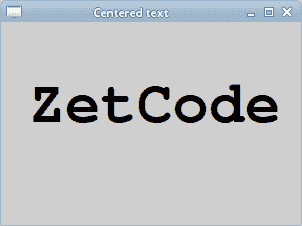
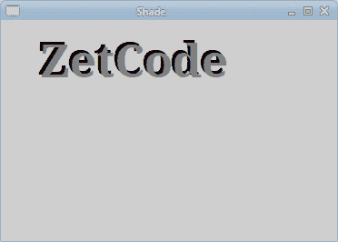
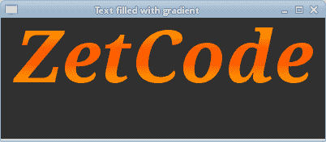
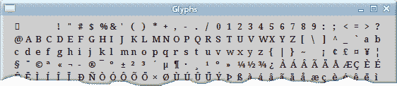

# PyCairo 中的文字

> 原文： [https://zetcode.com/gfx/pycairo/text/](https://zetcode.com/gfx/pycairo/text/)

在 PyCairo 教程的这一部分中，我们将处理文本。

## 灵魂伴侣

在第一个示例中，我们将在窗口上显示一些歌词。

```py
def on_draw(self, wid, cr):

    cr.set_source_rgb(0.1, 0.1, 0.1)

    cr.select_font_face("Purisa", cairo.FONT_SLANT_NORMAL, 
        cairo.FONT_WEIGHT_NORMAL)
    cr.set_font_size(13)

    cr.move_to(20, 30)
    cr.show_text("Most relationships seem so transitory")
    cr.move_to(20, 60)
    cr.show_text("They're all good but not the permanent one")
    cr.move_to(20, 120)
    cr.show_text("Who doesn't long for someone to hold")
    cr.move_to(20, 150)
    cr.show_text("Who knows how to love without being told")
    cr.move_to(20, 180)
    cr.show_text("Somebody tell me why I'm on my own")
    cr.move_to(20, 210)
    cr.show_text("If there's a soulmate for everyone")

```

在此代码中，我们显示了 Natasha Bedingfields Soulmate 歌曲的部分歌词。

```py
cr.select_font_face("Purisa", cairo.FONT_SLANT_NORMAL, 
    cairo.FONT_WEIGHT_NORMAL)

```

在这里，我们选择字体。 该方法采用三个参数：字体系列，字体倾斜度和字体粗细。

```py
cr.set_font_size(13)

```

在这里，我们指定字体大小。

```py
cr.move_to(20, 30)
cr.show_text("Most relationships seem so transitory")

```

我们通过指定文本的位置并调用`show_text()`方法在窗口上显示文本。


图：灵魂伴侣

## 居中文字

接下来，我们将展示如何在窗口上居中放置文本。

```py
def on_draw(self, wid, cr):

    w, h = self.get_size()

    cr.select_font_face("Courier", cairo.FONT_SLANT_NORMAL, 
        cairo.FONT_WEIGHT_BOLD)
    cr.set_font_size(60)

    (x, y, width, height, dx, dy) = cr.text_extents("ZetCode")

    cr.move_to(w/2 - width/2, h/2)    
    cr.show_text("ZetCode")

```

该代码将使文本在窗口上居中。 即使我们调整窗口大小，它仍然居中。

```py
w, h = self.get_size() 

```

为了使文本在窗口上居中，有必要获取窗口工作区的大小。

```py
cr.select_font_face("Courier", cairo.FONT_SLANT_NORMAL, 
    cairo.FONT_WEIGHT_BOLD)
cr.set_font_size(60)

```

我们选择要显示的字体及其大小。

```py
(x, y, width, height, dx, dy) = cr.text_extents("ZetCode") 

```

我们得到了文本范围。 这些是描述文字的数字。 我们的示例需要文本的宽度。

```py
cr.move_to(w/2 - width/2, h/2)    
cr.show_text("ZetCode")

```

我们将文本放置在窗口的中间，并使用`show_text()`方法显示它。



图：居中文本

## 带阴影的文字

现在，我们将在窗口上创建一个阴影文本。

```py
def on_draw(self, wid, cr):

    cr.select_font_face("Serif", cairo.FONT_SLANT_NORMAL, 
        cairo.FONT_WEIGHT_BOLD)
    cr.set_font_size(50)

    cr.set_source_rgb(0, 0, 0)
    cr.move_to(40, 60)
    cr.show_text("ZetCode")

    cr.set_source_rgb(0.5, 0.5, 0.5)
    cr.move_to(43, 63)
    cr.show_text("ZetCode")

```

要创建阴影，我们将文本绘制两次。 以不同的颜色。 第二个文本向右和向下移动一点。

```py
cr.set_source_rgb(0, 0, 0)
cr.move_to(40, 60)
cr.show_text("ZetCode")

```

第一个文本用黑色墨水绘制。 它充当阴影。

```py
cr.set_source_rgb(0.5, 0.5, 0.5)
cr.move_to(43, 63)
cr.show_text("ZetCode")

```

第二个文本用灰色墨水绘制。 它向右和向下移动了 3px。



图：阴影文本

## 渐变填充文本

以下示例将产生很好的效果。 我们将使用一些线性渐变填充文本。

```py
def on_draw(self, wid, cr):

    cr.set_source_rgb(0.2, 0.2, 0.2)
    cr.paint()

    h = 90

    cr.select_font_face("Serif", cairo.FONT_SLANT_ITALIC, 
        cairo.FONT_WEIGHT_BOLD)
    cr.set_font_size(h)

    lg = cairo.LinearGradient(0, 15, 0, h*0.8)
    lg.set_extend(cairo.EXTEND_REPEAT)
    lg.add_color_stop_rgb(0.0, 1, 0.6, 0)
    lg.add_color_stop_rgb(0.5, 1, 0.3, 0) 

    cr.move_to(15, 80)
    cr.text_path("ZetCode")
    cr.set_source(lg)
    cr.fill()

```

我们在充满线性渐变的窗口上绘制文本。 颜色是一些橙色。

```py
cr.set_source_rgb(0.2, 0.2, 0.2)
cr.paint() 

```

为了使其更具视觉吸引力，我们将背景涂成深灰色。

```py
lg = cairo.LinearGradient(0, 15, 0, h*0.8)
lg.set_extend(cairo.EXTEND_REPEAT)
lg.add_color_stop_rgb(0.0, 1, 0.6, 0)
lg.add_color_stop_rgb(0.5, 1, 0.3, 0) 

```

将创建线性渐变。

```py
cr.move_to(15, 80)
cr.text_path("ZetCode")
cr.set_source(lg)
cr.fill() 

```

文本显示在窗口上。 我们使用渐变作为绘画源。



图：用渐变填充的文本

## 逐个字母

为此，我们将逐个字母显示一个文本。 这些字母将被绘制得有些延迟。

```py
#!/usr/bin/python

'''
ZetCode PyCairo tutorial 

This program shows text letter by
letter. 

author: Jan Bodnar
website: zetcode.com 
last edited: August 2012
'''

from gi.repository import Gtk, GLib
import cairo

class cv(object):

    SPEED = 800
    TEXT_SIZE = 35
    COUNT_MAX = 8

class Example(Gtk.Window):

    def __init__(self):
        super(Example, self).__init__()

        self.init_ui()
        self.init_vars()

    def init_ui(self):    

        self.darea = Gtk.DrawingArea()
        self.darea.connect("draw", self.on_draw)
        self.add(self.darea)

        GLib.timeout_add(cv.SPEED, self.on_timer)

        self.set_title("Letter by letter")
        self.resize(350, 200)
        self.set_position(Gtk.WindowPosition.CENTER)
        self.connect("delete-event", Gtk.main_quit)
        self.show_all()

    def init_vars(self):

        self.timer = True
        self.count = 0
        self.text = [ "Z", "e", "t", "C", "o", "d", "e" ]

    def on_timer(self):

        if not self.timer: return False

        self.darea.queue_draw()
        return True        

    def on_draw(self, wid, cr):

        cr.select_font_face("Courier", cairo.FONT_SLANT_NORMAL,
            cairo.FONT_WEIGHT_BOLD)

        cr.set_font_size(cv.TEXT_SIZE)

        dis = 0

        for i in range(self.count):

            (x, y, width, height, dx, dy) = cr.text_extents(self.text[i])

            dis += width + 2
            cr.move_to(dis + 30, 50)
            cr.show_text(self.text[i])  

        self.count += 1

        if self.count == cv.COUNT_MAX:
            self.timer = False
            self.count = 0

def main():

    app = Example()
    Gtk.main()

if __name__ == "__main__":    
    main()

```

在我们的示例中，我们将在 GTK 窗口上逐个字母地绘制“`ZetCode`”字符串，并稍作延迟。

```py
self.text = [ "Z", "e", "t", "C", "o", "d", "e" ]

```

这是要在窗口上显示的字母列表。

```py
cr.select_font_face("Courier", cairo.FONT_SLANT_NORMAL,
    cairo.FONT_WEIGHT_BOLD)

```

我们选择粗体的 Courier 字体。

```py
for i in range(self.count):

    (x, y, width, height, dx, dy) = cr.text_extents(self.text[i])

    dis += width + 2
    cr.move_to(dis + 30, 50)
    cr.show_text(self.text[i])  

```

在这里，我们逐个字母地绘制文本。 我们获得每个字母的宽度并计算 x 轴上的距离。

## 字形

`show_text()`方法仅适用于简单的文本呈现。 Cairo 开发者将其称为玩具方法。 使用字形可以完成更专业的文本渲染。 标志符号是图形符号，可提供字符形式。 字符提供含义。 它可以有多个字形。 角色没有内在的外观。 字形没有内在的含义。

请注意，Pango 库解决了许多常见的编程要求，包括文本。

```py
def on_draw(self, wid, cr):

    cr.select_font_face("Serif", cairo.FONT_SLANT_NORMAL,
        cairo.FONT_WEIGHT_NORMAL)

    cr.set_font_size(13)

    glyphs = []
    index = 0

    for y in range(20):
        for x in range(35):
            glyphs.append((index, x*15 + 20, y*18 + 20))
            index += 1

    cr.show_glyphs(glyphs) 

```

该代码显示了所选字体的 700 个字形。

```py
glyphs = [] 

```

字形列表将存储三个整数值。 第一个值是字形到所选字体类型的索引。 第二和第三值是字形的 x，y 位置。

```py
cr.show_glyphs(glyphs) 

```

`show_glyphs()`方法在窗口上显示字形。



图：字形

本章介绍了 PyCairo 中的文本。