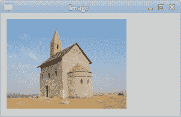
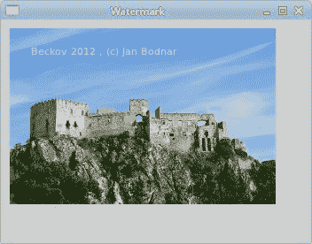

# PyCairo 中的图像

> 原文： [https://zetcode.com/gfx/pycaiimg/](https://zetcode.com/gfx/pycaiimg/)

在 PyCairo 教程的这一部分中，我们将讨论图像。 我们将展示如何在 GTK 窗口上显示 PNG 和 JPEG 图像。 我们还将在图像上绘制一些文本。

## 显示 PNG 图像

在第一个示例中，我们将显示一个 PNG 图像。

```py
#!/usr/bin/python

'''
ZetCode PyCairo tutorial 

This program shows how to draw 
an image on a GTK window in PyCairo.

author: Jan Bodnar
website: zetcode.com 
last edited: August 2012
'''

from gi.repository import Gtk
import cairo

class Example(Gtk.Window):

    def __init__(self):
        super(Example, self).__init__()

        self.init_ui()
        self.load_image()

    def init_ui(self):    

        darea = Gtk.DrawingArea()
        darea.connect("draw", self.on_draw)
        self.add(darea)

        self.set_title("Image")
        self.resize(300, 170)
        self.set_position(Gtk.WindowPosition.CENTER)
        self.connect("delete-event", Gtk.main_quit)
        self.show_all()

    def load_image(self):

        self.ims = cairo.ImageSurface.create_from_png("stmichaelschurch.png")

    def on_draw(self, wid, cr):

        cr.set_source_surface(self.ims, 10, 10)
        cr.paint()

def main():

    app = Example()
    Gtk.main()

if __name__ == "__main__":    
    main()

```

该示例显示图像。

```py
self.ims = cairo.ImageSurface.create_from_png("stmichaelschurch.png")

```

我们从 PNG 图像创建图像表面。

```py
cr.set_source_surface(self.ims, 10, 10)

```

我们为先前创建的图像表面设置了绘画源。

```py
cr.paint()

```

我们在窗口上绘制源。



图：显示图像

## 显示 JPEG 图像

PyCairo 仅对 PNG 图像提供内置支持。 可以通过`GdkPixbuf.Pixbuf`对象显示其他图像。 它是用于处理图像的 GTK 对象。

```py
#!/usr/bin/python

'''
ZetCode PyCairo tutorial 

This program shows how to draw 
an image on a GTK window in PyCairo.

author: Jan Bodnar
website: zetcode.com 
last edited: August 2012
'''

from gi.repository import Gtk, Gdk, GdkPixbuf
import cairo

class Example(Gtk.Window):

    def __init__(self):
        super(Example, self).__init__()

        self.init_ui()
        self.load_image()

    def init_ui(self):    

        darea = Gtk.DrawingArea()
        darea.connect("draw", self.on_draw)
        self.add(darea)

        self.set_title("Image")
        self.resize(300, 170)
        self.set_position(Gtk.WindowPosition.CENTER)
        self.connect("delete-event", Gtk.main_quit)
        self.show_all()

    def load_image(self):

        self.pb = GdkPixbuf.Pixbuf.new_from_file("stmichaelschurch.jpg")

    def on_draw(self, wid, cr):

        Gdk.cairo_set_source_pixbuf(cr, self.pb, 5, 5)
        cr.paint()

def main():

    app = Example()
    Gtk.main()

if __name__ == "__main__":    
    main()

```

在此示例中，我们在窗口上显示 JPEG 图像。

```py
from gi.repository import Gtk, Gdk, GdkPixbuf 

```

除了`Gtk`，我们还将需要`Gdk`和`GdkPixbuf`模块。

```py
self.pb = GdkPixbuf.Pixbuf.new_from_file("stmichaelschurch.jpg") 

```

我们从 JPEG 文件创建一个`GdkPixbuf.Pixbuf`。

```py
Gdk.cairo_set_source_pixbuf(cr, self.pb, 5, 5)
cr.paint() 

```

`Gdk.cairo_set_source_pixbuf()`方法将`pixbuf`设置为绘画源。

## 水印

在图像上绘制信息是很常见的。 写在图像上的文本称为水印。 水印用于识别图像。 它们可能是版权声明或图像创建时间。

```py
#!/usr/bin/python

'''
ZetCode PyCairo tutorial 

This program draws a watermark
on an image.

author: Jan Bodnar
website: zetcode.com 
last edited: August 2012
'''

from gi.repository import Gtk
import cairo

class Example(Gtk.Window):

    def __init__(self):
        super(Example, self).__init__()

        self.init_ui()
        self.load_image()
        self.draw_mark()

    def init_ui(self):    

        darea = Gtk.DrawingArea()
        darea.connect("draw", self.on_draw)
        self.add(darea)

        self.set_title("Watermark")
        self.resize(350, 250)
        self.set_position(Gtk.WindowPosition.CENTER)
        self.connect("delete-event", Gtk.main_quit)
        self.show_all()

    def load_image(self):

        self.ims = cairo.ImageSurface.create_from_png("beckov.png")

    def draw_mark(self):

        cr = cairo.Context(self.ims)
        cr.set_font_size(11)
        cr.set_source_rgb(0.9 , 0.9 , 0.9)
        cr.move_to(20 , 30)
        cr.show_text(" Beckov 2012 , (c) Jan Bodnar ")
        cr.stroke()          

    def on_draw(self, wid, cr):

        cr.set_source_surface(self.ims, 10, 10)
        cr.paint()

def main():

    app = Example()
    Gtk.main()

if __name__ == "__main__":    
    main()

```

我们在图像上绘制版权信息。

```py
def load_image(self):

    self.ims = cairo.ImageSurface.create_from_png("beckov.png")

```

在`load_image()`方法中，我们从 PNG 图像创建图像表面。

```py
def draw_mark(self):

    cr = cairo.Context(self.ims)
...

```

在`draw_mark()`方法中，我们在图像上绘制版权信息。 首先，我们从图像表面创建一个绘图上下文。

```py
cr.set_font_size(11)
cr.set_source_rgb(0.9 , 0.9 , 0.9)
cr.move_to(20 , 30)
cr.show_text(" Beckov 2012 , (c) Jan Bodnar ")
cr.stroke()   

```

然后，我们用白色绘制一个小的文本。

```py
def on_draw(self, wid, cr):

    cr.set_source_surface(self.ims, 10, 10)
    cr.paint()

```

最后，在窗口上绘制图像表面。



图：水印

本章介绍了 PyCairo 中的图像。