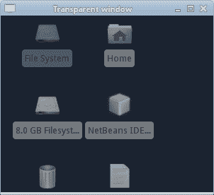

# 根窗口

> 原文： [https://zetcode.com/gfx/pycairo/root/](https://zetcode.com/gfx/pycairo/root/)

在 PyCairo 教程的这一部分中，我们将使用根窗口。 根窗口是我们通常具有图标快捷方式的桌面窗口。

可以使用根窗口进行操作。 从程序员的角度来看，它只是一种特殊的窗口。

## 透明窗口

我们的第一个示例将创建一个透明窗口。 我们将看到窗口对象下方的内容。

```
#!/usr/bin/python

'''
ZetCode PyCairo tutorial 

This code example shows how to
create a transparent window.

author: Jan Bodnar
website: zetcode.com 
last edited: August 2012
'''

from gi.repository import Gtk
import cairo

class Example(Gtk.Window):

    def __init__(self):
        super(Example, self).__init__()

        self.tran_setup()
        self.init_ui()

    def init_ui(self):    

        self.connect("draw", self.on_draw)        

        self.set_title("Transparent window")
        self.resize(300, 250)
        self.set_position(Gtk.WindowPosition.CENTER)
        self.connect("delete-event", Gtk.main_quit)
        self.show_all()

    def tran_setup(self):    

        self.set_app_paintable(True)  
        screen = self.get_screen()

        visual = screen.get_rgba_visual()       
        if visual != None and screen.is_composited():
            self.set_visual(visual)              

    def on_draw(self, wid, cr):

        cr.set_source_rgba(0.2, 0.2, 0.2, 0.4)
        cr.set_operator(cairo.OPERATOR_SOURCE)
        cr.paint()

def main():

    app = Example()
    Gtk.main()

if __name__ == "__main__":    
    main()

```

为了创建透明窗口，我们获得了屏幕对象的视觉效果并将其设置为我们的窗口。 在`on_draw()`方法中，我们绘制屏幕的可视对象。 这造成了部分透明的幻觉。

```
self.set_app_paintable(True)  

```

我们必须设置要绘制的应用。

```
screen = self.get_screen()

```

`get_screen()`方法返回屏幕对象。

```
visual = screen.get_rgba_visual()

```

从屏幕窗口中，我们可以看到它。 视觉内容包含低级显示信息。

```
if visual != None and screen.is_composited():
    self.set_visual(visual) 

```

并非所有的显示器都支持此操作。 因此，我们检查屏幕是否支持合成并且返回的视觉效果不是“无”。 我们将屏幕的视觉效果设置为窗口的视觉效果。

```
def on_draw(self, wid, cr):

    cr.set_source_rgba(0.2, 0.2, 0.2, 0.4)
    cr.set_operator(cairo.OPERATOR_SOURCE)
    cr.paint()

```

我们使用部分透明的源来绘制屏幕窗口。 `cairo.OPERATOR_SOURCE`在我们绘制源代码的地方创建了合成操作。 这是屏幕窗口。 为了获得完全透明，我们将 alpha 值设置为 0 或使用`cairo.OPERATOR_CLEAR`运算符。



Figure: Transparent window

## 截屏

根窗口对于截图也是必不可少的。

```
#!/usr/bin/python

'''
ZetCode PyCairo tutorial 

This code example takes a screenshot.

author: Jan Bodnar
website: zetcode.com 
last edited: August 2012
'''

from gi.repository import Gdk
import cairo

def main():

    root_win = Gdk.get_default_root_window()

    width = root_win.get_width()
    height = root_win.get_height()    

    ims = cairo.ImageSurface(cairo.FORMAT_ARGB32, width, height)                
    pb = Gdk.pixbuf_get_from_window(root_win, 0, 0, width, height)

    cr = cairo.Context(ims)    
    Gdk.cairo_set_source_pixbuf(cr, pb, 0, 0)     
    cr.paint()

    ims.write_to_png("screenshot.png")

if __name__ == "__main__":    
    main()

```

该示例捕获整个屏幕的快照。

```
root_win = Gdk.get_default_root_window()

```

我们通过`Gdk.get_default_root_window()`方法调用获得了根窗口。

```
width = root_win.get_width()
height = root_win.get_height() 

```

我们确定根窗口的宽度和高度。

```
ims = cairo.ImageSurface(cairo.FORMAT_ARGB32, width, height)

```

空的图像表面被创建。 它具有根窗口的大小。

```
pb = Gdk.pixbuf_get_from_window(root_win, 0, 0, width, height)

```

我们使用`Gdk.pixbuf_get_from_window()`方法调用从根窗口中获得一个 pixbuf。 pixbuf 是描述内存中图像的对象。 GTK 库使用它。

```
cr = cairo.Context(ims)    
Gdk.cairo_set_source_pixbuf(cr, pb, 0, 0)     
cr.paint()

```

在上述代码行中，我们在之前创建的图像表面上创建了 Cairo 绘图上下文。 我们将 pixbuf 放在绘图上下文上并将其绘制在表面上。

```
ims.write_to_png("screenshot.png")

```

使用`write_to_png()`方法将图像表面写入 PNG 图像。

## 显示信息

在第三个示例中，我们将在桌面窗口上显示一条消息。

```
#!/usr/bin/python

'''
ZetCode PyCairo tutorial 

This code example shows a message on the desktop
window.

author: Jan Bodnar
website: zetcode.com 
last edited: August 2012
'''

from gi.repository import Gtk, Gdk, Pango
import cairo

class Example(Gtk.Window):

    def __init__(self):
        super(Example, self).__init__()

        self.setup()       
        self.init_ui()

    def setup(self):    

        self.set_app_paintable(True)   
        self.set_type_hint(Gdk.WindowTypeHint.DOCK)
        self.set_keep_below(True)

        screen = self.get_screen()
        visual = screen.get_rgba_visual()       
        if visual != None and screen.is_composited():
            self.set_visual(visual)          

    def init_ui(self):    

        self.connect("draw", self.on_draw)        

        lbl = Gtk.Label()
        text = "ZetCode, tutorials for programmers."
        lbl.set_text(text)        

        fd = Pango.FontDescription("Serif 20")
        lbl.modify_font(fd)                
        lbl.modify_fg(Gtk.StateFlags.NORMAL,Gdk.color_parse("white"))        

        self.add(lbl)

        self.resize(300, 250)
        self.set_position(Gtk.WindowPosition.CENTER)
        self.connect("delete-event", Gtk.main_quit)
        self.show_all()

    def on_draw(self, wid, cr):

        cr.set_operator(cairo.OPERATOR_CLEAR)
        cr.paint()
        cr.set_operator(cairo.OPERATOR_OVER)

def main():

        app = Example()
        Gtk.main()        

if __name__ == "__main__":    
    import signal
    signal.signal(signal.SIGINT, signal.SIG_DFL)
    main()

```

该代码在根窗口上显示消息标签。

```
self.set_app_paintable(True) 

```

我们将操纵应用窗口，因此我们使其可绘制。

```
self.set_type_hint(Gdk.WindowTypeHint.DOCK)

```

实施此窗口提示会删除窗口边框和装饰。

```
self.set_keep_below(True) 

```

我们始终将应用始终放在根窗口的底部。

```
screen = self.get_screen()
visual = screen.get_rgba_visual()       
if visual != None and screen.is_composited():
    self.set_visual(visual)  

```

我们将屏幕的外观设置为应用的外观。

```
lbl = Gtk.Label()
text = "ZetCode, tutorials for programmers."
lbl.set_text(text)    

```

我们在应用窗口上放置一个消息标签。

```
fd = Pango.FontDescription("Serif 20")
lbl.modify_font(fd)                
lbl.modify_fg(Gtk.StateFlags.NORMAL,Gdk.color_parse("white"))   

```

在 Pango 模块的帮助下，我们更改了文本的外观。

```
def on_draw(self, wid, cr):

    cr.set_operator(cairo.OPERATOR_CLEAR)
    cr.paint()
    cr.set_operator(cairo.OPERATOR_OVER)

```

我们使用`cairo.OPERATOR_CLEAR`运算符清除窗口背景。 然后我们设置`cairo.OPERATOR_CLEAR`以绘制标签窗口小部件。

```
if __name__ == "__main__":    
    import signal
    signal.signal(signal.SIGINT, signal.SIG_DFL)
    main()

```

有一个较旧的[错误](https://bugzilla.gnome.org/show_bug.cgi?id=622084)，该错误不允许我们使用 `Ctrl + C` 快捷方式终止从终端启动的应用。 为此添加两行是一种解决方法。


Figure: Message on the root window

在本章中，我们使用了 PyCairo 中的桌面窗口。