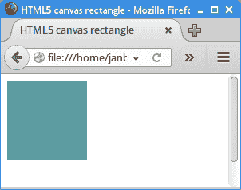
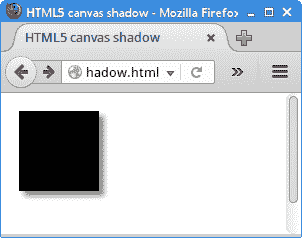

# 介绍

> 原文： [https://zetcode.com/gfx/html5canvas/introduction/](https://zetcode.com/gfx/html5canvas/introduction/)

HTML5 画布教程的这一部分是对 JavaScript 语言的 HTML5 画布编程的介绍。

## 关于

这是 HTML5 画布教程。 它是针对初学者的。 本教程将教您 HTML5 canvas 元素的 JavaScript 图形编程基础。 可以在此处下载本教程中使用的图像。

HTML5 画布元素提供了可同时处理矢量和栅格图形的工具。

## HTML5 画布

HTML5 canvas 元素提供了一个与分辨率有关的位图区域，该区域可用于动态绘制图形，游戏图形，艺术作品或其他可视图像。 简单来说，canvas 是 HTML5 中的新元素，它使您可以使用 JavaScript 绘制图形。 Canvas 无需将插件插入 Flash，Silverlight 或 Java，即可将动画带入网页。

HTML5 canvas 最初由 Apple 于 2004 年推出，用于 Mac OS X WebKit，以为仪表板应用程序及其 Safari Web 浏览器提供动力。 从那时起，它已被 Mozilla 和 Opera 所采用。 后来，W3C 在 HTML5 规范中采用了它。 如今，所有现代 Web 浏览器都支持它。

## 画布上下文

canvas 上下文是一个对象，它公开 Canvas API 来执行绘图。 它提供对象，方法和属性，以在画布绘图表面上绘制和操纵图形。 使用`getContext()`方法检索上下文。 方法的参数指定所需的 API：用于二维图形的`"2d"`或用于二维和三维图形的`"webgl"`。 如果不支持给定的上下文 ID，则返回`null`。

## 画一个矩形

我们创建一个简单的 HTML5 canvas 图形渲染示例。

`rectangle.html`

```
<!DOCTYPE html>
<html>
<head>
<title>HTML5 canvas rectangle</title>    
<script>
    function draw() {
        var canvas = document.getElementById('myCanvas');
        var ctx = canvas.getContext('2d');

        ctx.fillStyle = "cadetblue";
        ctx.fillRect(0, 0, 100, 100);
    }    
</script>
</head>

<body onload="draw();">
    <canvas id="myCanvas" width="250" height="150">
    </canvas>
</body>
</html>

```

该代码示例在网页的左上角绘制一个 cadetblue 矩形。

```
<!DOCTYPE html>

```

文档类型声明或 DOCTYPE 是对 Web 浏览器的有关 HTML 文档性质的指令。 这个特定的声明告诉浏览器该网页是 HTML5 文档。 canvas 元素最初是在 HTML5 标准中引入的。

```
<script>
    function draw() {
...
    }    
</script>

```

在自定义`draw()`功能中执行绘制。 加载 HTML 文档的正文时会调用它。

```
var canvas = document.getElementById('myCanvas');

```

通过`getElementById()`方法，我们获得对 canvas 元素的引用。

```
var ctx = canvas.getContext('2d');

```

使用`getContext()`方法检索渲染上下文。

```
ctx.fillStyle = "cadetblue";

```

上下文的`fillStyle`属性指定在内部形状中使用的颜色或样式。 然后在后续的绘图操作中使用该样式。

```
ctx.fillRect(0, 0, 100, 100);

```

我们用指定的颜色绘制一个矩形。 矩形的尺寸在方法的参数中给出。 前两个参数是 x 和 y 坐标。 接下来的两个参数是矩形的宽度和高度。

```
<body onload="draw();">

```

`onload`属性为窗口的加载事件定义事件处理程序。 加载事件在文档加载过程结束时触发。 至此，文档中的所有对象都在 DOM 中，并且所有图像，脚本，链接和子框架均已完成加载。 在我们的例子中，我们调用`draw()`方法，该方法在画布上执行绘制。

```
<canvas id="myCanvas" width="250" height="150">
</canvas>

```

canvas 元素是使用`&lt;canvas&gt;`和`&lt;/canvas&gt;`标签创建的。 `width`和`height`属性设置页面内 canvas 元素的大小。 `id`属性标识 DOM 层次结构中的元素。



Figure: HTML5 canvas rectangle

## 阴影

HTML5 画布包含用于创建阴影的属性。

`shadow.html`

```
<!DOCTYPE html>
<html>
<head>
<title>HTML5 canvas shadow</title>    
<script>
    function draw() {
        var canvas = document.getElementById('myCanvas');
        var ctx = canvas.getContext('2d');

        ctx.shadowOffsetX = 5;
        ctx.shadowOffsetY = 5;
        ctx.shadowBlur    = 4;
        ctx.shadowColor   = "#888";  

        ctx.fillStyle = "#000000";
        ctx.fillRect(10, 10, 80, 80);
    }    
</script>
</head>

<body onload="draw();">
    <canvas id="myCanvas" width="250" height="150">
    </canvas>
</body>
</html>

```

在示例中，我们在矩形下方创建阴影。

```
ctx.shadowOffsetX = 5;

```

`shadowOffsetX`属性指定阴影在水平方向上偏移的距离。

```
ctx.shadowOffsetY = 5;

```

`shadowOffsetY`属性指定阴影在垂直方向上将偏移的距离。

```
ctx.shadowBlur    = 4;

```

`shadowBlur`属性指定模糊效果的级别。

```
ctx.shadowColor   = "#888";  

```

`shadowColor`属性指定阴影的颜色。



Figure: HTML5 canvas shadow

## 参考

以下资源用于创建本教程：

*   [Wikipedia 上的 Canvas 元素](https://en.wikipedia.org/wiki/Canvas_element)文章。
*   [developer.mozilla.org/zh-CN/docs/Web/API/Canvas_API](https://developer.mozilla.org/en-US/docs/Web/API/Canvas_API)

HTML5 画布教程的这一部分是对 HTML5 画布的 JavaScript 编程的介绍。