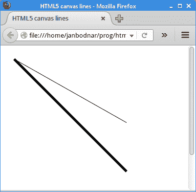
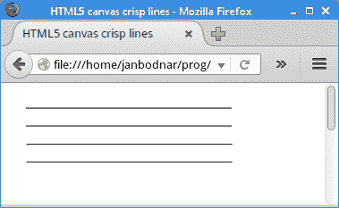
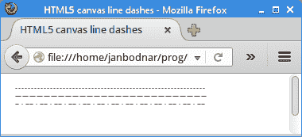
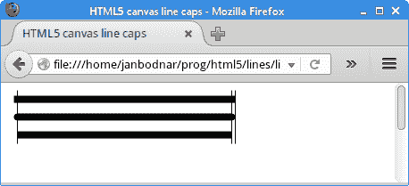
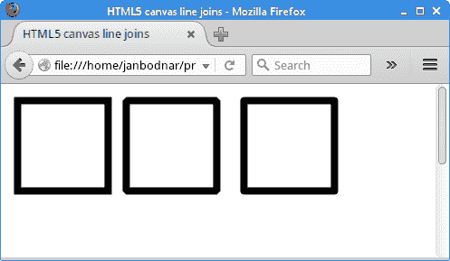
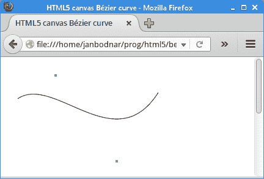

# HTML5 画布中的直线

> 原文： [https://zetcode.com/gfx/html5canvas/lines/](https://zetcode.com/gfx/html5canvas/lines/)

线是简单的图形基元。 线是连接两个点的对象。

在 HTML5 画布中，使用`path`对象创建一行。 路径是由线段连接的点的列表，这些线段可以具有不同的形状（弯曲或不弯曲），不同的宽度和不同的颜色。 在路径对象内，使用`lineTo()`方法创建一条线。

## 直线

下面的示例绘制两条线。

`lines.html`

```
<!DOCTYPE html>
<html>
<head>
<title>HTML5 canvas lines</title>
<script>
    function draw() {
        var canvas = document.getElementById('myCanvas');
        var ctx = canvas.getContext('2d');

        ctx.beginPath();
        ctx.moveTo(20, 20);
        ctx.lineTo(250, 150);
        ctx.stroke();

        ctx.beginPath();
        ctx.moveTo(20, 20);
        ctx.lineTo(250, 250);
        ctx.lineWidth = 5;
        ctx.stroke();
    }
</script>
</head>

<body onload="draw();">
    <canvas id="myCanvas" width="350" height="350">
    </canvas>
</body>
</html> 

```

画了两条线。 第二行较粗。

```
ctx.beginPath();

```

`beginPath()`方法创建一个新路径。 创建后，随后的绘图命令将直接进入路径并用于构建路径。

```
ctx.moveTo(20, 20);

```

`moveTo()`方法将笔移动到`x`和`y`指定的坐标。

```
ctx.lineTo(250, 150);

```

`lineTo()`方法从当前绘制位置到`x`和`y`指定的位置绘制一条线。

```
ctx.stroke();

```

`stroke()`方法通过描边轮廓绘制线条。

```
ctx.lineWidth = 5;

```

`lineWidth`设置第二行的宽度； 线较粗。



Figure: Lines

## 模糊直线

具有奇数宽度的线似乎模糊。 这是因为这些线是在画布的网格线之间绘制的。 有一个快速的解决方案-将坐标移动半个单位。

`crisp_lines.html`

```
<!DOCTYPE html>
<html>
<head>
<title>HTML5 canvas crisp lines</title>
<script>
    function draw() {
        var canvas = document.getElementById('myCanvas');
        var ctx = canvas.getContext('2d');

        ctx.lineWidth = 1
        ctx.beginPath();
        ctx.moveTo(20, 20);
        ctx.lineTo(250, 20);
        ctx.stroke();

        ctx.beginPath();
        ctx.moveTo(20, 40);
        ctx.lineTo(250, 40);
        ctx.stroke();

        ctx.translate(0.5, 0.5);

        ctx.beginPath();
        ctx.moveTo(20, 60);
        ctx.lineTo(250, 60);
        ctx.stroke();   

        ctx.beginPath();
        ctx.moveTo(20, 80);
        ctx.lineTo(250, 80);
        ctx.stroke();  
    }        
</script>
</head>

<body onload="draw();">
    <canvas id="myCanvas" width="350" height="350">
    </canvas>
</body>
</html> 

```

该示例绘制了四行。 前两个略微模糊，其他两个更平滑。

```
ctx.lineWidth = 1

```

我们有一条宽度奇数的线。

```
ctx.translate(0.5, 0.5);

```

这是消除线条模糊的快速解决方案。 `translate()`方法将坐标系移动半个单位。



Figure: Crisp lines

## 笔划线

可以使用各种笔划线来绘制线。 破折号是通过混合不透明部分和透明部分而创建的图案。 使用画布上下文的`setLineDash()`方法指定破折号。

`line_dashes.html`

```
<!DOCTYPE html>
<html>
<head>
<title>HTML5 canvas line dashes</title>
<script>
    function draw() {
        var canvas = document.getElementById('myCanvas');
        var ctx = canvas.getContext('2d');

        ctx.translate(0.5, 0.5);

        ctx.beginPath();
        ctx.setLineDash([2]);
        ctx.moveTo(10, 10);
        ctx.lineTo(250, 10);
        ctx.stroke();

        ctx.beginPath();
        ctx.setLineDash([7, 2]);
        ctx.moveTo(10, 20);
        ctx.lineTo(250, 20);
        ctx.stroke();        

        ctx.beginPath();
        ctx.setLineDash([4, 4, 1]);
        ctx.moveTo(10, 30);
        ctx.lineTo(250, 30);
        ctx.stroke();
    }            
</script>
</head>

<body onload="draw();">
    <canvas id="myCanvas" width="350" height="250">
    </canvas>
</body>
</html> 

```

该示例绘制了三条具有不同破折号图案的线。

```
ctx.setLineDash([2]);

```

这条线将交替显示 2 个坐标单位的不透明和透明部分。

```
ctx.setLineDash([4, 4, 1]);

```

在这里，破折号由以下模式组成：4 个单位已绘制，4 个未绘制单位，1 个已绘制单位。



Figure: Line dashes

## 端盖

端盖是应用于未封闭子路径和破折线段末端的装饰。 Java 2D 中有三种不同的端盖：`'square'`，`'round'`和`'butt'`。

*   `'butt'`-结束未封闭的子路径和虚线段，不添加任何修饰。
*   `'round'`-用圆形装饰结束未封闭的子路径和虚线段，该圆形装饰的半径等于笔的宽度的一半。
*   `'square'`-以方形投影结束未封闭的子路径和虚线段，该方形投影超出段的末端并延伸到等于线宽一半的距离。

`line_caps.html`

```
<!DOCTYPE html>
<html>
<head>
<title>HTML5 canvas line caps</title>
<script>
    function draw() {
        var canvas = document.getElementById('myCanvas');
        var ctx = canvas.getContext('2d');

        ctx.translate(0.5, 0.5);
        ctx.lineWidth = 8;

        ctx.beginPath();
        ctx.lineCap = 'square';
        ctx.moveTo(10, 10);
        ctx.lineTo(250, 10);
        ctx.stroke();

        ctx.beginPath();
        ctx.lineCap = 'round';
        ctx.moveTo(10, 30);
        ctx.lineTo(250, 30);
        ctx.stroke();        

        ctx.beginPath();
        ctx.lineCap = 'butt';
        ctx.moveTo(10, 50);
        ctx.lineTo(250, 50);
        ctx.stroke();

        ctx.lineWidth = 1;
        ctx.beginPath();
        ctx.moveTo(10, 0);
        ctx.lineTo(10, 60);
        ctx.stroke();

        ctx.beginPath();
        ctx.moveTo(250, 0);
        ctx.lineTo(250, 60);
        ctx.stroke();

        ctx.beginPath();
        ctx.moveTo(254, 0);
        ctx.lineTo(254, 60);
        ctx.stroke();
    }
</script>
</head>

<body onload="draw();">
    <canvas id="myCanvas" width="350" height="250">
    </canvas>
</body>
</html> 

```

在我们的示例中，我们显示了所有三种类型的端盖。

```
ctx.lineWidth = 8;

```

我们增加线条的宽度，以便更好地看到盖帽。

```
ctx.lineCap = 'square';

```

线宽由`lineCap`上下文属性指定。



Figure: Line caps

垂直线强调线的大小差异。

## 连接

线连接是应用于两个路径段的交点以及子路径端点的交点的修饰。 一共有三种装饰：`'bevel'`，`'miter'`和`'round'`。

*   `'bevel'`-通过将宽轮廓的外角与直线段相连来连接路径段。
*   `'miter'`-通过扩展路径段的外部边缘直到它们交汇来连接路径段。
*   `'round'`-通过以线宽一半的半径四舍五入拐角来连接路径段。

`line_joins.html`

```
<!DOCTYPE html>
<html>
<head>
<title>HTML5 canvas line joins</title>
<script>
    function draw() {
        var canvas = document.getElementById('myCanvas');
        var ctx = canvas.getContext('2d');

        ctx.translate(0.5, 0.5);   
        ctx.lineWidth = 8;

        ctx.lineJoin = 'miter';
        ctx.strokeRect(10, 10, 100, 100);

        ctx.lineJoin = 'bevel';
        ctx.strokeRect(130, 10, 100, 100);

        ctx.lineJoin = 'round';
        ctx.strokeRect(260, 10, 100, 100);
    }
</script>
</head>

<body onload="draw();">
    <canvas id="myCanvas" width="450" height="350">
    </canvas>
</body>
</html> 

```

此代码示例显示了三个不同的线联接在起作用。

```
ctx.lineWidth = 8;

```

用细线很难分辨连接类型之间的区别。 因此，通过将`lineWidth`设置为 8 个单位，可以使线条更粗。

```
ctx.lineJoin = 'miter';

```

线连接使用`lineJoin`属性设置。



Figure: Joins

## 贝塞尔曲线

贝塞尔曲线是由数学公式定义的曲线（样条线）。 绘制曲线的数学方法由 PierreBézier 在 1960 年代后期创建，用于雷诺的汽车制造。

画布上下文的`bezierCurveTo()`方法将三次贝塞尔曲线添加到路径。 它需要三个点：前两个点是控制点，第三个点是终点。 起点是当前路径中的最后一个点，可以在创建贝塞尔曲线之前使用`moveTo()`对其进行更改。 通过移动控制点来修改形状。

`bezier_curve.html`

```
<!DOCTYPE html>
<html>
<head>
<title>HTML5 canvas Bézier curve</title>
<meta charset="utf-8">
<script>
    function draw() {

        var canvas = document.getElementById('myCanvas');
        var ctx = canvas.getContext('2d');

        ctx.beginPath();
        ctx.moveTo(20, 60);
        ctx.bezierCurveTo(80, 20, 180, 160, 250, 50);
        ctx.stroke();

        ctx.fillStyle = 'cadetblue';
        ctx.fillRect(80, 20, 4, 4);
        ctx.fillRect(180, 160, 4, 4);
    }
</script>
</head>

<body onload="draw();">
    <canvas id="myCanvas" width="350" height="350">
    </canvas>
</body>
</html> 

```

该示例绘制了一条贝塞尔曲线。

```
ctx.moveTo(20, 60);

```

通过`moveTo()`方法，我们定义了曲线的起点。

```
ctx.bezierCurveTo(80, 20, 180, 160, 250, 50);

```

使用`bezierCurveTo()`方法，我们在路径上添加了贝塞尔曲线。 前两个点是控制点； 最后一点是曲线的终点。

```
ctx.fillStyle = 'cadetblue';
ctx.fillRect(80, 20, 4, 4);
ctx.fillRect(180, 160, 4, 4);

```

这些线绘制曲线的控制点。



Figure: Bézier curve

在 HTML5 画布教程的这一部分中，我们使用了线条。