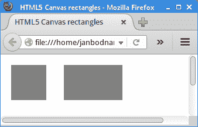
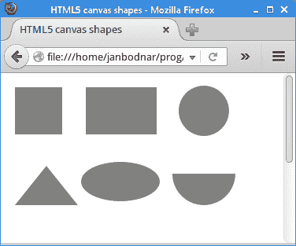
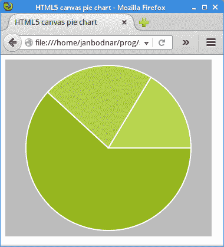
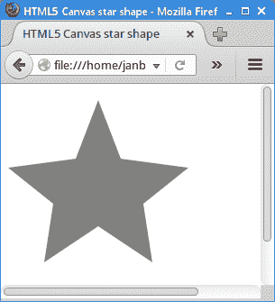
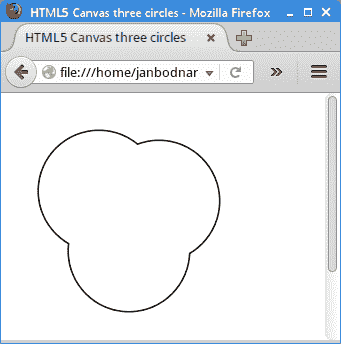

# HTML5 画布形状

> 原文： [https://zetcode.com/gfx/html5canvas/shapes/](https://zetcode.com/gfx/html5canvas/shapes/)

在 HTML5 画布教程的这一部分中，我们创建一些基本的和更高级的几何形状。

## 长方形

第一个程序绘制两个矩形。

`rectangles.html`

```js
<!DOCTYPE html>
<html>
<head>
<title>HTML5 canvas rectangles</title>
<script>
    function draw() {

        var canvas = document.getElementById('myCanvas');
        var ctx = canvas.getContext('2d');

        ctx.fillStyle = 'gray';
        ctx.fillRect(10, 10, 60, 60);
        ctx.fillRect(100, 10, 100, 60);
    }
</script>
</head>

<body onload="draw();">
    <canvas id="myCanvas" width="350" height="250">
    </canvas>
</body>
</html> 

```

该示例使用`drawRect()`方法绘制矩形。

```js
ctx.fillStyle = 'gray';

```

矩形的内部被涂成灰色。

```js
ctx.fillRect(10, 10, 60, 60);
ctx.fillRect(100, 10, 100, 60);

```

`fillRect()`方法用于绘制正方形和矩形。 前两个参数是要绘制的形状的 x 和 y 坐标。 最后两个参数是形状的宽度和高度。



Figure: Rectangles

## 基本形状

在下面的程序中，我们绘制一些基本形状。

`shapes.html`

```js
<!DOCTYPE html>
<html>
<head>
<title>HTML5 canvas shapes</title>
<script>
    function draw() {

        var canvas = document.getElementById('myCanvas');
        var ctx = canvas.getContext('2d');

        ctx.fillStyle = 'gray';
        ctx.fillRect(10, 10, 60, 60);
        ctx.fillRect(100, 10, 90, 60);

        ctx.beginPath();
        ctx.arc(250, 40, 32, 0, 2*Math.PI);
        ctx.fill(); 

        ctx.beginPath();
        ctx.moveTo(10, 160);
        ctx.lineTo(90, 160);
        ctx.lineTo(50, 110);
        ctx.closePath();
        ctx.fill();         

        ctx.save();
        ctx.scale(2, 1);
        ctx.beginPath();
        ctx.arc(72, 130, 25, 0, 2*Math.PI);
        ctx.fill();
        ctx.restore();

        ctx.beginPath();
        ctx.arc(250, 120, 40, 0, Math.PI);
        ctx.fill();                 
    }
</script>
</head>

<body onload="draw();">
<canvas id="myCanvas" width="350" height="350">
</canvas>
</body>

</html> 

```

画布上绘制了六个不同的形状。

```js
ctx.fillStyle = 'gray';

```

形状将被涂成灰色。

```js
ctx.fillRect(10, 10, 60, 60);
ctx.fillRect(100, 10, 90, 60);

```

使用`fillRect()`方法绘制矩形。 矩形是唯一未通过`beginPath()`方法启动的形状。

```js
ctx.beginPath();
ctx.arc(250, 40, 32, 0, 2*Math.PI);
ctx.fill(); 

```

用`arc()`方法绘制一个圆。 该方法将弧添加到创建的路径。 前两个参数定义圆弧中心点的 x 和 y 坐标。 接下来的两个参数指定圆弧的起点和终点。 角度以弧度定义。 最后一个参数是可选的； 它指定绘制圆弧的方向。 默认方向为顺时针。

```js
ctx.beginPath();
ctx.moveTo(10, 160);
ctx.lineTo(90, 160);
ctx.lineTo(50, 110);
ctx.closePath();
ctx.fill(); 

```

使用`moveTo()`和`lineTo()`方法，我们绘制了一个三角形。 `closePath()`方法使笔移回当前子路径的起点。 在我们的例子中，它完成了三角形的形状。

```js
ctx.save();
ctx.scale(2, 1);
ctx.beginPath();
ctx.arc(72, 130, 25, 0, 2*Math.PI);
ctx.fill();
ctx.restore();

```

通过缩放圆形来绘制椭圆形。 这些操作位于`save()`和`restore()`方法之间，因此缩放操作不会影响后续图形。

```js
ctx.beginPath();
ctx.arc(250, 120, 40, 0, Math.PI);
ctx.fill(); 

```

最后的形状（半圆）用`arc()`方法绘制。



图：基本形状

## 饼形图

饼图是圆形图，将其分成多个切片以说明数值比例。

`piechart.html`

```js
<!DOCTYPE html>
<html>
<head>
<title>HTML5 canvas pie chart</title>
<style>
    canvas {background: #bbb}
</style>
<script>
    function draw() {

        var canvas = document.getElementById('myCanvas');
        var ctx = canvas.getContext('2d');

        var beginAngle = 0;
        var endAngle = 0;
        var data = [170, 60, 45]; 
        var total = 0; 
        var colours = ["#95B524", "#AFCC4C", "#C1DD54"];
        const SPACE = 10;

        for (var i = 0; i < data.length; i++) {
          total += data[i];
        }

        ctx.strokeStyle = 'white';
        ctx.lineWidth = 2;

        for (var j = 0; j < data.length; j++) {

            endAngle = beginAngle + (Math.PI * 2 * (data[j] / total));
            ctx.fillStyle = colours[j];
            ctx.beginPath();
            ctx.moveTo(canvas.width/2, canvas.height/2);
            ctx.arc(canvas.width/2, canvas.height/2, canvas.height/2 - SPACE, 
                beginAngle, endAngle, false);
            ctx.closePath();
            ctx.fill();
            ctx.stroke();
            beginAngle = endAngle;
        }               
    }
</script>
</head>
<body onload="draw();">
    <canvas id="myCanvas" width="350" height="300">
    </canvas>
</body>
</html> 

```

该示例绘制了一个饼图。 它有三片，分别涂有不同的绿色阴影。

```js
<style>
    canvas {background: #bbb}
</style>

```

为了使图表的白色轮廓清晰可见，我们将画布的背景色更改为灰色。

```js
var data = [170, 60, 45];

```

这是饼图说明的数据。

```js
const SPACE = 10;

```

`SPACE`常数是从饼图到画布边界的距离。

```js
endAngle = beginAngle + (Math.PI * 2 * (data[j] / total));

```

该公式计算当前绘制的切片的结束角度。

```js
ctx.moveTo(canvas.width/2, canvas.height/2);
ctx.arc(canvas.width/2, canvas.height/2, canvas.height/2 - SPACE, 
    beginAngle, endAngle, false);
ctx.closePath();

```

三种方法可用于绘制当前切片：`moveTo()`，`arc()`和`closePath()`。

```js
ctx.fill();
ctx.stroke();

```

我们绘制形状的内部和轮廓。

```js
beginAngle = endAngle;

```

对于下一个切片，最后的终止角度成为起始角度。



Figure: Pie chart

## 星星

下面的示例创建一个星形。

`star.html`

```js
<!DOCTYPE html>
<html>
<head>
<title>HTML5 canvas star shape</title>
<script>
    function draw() {

        var canvas = document.getElementById('myCanvas');
        var ctx = canvas.getContext('2d');

        ctx.fillStyle = 'gray';

        var points = [ [ 0, 85 ], [ 75, 75 ], [ 100, 10 ], [ 125, 75 ], 
            [ 200, 85 ], [ 150, 125 ], [ 160, 190 ], [ 100, 150 ], 
            [ 40, 190 ], [ 50, 125 ], [ 0, 85 ] ];

        var len = points.length;

        ctx.beginPath();
        ctx.moveTo(points[0][0], points[0][1]);

        for (var i = 0; i < len; i++) {
            ctx.lineTo(points[i][0], points[i][1]);
        }        

        ctx.fill(); 

    }
</script>
</head>

<body onload="draw();">
    <canvas id="myCanvas" width="350" height="250">
    </canvas>
</body>
</html> 

```

从一系列点创建星形。

```js
var points = [ [ 0, 85 ], [ 75, 75 ], [ 100, 10 ], [ 125, 75 ], 
    [ 200, 85 ], [ 150, 125 ], [ 160, 190 ], [ 100, 150 ], 
    [ 40, 190 ], [ 50, 125 ], [ 0, 85 ] ];

```

这些是星星的坐标。

```js
ctx.moveTo(points[0][0], points[0][1]);        

```

我们使用`moveTo()`方法移动到形状的初始坐标。

```js
for (var i = 0; i < len; i++) {
    ctx.lineTo(points[i][0], points[i][1]);
}    

```

在这里，我们使用`lineTo()`方法连接星星的所有坐标。

```js
ctx.fill(); 

```

`fill()`方法使用定义的（灰色）颜色填充星形内部。



图：星星

## 三个圆圈

可以通过合成来创建新形状。 合成是确定画布中形状混合方式的规则。

`three_circles.html`

```js
<!DOCTYPE html>
<html>
<head>
<title>HTML5 Canvas three circles</title>
<script>
    function draw() {

        var canvas = document.getElementById('myCanvas');
        var ctx = canvas.getContext('2d');

        ctx.lineWidth = 3;

        ctx.fillStyle = 'gray';
        ctx.beginPath();
        ctx.arc(90, 90, 60, 0, 2*Math.PI);
        ctx.stroke();

        ctx.beginPath();
        ctx.arc(120, 150, 60, 0, 2*Math.PI);
        ctx.stroke();

        ctx.beginPath();
        ctx.arc(150, 100, 60, 0, 2*Math.PI);
        ctx.stroke();        

        ctx.globalCompositeOperation='destination-out';

        ctx.beginPath();
        ctx.arc(90, 90, 60, 0, 2*Math.PI);
        ctx.fill();

        ctx.beginPath();
        ctx.arc(120, 150, 60, 0, 2*Math.PI);
        ctx.fill();

        ctx.beginPath();
        ctx.arc(150, 100, 60, 0, 2*Math.PI);
        ctx.fill();
    }
</script>
</head>

<body onload="draw();">
    <canvas id="myCanvas" width="400" height="350">
    </canvas>
</body>
</html> 

```

该示例通过组合三个圆的轮廓来创建形状。 三个圆圈重叠。

```js
ctx.beginPath();
ctx.arc(90, 90, 60, 0, 2*Math.PI);
ctx.stroke();

```

在画布上绘制了一个圆圈。

```js
ctx.globalCompositeOperation='destination-out';

```

合成操作设置为`destination-out`。 在此模式下，目的地和来源不重叠的任何地方都会显示目的地。 在其他任何地方都显示透明性。

```js
ctx.beginPath();
ctx.arc(90, 90, 60, 0, 2*Math.PI);
ctx.fill();

```

现在，相同的圆圈充满了灰色。 新图形将删除两个重叠的现有图形。 结果，仅保留轮廓。



Figure: Three circles

在 HTML5 画布教程的这一部分中，我们介绍了 HTML5 画布中的一些基本形状和更高级的形状。