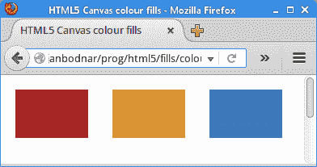
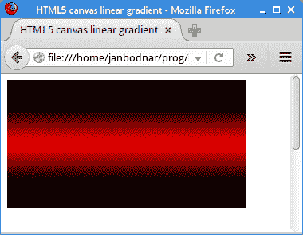
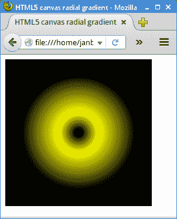
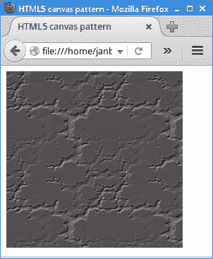

# HTML5 画布填充

> 原文： [https://zetcode.com/gfx/html5canvas/fills/](https://zetcode.com/gfx/html5canvas/fills/)

在 HTML5 画布教程的这一部分中，我们将使用填充。

填充用于绘制形状的内部。 共有三种基本填充：颜色，渐变和图案。 要设置形状的内部样式，我们使用`fillStyle`属性。

## 色彩

代表计算机中颜色的常见系统是 RGB。 颜色表示为红色，绿色和蓝色强度值的组合。

`colours.html`

```
<!DOCTYPE html>
<html>
<head>
<title>HTML5 Canvas colour fills</title>
<script>
    function draw() {

        var canvas = document.getElementById('myCanvas');
        var ctx = canvas.getContext('2d');

        ctx.fillStyle = 'brown';
        ctx.fillRect(10, 10, 90, 60);

        ctx.fillStyle = 'rgb(217, 146, 54)';
        ctx.fillRect(130, 10, 90, 60);

        ctx.fillStyle = '#3F79BA';
        ctx.fillRect(250, 10, 90, 60);        
    }
</script>
</head>

<body onload="draw();">
    <canvas id="myCanvas" width="350" height="250">
    </canvas>
</body>
</html> 

```

在示例中，我们绘制了三个彩色矩形。 颜色以三种不同的格式指定。

```
ctx.fillStyle = 'brown';

```

在这一行中，使用一个字符串值来设置颜色值。

```
ctx.fillStyle = 'rgb(217, 146, 54)';

```

在这里，我们使用 RGB 系统。

```
ctx.fillStyle = '#3F79BA';

```

第三个矩形的颜色由 RGB 系统的十六进制表示法设置。



Figure: Colours

## 线性渐变

在计算机图形学中，渐变是从浅到深或从一种颜色到另一种颜色的阴影的平滑混合。 在 2D 绘图程序和绘画程序中，渐变用于创建彩色背景和特殊效果以及模拟灯光和阴影。

有两种类型的渐变：线性渐变和径向渐变。 第一个示例演示了 HTML5 canvas 中的线性渐变。

`linear_gradient.html`

```
<!DOCTYPE html>
<html>
<head>    
<title>HTML5 canvas linear gradient</title>
<script>
    function draw() {
        var canvas = document.getElementById('myCanvas');
        var ctx = canvas.getContext('2d');

        var lgr = ctx.createLinearGradient(150, 0, 150, 160);
        lgr.addColorStop(0.2, "black");
        lgr.addColorStop(0.5, "red");
        lgr.addColorStop(0.8, "black");

        ctx.fillStyle = lgr;
        ctx.fillRect(0, 0, 300, 160);
    }
</script>
</head>

<body onload="draw();">
    <canvas id="myCanvas" width="350" height="350">
    </canvas>
</body>
</html>

```

该代码示例使用线性渐变填充矩形。 线性渐变是沿直线创建的渐变。

```
var lgr = ctx.createLinearGradient(150, 0, 150, 160);

```

`createLinearGradient()`方法沿着由参数表示的坐标给出的直线创建一个渐变。 参数是起点和终点的 x 和 y 坐标。

```
lgr.addColorStop(0.2, "black");
lgr.addColorStop(0.5, "red");
lgr.addColorStop(0.8, "black");

```

`addColorStop()`方法使用指定的偏移量和颜色在渐变上定义新的色标。 在我们的情况下，颜色停止设置，黑色和红色开始和结束。

```
ctx.fillStyle = lgr;

```

创建的线性梯度设置为当前`fillStyle`。

```
ctx.fillRect(0, 0, 300, 160);

```

使用`fillRect()`方法绘制一个矩形。 矩形的内部充满了我们的线性渐变。



Figure: Linear gradient

## 径向渐变

径向渐变是两个圆之间颜色或阴影的混合。

`radial_gradient.html`

```
<!DOCTYPE html>
<html>
<head>
<title>HTML5 canvas radial gradient</title>
<script>
    function draw() {
        var canvas = document.getElementById('myCanvas');
        var ctx = canvas.getContext('2d');

        var rgr = ctx.createRadialGradient(canvas.width/2, canvas.height/2, 5, 
            canvas.width/2, canvas.height/2, 100);
        rgr.addColorStop(0, "black");
        rgr.addColorStop(0.3, "yellow");
        rgr.addColorStop(1, "black");

        ctx.fillStyle = rgr;
        ctx.fillRect(0, 0, 250, 250);
    }
</script>
</head>

<body onload="draw();">
<canvas id="myCanvas" width="250" height="250">
</canvas>

</body>
</html>

```

该代码示例使用径向渐变填充矩形。

```
var rgr = ctx.createRadialGradient(canvas.width/2, canvas.height/2, 5, 
    canvas.width/2, canvas.height/2, 100);

```

`createRadialGradient()`方法创建由参数表示的两个圆的坐标给定的径向渐变。 我们将圆圈设置在画布的中间。 前两个参数设置起始圆的 x 和 y 坐标。 第三个参数是起始圆的半径。 接下来的两个参数是结束圆的 x 和 y 坐标。 最后一个参数指定末端线圈的半径。

```
rgr.addColorStop(0, "black");
rgr.addColorStop(0.3, "yellow");
rgr.addColorStop(1, "black");

```

`addColorStop()`方法设置径向渐变中的交替颜色：黑色和黄色。

```
ctx.fillStyle = rgr;
ctx.fillRect(0, 0, 250, 250);

```

用径向渐变填充绘制一个矩形。



Figure: Radial gradient

## 图案

图案是应用于形状的图像。 也称为图像纹理。

`pattern.html`

```
<!DOCTYPE html>
<html>
<head>
<title>HTML5 canvas pattern</title>
<script>
    function draw() {

        var canvas = document.getElementById('myCanvas');
        var ctx = canvas.getContext('2d');

        var img = new Image();
        img.src = 'crack.png';

        img.onload = function() {
            var pattern = ctx.createPattern(img, 'repeat');

            ctx.rect(0, 0, canvas.width, canvas.height);
            ctx.fillStyle = pattern;
            ctx.fill();
      };
    }
</script>
</head>

<body onload="draw();">
    <canvas id="myCanvas" width="250" height="250">
    </canvas>
</body>
</html> 

```

该示例使用重复的图像纹理填充整个画布。

```
var img = new Image();

```

`Image()`是 HTML 图像元素的 HTML5 构造函数。

```
img.src = 'crack.png';

```

在`src`属性中，设置图像的 URL。

```
var pattern = ctx.createPattern(img, 'repeat');

```

`createPattern()`方法使用指定的图像创建图案。 它按照重复参数指定的方向重复源。 `'repeat'`值在两个方向上重复该图案。



Figure: Pattern

在 HTML5 画布教程的这一部分中，我们进行了各种填充。